# Claude Code Architecture

> Deep architectural analysis with diagrams explaining why Claude Code is the most capable AI coding agent. Every diagram is a Mermaid diagram you can render in any Markdown viewer.

---

## Table of Contents

1. [System Overview](#1-system-overview)
2. [Boot Sequence](#2-boot-sequence)
3. [The Agentic Loop — The Brain](#3-the-agentic-loop--the-brain)
4. [Tool Execution Pipeline](#4-tool-execution-pipeline)
5. [Permission & Security System](#5-permission--security-system)
6. [Context Window Management](#6-context-window-management)
7. [Multi-Agent Architecture](#7-multi-agent-architecture)
8. [Terminal UI Rendering](#8-terminal-ui-rendering)
9. [MCP Integration](#9-mcp-integration)
10. [Plugin & Skill System](#10-plugin--skill-system)
11. [State Management](#11-state-management)
12. [API Client Architecture](#12-api-client-architecture)
13. [Hook System](#13-hook-system)
14. [Message Flow](#14-message-flow)
15. [Configuration Hierarchy](#15-configuration-hierarchy)

---

## 1. System Overview

This is the 30,000-foot view of Claude Code. It operates as an **agentic loop** that bridges the user's terminal with Claude's intelligence, using tools to interact with the filesystem, web, and external services.

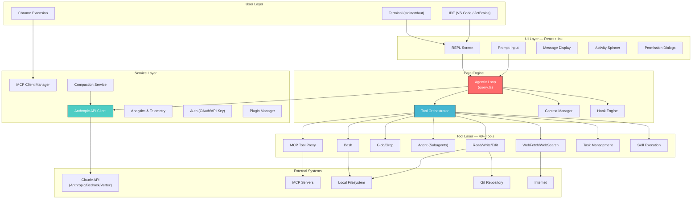
```mermaid
graph TB
    subgraph User["User Layer"]
        Terminal["Terminal (stdin/stdout)"]
        IDE["IDE (VS Code / JetBrains)"]
        Chrome["Chrome Extension"]
    end

    subgraph UI["UI Layer — React + Ink"]
        REPL["REPL Screen"]
        PromptInput["Prompt Input"]
        Messages["Message Display"]
        Spinner["Activity Spinner"]
        Permissions["Permission Dialogs"]
    end

    subgraph Core["Core Engine"]
        QueryLoop["Agentic Loop<br/>(query.ts)"]
        ToolOrch["Tool Orchestrator"]
        ContextMgr["Context Manager"]
        HookEngine["Hook Engine"]
    end

    subgraph Tools["Tool Layer — 40+ Tools"]
        BashTool["Bash"]
        FileTool["Read/Write/Edit"]
        SearchTool["Glob/Grep"]
        AgentTool["Agent (Subagents)"]
        WebTool["WebFetch/WebSearch"]
        MCPProxy["MCP Tool Proxy"]
        TaskTool["Task Management"]
        SkillTool["Skill Execution"]
    end

    subgraph Services["Service Layer"]
        APIClient["Anthropic API Client"]
        MCPClient["MCP Client Manager"]
        CompactSvc["Compaction Service"]
        Analytics["Analytics & Telemetry"]
        Auth["Auth (OAuth/API Key)"]
        PluginMgr["Plugin Manager"]
    end

    subgraph External["External Systems"]
        ClaudeAPI["Claude API<br/>(Anthropic/Bedrock/Vertex)"]
        MCPServers["MCP Servers"]
        Filesystem["Local Filesystem"]
        Git["Git Repository"]
        Web["Internet"]
    end

    Terminal --> REPL
    IDE --> REPL
    Chrome --> MCPClient

    REPL --> QueryLoop
    PromptInput --> QueryLoop

    QueryLoop --> ToolOrch
    QueryLoop --> ContextMgr
    QueryLoop --> HookEngine
    QueryLoop --> APIClient

    ToolOrch --> BashTool
    ToolOrch --> FileTool
    ToolOrch --> SearchTool
    ToolOrch --> AgentTool
    ToolOrch --> WebTool
    ToolOrch --> MCPProxy
    ToolOrch --> TaskTool
    ToolOrch --> SkillTool

    APIClient --> ClaudeAPI
    MCPProxy --> MCPServers
    BashTool --> Filesystem
    FileTool --> Filesystem
    FileTool --> Git
    WebTool --> Web
    CompactSvc --> APIClient

    style QueryLoop fill:#ff6b6b,color:#fff,stroke:#333
    style APIClient fill:#4ecdc4,color:#fff,stroke:#333
    style ToolOrch fill:#45b7d1,color:#fff,stroke:#333
```

### Why This Architecture Works

Claude Code's power comes from three architectural decisions:
1. **Agentic loop with unbounded iterations** — the model can use tools, observe results, and iterate until the task is done
2. **Rich tool ecosystem** — 40+ tools give the model real-world capabilities
3. **Context management** — automatic compaction lets conversations run indefinitely

---

## 2. Boot Sequence

The startup is carefully optimized for speed — prefetching credentials and settings in parallel while the heavy module graph loads.

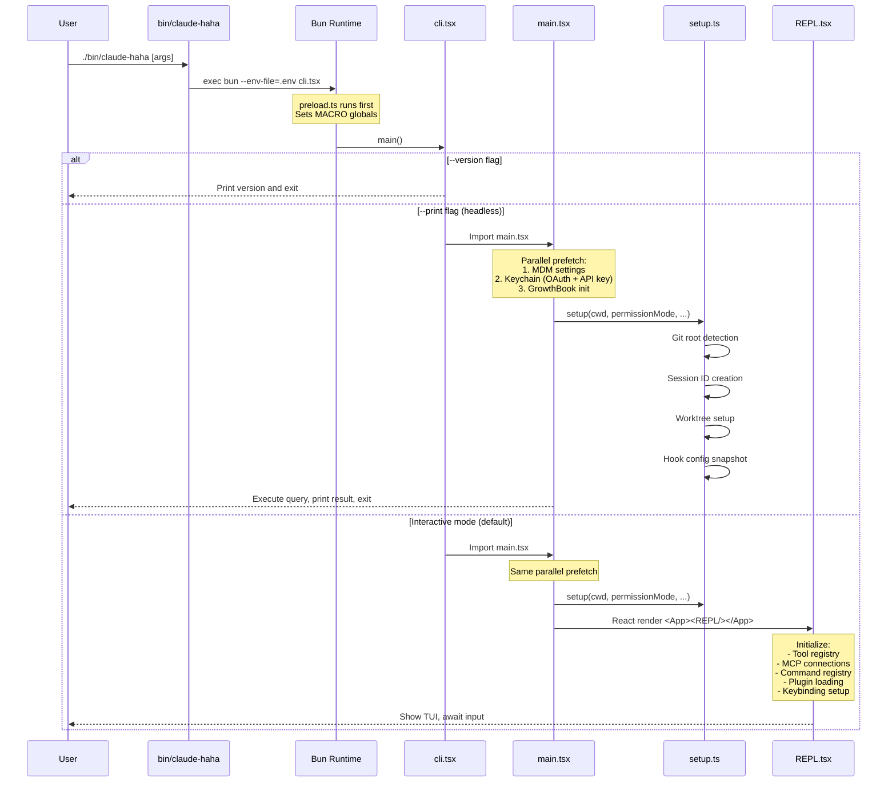
```mermaid
sequenceDiagram
    participant User
    participant Bash as bin/claude-haha
    participant Bun as Bun Runtime
    participant CLI as cli.tsx
    participant Main as main.tsx
    participant Setup as setup.ts
    participant REPL as REPL.tsx

    User->>Bash: ./bin/claude-haha [args]
    Bash->>Bun: exec bun --env-file=.env cli.tsx

    Note over Bun: preload.ts runs first<br/>Sets MACRO globals

    Bun->>CLI: main()

    alt --version flag
        CLI-->>User: Print version and exit
    else --print flag (headless)
        CLI->>Main: Import main.tsx
        Note over Main: Parallel prefetch:<br/>1. MDM settings<br/>2. Keychain (OAuth + API key)<br/>3. GrowthBook init
        Main->>Setup: setup(cwd, permissionMode, ...)
        Setup->>Setup: Git root detection
        Setup->>Setup: Session ID creation
        Setup->>Setup: Worktree setup
        Setup->>Setup: Hook config snapshot
        Main-->>User: Execute query, print result, exit
    else Interactive mode (default)
        CLI->>Main: Import main.tsx
        Note over Main: Same parallel prefetch
        Main->>Setup: setup(cwd, permissionMode, ...)
        Main->>REPL: React render <App><REPL/></App>
        Note over REPL: Initialize:<br/>- Tool registry<br/>- MCP connections<br/>- Command registry<br/>- Plugin loading<br/>- Keybinding setup
        REPL-->>User: Show TUI, await input
    end
```

### Key Optimization: Parallel Prefetching

```mermaid
gantt
    title Boot Timeline (Parallel Prefetch Strategy)
    dateFormat X
    axisFormat %L ms

    section Critical Path
    Parse CLI args           :a1, 0, 5
    Import main.tsx          :a2, 5, 50
    Commander.js setup       :a3, 50, 80
    setup() call             :a4, 80, 120
    Render REPL              :a5, 120, 150

    section Parallel (non-blocking)
    MDM settings read        :b1, 5, 40
    Keychain prefetch        :b2, 5, 70
    GrowthBook init          :b3, 50, 100
    MCP server connect       :b4, 120, 200
    Plugin loading           :b5, 120, 180
```

---

## 3. The Agentic Loop — The Brain

This is **the most critical piece** of Claude Code. The `query()` function in `query.ts` implements an infinite loop that:
1. Sends messages to Claude
2. Receives a response (which may include tool calls)
3. Executes tools and collects results
4. Feeds results back and repeats

This loop is what makes Claude Code **agentic** rather than a simple chatbot.

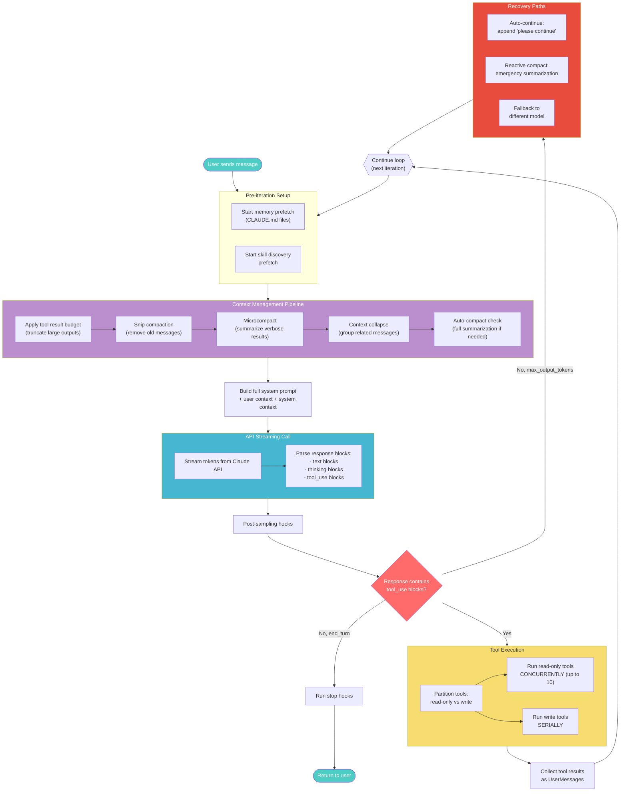
```mermaid
flowchart TD
    Start([User sends message]) --> Prefetch

    subgraph Prefetch["Pre-iteration Setup"]
        MemPrefetch["Start memory prefetch<br/>(CLAUDE.md files)"]
        SkillPrefetch["Start skill discovery<br/>prefetch"]
    end

    Prefetch --> ContextMgmt

    subgraph ContextMgmt["Context Management Pipeline"]
        Budget["Apply tool result budget<br/>(truncate large outputs)"]
        Snip["Snip compaction<br/>(remove old messages)"]
        Micro["Microcompact<br/>(summarize verbose results)"]
        Collapse["Context collapse<br/>(group related messages)"]
        Auto["Auto-compact check<br/>(full summarization if needed)"]
        Budget --> Snip --> Micro --> Collapse --> Auto
    end

    ContextMgmt --> BuildPrompt["Build full system prompt<br/>+ user context + system context"]

    BuildPrompt --> APICall

    subgraph APICall["API Streaming Call"]
        Stream["Stream tokens from Claude API"]
        Parse["Parse response blocks:<br/>- text blocks<br/>- thinking blocks<br/>- tool_use blocks"]
        Stream --> Parse
    end

    APICall --> PostSampling["Post-sampling hooks"]

    PostSampling --> Decision{Response contains<br/>tool_use blocks?}

    Decision -->|Yes| ToolExec

    subgraph ToolExec["Tool Execution"]
        Partition["Partition tools:<br/>read-only vs write"]
        ReadOnly["Run read-only tools<br/>CONCURRENTLY (up to 10)"]
        WriteTools["Run write tools<br/>SERIALLY"]
        Partition --> ReadOnly
        Partition --> WriteTools
    end

    ToolExec --> ToolResults["Collect tool results<br/>as UserMessages"]
    ToolResults --> Continue{{"Continue loop<br/>(next iteration)"}}
    Continue --> Prefetch

    Decision -->|No, end_turn| StopHooks["Run stop hooks"]
    StopHooks --> Terminal([Return to user])

    Decision -->|No, max_output_tokens| Recovery

    subgraph Recovery["Recovery Paths"]
        AutoContinue["Auto-continue:<br/>append 'please continue'"]
        ReactiveCompact["Reactive compact:<br/>emergency summarization"]
        FallbackModel["Fallback to<br/>different model"]
    end

    Recovery --> Continue

    style Start fill:#4ecdc4,color:#fff
    style Terminal fill:#4ecdc4,color:#fff
    style Decision fill:#ff6b6b,color:#fff
    style APICall fill:#45b7d1,color:#fff
    style ToolExec fill:#f7dc6f,color:#333
    style ContextMgmt fill:#bb8fce,color:#fff
    style Recovery fill:#e74c3c,color:#fff
```

### State Machine View

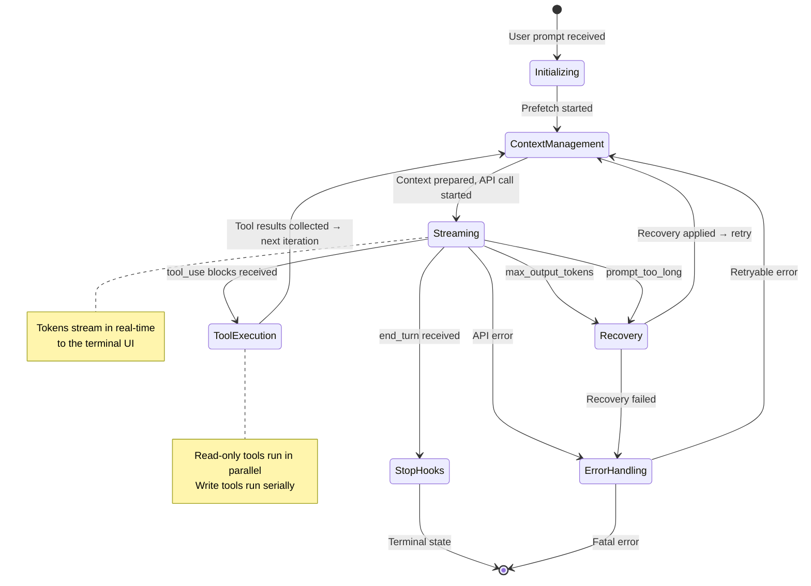
```mermaid
stateDiagram-v2
    [*] --> Initializing: User prompt received

    Initializing --> ContextManagement: Prefetch started

    ContextManagement --> Streaming: Context prepared, API call started

    Streaming --> ToolExecution: tool_use blocks received
    Streaming --> StopHooks: end_turn received
    Streaming --> Recovery: max_output_tokens
    Streaming --> Recovery: prompt_too_long
    Streaming --> ErrorHandling: API error

    ToolExecution --> ContextManagement: Tool results collected → next iteration

    Recovery --> ContextManagement: Recovery applied → retry
    Recovery --> ErrorHandling: Recovery failed

    StopHooks --> [*]: Terminal state

    ErrorHandling --> [*]: Fatal error
    ErrorHandling --> ContextManagement: Retryable error

    note right of Streaming
        Tokens stream in real-time
        to the terminal UI
    end note

    note right of ToolExecution
        Read-only tools run in parallel
        Write tools run serially
    end note
```

---

## 4. Tool Execution Pipeline

Every tool call goes through a sophisticated pipeline with hooks, permissions, and execution.

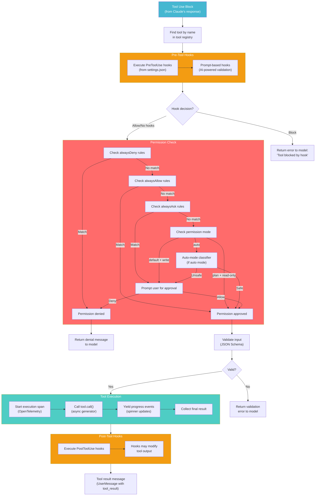
```mermaid
flowchart TD
    ToolUseBlock["Tool Use Block<br/>(from Claude's response)"] --> FindTool

    FindTool["Find tool by name<br/>in tool registry"] --> PreToolHooks

    subgraph PreToolHooks["Pre-Tool Hooks"]
        PreHook1["Execute PreToolUse hooks<br/>(from settings.json)"]
        PreHookPrompt["Prompt-based hooks<br/>(AI-powered validation)"]
        PreHook1 --> PreHookPrompt
    end

    PreToolHooks --> HookDecision{Hook decision?}

    HookDecision -->|Block| Blocked["Return error to model:<br/>'Tool blocked by hook'"]
    HookDecision -->|Allow/No hooks| PermCheck

    subgraph PermCheck["Permission Check"]
        DenyRules["Check alwaysDeny rules"]
        AllowRules["Check alwaysAllow rules"]
        AskRules["Check alwaysAsk rules"]
        ModeCheck["Check permission mode"]
        Classifier["Auto-mode classifier<br/>(if auto mode)"]
        UserPrompt["Prompt user for approval"]

        DenyRules -->|Match| Denied
        DenyRules -->|No match| AllowRules
        AllowRules -->|Match| Approved
        AllowRules -->|No match| AskRules
        AskRules -->|Match| UserPrompt
        AskRules -->|No match| ModeCheck
        ModeCheck -->|auto| Classifier
        ModeCheck -->|default + write| UserPrompt
        ModeCheck -->|plan + read-only| Approved
        Classifier -->|Safe| Approved
        Classifier -->|Unsafe| UserPrompt
        UserPrompt -->|Allow| Approved
        UserPrompt -->|Deny| Denied
    end

    Denied["Permission denied"] --> DeniedResult["Return denial message<br/>to model"]
    Approved["Permission approved"] --> Validate

    Validate["Validate input<br/>(JSON Schema)"] --> ValidDecision{Valid?}

    ValidDecision -->|No| ValidationError["Return validation<br/>error to model"]
    ValidDecision -->|Yes| Execute

    subgraph Execute["Tool Execution"]
        ExecStart["Start execution span<br/>(OpenTelemetry)"]
        ToolCall["Call tool.call()<br/>(async generator)"]
        Progress["Yield progress events<br/>(spinner updates)"]
        Result["Collect final result"]
        ExecStart --> ToolCall --> Progress --> Result
    end

    Execute --> PostToolHooks

    subgraph PostToolHooks["Post-Tool Hooks"]
        PostHook["Execute PostToolUse hooks"]
        ModifyOutput["Hooks may modify<br/>tool output"]
        PostHook --> ModifyOutput
    end

    PostToolHooks --> ToolResult["Tool result message<br/>(UserMessage with tool_result)"]

    style ToolUseBlock fill:#45b7d1,color:#fff
    style PermCheck fill:#ff6b6b,color:#fff
    style Execute fill:#4ecdc4,color:#fff
    style PreToolHooks fill:#f39c12,color:#fff
    style PostToolHooks fill:#f39c12,color:#fff
```

### Tool Concurrency Strategy

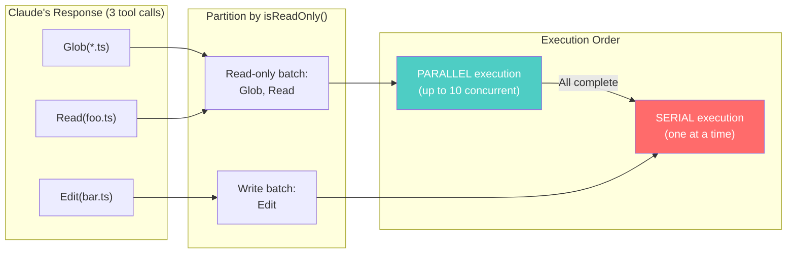
```mermaid
flowchart LR
    subgraph Input["Claude's Response (3 tool calls)"]
        T1["Glob(*.ts)"]
        T2["Read(foo.ts)"]
        T3["Edit(bar.ts)"]
    end

    subgraph Partition["Partition by isReadOnly()"]
        direction TB
        ReadBatch["Read-only batch:<br/>Glob, Read"]
        WriteBatch["Write batch:<br/>Edit"]
    end

    subgraph Execution["Execution Order"]
        direction TB
        Par["PARALLEL execution<br/>(up to 10 concurrent)"]
        Ser["SERIAL execution<br/>(one at a time)"]
        Par -->|"All complete"| Ser
    end

    T1 --> ReadBatch
    T2 --> ReadBatch
    T3 --> WriteBatch

    ReadBatch --> Par
    WriteBatch --> Ser

    style Par fill:#4ecdc4,color:#fff
    style Ser fill:#ff6b6b,color:#fff
```

---

## 5. Permission & Security System

The permission system is a critical safety layer that prevents the AI from performing unauthorized operations.

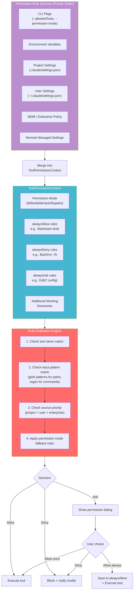
```mermaid
flowchart TB
    subgraph Sources["Permission Rule Sources (Priority Order)"]
        CLI["CLI Flags<br/>(--allowedTools, --permission-mode)"]
        Env["Environment Variables"]
        Project["Project Settings<br/>(.claude/settings.json)"]
        User["User Settings<br/>(~/.claude/settings.json)"]
        MDM["MDM / Enterprise Policy"]
        Remote["Remote Managed Settings"]
    end

    Sources --> Merge["Merge into<br/>ToolPermissionContext"]

    subgraph Context["ToolPermissionContext"]
        Mode["Permission Mode<br/>(default/plan/auto/bypass)"]
        Allow["alwaysAllow rules<br/>e.g., Bash(npm test)"]
        Deny["alwaysDeny rules<br/>e.g., Bash(rm -rf)"]
        Ask["alwaysAsk rules<br/>e.g., Edit(*.config)"]
        AWD["Additional Working<br/>Directories"]
    end

    Merge --> Context

    Context --> Eval["Permission Evaluator"]

    subgraph Eval["Rule Evaluation Engine"]
        direction TB
        Step1["1. Check tool name match"]
        Step2["2. Check input pattern match<br/>(glob patterns for paths,<br/>regex for commands)"]
        Step3["3. Check source priority<br/>(project > user > enterprise)"]
        Step4["4. Apply permission mode<br/>fallback rules"]
        Step1 --> Step2 --> Step3 --> Step4
    end

    Eval --> Result{Decision}

    Result -->|Allow| Allow2["Execute tool"]
    Result -->|Deny| Deny2["Block + notify model"]
    Result -->|Ask| Prompt["Show permission dialog"]

    Prompt --> UserChoice{User choice}
    UserChoice -->|Allow once| Allow2
    UserChoice -->|Allow always| SaveRule["Save to alwaysAllow<br/>+ Execute tool"]
    UserChoice -->|Deny| Deny2

    style Sources fill:#bb8fce,color:#fff
    style Context fill:#45b7d1,color:#fff
    style Eval fill:#ff6b6b,color:#fff
```

### Permission Mode Comparison

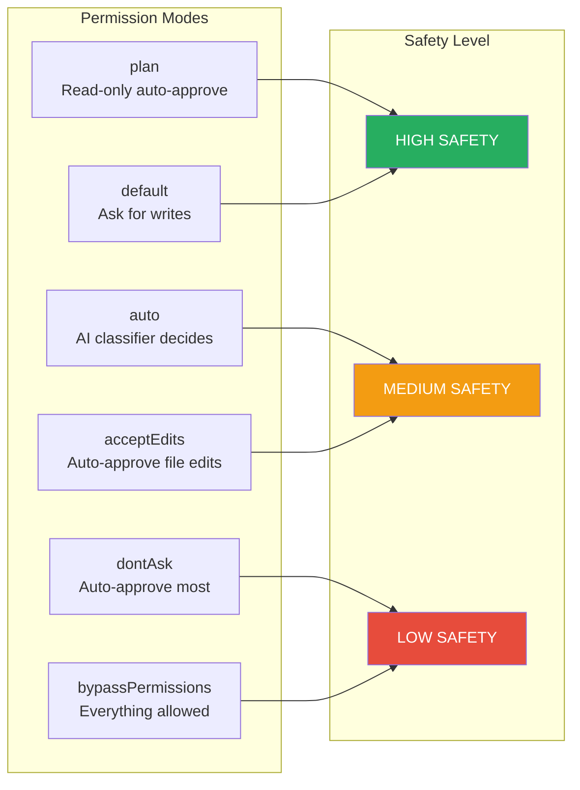
```mermaid
graph LR
    subgraph Modes["Permission Modes"]
        Default["default<br/>Ask for writes"]
        Plan["plan<br/>Read-only auto-approve"]
        Auto["auto<br/>AI classifier decides"]
        Bypass["bypassPermissions<br/>Everything allowed"]
        AcceptEdits["acceptEdits<br/>Auto-approve file edits"]
        DontAsk["dontAsk<br/>Auto-approve most"]
    end

    subgraph Safety["Safety Level"]
        High["HIGH SAFETY"]
        Medium["MEDIUM SAFETY"]
        Low["LOW SAFETY"]
    end

    Plan --> High
    Default --> High
    Auto --> Medium
    AcceptEdits --> Medium
    DontAsk --> Low
    Bypass --> Low

    style High fill:#27ae60,color:#fff
    style Medium fill:#f39c12,color:#fff
    style Low fill:#e74c3c,color:#fff
```

---

## 6. Context Window Management

Claude Code can run indefinitely without hitting context limits thanks to this multi-layered compaction system.

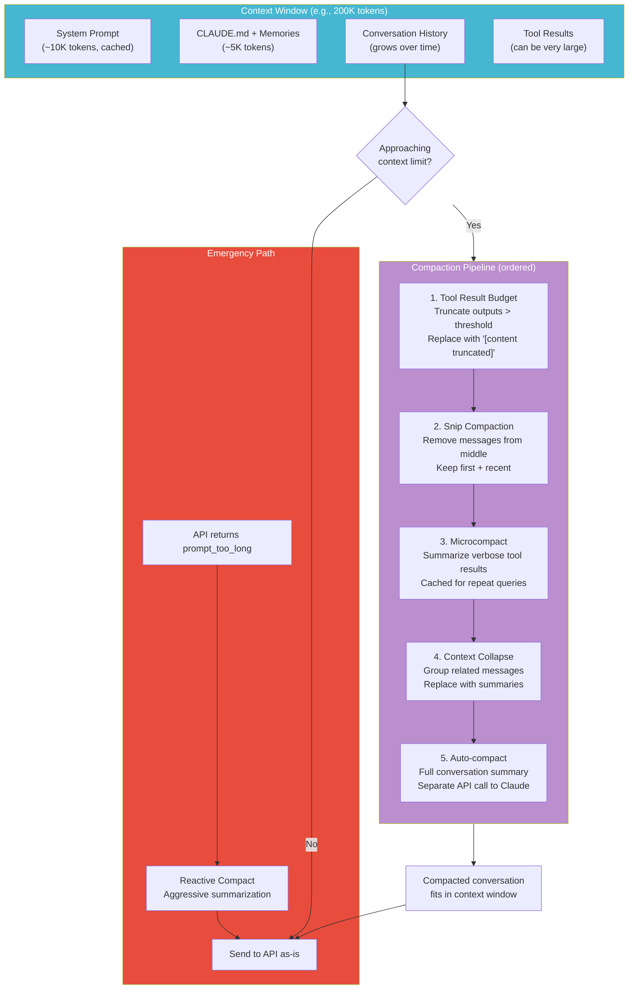
```mermaid
flowchart TD
    subgraph Window["Context Window (e.g., 200K tokens)"]
        SysPrompt["System Prompt<br/>(~10K tokens, cached)"]
        Attachments["CLAUDE.md + Memories<br/>(~5K tokens)"]
        History["Conversation History<br/>(grows over time)"]
        ToolResults["Tool Results<br/>(can be very large)"]
    end

    History --> Check{Approaching<br/>context limit?}

    Check -->|No| Send["Send to API as-is"]
    Check -->|Yes| Pipeline

    subgraph Pipeline["Compaction Pipeline (ordered)"]
        direction TB
        P1["1. Tool Result Budget<br/>Truncate outputs > threshold<br/>Replace with '[content truncated]'"]
        P2["2. Snip Compaction<br/>Remove messages from middle<br/>Keep first + recent"]
        P3["3. Microcompact<br/>Summarize verbose tool results<br/>Cached for repeat queries"]
        P4["4. Context Collapse<br/>Group related messages<br/>Replace with summaries"]
        P5["5. Auto-compact<br/>Full conversation summary<br/>Separate API call to Claude"]
        P1 --> P2 --> P3 --> P4 --> P5
    end

    Pipeline --> Result["Compacted conversation<br/>fits in context window"]
    Result --> Send

    subgraph Emergency["Emergency Path"]
        PromptTooLong["API returns prompt_too_long"]
        Reactive["Reactive Compact<br/>Aggressive summarization"]
        PromptTooLong --> Reactive --> Send
    end

    style Pipeline fill:#bb8fce,color:#fff
    style Emergency fill:#e74c3c,color:#fff
    style Window fill:#45b7d1,color:#fff
```

### Auto-Compact Deep Dive

```mermaid
sequenceDiagram
    participant Loop as Query Loop
    participant Compact as Auto-Compact Service
    participant API as Claude API (Sonnet)
    participant State as AppState

    Loop->>Compact: Check if compaction needed
    Compact->>Compact: Estimate token count<br/>(from last API response usage)

    alt Under threshold
        Compact-->>Loop: No compaction needed
    else Over threshold
        Compact->>Compact: Build summary prompt
        Note over Compact: Include: conversation history,<br/>tool outputs, key decisions,<br/>file modifications

        Compact->>API: Send summarization request<br/>(using Sonnet model for speed)
        API-->>Compact: Summary response

        Compact->>Compact: Build post-compact messages:<br/>1. Summary message<br/>2. Re-attach CLAUDE.md files<br/>3. Run post-compact hooks

        Compact->>State: Replace old messages<br/>with summary
        Compact-->>Loop: Compaction complete<br/>(pre: 180K → post: 40K tokens)
    end
```

---

## 7. Multi-Agent Architecture

Claude Code can spawn child agents (subagents) that work autonomously or in teams. This is what enables complex, parallelized workflows.

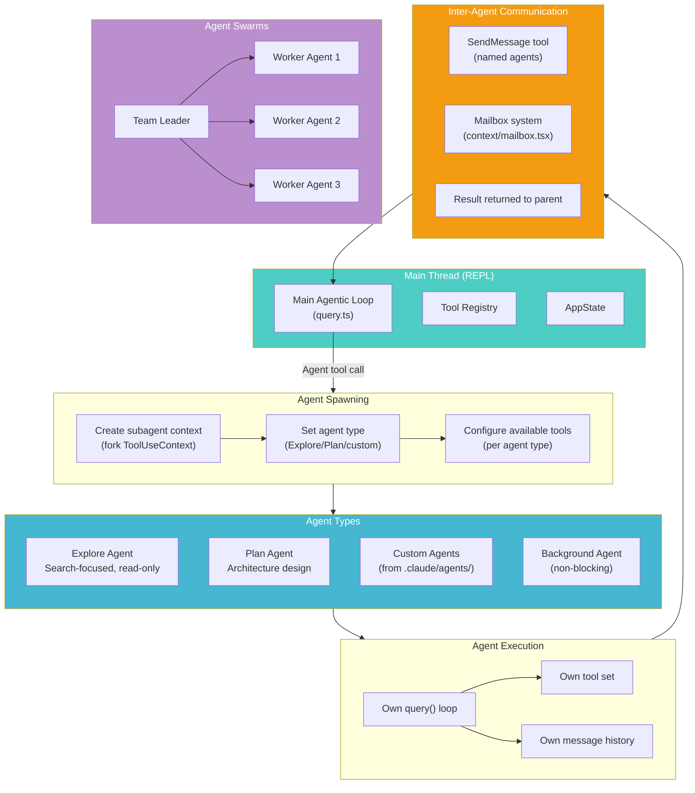
```mermaid
flowchart TB
    subgraph Main["Main Thread (REPL)"]
        MainLoop["Main Agentic Loop<br/>(query.ts)"]
        MainTools["Tool Registry"]
        MainState["AppState"]
    end

    MainLoop -->|"Agent tool call"| Spawn

    subgraph Spawn["Agent Spawning"]
        CreateCtx["Create subagent context<br/>(fork ToolUseContext)"]
        SetType["Set agent type<br/>(Explore/Plan/custom)"]
        SetTools["Configure available tools<br/>(per agent type)"]
        CreateCtx --> SetType --> SetTools
    end

    Spawn --> AgentTypes

    subgraph AgentTypes["Agent Types"]
        direction TB
        Explore["Explore Agent<br/>Search-focused, read-only"]
        Plan["Plan Agent<br/>Architecture design"]
        Custom["Custom Agents<br/>(from .claude/agents/)"]
        Background["Background Agent<br/>(non-blocking)"]
    end

    subgraph AgentExec["Agent Execution"]
        SubLoop["Own query() loop"]
        SubTools["Own tool set"]
        SubMessages["Own message history"]
        SubLoop --> SubTools
        SubLoop --> SubMessages
    end

    AgentTypes --> AgentExec

    subgraph Communication["Inter-Agent Communication"]
        SendMsg["SendMessage tool<br/>(named agents)"]
        Mailbox["Mailbox system<br/>(context/mailbox.tsx)"]
        Results["Result returned to parent"]
    end

    AgentExec --> Communication
    Communication --> MainLoop

    subgraph Teams["Agent Swarms"]
        Leader["Team Leader"]
        Worker1["Worker Agent 1"]
        Worker2["Worker Agent 2"]
        Worker3["Worker Agent 3"]
        Leader --> Worker1
        Leader --> Worker2
        Leader --> Worker3
    end

    style Main fill:#4ecdc4,color:#fff
    style AgentTypes fill:#45b7d1,color:#fff
    style Communication fill:#f39c12,color:#fff
    style Teams fill:#bb8fce,color:#fff
```

### Subagent Lifecycle

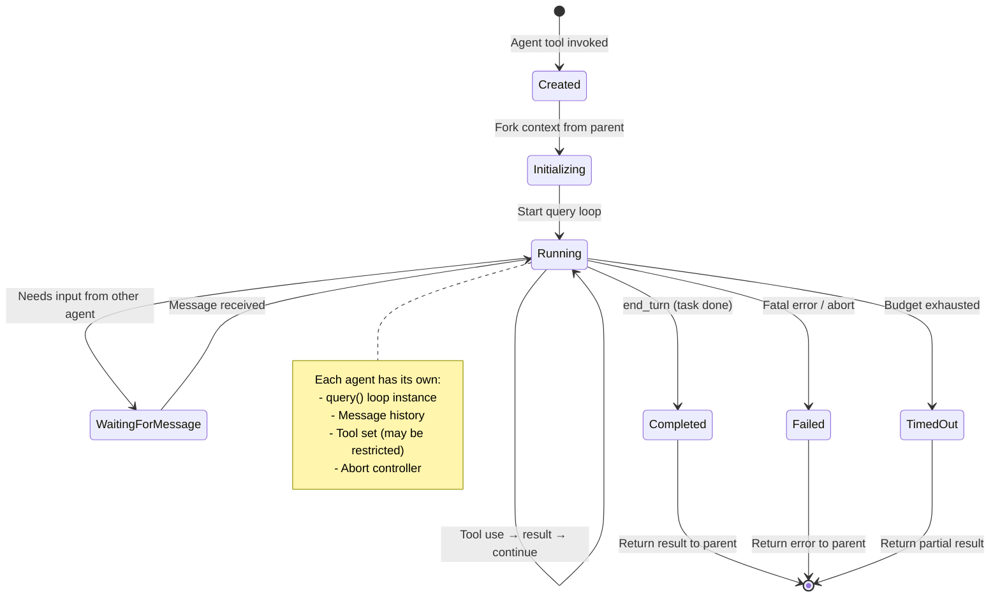
```mermaid
stateDiagram-v2
    [*] --> Created: Agent tool invoked
    Created --> Initializing: Fork context from parent
    Initializing --> Running: Start query loop

    Running --> Running: Tool use → result → continue
    Running --> WaitingForMessage: Needs input from other agent
    WaitingForMessage --> Running: Message received

    Running --> Completed: end_turn (task done)
    Running --> Failed: Fatal error / abort
    Running --> TimedOut: Budget exhausted

    Completed --> [*]: Return result to parent
    Failed --> [*]: Return error to parent
    TimedOut --> [*]: Return partial result

    note right of Running
        Each agent has its own:
        - query() loop instance
        - Message history
        - Tool set (may be restricted)
        - Abort controller
    end note
```

### Worktree Isolation

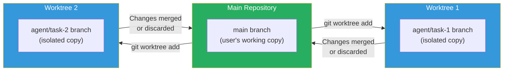
```mermaid
flowchart LR
    subgraph MainRepo["Main Repository"]
        MainBranch["main branch<br/>(user's working copy)"]
    end

    subgraph Worktree1["Worktree 1"]
        WT1Branch["agent/task-1 branch<br/>(isolated copy)"]
    end

    subgraph Worktree2["Worktree 2"]
        WT2Branch["agent/task-2 branch<br/>(isolated copy)"]
    end

    MainRepo -->|"git worktree add"| Worktree1
    MainRepo -->|"git worktree add"| Worktree2

    Worktree1 -->|"Changes merged<br/>or discarded"| MainRepo
    Worktree2 -->|"Changes merged<br/>or discarded"| MainRepo

    style MainRepo fill:#27ae60,color:#fff
    style Worktree1 fill:#3498db,color:#fff
    style Worktree2 fill:#3498db,color:#fff
```

---

## 8. Terminal UI Rendering

Claude Code uses React + Ink to build a terminal UI that feels as responsive as a web application.

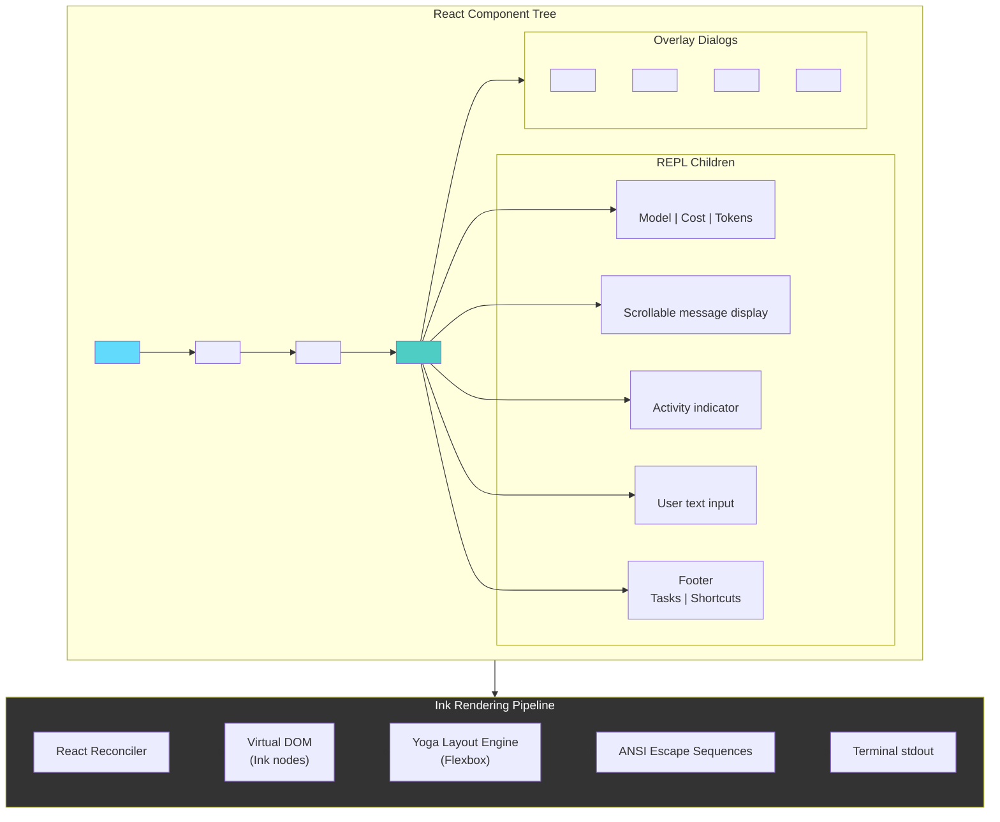
```mermaid
flowchart TB
    subgraph ReactTree["React Component Tree"]
        App["<App>"]
        AppState["<AppStateProvider>"]
        Keybindings["<KeybindingSetup>"]
        REPLScreen["<REPL>"]

        subgraph REPLChildren["REPL Children"]
            StatusLine["<StatusLine><br/>Model | Cost | Tokens"]
            VirtualList["<VirtualMessageList><br/>Scrollable message display"]
            SpinnerComp["<Spinner><br/>Activity indicator"]
            Input["<PromptInput><br/>User text input"]
            Footer["Footer<br/>Tasks | Shortcuts"]
        end

        subgraph Overlays["Overlay Dialogs"]
            PermDialog["<PermissionRequest>"]
            MCPDialog["<MCPServerApprovalDialog>"]
            CostDialog["<CostThresholdDialog>"]
            SettingsDialog["<Settings>"]
        end

        App --> AppState --> Keybindings --> REPLScreen
        REPLScreen --> StatusLine
        REPLScreen --> VirtualList
        REPLScreen --> SpinnerComp
        REPLScreen --> Input
        REPLScreen --> Footer
        REPLScreen --> Overlays
    end

    subgraph InkRenderer["Ink Rendering Pipeline"]
        Reconciler["React Reconciler"]
        VirtualDOM["Virtual DOM<br/>(Ink nodes)"]
        Layout["Yoga Layout Engine<br/>(Flexbox)"]
        Render["ANSI Escape Sequences"]
        Terminal["Terminal stdout"]

        Reconciler --> VirtualDOM --> Layout --> Render --> Terminal
    end

    ReactTree --> InkRenderer

    style App fill:#61dafb,color:#333
    style REPLScreen fill:#4ecdc4,color:#fff
    style InkRenderer fill:#333,color:#fff
```

### Message Rendering Pipeline

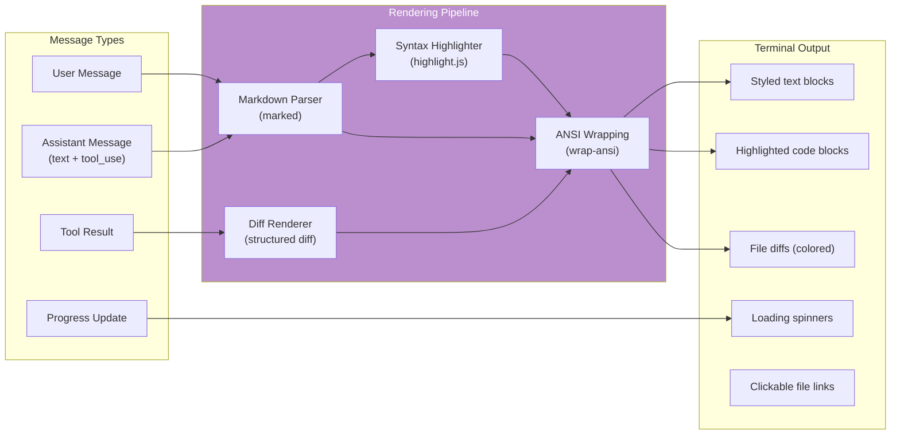
```mermaid
flowchart LR
    subgraph Input["Message Types"]
        UserMsg["User Message"]
        AssistantMsg["Assistant Message<br/>(text + tool_use)"]
        ToolResult["Tool Result"]
        Progress["Progress Update"]
    end

    subgraph Processing["Rendering Pipeline"]
        Markdown["Markdown Parser<br/>(marked)"]
        Syntax["Syntax Highlighter<br/>(highlight.js)"]
        Diff["Diff Renderer<br/>(structured diff)"]
        Wrap["ANSI Wrapping<br/>(wrap-ansi)"]
    end

    subgraph Output["Terminal Output"]
        Text["Styled text blocks"]
        Code["Highlighted code blocks"]
        DiffView["File diffs (colored)"]
        SpinnerOut["Loading spinners"]
        Links["Clickable file links"]
    end

    UserMsg --> Markdown
    AssistantMsg --> Markdown
    ToolResult --> Diff
    Progress --> SpinnerOut

    Markdown --> Syntax --> Wrap --> Text
    Markdown --> Wrap --> Code
    Diff --> Wrap --> DiffView

    style Processing fill:#bb8fce,color:#fff
```

---

## 9. MCP Integration

Model Context Protocol enables Claude Code to connect to external services, extending its capabilities dynamically.

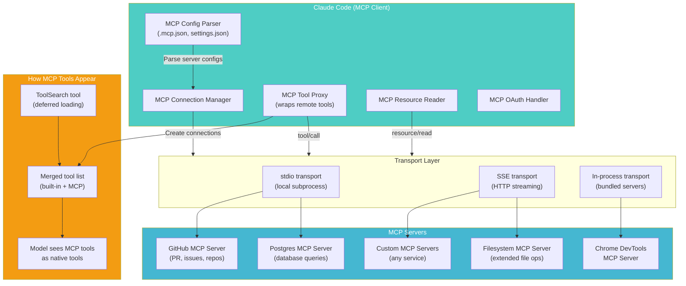
```mermaid
flowchart TB
    subgraph ClaudeCode["Claude Code (MCP Client)"]
        MCPManager["MCP Connection Manager"]
        MCPConfig["MCP Config Parser<br/>(.mcp.json, settings.json)"]
        MCPToolProxy["MCP Tool Proxy<br/>(wraps remote tools)"]
        MCPResources["MCP Resource Reader"]
        MCPAuth["MCP OAuth Handler"]
    end

    subgraph Transports["Transport Layer"]
        Stdio["stdio transport<br/>(local subprocess)"]
        SSE["SSE transport<br/>(HTTP streaming)"]
        InProcess["In-process transport<br/>(bundled servers)"]
    end

    subgraph Servers["MCP Servers"]
        GitHub["GitHub MCP Server<br/>(PR, issues, repos)"]
        Postgres["Postgres MCP Server<br/>(database queries)"]
        Filesystem2["Filesystem MCP Server<br/>(extended file ops)"]
        Custom["Custom MCP Servers<br/>(any service)"]
        ChromeMCP["Chrome DevTools<br/>MCP Server"]
    end

    MCPConfig -->|"Parse server configs"| MCPManager
    MCPManager -->|"Create connections"| Transports

    Stdio --> GitHub
    Stdio --> Postgres
    SSE --> Custom
    InProcess --> ChromeMCP
    SSE --> Filesystem2

    MCPToolProxy -->|"tool/call"| Transports
    MCPResources -->|"resource/read"| Transports

    subgraph Integration["How MCP Tools Appear"]
        ToolSearch["ToolSearch tool<br/>(deferred loading)"]
        ToolList["Merged tool list<br/>(built-in + MCP)"]
        ModelSees["Model sees MCP tools<br/>as native tools"]
    end

    MCPToolProxy --> ToolList
    ToolSearch --> ToolList
    ToolList --> ModelSees

    style ClaudeCode fill:#4ecdc4,color:#fff
    style Servers fill:#45b7d1,color:#fff
    style Integration fill:#f39c12,color:#fff
```

### MCP Server Connection Lifecycle

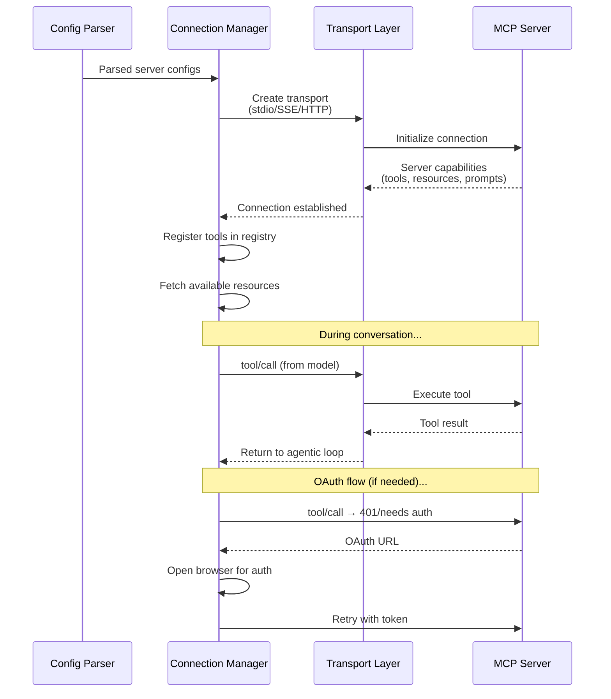
```mermaid
sequenceDiagram
    participant Config as Config Parser
    participant Manager as Connection Manager
    participant Transport as Transport Layer
    participant Server as MCP Server

    Config->>Manager: Parsed server configs
    Manager->>Transport: Create transport<br/>(stdio/SSE/HTTP)
    Transport->>Server: Initialize connection
    Server-->>Transport: Server capabilities<br/>(tools, resources, prompts)
    Transport-->>Manager: Connection established

    Manager->>Manager: Register tools in registry
    Manager->>Manager: Fetch available resources

    Note over Manager,Server: During conversation...

    Manager->>Transport: tool/call (from model)
    Transport->>Server: Execute tool
    Server-->>Transport: Tool result
    Transport-->>Manager: Return to agentic loop

    Note over Manager,Server: OAuth flow (if needed)...

    Manager->>Server: tool/call → 401/needs auth
    Server-->>Manager: OAuth URL
    Manager->>Manager: Open browser for auth
    Manager->>Server: Retry with token
```

---

## 10. Plugin & Skill System

Plugins are the extensibility mechanism — they bundle tools, commands, skills, hooks, agents, and MCP servers into distributable packages.

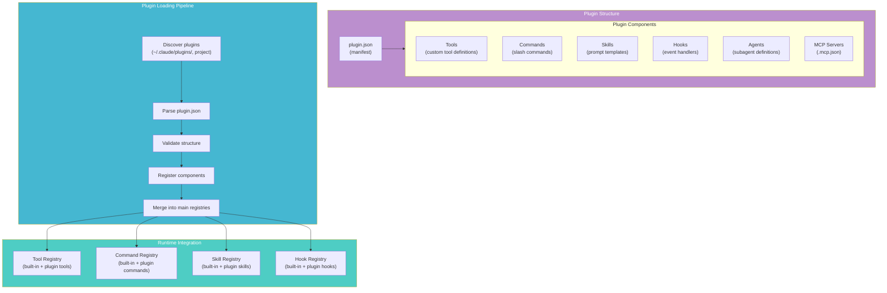
```mermaid
flowchart TB
    subgraph PluginStructure["Plugin Structure"]
        Manifest["plugin.json<br/>(manifest)"]

        subgraph Components["Plugin Components"]
            PTools["Tools<br/>(custom tool definitions)"]
            PCommands["Commands<br/>(slash commands)"]
            PSkills["Skills<br/>(prompt templates)"]
            PHooks["Hooks<br/>(event handlers)"]
            PAgents["Agents<br/>(subagent definitions)"]
            PMCP["MCP Servers<br/>(.mcp.json)"]
        end

        Manifest --> Components
    end

    subgraph Loading["Plugin Loading Pipeline"]
        Discover["Discover plugins<br/>(~/.claude/plugins/, project)"]
        Parse["Parse plugin.json"]
        Validate["Validate structure"]
        Register["Register components"]
        Merge["Merge into main registries"]

        Discover --> Parse --> Validate --> Register --> Merge
    end

    subgraph Runtime["Runtime Integration"]
        ToolRegistry["Tool Registry<br/>(built-in + plugin tools)"]
        CommandRegistry["Command Registry<br/>(built-in + plugin commands)"]
        SkillRegistry["Skill Registry<br/>(built-in + plugin skills)"]
        HookRegistry["Hook Registry<br/>(built-in + plugin hooks)"]
    end

    Merge --> ToolRegistry
    Merge --> CommandRegistry
    Merge --> SkillRegistry
    Merge --> HookRegistry

    style PluginStructure fill:#bb8fce,color:#fff
    style Loading fill:#45b7d1,color:#fff
    style Runtime fill:#4ecdc4,color:#fff
```

### Skill Execution Flow

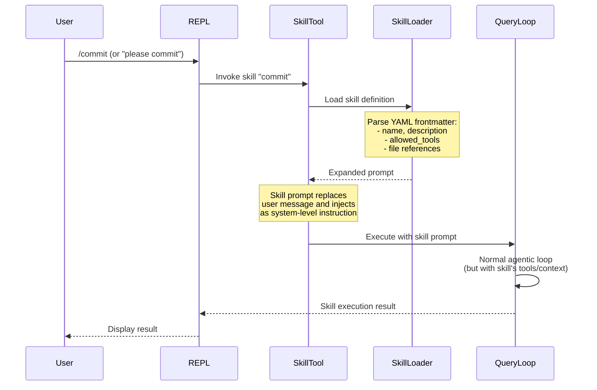
```mermaid
sequenceDiagram
    participant User
    participant REPL
    participant SkillTool
    participant SkillLoader
    participant QueryLoop

    User->>REPL: /commit (or "please commit")
    REPL->>SkillTool: Invoke skill "commit"
    SkillTool->>SkillLoader: Load skill definition

    Note over SkillLoader: Parse YAML frontmatter:<br/>- name, description<br/>- allowed_tools<br/>- file references

    SkillLoader-->>SkillTool: Expanded prompt

    Note over SkillTool: Skill prompt replaces<br/>user message and injects<br/>as system-level instruction

    SkillTool->>QueryLoop: Execute with skill prompt
    QueryLoop->>QueryLoop: Normal agentic loop<br/>(but with skill's tools/context)
    QueryLoop-->>REPL: Skill execution result
    REPL-->>User: Display result
```

---

## 11. State Management

Claude Code uses a Zustand-like external store pattern with React context for the UI layer.

```mermaid
flowchart TB
    subgraph Store["AppStateStore (External)"]
        State["AppState (Immutable)"]
        GetState["getState()"]
        SetState["setState(fn)"]
        Subscribe["subscribe(listener)"]
    end

    subgraph StateShape["AppState Shape"]
        Settings["settings: SettingsJson"]
        Model["mainLoopModel: ModelSetting"]
        Permissions["toolPermissionContext"]
        Messages2["messages: Message[]"]
        MCPClients["mcpClients: MCPServerConnection[]"]
        Tasks["tasks: Record<string, TaskState>"]
        Speculation["speculation: SpeculationState"]
        Plugins["loadedPlugins: LoadedPlugin[]"]
    end

    subgraph ReactLayer["React Layer"]
        Provider["<AppStateProvider>"]
        Context["AppStoreContext"]
        UseSyncExtStore["useSyncExternalStore()"]
        Components2["UI Components"]

        Provider --> Context
        Context --> UseSyncExtStore
        UseSyncExtStore --> Components2
    end

    subgraph NonReactLayer["Non-React Layer (Tools, Services)"]
        ToolCtx["ToolUseContext.getAppState()"]
        ToolSet["ToolUseContext.setAppState()"]
    end

    Store --> ReactLayer
    Store --> NonReactLayer

    style Store fill:#ff6b6b,color:#fff
    style ReactLayer fill:#61dafb,color:#333
    style NonReactLayer fill:#f39c12,color:#fff
```

---

## 12. API Client Architecture

Claude Code supports multiple API providers through a unified client interface.

```mermaid
flowchart TB
    subgraph Providers["API Providers"]
        Direct["Anthropic Direct<br/>(api.anthropic.com)"]
        Bedrock["AWS Bedrock<br/>(bedrock-runtime)"]
        Vertex["Google Vertex AI<br/>(aiplatform)"]
        Foundry["Azure Foundry<br/>(ai.azure.com)"]
        Custom2["Custom Compatible<br/>(ANTHROPIC_BASE_URL)"]
    end

    subgraph ClientCreation["Client Creation (client.ts)"]
        DetectProvider["Detect provider from<br/>env vars + model name"]
        CreateSDK["Create Anthropic SDK client<br/>with provider-specific auth"]
        ConfigureProxy["Configure proxy<br/>(https-proxy-agent)"]
        SetHeaders["Set custom headers<br/>(User-Agent, auth tokens)"]

        DetectProvider --> CreateSDK --> ConfigureProxy --> SetHeaders
    end

    subgraph StreamingCall["Streaming Call (claude.ts)"]
        BuildParams["Build message params:<br/>- model<br/>- messages<br/>- tools<br/>- system prompt<br/>- thinking config<br/>- betas"]
        StreamAPI["sdk.beta.messages.stream()"]
        ParseEvents["Parse streaming events:<br/>- content_block_start<br/>- content_block_delta<br/>- message_delta<br/>- message_stop"]
        HandleErrors["Handle errors:<br/>- rate_limit → retry<br/>- overloaded → backoff<br/>- prompt_too_long → compact"]

        BuildParams --> StreamAPI --> ParseEvents --> HandleErrors
    end

    subgraph RetryLogic["Retry Logic (withRetry.ts)"]
        ExponentialBackoff["Exponential backoff"]
        FallbackModel["Fallback to alternate model"]
        RateLimitWait["Wait for rate limit reset"]
    end

    Providers --> ClientCreation
    ClientCreation --> StreamingCall
    HandleErrors --> RetryLogic
    RetryLogic -->|"Retry"| StreamAPI

    style Providers fill:#45b7d1,color:#fff
    style StreamingCall fill:#4ecdc4,color:#fff
    style RetryLogic fill:#e74c3c,color:#fff
```

### Streaming Response Processing

```mermaid
sequenceDiagram
    participant Loop as Query Loop
    participant Claude as claude.ts
    participant SDK as Anthropic SDK
    participant API as Claude API

    Loop->>Claude: createApiStream(messages, tools, config)
    Claude->>SDK: sdk.beta.messages.stream(params)
    SDK->>API: POST /v1/messages (streaming)

    loop For each SSE event
        API-->>SDK: content_block_start (text/tool_use/thinking)
        SDK-->>Claude: Parsed event
        Claude-->>Loop: yield StreamEvent

        API-->>SDK: content_block_delta (text delta)
        SDK-->>Claude: Parsed delta
        Claude-->>Loop: yield StreamEvent<br/>(UI renders incrementally)
    end

    API-->>SDK: message_stop
    SDK-->>Claude: Final message
    Claude->>Claude: Extract tool_use blocks
    Claude->>Claude: Calculate token usage
    Claude-->>Loop: yield AssistantMessage

    Note over Loop: If tool_use blocks exist,<br/>execute tools and loop back
```

---

## 13. Hook System

Hooks are the extensibility mechanism for intercepting and modifying Claude Code's behavior at key points.

```mermaid
flowchart TB
    subgraph Events["Hook Events"]
        PreToolUse["PreToolUse<br/>Before tool execution"]
        PostToolUse["PostToolUse<br/>After tool execution"]
        Stop["Stop<br/>When model stops"]
        SubagentStop["SubagentStop<br/>When subagent completes"]
        SessionStart["SessionStart<br/>Session begins"]
        SessionEnd["SessionEnd<br/>Session ends"]
        UserPromptSubmit["UserPromptSubmit<br/>User sends message"]
        PreCompact["PreCompact<br/>Before compaction"]
        Notification["Notification<br/>System notification"]
    end

    subgraph HookTypes["Hook Types"]
        CommandHook["Command Hook<br/>(shell command)"]
        PromptHook["Prompt Hook<br/>(AI-powered, sends<br/>to Claude for decision)"]
    end

    subgraph Execution["Hook Execution"]
        Match["Match hook to event<br/>(tool name filter)"]
        Run["Execute hook"]
        Collect["Collect results"]
    end

    subgraph Results["Hook Results"]
        Approve["approve<br/>(allow operation)"]
        Block["block<br/>(prevent operation)"]
        Modify["modify<br/>(change tool input/output)"]
        Message["message<br/>(inject system message)"]
        NoOp["no-op<br/>(hook had no opinion)"]
    end

    Events --> Match
    Match --> HookTypes
    HookTypes --> Run
    Run --> Collect
    Collect --> Results

    style Events fill:#bb8fce,color:#fff
    style HookTypes fill:#45b7d1,color:#fff
    style Results fill:#4ecdc4,color:#fff
```

### Hook Configuration Example

```mermaid
flowchart LR
    subgraph Config["settings.json hooks section"]
        PreTool["PreToolUse: [<br/>  {<br/>    tool: 'Bash',<br/>    command: 'npm run lint',<br/>    type: 'command'<br/>  },<br/>  {<br/>    tool: 'Edit',<br/>    prompt: 'Check for security issues',<br/>    type: 'prompt'<br/>  }<br/>]"]
    end

    subgraph Trigger["When Edit tool is called"]
        PromptHook2["Prompt hook sends:<br/>'Is this edit safe?'<br/>to Claude (separate call)"]
        Decision2{Claude's verdict}
    end

    Config --> Trigger
    Decision2 -->|"approve"| Execute2["Edit executes normally"]
    Decision2 -->|"block: 'XSS vulnerability'"| Block2["Edit blocked,<br/>message sent to main model"]

    style Config fill:#f39c12,color:#fff
    style Trigger fill:#45b7d1,color:#fff
```

---

## 14. Message Flow

End-to-end flow of a user message through the entire system.

```mermaid
sequenceDiagram
    participant User
    participant Input as PromptInput
    participant REPL as REPL.tsx
    participant Hooks as Hook Engine
    participant Query as query.ts
    participant Context as Context Mgr
    participant API as Claude API
    participant Tools as Tool Executor
    participant UI as Message Display

    User->>Input: Type message + Enter
    Input->>REPL: onSubmit(text)

    REPL->>Hooks: UserPromptSubmit hooks
    Hooks-->>REPL: hooks complete

    REPL->>REPL: Create UserMessage
    REPL->>REPL: Get system prompt<br/>+ CLAUDE.md attachments

    REPL->>Query: query(messages, systemPrompt, tools, ...)

    Note over Query: Agentic loop starts

    Query->>Context: Apply context management<br/>(compact, snip, microcompact)
    Context-->>Query: Optimized messages

    Query->>API: Stream request
    API-->>Query: Streaming tokens
    Query-->>UI: Stream text to display

    API-->>Query: tool_use: Edit(file.ts, ...)
    Query-->>UI: Show tool call

    Query->>Hooks: PreToolUse hooks
    Hooks-->>Query: Approved

    Query->>Tools: Execute Edit tool
    Tools-->>Query: Tool result

    Query->>Hooks: PostToolUse hooks
    Hooks-->>Query: OK

    Query-->>UI: Show tool result (diff)

    Note over Query: Loop continues...

    Query->>API: Stream request (with tool result)
    API-->>Query: "I've updated the file..."
    Query-->>UI: Stream response text

    API-->>Query: end_turn
    Query->>Hooks: Stop hooks
    Hooks-->>Query: OK

    Query-->>REPL: Terminal state
    REPL-->>User: Ready for next input
```

---

## 15. Configuration Hierarchy

Settings flow through a layered system with clear precedence rules.

```mermaid
flowchart TB
    subgraph Sources["Configuration Sources (highest → lowest priority)"]
        direction TB
        S1["1. CLI Arguments<br/>(--model, --permission-mode, etc.)"]
        S2["2. Environment Variables<br/>(.env file, shell env)"]
        S3["3. Project Settings<br/>(.claude/settings.json)"]
        S4["4. Project CLAUDE.md<br/>(.claude/CLAUDE.md)"]
        S5["5. User Settings<br/>(~/.claude/settings.json)"]
        S6["6. User CLAUDE.md<br/>(~/.claude/CLAUDE.md)"]
        S7["7. MDM / Enterprise Policy<br/>(macOS: plutil, Windows: registry)"]
        S8["8. Remote Managed Settings<br/>(server-pushed config)"]
        S9["9. Hardcoded Defaults"]

        S1 --> S2 --> S3 --> S4 --> S5 --> S6 --> S7 --> S8 --> S9
    end

    subgraph Merge["Settings Merge"]
        Parser["Parse all sources"]
        Validate2["Validate with JSON Schema"]
        MergeLogic["Merge with precedence"]
        Cache["Cache in settingsCache"]
    end

    subgraph Output["Effective Settings"]
        Permissions2["Permission rules"]
        Env["Environment variables"]
        HookConfig["Hook configurations"]
        ModelConfig["Model preferences"]
        PluginConfig["Plugin settings"]
    end

    Sources --> Merge --> Output

    style Sources fill:#bb8fce,color:#fff
    style Merge fill:#45b7d1,color:#fff
    style Output fill:#4ecdc4,color:#fff
```

---

## Why Claude Code Is the Most Capable AI Coding Agent

### Architectural Advantages

```mermaid
mindmap
    root((Claude Code<br/>Architecture))
        Agentic Loop
            Unbounded iterations
            Self-correcting
            Multi-turn tool use
            Recovery mechanisms
        Tool Ecosystem
            40+ built-in tools
            MCP extensibility
            Plugin tools
            Concurrent execution
        Context Management
            5-layer compaction
            Infinite conversations
            Smart summarization
            Cache-aware
        Multi-Agent
            Subagent spawning
            Agent swarms/teams
            Worktree isolation
            Inter-agent messaging
        Safety
            Multi-layer permissions
            Hook-based validation
            AI-powered classifiers
            Rule-based controls
        UI/UX
            React terminal UI
            Virtual scrolling
            Vim mode
            Voice input
            IDE integration
        Extensibility
            Plugin system
            Skill system
            MCP servers
            Custom agents
            Custom hooks
```

### Key Differentiators

| Capability | How It Works | Why It Matters |
|---|---|---|
| **Unbounded reasoning** | Agentic loop with auto-compact | Can solve arbitrarily complex problems |
| **Parallel tool use** | Read-only tools run concurrently | 10x faster for search/read-heavy tasks |
| **Self-healing context** | 5-layer compaction pipeline | Never hits context limits, runs forever |
| **Speculative execution** | Pre-compute likely next actions | Reduces perceived latency |
| **Hook-based safety** | Pre/post hooks with AI validation | Catches dangerous operations before they execute |
| **Multi-agent parallelism** | Agent swarms with worktree isolation | Complex tasks decomposed and parallelized |
| **Universal extensibility** | Plugins + MCP + Skills + Hooks | Adapts to any workflow or service |
| **Rich terminal UI** | React + Ink with virtual scrolling | Full application feel in the terminal |

---

*This document was generated by analyzing the Claude Code source code. All diagrams are Mermaid-compatible and can be rendered in GitHub, VS Code, or any Mermaid-supporting viewer.*
