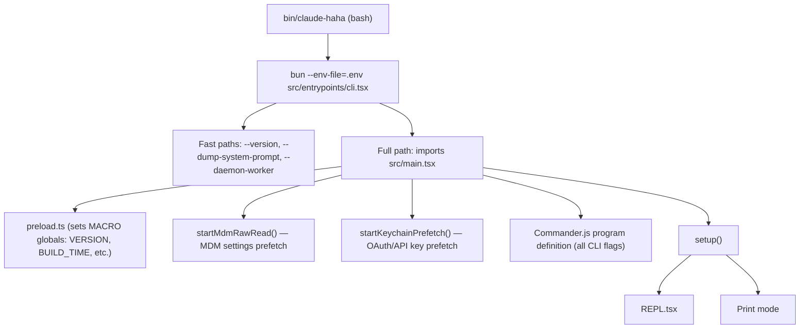
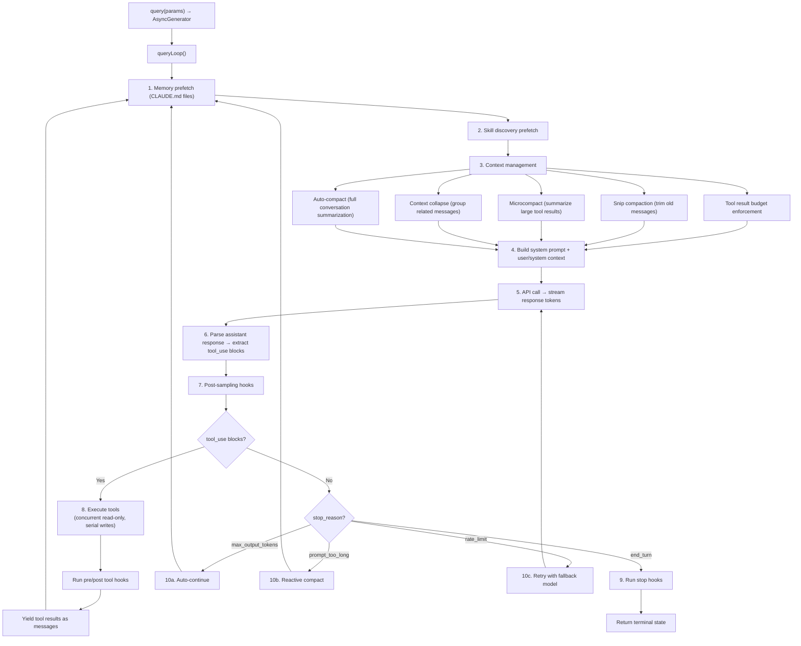
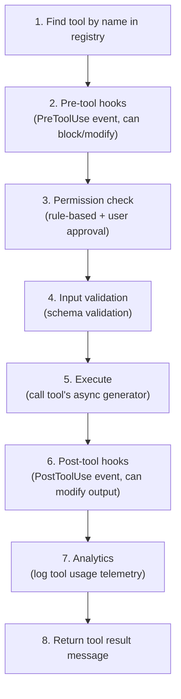
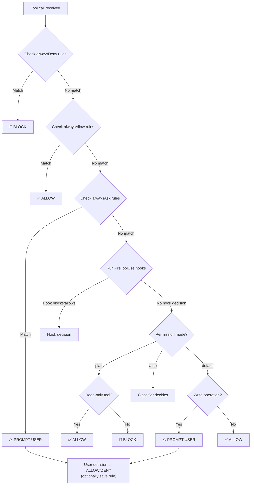
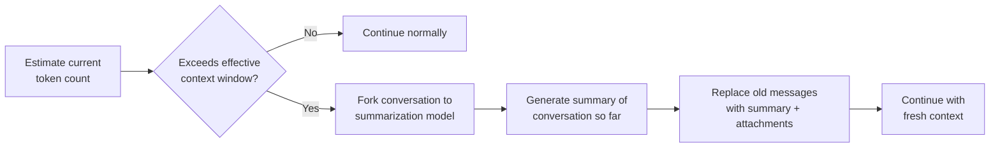
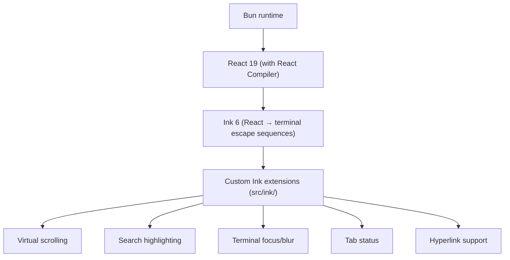
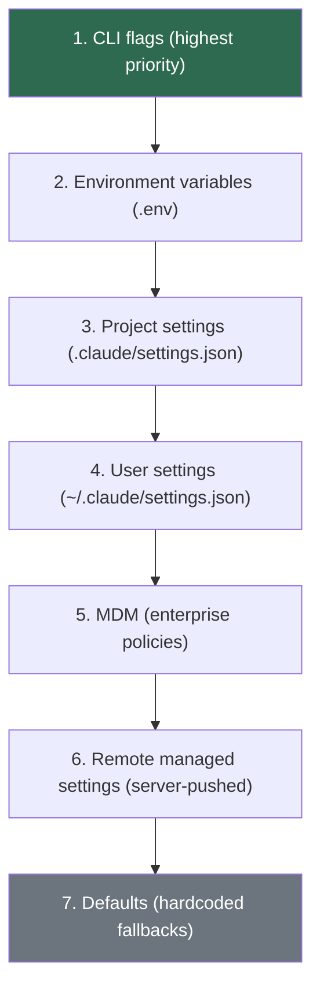

# Claude Code Blueprint

> Comprehensive technical blueprint of the Claude Code CLI — Anthropic's agentic AI coding assistant.

---

## 1. Project Identity

| Field | Value |
|---|---|
| **Name** | `claude-code-local` (forked from Anthropic's Claude Code) |
| **Runtime** | [Bun](https://bun.sh) (TypeScript-first, fast startup) |
| **Language** | TypeScript (ESNext, JSX via React) |
| **Terminal UI** | React + [Ink](https://github.com/vadimdemedes/ink) (React renderer for CLI) |
| **CLI Framework** | Commander.js (`@commander-js/extra-typings`) |
| **AI SDK** | `@anthropic-ai/sdk` (Claude Messages API, streaming) |
| **Protocol Support** | MCP (Model Context Protocol), LSP (Language Server Protocol) |
| **Module System** | ESM (`"type": "module"`) |
| **Build** | Bun bundler with `bun:bundle` feature flags for dead code elimination |

---

## 2. Entry Points & Boot Sequence

### 2.1 Entry Chain



### 2.2 Boot Modes

| Mode | Trigger | Description |
|---|---|---|
| **Interactive TUI** | `./bin/claude-haha` (no args) | Full React/Ink REPL with rich UI |
| **Headless/Print** | `--print` / `-p` flag | Single query, stdout output, no TUI |
| **Recovery CLI** | `CLAUDE_CODE_FORCE_RECOVERY_CLI=1` | Minimal readline REPL fallback |
| **Chrome MCP** | `--claude-in-chrome-mcp` | Chrome browser extension MCP server |
| **Daemon Worker** | `--daemon-worker=<kind>` | Background worker (internal) |

### 2.3 Setup Phase (`setup.ts`)

The `setup()` function performs:
1. Node.js version check (>=18)
2. Session ID creation/restoration
3. UDS messaging server start (for inter-process communication)
4. Git root detection and working directory setup
5. Worktree creation (if enabled)
6. Session memory initialization
7. Hook configuration snapshot
8. Background housekeeping launch

---

## 3. Directory Structure

```
claude-code-haha/
├── bin/claude-haha              # Bash entry script
├── preload.ts                   # Bun preload (MACRO globals)
├── .env.example                 # Environment variable template
├── package.json                 # Dependencies & scripts
├── tsconfig.json                # TypeScript config (ESNext, bundler resolution)
├── stubs/                       # Stub modules for missing native packages
│
└── src/
    ├── entrypoints/
    │   └── cli.tsx              # CLI bootstrap (fast paths + full init)
    ├── main.tsx                 # Commander.js program definition (~800KB, the big one)
    ├── setup.ts                 # Session initialization
    ├── query.ts                 # THE AGENTIC LOOP — core message/tool cycle
    ├── Tool.ts                  # Tool type definitions & ToolUseContext
    ├── tools.ts                 # Tool registry (all tools collected)
    ├── commands.ts              # Slash command registry
    │
    ├── screens/
    │   └── REPL.tsx             # Interactive REPL screen (main UI)
    │
    ├── tools/                   # 40+ tool implementations
    │   ├── BashTool/            # Shell command execution
    │   ├── FileReadTool/        # File reading
    │   ├── FileWriteTool/       # File creation
    │   ├── FileEditTool/        # Surgical file editing
    │   ├── GlobTool/            # File pattern matching
    │   ├── GrepTool/            # Content search (ripgrep)
    │   ├── AgentTool/           # Subagent spawning
    │   ├── WebFetchTool/        # HTTP fetching
    │   ├── WebSearchTool/       # Web search
    │   ├── SkillTool/           # Skill execution
    │   ├── TaskCreateTool/      # Task management
    │   ├── SendMessageTool/     # Inter-agent messaging
    │   ├── MCPTool/             # MCP tool proxy
    │   ├── ToolSearchTool/      # Deferred tool loading
    │   └── ... (30+ more)
    │
    ├── commands/                # 100+ slash commands
    │   ├── commit.ts            # /commit
    │   ├── compact/             # /compact
    │   ├── review.ts            # /review
    │   ├── resume/              # /resume
    │   ├── mcp/                 # /mcp add, etc.
    │   ├── plugin/              # /plugin install, etc.
    │   └── ...
    │
    ├── components/              # 140+ React/Ink UI components
    │   ├── App.tsx              # Root application component
    │   ├── PromptInput/         # User input area
    │   ├── Messages.tsx         # Message display list
    │   ├── Spinner.tsx          # Activity spinner
    │   ├── permissions/         # Permission dialogs
    │   ├── diff/                # Diff rendering
    │   ├── Markdown.tsx         # Markdown renderer
    │   └── ...
    │
    ├── services/                # Business logic services
    │   ├── api/                 # Anthropic API client
    │   │   ├── client.ts        # SDK client creation (Direct/Bedrock/Vertex/Foundry)
    │   │   ├── claude.ts        # Message streaming & response handling
    │   │   └── withRetry.ts     # Retry logic with fallback
    │   ├── mcp/                 # MCP server management
    │   │   ├── client.ts        # MCP client connections
    │   │   ├── config.ts        # MCP server configuration parsing
    │   │   └── types.ts         # MCP type definitions
    │   ├── compact/             # Context compaction
    │   │   ├── autoCompact.ts   # Auto-compact when context is full
    │   │   └── compact.ts       # Conversation summarization
    │   ├── tools/               # Tool execution pipeline
    │   │   ├── toolExecution.ts # Single tool execution
    │   │   ├── toolOrchestration.ts # Concurrent/serial tool batching
    │   │   ├── toolHooks.ts     # Pre/post tool hooks
    │   │   └── StreamingToolExecutor.ts # Streaming tool execution
    │   ├── analytics/           # Telemetry & feature flags (GrowthBook)
    │   ├── oauth/               # OAuth authentication flows
    │   ├── plugins/             # Plugin management
    │   └── ...
    │
    ├── hooks/                   # 80+ React hooks
    │   ├── useCanUseTool.tsx    # Permission checking hook
    │   ├── useMergedTools.ts    # Tool merging (built-in + MCP + plugin)
    │   ├── useMergedCommands.ts # Command merging
    │   ├── useVoice*.ts         # Voice input hooks
    │   ├── useIDEIntegration.tsx # IDE connection hooks
    │   └── ...
    │
    ├── state/                   # Application state management
    │   ├── AppState.tsx         # React context provider
    │   ├── AppStateStore.ts     # State type definitions
    │   └── store.ts             # Zustand-like external store
    │
    ├── context/                 # React contexts
    │   ├── notifications.tsx    # Notification system
    │   ├── mailbox.tsx          # Inter-agent messaging
    │   └── ...
    │
    ├── constants/               # Configuration constants
    │   ├── prompts.ts           # System prompt construction
    │   ├── system.ts            # System-level constants
    │   └── ...
    │
    ├── types/                   # TypeScript type definitions
    │   ├── message.ts           # Message types
    │   ├── permissions.ts       # Permission types
    │   ├── hooks.ts             # Hook event types
    │   └── plugin.ts            # Plugin types
    │
    ├── skills/                  # Skill system
    ├── plugins/                 # Plugin system
    ├── ink/                     # Custom Ink extensions
    ├── keybindings/             # Keyboard shortcut system
    ├── vim/                     # Vim mode support
    ├── voice/                   # Voice input
    ├── bridge/                  # IDE bridge protocol
    ├── coordinator/             # Multi-agent coordination
    ├── tasks/                   # Background task system
    ├── remote/                  # Remote session support
    ├── server/                  # Direct-connect server
    └── utils/                   # 300+ utility modules
        ├── permissions/         # Permission engine
        ├── hooks/               # Hook execution engine
        ├── model/               # Model selection/routing
        ├── settings/            # Settings management
        ├── plugins/             # Plugin loading
        ├── swarm/               # Agent swarm helpers
        └── ...
```

---

## 4. Core Abstractions

### 4.1 Tool (`Tool.ts`)

Every capability the AI can invoke is a **Tool**. The `Tool<Input, Output>` interface defines:

```typescript
type Tool<Input, Output> = {
  name: string                           // Unique identifier
  description: string                    // Shown to the model
  inputSchema: ToolInputJSONSchema       // JSON Schema for parameters
  isReadOnly(): boolean                  // Controls concurrent execution
  isEnabled(context): boolean            // Dynamic enable/disable
  validateInput(input): ValidationResult // Input validation
  prompt(context): string                // Dynamic prompt generation
  call(input, context): AsyncGenerator   // Execution (yields progress + result)
}
```

**Key tools**: `Bash`, `Read`, `Write`, `Edit`, `Glob`, `Grep`, `Agent`, `Skill`, `WebFetch`, `WebSearch`, `TaskCreate/Update/List`, `SendMessage`, `TeamCreate/Delete`, MCP proxy tools.

### 4.2 ToolUseContext

The central context object threaded through all tool executions:

```typescript
type ToolUseContext = {
  options: {
    commands: Command[]          // Available slash commands
    tools: Tools                 // Available tools
    mcpClients: MCPServerConnection[]  // MCP server connections
    mainLoopModel: string        // Current model
    thinkingConfig: ThinkingConfig  // Extended thinking settings
    agentDefinitions: AgentDefinitionsResult  // Agent configs
  }
  abortController: AbortController  // Cancellation
  getAppState(): AppState           // Read application state
  setAppState(fn): void             // Update application state
  messages: Message[]               // Conversation history
  readFileState: FileStateCache     // File content cache
  // ... 30+ more fields
}
```

### 4.3 Message Types

Messages form the conversation history:

| Type | Description |
|---|---|
| `UserMessage` | User text input or tool results |
| `AssistantMessage` | Model responses (text + tool_use blocks) |
| `SystemMessage` | System instructions |
| `AttachmentMessage` | CLAUDE.md files, hook results, skill content |
| `ProgressMessage` | Tool execution progress updates |
| `ToolUseSummaryMessage` | Microcompact summaries |

### 4.4 AppState

Immutable application state managed via external store:

```typescript
type AppState = DeepImmutable<{
  settings: SettingsJson
  mainLoopModel: ModelSetting
  toolPermissionContext: ToolPermissionContext
  messages: Message[]
  mcpClients: MCPServerConnection[]
  agentDefinitions: AgentDefinitionsResult
  tasks: Record<string, TaskState>
  speculation: SpeculationState
  // ... 40+ more fields
}>
```

---

## 5. The Agentic Loop (`query.ts`)

The heart of Claude Code — an async generator that implements the AI reasoning cycle:

### 5.1 Loop Structure



### 5.2 Key Recovery Mechanisms

| Condition | Recovery |
|---|---|
| Context too large | Auto-compact: summarize conversation, reset |
| Max output tokens | Auto-continue: append "please continue" message |
| Prompt too long | Reactive compact: emergency summarization |
| API rate limit | Retry with exponential backoff + fallback model |
| Tool execution error | Error message returned to model for self-correction |

---

## 6. Tool Execution Pipeline

### 6.1 Orchestration (`toolOrchestration.ts`)

Tool calls from a single model response are partitioned:

1. **Read-only tools** (e.g., `Read`, `Glob`, `Grep`) → run concurrently (up to 10 parallel)
2. **Write tools** (e.g., `Edit`, `Write`, `Bash`) → run serially

### 6.2 Single Tool Execution (`toolExecution.ts`)

For each tool call:



---

## 7. Permission System

### 7.1 Permission Modes

| Mode | Behavior |
|---|---|
| `default` | Ask user for dangerous operations |
| `plan` | Only allow read-only tools without asking |
| `auto` | AI-assisted approval via classifier |
| `bypassPermissions` | Allow everything (dangerous) |
| `acceptEdits` | Auto-approve file edits |
| `dontAsk` | Auto-approve most operations |

### 7.2 Permission Rules

Rules are defined per-source (project, user, global) with three lists:
- **alwaysAllow** — auto-approved tool+pattern combinations
- **alwaysDeny** — blocked operations
- **alwaysAsk** — always prompt user

### 7.3 Permission Flow



---

## 8. Context Window Management

### 8.1 Token Budget

Claude Code operates within a model's context window (typically 200K-1M tokens) and uses multiple strategies:

| Strategy | When | What |
|---|---|---|
| **Tool Result Budget** | Every iteration | Truncate large tool outputs |
| **Snip Compaction** | Before each API call | Remove old messages from middle |
| **Microcompact** | Before each API call | Summarize verbose tool results |
| **Context Collapse** | Before auto-compact | Group related messages |
| **Auto-compact** | When approaching limit | Full conversation summarization |
| **Reactive compact** | On `prompt_too_long` error | Emergency summarization |

### 8.2 Auto-compact Flow



---

## 9. Multi-Agent Architecture

### 9.1 Subagent Spawning (`AgentTool`)

The `Agent` tool creates child agent processes:

- Each agent gets its own `query()` loop instance
- Agents can be specialized types (Explore, Plan, code-reviewer, etc.)
- Agents run in foreground (blocking) or background
- Agents can communicate via `SendMessage` tool
- Worktree isolation available for git operations

### 9.2 Agent Swarms

Teams of agents can work together:
- `TeamCreate` — spawn a team with leader + workers
- `SendMessage` — inter-agent communication
- `TeamDelete` — teardown team
- Shared state via mailbox system

---

## 10. Plugin & Skill System

### 10.1 Plugins

Plugins extend Claude Code with:
- **Tools** — new tool definitions
- **Commands** — slash commands
- **Skills** — prompt-based capabilities
- **Hooks** — event handlers (PreToolUse, PostToolUse, Stop, SessionStart, etc.)
- **Agents** — custom agent definitions
- **MCP Servers** — external service integrations

Plugin manifest: `plugin.json` with component declarations.

### 10.2 Skills

Skills are prompt expansions triggered by slash commands or pattern matching:
- Defined in markdown files with YAML frontmatter
- Can reference files and include dynamic content
- Invoked via `SkillTool` or slash command

---

## 11. MCP Integration

Claude Code is both an MCP **client** and can run as an MCP **server**:

### As MCP Client:
- Connects to configured MCP servers (stdio, SSE, HTTP)
- Exposes remote tools to the AI model via `MCPTool` proxy
- Handles OAuth authentication for MCP servers
- Supports resource reading via `ListMcpResources` / `ReadMcpResource`

### As MCP Server:
- Chrome extension integration (`--claude-in-chrome-mcp`)
- Computer use MCP server
- IDE integration servers

---

## 12. Terminal UI Architecture

### 12.1 Rendering Stack



### 12.2 REPL Screen Structure

```mermaid
block-beta
    columns 1
    block:statusline["Status Line (model, cost, tokens)"]
    end
    block:messages["Message List (virtual scrolling)"]
        columns 4
        um["User messages"] am["Assistant messages (markdown)"] tr["Tool use results (diffs, etc.)"] pi["Progress indicators"]
    end
    block:spinner["Spinner / Activity indicator"]
    end
    block:prompt["Prompt Input (with vim mode)"]
        columns 3
        ac["Autocomplete suggestions"] fm["File @ mentions"] sc["Slash command palette"]
    end
    block:footer["Footer (tasks, teams, shortcuts)"]
    end
```

---

## 13. Key Dependencies

| Package | Purpose |
|---|---|
| `@anthropic-ai/sdk` | Claude API client |
| `@modelcontextprotocol/sdk` | MCP protocol implementation |
| `ink` + `react` | Terminal UI rendering |
| `@commander-js/extra-typings` | CLI argument parsing |
| `chalk` | Terminal colors |
| `chokidar` | File watching |
| `diff` | Diff computation |
| `fuse.js` | Fuzzy search (commands, files) |
| `highlight.js` | Syntax highlighting |
| `marked` | Markdown parsing |
| `zod` | Schema validation |
| `ws` | WebSocket (MCP, IDE bridge) |
| `@opentelemetry/*` | Observability/tracing |
| `@growthbook/growthbook` | Feature flags |
| `execa` | Process execution |
| `lru-cache` | Caching |
| `yaml` | YAML parsing (skills, configs) |

---

## 14. Configuration System

### 14.1 Configuration Sources (priority order)



### 14.2 Key Environment Variables

| Variable | Purpose |
|---|---|
| `ANTHROPIC_API_KEY` | API authentication |
| `ANTHROPIC_BASE_URL` | Custom API endpoint |
| `ANTHROPIC_MODEL` | Default model override |
| `API_TIMEOUT_MS` | Request timeout |
| `DISABLE_TELEMETRY` | Disable analytics |

---

## 15. API Provider Support

Claude Code supports multiple API providers:

| Provider | Auth Method | Configuration |
|---|---|---|
| **Anthropic Direct** | API Key or OAuth | `ANTHROPIC_API_KEY` |
| **AWS Bedrock** | AWS credentials | `AWS_REGION`, AWS SDK config |
| **Google Vertex AI** | GCP credentials | `VERTEX_REGION_*` variables |
| **Azure Foundry** | API Key or Azure AD | `ANTHROPIC_FOUNDRY_*` variables |
| **Custom/Compatible** | API Key | `ANTHROPIC_BASE_URL` |

---

## 16. Build & Feature Flag System

The project uses Bun's `feature()` function from `bun:bundle` for dead code elimination:

```typescript
import { feature } from 'bun:bundle'

// Entire code blocks are eliminated at build time if feature is disabled
if (feature('VOICE_MODE')) {
  const voice = require('./voice.js')
  // ...
}
```

Key feature flags: `VOICE_MODE`, `DAEMON`, `COORDINATOR_MODE`, `KAIROS`, `PROACTIVE`, `AGENT_TRIGGERS`, `CACHED_MICROCOMPACT`, `CONTEXT_COLLAPSE`, `HISTORY_SNIP`, `TOKEN_BUDGET`, and many more.

---

## 17. Observability

| System | Purpose |
|---|---|
| **OpenTelemetry** | Distributed tracing, metrics, logs |
| **GrowthBook** | A/B testing, feature flags |
| **Analytics events** | `logEvent()` for usage tracking |
| **Startup profiler** | `profileCheckpoint()` for boot performance |
| **Query profiler** | `queryCheckpoint()` for loop performance |
| **Diagnostic logs** | `logForDiagnosticsNoPII()` for debugging |
