# Context Window Intelligence & Compaction Strategies

> How Claude Code manages the finite context window as an intelligent resource — compacting, snipping, collapsing, budgeting, and persisting to keep the model effective across arbitrarily long sessions. Every diagram is a Mermaid diagram you can render in any Markdown viewer.

---

## Table of Contents

1. [Why Context Management Is the Hardest Problem](#1-why-context-management-is-the-hardest-problem)
2. [The Context Management Pipeline](#2-the-context-management-pipeline)
3. [Token Counting & Estimation](#3-token-counting--estimation)
4. [Auto-Compact: The Primary Safety Net](#4-auto-compact-the-primary-safety-net)
5. [Reactive Compact: Emergency Recovery](#5-reactive-compact-emergency-recovery)
6. [History Snip: Surgical Message Removal](#6-history-snip-surgical-message-removal)
7. [Context Collapse: Read/Search Folding](#7-context-collapse-readsearch-folding)
8. [Tool Result Budget & Persistence](#8-tool-result-budget--persistence)
9. [Microcompact & Caching](#9-microcompact--caching)
10. [Session Memory: Surviving Compaction](#10-session-memory-surviving-compaction)
11. [Token Budget: Spending Control](#11-token-budget-spending-control)
12. [The Complete Decision Flow](#12-the-complete-decision-flow)

---

## 1. Why Context Management Is the Hardest Problem

An AI coding agent that runs for hours, reads hundreds of files, and executes dozens of tools will inevitably exceed any context window. The challenge: **how do you compress without losing the information the model needs right now?**

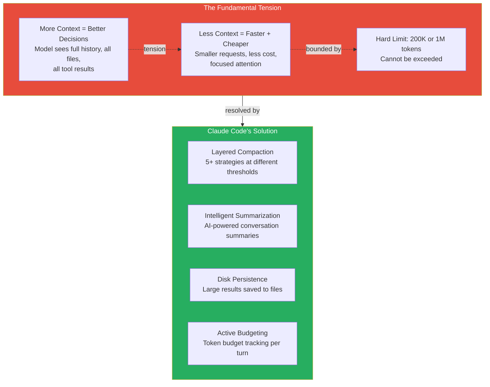

---

## 2. The Context Management Pipeline

Every API call goes through a multi-stage context preparation pipeline.

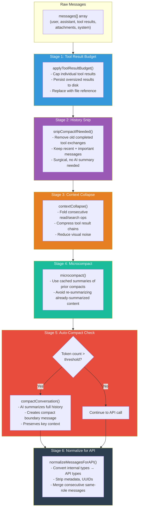

---

## 3. Token Counting & Estimation

Accurate token counting is critical — over-estimate and you compact too early, under-estimate and you hit API errors.

```mermaid
flowchart LR
    subgraph Strategies["Token Counting Strategies"]
        direction TB
        APIUsage["1. API Usage Data<br/>Most accurate — from last response<br/>input_tokens + cache_tokens + output_tokens"]
        CountAPI["2. Count Tokens API<br/>Exact count via API call<br/>(Bedrock/Vertex/Anthropic)"]
        Estimation["3. Rough Estimation<br/>Fast heuristic: bytes / 4<br/>Used when no API data available"]
    end

    subgraph Function["tokenCountWithEstimation()"]
        direction TB
        Check["Check: has recent API usage?"]
        Yes["Use getTokenCountFromUsage()"]
        No["Use roughTokenCountEstimationForMessages()"]
        Check -->|"Yes"| Yes
        Check -->|"No"| No
    end

    subgraph Gotchas["Token Counting Gotchas"]
        direction TB
        G1["Split assistant messages share<br/>the same message.id but different<br/>usage — deduplicate!"]
        G2["Cache tokens count toward<br/>context window size but not<br/>toward billing the same way"]
        G3["Synthetic messages (internal)<br/>are excluded from counts"]
    end

    Strategies --> Function --> Gotchas

    style Strategies fill:#2980b9,color:#fff
    style Function fill:#27ae60,color:#fff
    style Gotchas fill:#f39c12,color:#333
```

### The roughTokenCountEstimation Heuristic

```typescript
// ~4 bytes per token for English text
const BYTES_PER_TOKEN = 4
function roughTokenCountEstimation(text: string): number {
  return Math.ceil(Buffer.byteLength(text, 'utf-8') / BYTES_PER_TOKEN)
}
```

This is intentionally simple — it's used when speed matters more than precision (e.g., during tool result budgeting). The API usage data from the previous turn provides the accurate count for threshold decisions.

---

## 4. Auto-Compact: The Primary Safety Net

Auto-compact is the workhorse of context management. It triggers when context approaches the window limit.

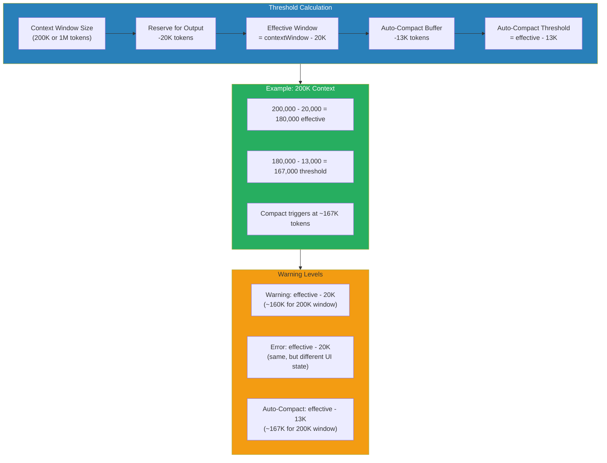

### The Compaction Process

```mermaid
sequenceDiagram
    participant Loop as Query Loop
    participant AutoC as Auto-Compact
    participant Fork as Forked Agent
    participant API as Claude API

    Loop->>AutoC: Token count > threshold
    AutoC->>AutoC: isAutoCompactEnabled()?

    alt Enabled
        AutoC->>AutoC: executePreCompactHooks()
        AutoC->>Fork: runForkedAgent(messages, "Summarize conversation")
        Fork->>API: Send full history with compact prompt
        API-->>Fork: Summary (~2-5K tokens)
        Fork-->>AutoC: Compact summary
        AutoC->>AutoC: buildPostCompactMessages()
        Note over AutoC: Creates SystemCompactBoundaryMessage<br/>with summary text
        AutoC->>AutoC: Re-inject CLAUDE.md attachments
        AutoC->>AutoC: Re-inject plan file if active
        AutoC->>AutoC: executePostCompactHooks()
        AutoC->>AutoC: trySessionMemoryCompaction()
        AutoC-->>Loop: Compacted messages[] (much smaller)
    else Disabled or circuit-breaker tripped
        AutoC-->>Loop: Original messages (unchanged)
    end
```

### The Circuit Breaker

Auto-compact has a circuit breaker to prevent infinite retry loops:

```typescript
const MAX_CONSECUTIVE_AUTOCOMPACT_FAILURES = 3
```

If compaction fails 3 times in a row (e.g., the context is so large even the compact call hits `prompt_too_long`), it stops trying. This prevents wasting ~250K API calls/day globally (measured from production data).

---

## 5. Reactive Compact: Emergency Recovery

When auto-compact isn't enough and the API returns `prompt_too_long`, reactive compact kicks in.

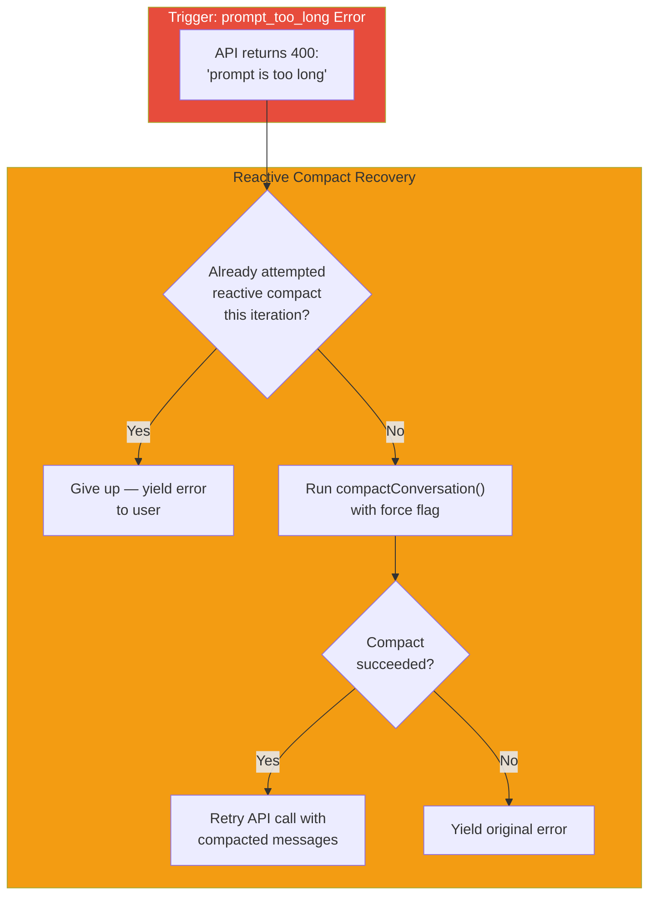

**Key insight**: Reactive compact is a **one-shot** recovery. If it fails, the error propagates to the user. This prevents infinite compact→retry→error loops.

---

## 6. History Snip: Surgical Message Removal

History Snip (feature flag: `HISTORY_SNIP`) is a lightweight alternative to full compaction.

```mermaid
flowchart LR
    subgraph Before["Before Snip"]
        direction TB
        M1["Turn 1: Read file A (500 tokens)"]
        M2["Turn 2: Edit file A (200 tokens)"]
        M3["Turn 3: Read file B (800 tokens)"]
        M4["Turn 4: Read file C (600 tokens)"]
        M5["Turn 5: Edit file B (300 tokens)"]
        M6["Turn 6: Read file D (current)"]
    end

    subgraph After["After Snip"]
        direction TB
        S1["Turn 1: [snipped]"]
        S2["Turn 2: Edit file A (kept)"]
        S3["Turn 3: [snipped]"]
        S4["Turn 4: Read file C (kept — recent)"]
        S5["Turn 5: Edit file B (kept)"]
        S6["Turn 6: Read file D (kept — current)"]
    end

    Before -->|"snipCompactIfNeeded()"| After

    style Before fill:#e74c3c,color:#fff
    style After fill:#27ae60,color:#fff
```

### What Gets Snipped

- Old read/search tool results whose content is no longer relevant
- Tool results that have been superseded by edits
- Messages beyond a sliding window of recent history

### What's Preserved

- Recent messages (within a configurable window)
- Write/edit tool calls (they represent state changes)
- The compact boundary summary (if one exists)
- Messages the model is currently referencing

---

## 7. Context Collapse: Read/Search Folding

Context Collapse (feature flag: `CONTEXT_COLLAPSE`) folds consecutive read/search operations into compact groups for the UI, reducing visual and cognitive noise.

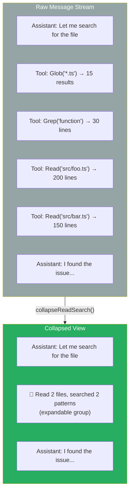

### Collapsibility Detection

```typescript
type SearchOrReadResult = {
  isCollapsible: boolean  // Can this be folded?
  isSearch: boolean       // Glob/Grep operations
  isRead: boolean         // File read operations
  isList: boolean         // Directory listing
  isREPL: boolean         // REPL tool usage
  isMemoryWrite: boolean  // Memory file writes
  isAbsorbedSilently: boolean  // Snip/ToolSearch — no count increment
}
```

Tools are categorized by their read/write nature. Read-only tools are collapsible; write tools break the collapse group because they represent observable state changes.

---

## 8. Tool Result Budget & Persistence

Large tool results are the primary source of context bloat. The tool result budget system prevents any single tool from consuming too much context.

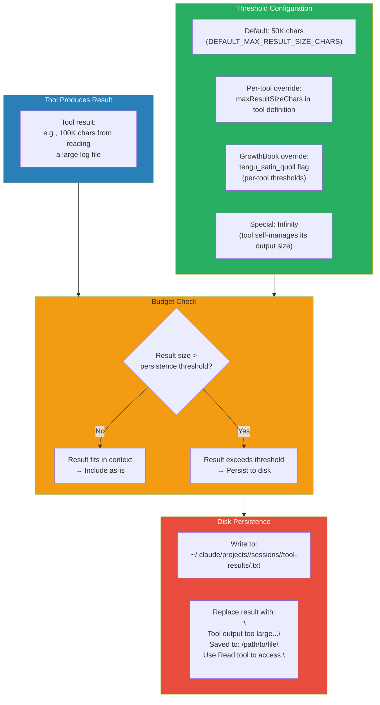

### The FRC (Function Result Clearing) Pattern

Beyond budgeting new results, old tool results are proactively cleared:

```
[Old tool result content cleared]
```

The system prompt warns the model:
> "When working with tool results, write down any important information you might need later in your response, as the original tool result may be cleared later."

This trains the model to **extract and summarize** key findings immediately, a behavior essential for long sessions.

---

## 9. Microcompact & Caching

Microcompact (feature flag: `CACHED_MICROCOMPACT`) avoids redundant summarization by caching compact summaries.

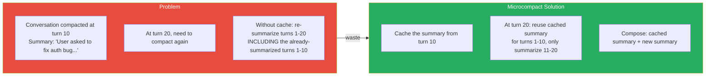

### How It Works

1. After compaction, the summary is stored as a `MicrocompactBoundaryMessage`
2. On next compaction, messages after the boundary are the only ones needing summarization
3. The cached summary is prepended to the new summary
4. Result: compaction gets cheaper over time as more history is pre-summarized

---

## 10. Session Memory: Surviving Compaction

When compaction discards message history, critical information can be lost. Session memory persists key facts across compact boundaries.

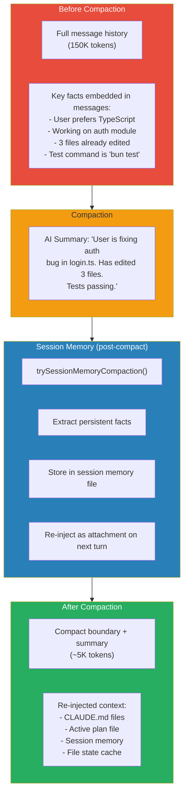

---

## 11. Token Budget: Spending Control

The token budget system (feature flag: `TOKEN_BUDGET`) allows users to specify how many tokens they want the model to spend on a task.

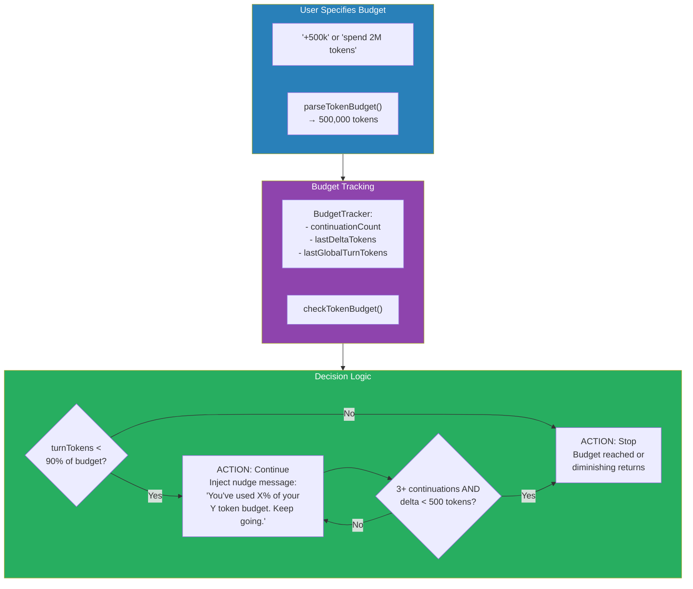

### The Diminishing Returns Guard

The system detects when the model is making less than 500 tokens of progress per continuation after 3+ attempts. This prevents the model from spinning its wheels when it's effectively done but hasn't explicitly said so.

---

## 12. The Complete Decision Flow

Here's how all the compaction strategies work together in a single query loop iteration.

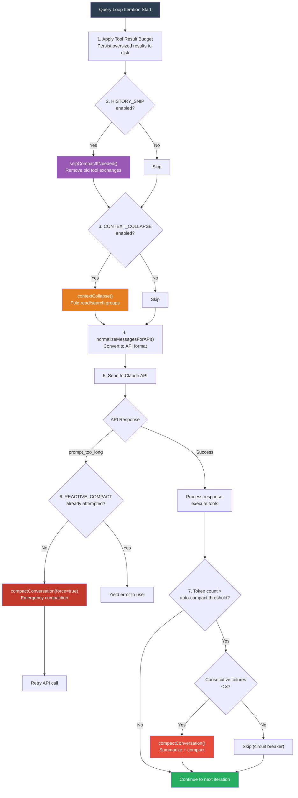

### Context Window Sizes

| Model | Default Window | 1M Enabled | Effective (after reserves) |
|---|---|---|---|
| Claude Sonnet 4.6 | 200K | 1M (opt-in) | 167K / 967K |
| Claude Opus 4.6 | 200K | 1M (with suffix) | 167K / 967K |
| Claude Haiku 4.5 | 200K | No | 167K |
| Custom/Bedrock | Per model capability | Via env override | Capability - 33K |

### Environment Overrides

| Variable | Effect |
|---|---|
| `CLAUDE_CODE_AUTO_COMPACT_WINDOW` | Cap the effective context window size |
| `CLAUDE_AUTOCOMPACT_PCT_OVERRIDE` | Set compact threshold as % of effective window |
| `CLAUDE_CODE_MAX_CONTEXT_TOKENS` | Override context window detection entirely |
| `CLAUDE_CODE_DISABLE_1M_CONTEXT` | Force 200K even on 1M-capable models |
