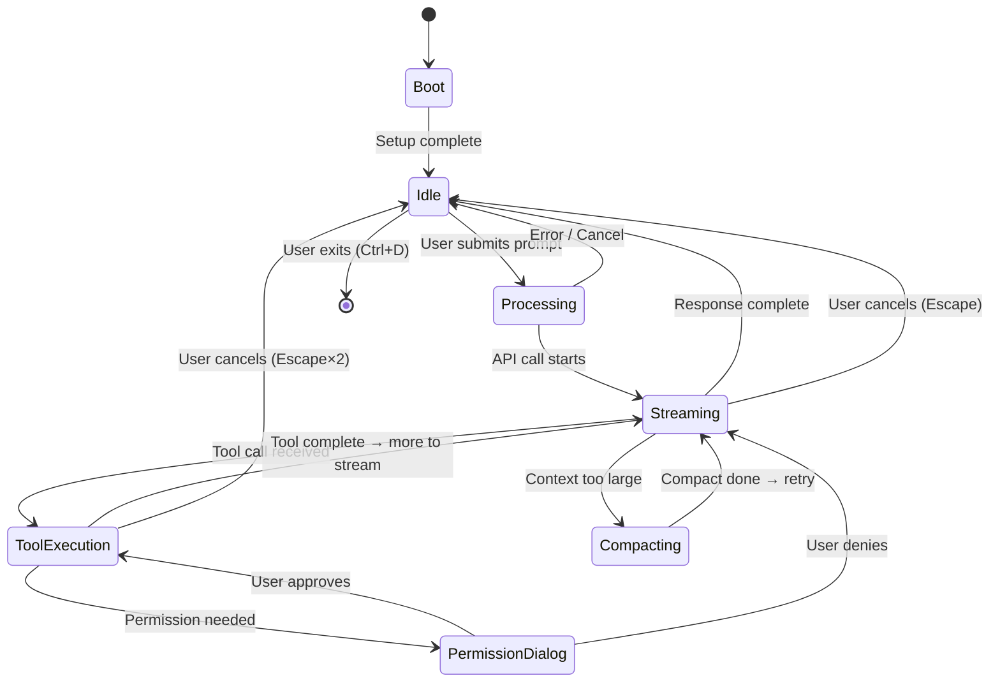
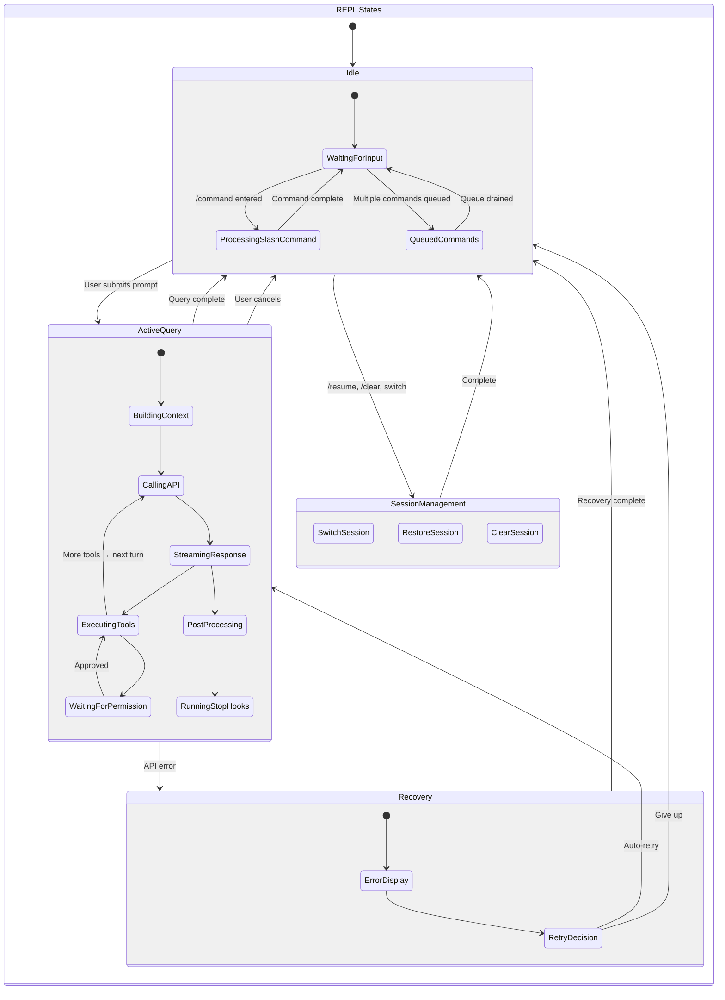
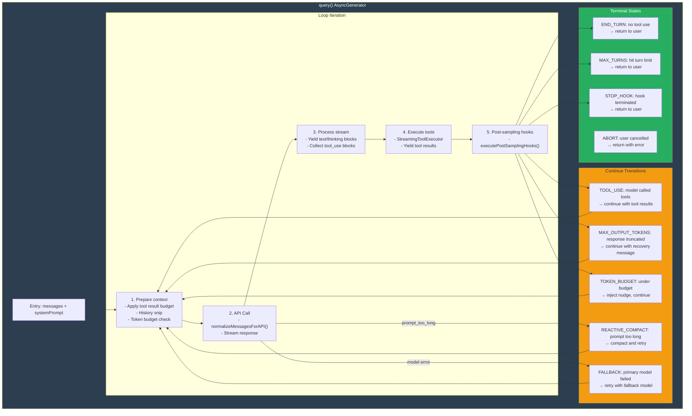
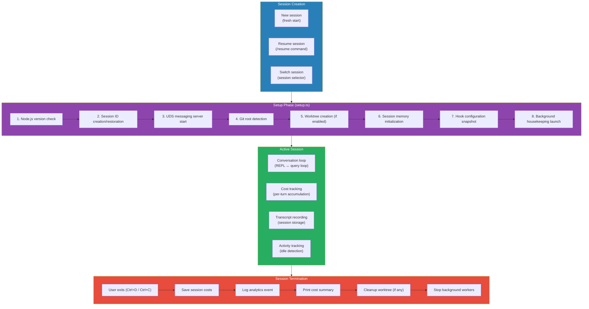
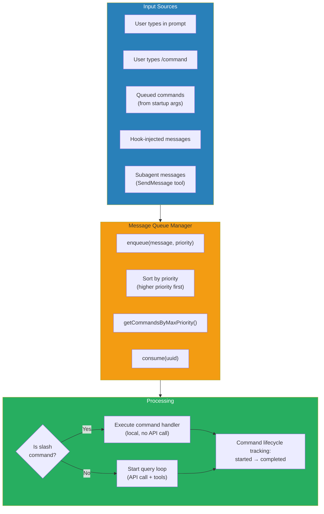
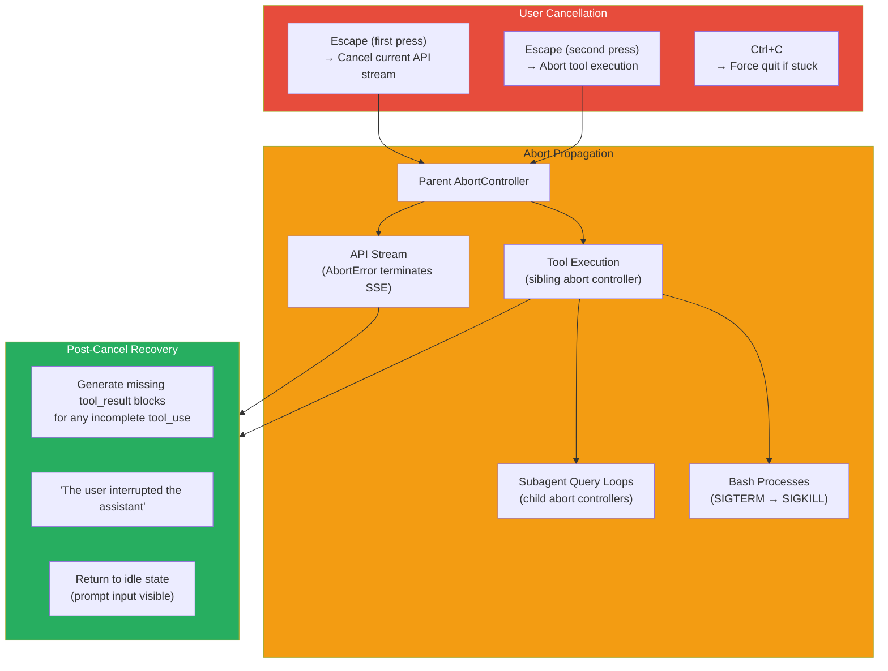
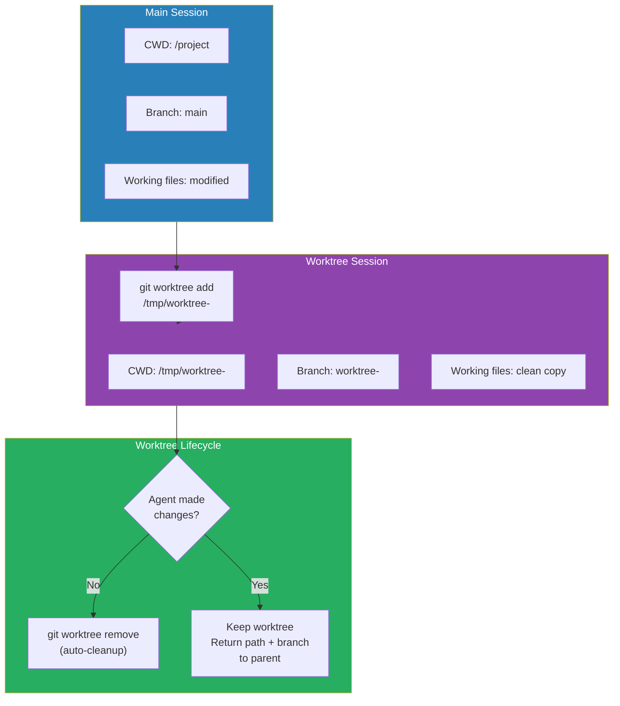
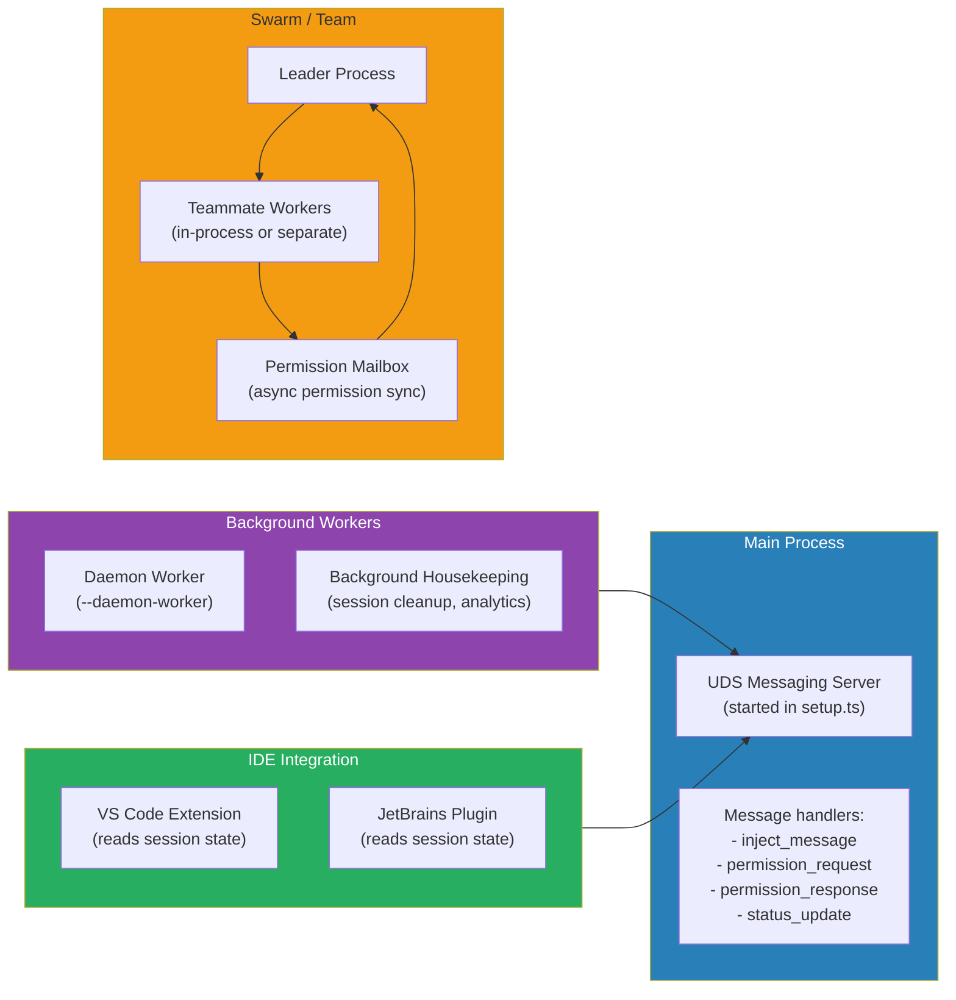
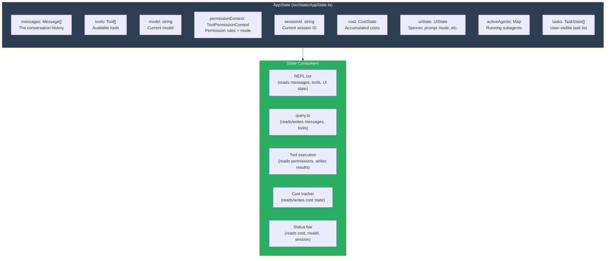

# Conversation State Machine & Session Lifecycle

> How Claude Code manages the state transitions of a conversation — from idle to streaming, from tool execution to compaction, from session start to session recovery. Every diagram is a Mermaid diagram you can render in any Markdown viewer.

---

## Table of Contents

1. [Why State Management Matters](#1-why-state-management-matters)
2. [The REPL State Machine](#2-the-repl-state-machine)
3. [The Query Loop State Machine](#3-the-query-loop-state-machine)
4. [Session Lifecycle](#4-session-lifecycle)
5. [Message Queue & Command Lifecycle](#5-message-queue--command-lifecycle)
6. [Cancellation & Abort Propagation](#6-cancellation--abort-propagation)
7. [Session Persistence & Recovery](#7-session-persistence--recovery)
8. [Worktree Isolation](#8-worktree-isolation)
9. [Inter-Process Communication](#9-inter-process-communication)
10. [The AppState Architecture](#10-the-appstate-architecture)

---

## 1. Why State Management Matters

An AI coding agent has more state transitions than a typical CLI. It must handle: streaming responses, tool execution, permission dialogs, cancellation, compaction, subagent spawning, session switching, and crash recovery — all without losing the user's work.



---

## 2. The REPL State Machine

The REPL (`src/screens/REPL.tsx`) is the main interactive screen. Its state drives the entire UI.



### Key UI States

| State | Spinner | Prompt Input | Permission Dialog |
|---|---|---|---|
| Idle | Hidden | Visible, editable | Hidden |
| BuildingContext | "Thinking..." | Hidden | Hidden |
| StreamingResponse | "Responding..." | Hidden | Hidden |
| ExecutingTools | "Running tool_name..." | Hidden | Hidden |
| WaitingForPermission | Paused | Hidden | Visible |
| PostProcessing | "Processing..." | Hidden | Hidden |
| Error | Hidden | Visible | Hidden |

---

## 3. The Query Loop State Machine

The query loop (`src/query.ts`) is the core agentic loop. It's an `AsyncGenerator` that yields messages and events.



### The State Object

```typescript
type State = {
  messages: Message[]                    // Conversation history
  toolUseContext: ToolUseContext          // Shared tool state
  autoCompactTracking: AutoCompactTrackingState  // Compact state
  maxOutputTokensRecoveryCount: number   // Recovery attempts
  hasAttemptedReactiveCompact: boolean   // Emergency compact flag
  maxOutputTokensOverride: number | undefined
  pendingToolUseSummary: Promise<...>    // Background summary
  stopHookActive: boolean               // Stop hooks running
  turnCount: number                     // Current turn number
  transition: Continue | undefined      // Why we continued
}
```

---

## 4. Session Lifecycle

A session goes through distinct phases from creation to termination.



### Session Storage Structure

```
~/.claude/projects/<project-hash>/
├── sessions/
│   └── <session-id>/
│       ├── transcript.jsonl     # Full message history
│       ├── tool-results/        # Persisted oversized tool outputs
│       ├── agent-<id>/          # Subagent transcripts
│       └── metadata.json        # Session metadata
├── config.json                  # Project config (cumulative costs)
├── CLAUDE.md                    # Project memory
└── memory/                      # Auto-memory files
    ├── MEMORY.md               # Memory index
    ├── user_role.md            # User memories
    ├── feedback_testing.md     # Feedback memories
    └── project_auth.md         # Project memories
```

---

## 5. Message Queue & Command Lifecycle

Messages and commands are queued and processed in priority order.



---

## 6. Cancellation & Abort Propagation

Cancellation must propagate through multiple layers without losing data.



### The Missing Tool Result Problem

When the user cancels mid-tool-execution, the API has already received `tool_use` blocks but won't get `tool_result` blocks. The system generates synthetic error results:

```typescript
function* yieldMissingToolResultBlocks(assistantMessages, errorMessage) {
  for (const assistantMessage of assistantMessages) {
    for (const toolUse of assistantMessage.message.content) {
      yield createUserMessage({
        content: [{ type: 'tool_result', content: errorMessage, is_error: true, tool_use_id: toolUse.id }]
      })
    }
  }
}
```

This ensures the message history remains valid (every `tool_use` has a corresponding `tool_result`).

---

## 7. Session Persistence & Recovery

Sessions survive process crashes and can be resumed.

```mermaid
flowchart LR
    subgraph Write["Session Write Path"]
        direction TB
        W1["Every message → transcript.jsonl<br/>(append-only JSONL)"]
        W2["Every API call → usage tracking<br/>(in-memory, periodic flush)"]
        W3["Every tool result → tool-results/<br/>(if persisted to disk)"]
    end

    subgraph Recovery["Session Recovery"]
        direction TB
        R1["Parse transcript.jsonl"]
        R2["Rebuild messages[] array"]
        R3["Restore cost state"]
        R4["Restore file state cache"]
        R5["Resume from last state"]
    end

    subgraph Resume["Session Resume Flow"]
        direction TB
        ListSessions["listSessionsImpl()<br/>Show recent sessions"]
        SelectSession["User selects session"]
        RestoreSession["sessionRestore.ts<br/>Rebuild full state"]
        ContinueREPL["Continue REPL<br/>with restored messages"]
    end

    Write --> Recovery --> Resume

    style Write fill:#2980b9,color:#fff
    style Recovery fill:#8e44ad,color:#fff
    style Resume fill:#27ae60,color:#fff
```



---

## 8. Worktree Isolation

Subagents can run in isolated git worktrees to prevent interference with the main workspace.



---

## 9. Inter-Process Communication

Claude Code uses Unix Domain Sockets (UDS) for inter-process communication.



---

## 10. The AppState Architecture

All application state lives in a centralized `AppState` type.



### Why a Custom Store?

The existing documentation covers this (design-decisions.md), but the key insight for the state machine: React state management via Ink's rendering means that **state updates trigger UI re-renders**. The custom store provides:
- **Selective updates** — only re-render components that use changed state
- **Batch updates** — multiple state changes in one render cycle
- **Snapshot isolation** — tools see consistent state during execution
