# Cost & Token Economics

> How Claude Code tracks, optimizes, and reports the real-dollar cost of AI-powered coding — from per-token pricing tiers to session-level cost dashboards. Every diagram is a Mermaid diagram you can render in any Markdown viewer.

---

## Table of Contents

1. [Why Cost Matters for AI Coding Agents](#1-why-cost-matters-for-ai-coding-agents)
2. [The Pricing Model Landscape](#2-the-pricing-model-landscape)
3. [Cost Tracking Architecture](#3-cost-tracking-architecture)
4. [Token Flow: Where Tokens Are Spent](#4-token-flow-where-tokens-are-spent)
5. [Prompt Caching: The 90% Discount](#5-prompt-caching-the-90-discount)
6. [The Max Output Tokens Optimization](#6-the-max-output-tokens-optimization)
7. [Model Selection Economics](#7-model-selection-economics)
8. [Subagent Cost Isolation](#8-subagent-cost-isolation)
9. [Cost Reporting & Dashboards](#9-cost-reporting--dashboards)
10. [Cost Optimization Strategies Summary](#10-cost-optimization-strategies-summary)

---

## 1. Why Cost Matters for AI Coding Agents

An AI coding agent that runs for hours can easily spend $10-50+ per session. Understanding and optimizing cost is essential for making the tool accessible.

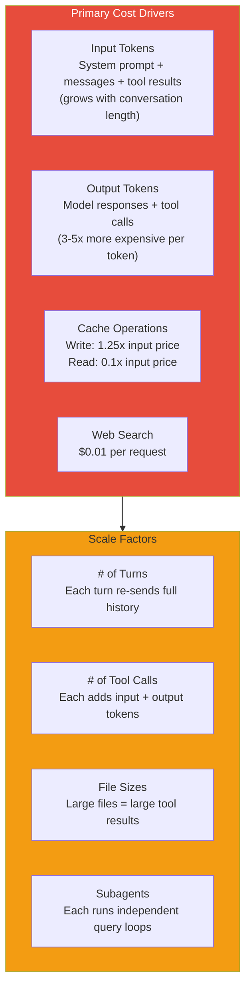

---

## 2. The Pricing Model Landscape

Claude Code supports multiple model tiers with dramatically different cost structures.

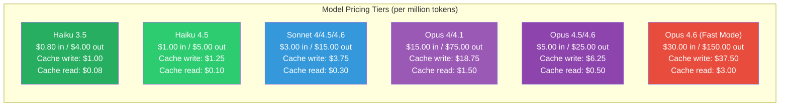

### The Output Token Multiplier

Output tokens are **3-6x more expensive** than input tokens across all tiers. This has profound implications:
- **Verbose model responses** cost disproportionately more
- **Prompt engineering for conciseness** has direct cost impact (the "≤25 words between tools" instruction)
- **Tool calls** (which are output tokens) are expensive

---

## 3. Cost Tracking Architecture

Cost tracking flows through a centralized state system.

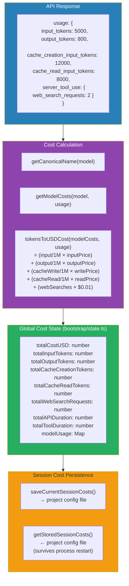

### Per-Model Usage Tracking

Costs are tracked **per model** because a single session may use multiple models:
- Main loop: Opus 4.6
- Subagents: Sonnet 4.6 or Haiku (via `model` override)
- Compact operations: Same model or cheaper model
- Fast mode toggle: Changes Opus 4.6 pricing tier mid-session

---

## 4. Token Flow: Where Tokens Are Spent

Understanding where tokens go reveals the biggest optimization opportunities.

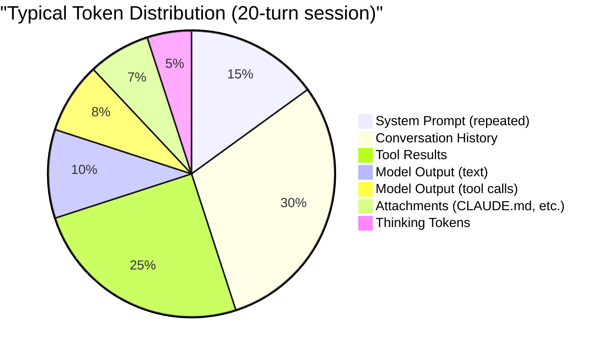

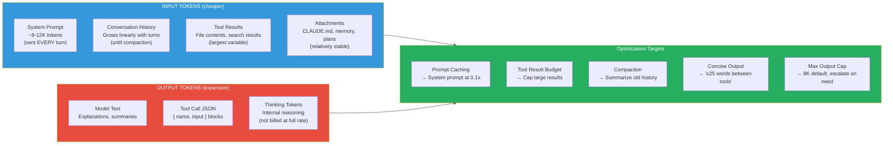

---

## 5. Prompt Caching: The 90% Discount

Prompt caching is the most impactful cost optimization. It turns the system prompt from the biggest cost to nearly free.

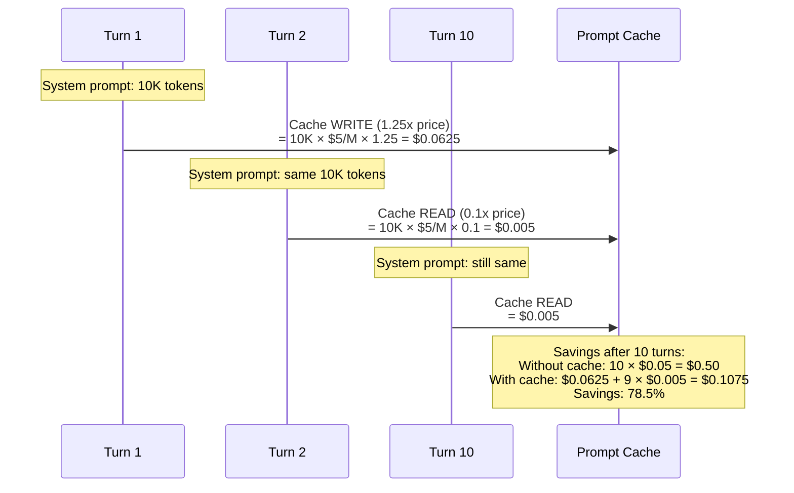

### Global vs Session Cache Scope

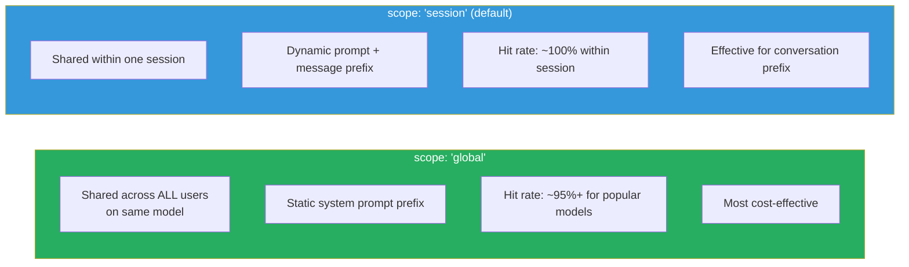

---

## 6. The Max Output Tokens Optimization

A subtle but significant cost optimization: capping default output tokens.

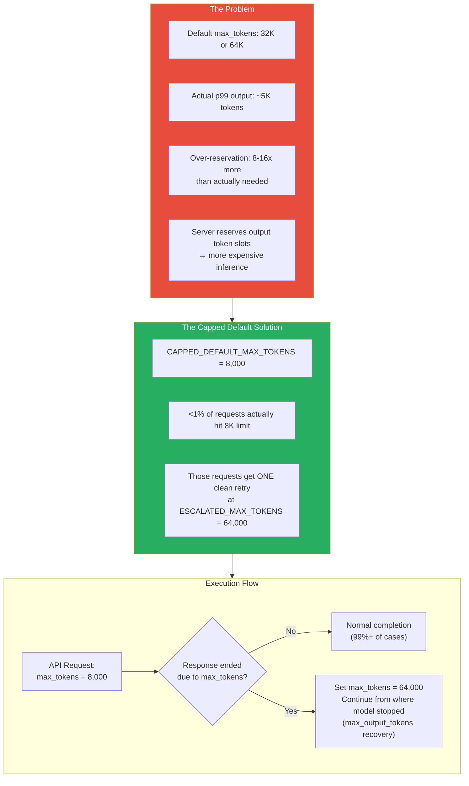

### The Recovery Limit

Max output token recovery is limited to **3 attempts** per query loop iteration. This prevents runaway costs if the model is generating extremely long output.

---

## 7. Model Selection Economics

Different tasks have dramatically different cost profiles.

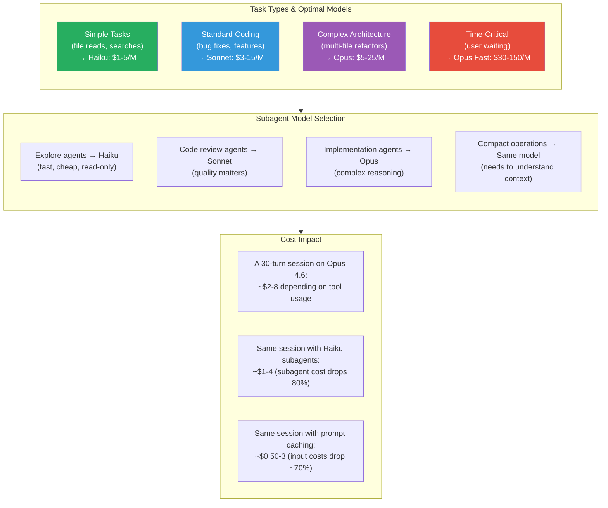

---

## 8. Subagent Cost Isolation

Subagents track their own costs, which roll up to the parent session.

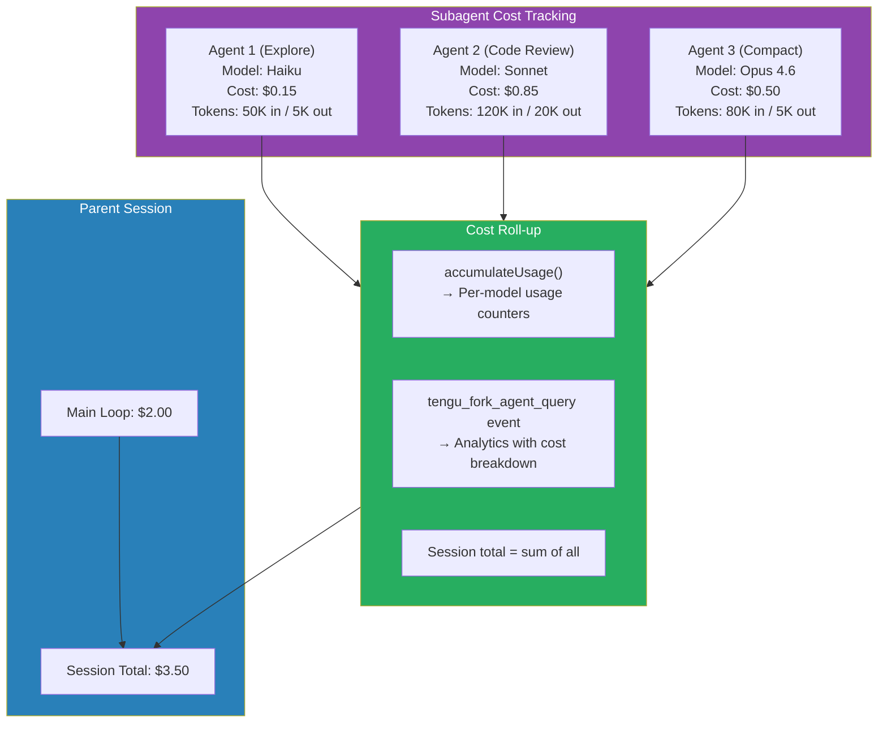

### Cache Sharing Between Parent and Subagent

The `CacheSafeParams` system ensures subagents can share the parent's prompt cache:

```typescript
type CacheSafeParams = {
  systemPrompt: SystemPrompt      // Must match parent
  userContext: { ... }             // Must match parent
  systemContext: { ... }           // Must match parent
  toolUseContext: ToolUseContext    // Must match parent
  forkContextMessages: Message[]   // Parent's messages as prefix
}
```

If any of these diverge, the subagent creates a new cache entry instead of sharing. This is why the `DANGEROUS_` prefix exists on volatile system prompt sections — they can inadvertently break cache sharing.

---

## 9. Cost Reporting & Dashboards

Claude Code provides real-time cost visibility to users.

```mermaid
flowchart LR
    subgraph RealTime["Real-Time Display"]
        StatusBar["Status bar:<br/>'$0.45 | 15K tokens | 3m 20s'"]
        PerTurn["Per-turn cost delta"]
        Warnings["Cost threshold warnings<br/>(CostThresholdDialog)"]
    end

    subgraph Session["Session Summary (on exit)"]
        Total["Total cost: $2.34"]
        Breakdown["Input: 250K tokens ($1.25)<br/>Output: 30K tokens ($0.75)<br/>Cache write: 12K ($0.08)<br/>Cache read: 180K ($0.09)<br/>Web search: 5 ($0.05)"]
        Duration["API time: 45s<br/>Tool time: 1m 30s<br/>Total time: 5m 15s"]
        Lines["Lines changed: +150 / -42"]
    end

    subgraph Persistence["Persistent Tracking"]
        ProjectConfig["Project config:<br/>Cumulative session costs"]
        Analytics["Analytics events:<br/>Per-model usage breakdowns"]
    end

    RealTime --> Session --> Persistence

    style RealTime fill:#2980b9,color:#fff
    style Session fill:#27ae60,color:#fff
    style Persistence fill:#f39c12,color:#333
```

---

## 10. Cost Optimization Strategies Summary

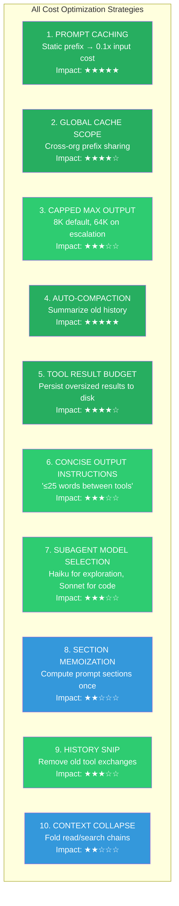

### The Compound Effect

These strategies compound:
1. **Prompt caching** reduces the base cost per turn
2. **Compaction** keeps conversation history from growing unbounded
3. **Tool result budget** prevents single tool calls from dominating cost
4. **Max output cap** reduces wasted output reservation
5. **Subagent model selection** puts cheap models on cheap tasks

Together, a session that would cost $20 without optimization might cost $3-5 with all strategies active.
