# Data Flow & Message Lifecycle

> Complete end-to-end trace of how data flows through Claude Code — from the user's keystroke to terminal pixel, and everything in between. Every diagram is a Mermaid diagram you can render in any Markdown viewer.

---

## Table of Contents

1. [End-to-End Overview](#1-end-to-end-overview)
2. [User Input Path](#2-user-input-path)
3. [Message Construction & Transformation](#3-message-construction--transformation)
4. [System Prompt Assembly](#4-system-prompt-assembly)
5. [API Request Construction](#5-api-request-construction)
6. [Streaming Response Handling](#6-streaming-response-handling)
7. [Tool Result Lifecycle](#7-tool-result-lifecycle)
8. [State Updates During the Loop](#8-state-updates-during-the-loop)
9. [Message Rendering Path](#9-message-rendering-path)
10. [Inter-Process Communication](#10-inter-process-communication)

---

## 1. End-to-End Overview

This is the complete journey of a single user interaction — from typing a message to seeing the AI's response rendered in the terminal.

```mermaid
flowchart TD
    subgraph Input["1. INPUT CAPTURE"]
        Keystroke["User types in terminal"] --> InkInput["Ink captures stdin"]
        InkInput --> PromptInput["PromptInput component\n(React controlled input)"]
        PromptInput --> Submit["User presses Enter"]
    end

    subgraph Transform["2. MESSAGE CONSTRUCTION"]
        Submit --> ParseRefs["Parse @file references\nand slash commands"]
        ParseRefs --> BuildMsg["createUserMessage()\nAttach metadata:\n- UUID, timestamp\n- tool results\n- image attachments"]
        BuildMsg --> AppendHistory["Append to messages[] array\nin AppState"]
    end

    subgraph Context["3. CONTEXT ASSEMBLY"]
        AppendHistory --> SysPrompt["Build system prompt\n(getSystemPrompt + buildEffectiveSystemPrompt)"]
        SysPrompt --> Attachments["Inject CLAUDE.md files\n+ memory attachments"]
        Attachments --> UserCtx["Prepend user context\n(getUserContext)"]
        UserCtx --> SysCtx["Append system context\n(getSystemContext)"]
        SysCtx --> Compact["Context management pipeline:\n1. Tool result budget\n2. Snip compaction\n3. Microcompact\n4. Context collapse\n5. Auto-compact"]
    end

    subgraph API["4. API STREAMING"]
        Compact --> Normalize["normalizeMessagesForAPI()\nConvert internal → API format"]
        Normalize --> BuildReq["Build BetaMessageStreamParams:\n- model, max_tokens, tools[]\n- system prompt, messages\n- betas, thinking config"]
        BuildReq --> Stream["SDK.beta.messages.stream()\n→ SSE event stream"]
    end

    subgraph Process["5. RESPONSE PROCESSING"]
        Stream --> TokenEvents["Stream events:\n- content_block_start\n- content_block_delta\n- message_delta\n- message_stop"]
        TokenEvents --> ParseBlocks["Parse into blocks:\n- TextBlock → display text\n- ThinkingBlock → internal reasoning\n- ToolUseBlock → tool invocations"]
        ParseBlocks --> BuildAssistant["Build AssistantMessage:\n- UUID, model, cost\n- content blocks\n- usage stats"]
    end

    subgraph Tools["6. TOOL EXECUTION"]
        BuildAssistant --> HasTools{Contains\ntool_use blocks?}
        HasTools -->|Yes| Partition["Partition:\nread-only vs write"]
        Partition --> Execute["Execute tools\n(parallel/serial)"]
        Execute --> ToolResult["Build tool_result\nUserMessages"]
        ToolResult --> AppendHistory
        HasTools -->|No| Render
    end

    subgraph Render["7. TERMINAL RENDERING"]
        BuildAssistant --> MsgList["Messages.tsx\n(message list component)"]
        MsgList --> Markdown["Markdown.tsx\n(parse + highlight)"]
        Markdown --> InkRender["Ink renderer\n(React → ANSI escape codes)"]
        InkRender --> Terminal["Terminal stdout\n(user sees response)"]
    end

    style Input fill:#4ecdc4,color:#fff
    style Transform fill:#45b7d1,color:#fff
    style Context fill:#bb8fce,color:#fff
    style API fill:#f39c12,color:#fff
    style Process fill:#ff6b6b,color:#fff
    style Tools fill:#f7dc6f,color:#333
    style Render fill:#27ae60,color:#fff
```

### Design Insight: Why AsyncGenerator for the Loop?

The `query()` function returns `AsyncGenerator<StreamEvent | Message, Terminal>`. This was a deliberate choice:

| Alternative | Why Rejected |
|---|---|
| **Callbacks** | No backpressure — if tokens stream faster than UI renders, events pile up |
| **Promises** | Can't yield intermediate results — streaming needs partial updates |
| **Observables (RxJS)** | Heavy dependency, complex operator chains for a fundamentally sequential flow |
| **AsyncGenerator** | **Chosen** — natural fit for "produce values over time, consumer controls pace" |

The generator pattern means the REPL can `for await (const event of query(...))` and process each token/tool-result at its own pace. The loop naturally pauses API streaming when the UI needs to catch up.

---

## 2. User Input Path

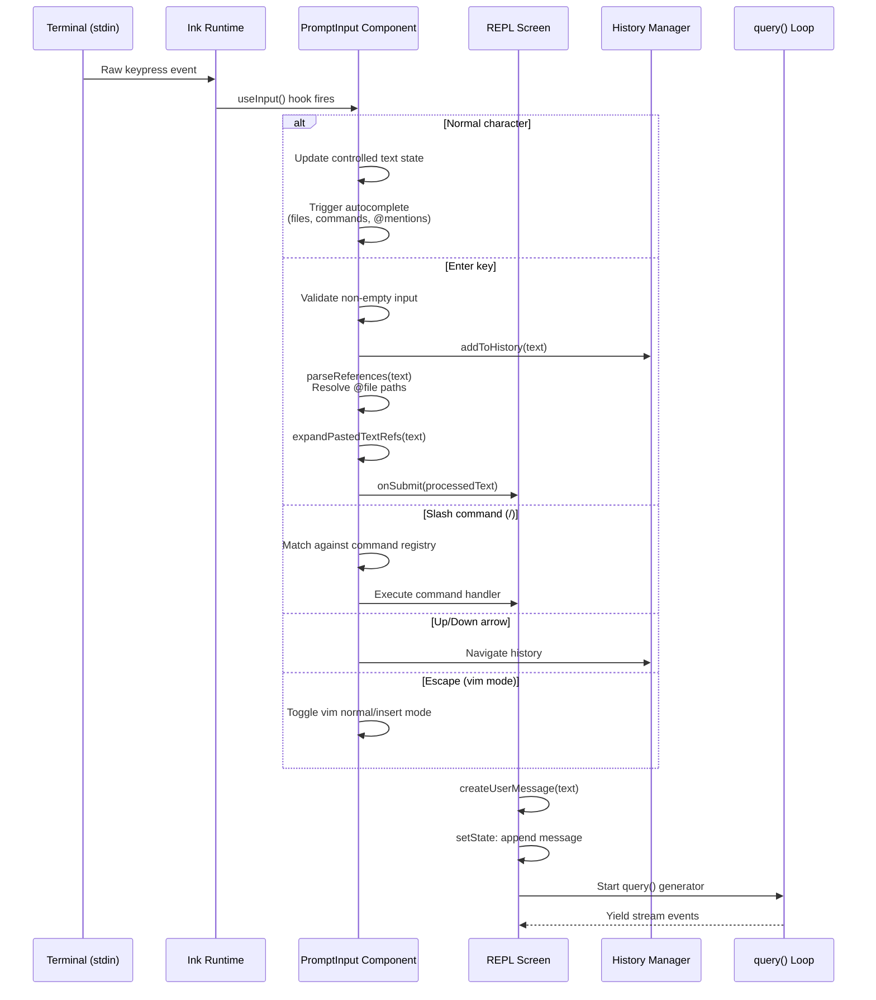

### Design Insight: Why React for a CLI?

Using React + Ink for the terminal UI is counterintuitive but powerful:

1. **Component composition** — The 140+ UI components (PromptInput, Messages, PermissionRequest, DiffView, etc.) compose just like web React
2. **State-driven rendering** — When `AppState` changes, React's reconciliation only re-renders affected terminal regions
3. **Hooks ecosystem** — 80+ custom hooks (useCanUseTool, useTerminalSize, useSearchHighlight, useVoice) provide clean state management
4. **React Compiler** — The `react/compiler-runtime` import enables automatic memoization, crucial for terminal performance where every re-render redraws characters

---

## 3. Message Construction & Transformation

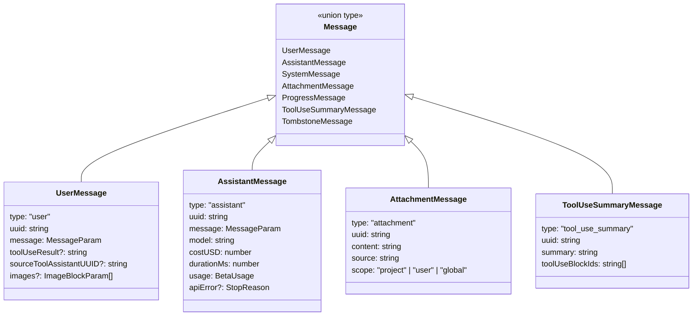

### Message Transformation Pipeline

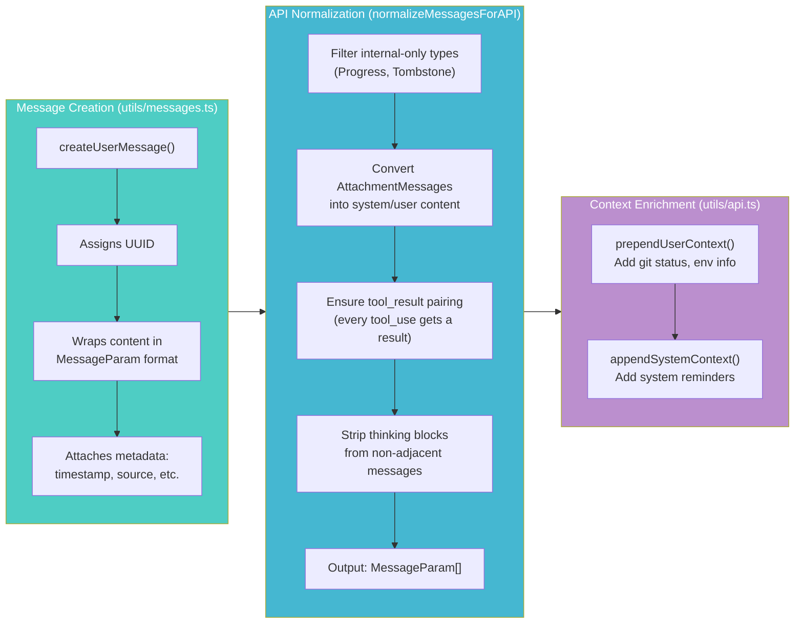

### Design Insight: Why a Union Type for Messages?

Claude Code uses a discriminated union (`type` field) rather than a class hierarchy for messages:

- **Serialization** — Messages must be serializable to JSON for session persistence and compaction. Plain objects serialize trivially; class instances don't.
- **Pattern matching** — `if (msg.type === 'assistant')` is idiomatic TypeScript with full type narrowing. No `instanceof` checks needed.
- **Immutability** — `DeepImmutable<AppState>` wraps the entire state. Immutable plain objects are natural; immutable class instances fight against OOP patterns.

---

## 4. System Prompt Assembly

The system prompt is the most carefully constructed piece of the entire request. It's built in layers:

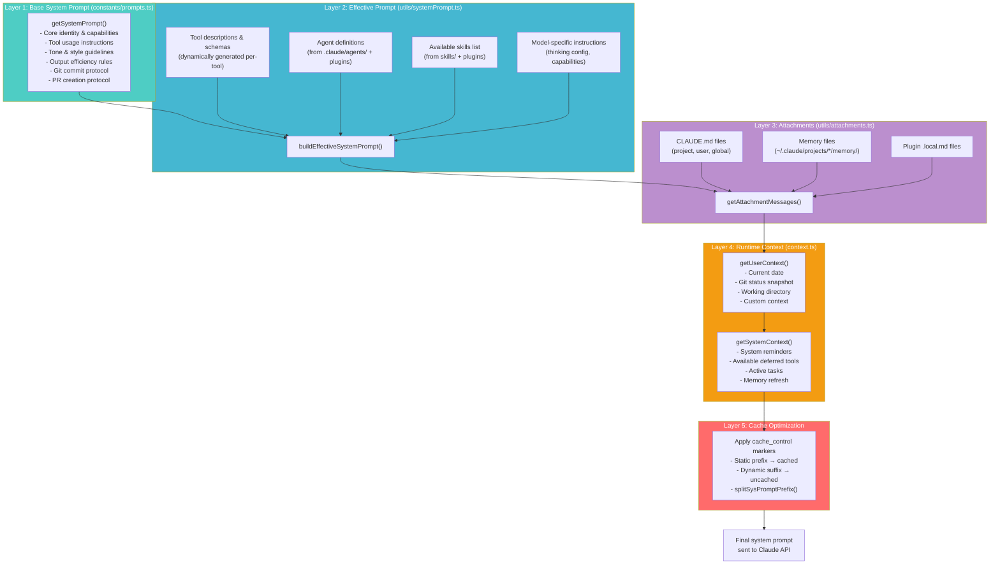

### Design Insight: Why Split the System Prompt for Caching?

The `splitSysPromptPrefix()` function divides the system prompt into a **static prefix** and **dynamic suffix**:

- **Static prefix** (tool descriptions, identity, rules) → marked with `cache_control: { type: 'ephemeral' }` → Anthropic's prompt caching reuses this across requests
- **Dynamic suffix** (current date, git status, task list) → changes each request

This saves ~10K tokens of re-processing per API call within a session, reducing both latency and cost.

---

## 5. API Request Construction

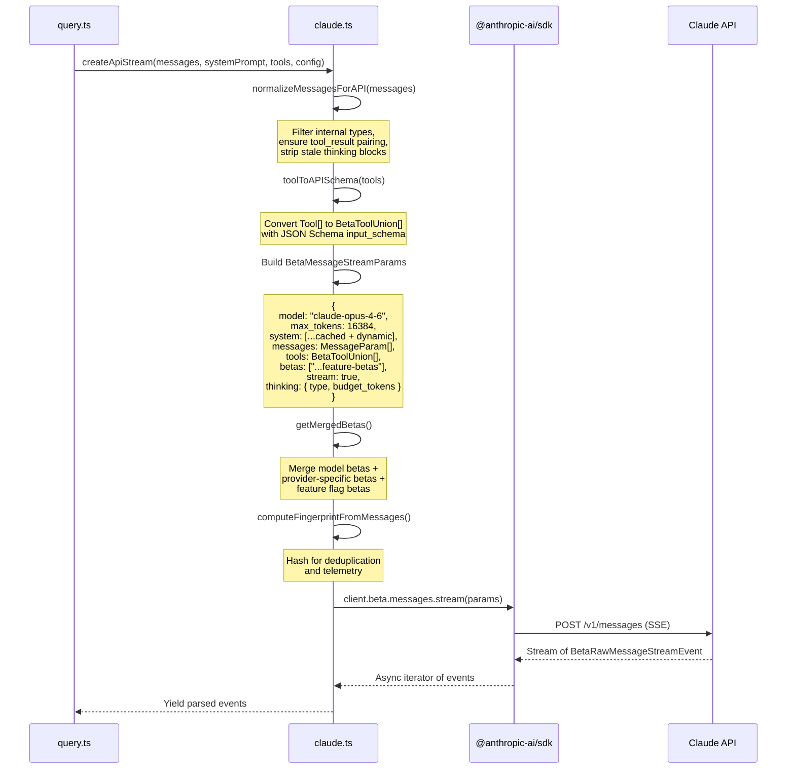

### Design Insight: Why the Beta API Surface?

Claude Code uses `client.beta.messages.stream()` rather than the stable API because:

1. **Extended thinking** — The `thinking` parameter for chain-of-thought is a beta feature
2. **Computer use** — Beta tool types support computer_use_20241022
3. **Task budgets** — `output_config.task_budget` for agentic cost control
4. **Prompt caching** — `cache_control` on system prompt blocks
5. **Future-proofing** — New capabilities land in beta first; Claude Code ships weekly and needs them immediately

---

## 6. Streaming Response Handling

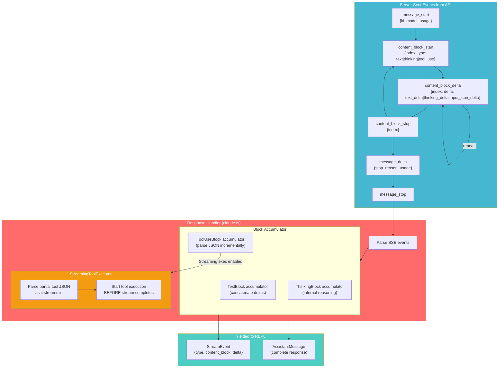

### Design Insight: StreamingToolExecutor — Starting Before the Stream Ends

The `StreamingToolExecutor` is a performance optimization that starts executing tools **while the API response is still streaming**:

1. As `input_json_delta` events arrive, the executor parses the partial JSON
2. For tools like `Read` or `Glob`, the file path appears early in the JSON
3. The executor begins file I/O before the API finishes generating the rest of the response
4. By the time the full tool_use block arrives, the result may already be ready

This overlaps API latency with I/O latency, reducing perceived response time for multi-tool responses.

---

## 7. Tool Result Lifecycle

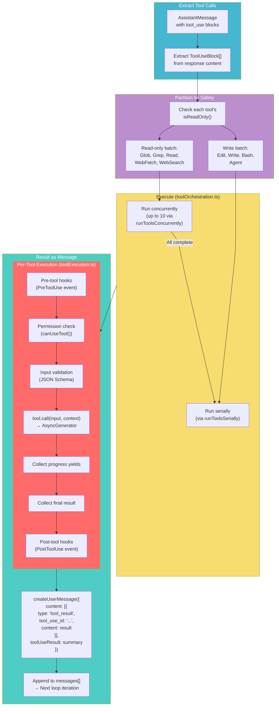

### Design Insight: Why Read-Parallel, Write-Serial?

This concurrency model is driven by **correctness constraints**:

| Operation | Safe to Parallelize? | Reason |
|---|---|---|
| Read file A + Read file B | Yes | No side effects, no ordering dependency |
| Read file A + Grep for pattern | Yes | Both are pure observations |
| Edit file A + Edit file B | **No** | Both may modify overlapping regions; Edit uses line-based patches that shift if another edit changes line numbers |
| Edit file A + Bash(npm test) | **No** | Bash may read the file being edited; ordering matters |
| Bash(cmd1) + Bash(cmd2) | **No** | Shell commands may have implicit ordering dependencies |

The 10-concurrent-read limit prevents file descriptor exhaustion while still being much faster than serial execution for large codebase searches.

---

## 8. State Updates During the Loop

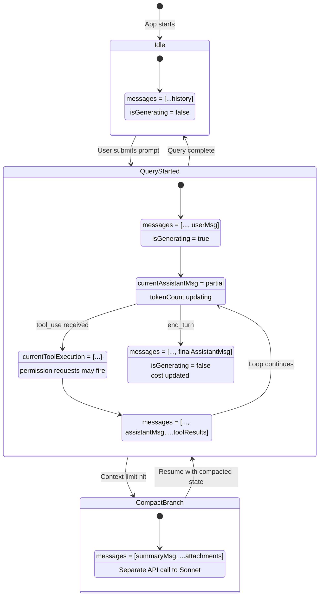

### The External Store Pattern

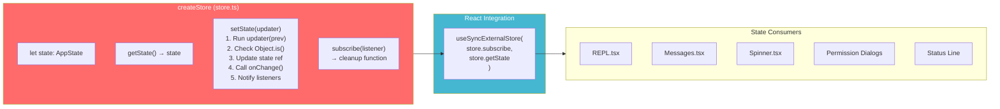

### Design Insight: Why a Custom Store Instead of Zustand/Redux?

The store implementation in `store.ts` is only **35 lines**:

1. **Zero dependencies** — No bundle size cost for a simple get/set/subscribe pattern
2. **React 19 integration** — `useSyncExternalStore` is the React-blessed way to read external state; the custom store implements exactly its contract
3. **DeepImmutable** — AppState is typed as `DeepImmutable<...>`, enforcing immutability at the type level. No middleware needed.
4. **onChange callback** — Single point for side effects (analytics, persistence) without Redux middleware complexity

---

## 9. Message Rendering Path

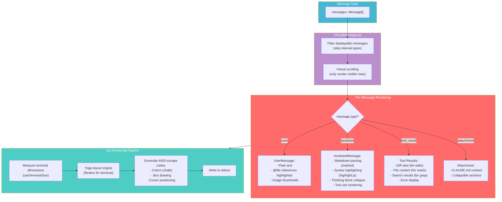

### Design Insight: Why Virtual Scrolling?

Long conversations can have thousands of messages with syntax-highlighted code blocks. Without virtual scrolling:
- Every re-render would process ALL messages (O(n) where n = total messages)
- Terminal flickering from redrawing unchanged content
- Memory pressure from holding rendered output of invisible messages

Virtual scrolling renders only the ~50 visible lines, making rendering O(1) regardless of conversation length. Combined with React's reconciliation, only changed characters are repainted.

---

## 10. Inter-Process Communication

Claude Code communicates across process boundaries through multiple channels:

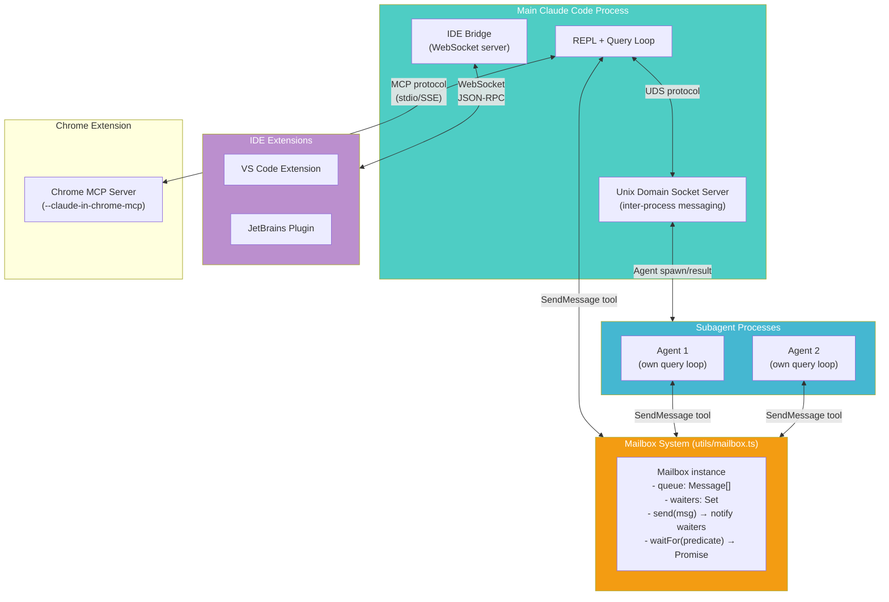

### The Mailbox Pattern

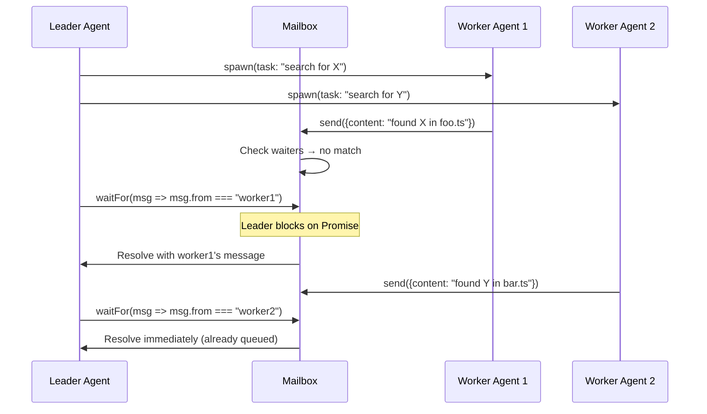

### Design Insight: Why Unix Domain Sockets for IPC?

Claude Code uses UDS rather than TCP for inter-process communication:

| Property | UDS | TCP |
|---|---|---|
| **Security** | File-system permissions — only the user can connect | Port scanning exposes the service to local network |
| **Performance** | Kernel bypass (no TCP stack overhead) | Full TCP handshake + stack processing |
| **Discovery** | Socket file path is deterministic | Need port allocation + discovery mechanism |
| **Cleanup** | OS cleans up on process exit | Ports can linger in TIME_WAIT |

The socket path includes the session ID, so multiple Claude Code instances don't collide.

---

## Summary: The Complete Data Journey

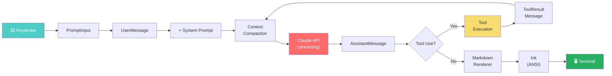

Every step in this pipeline was designed for a specific trade-off:
- **AsyncGenerator** → backpressure-aware streaming
- **Discriminated unions** → type-safe serializable messages
- **Split system prompt** → prompt caching cost savings
- **Read-parallel, write-serial** → correctness with maximum throughput
- **Virtual scrolling** → O(1) rendering regardless of history length
- **UDS** → secure, fast inter-process communication
