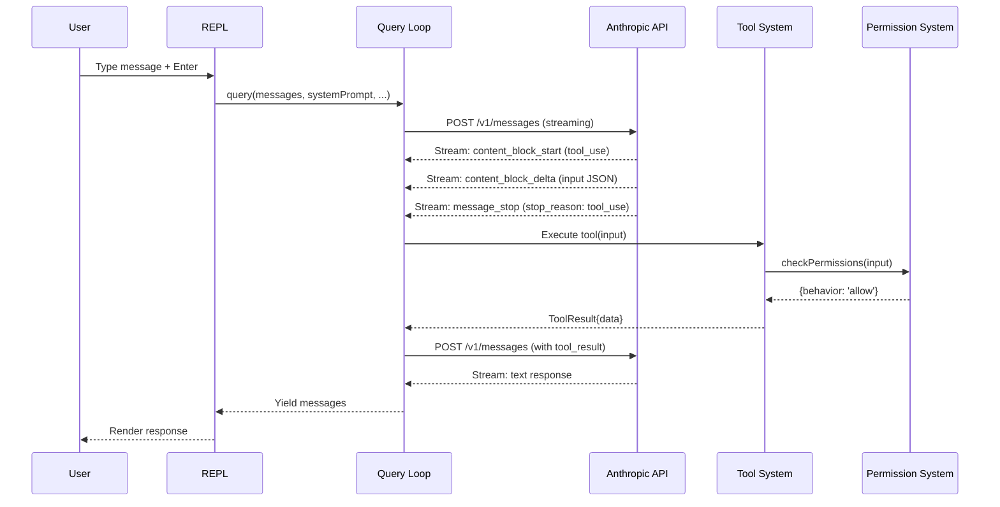
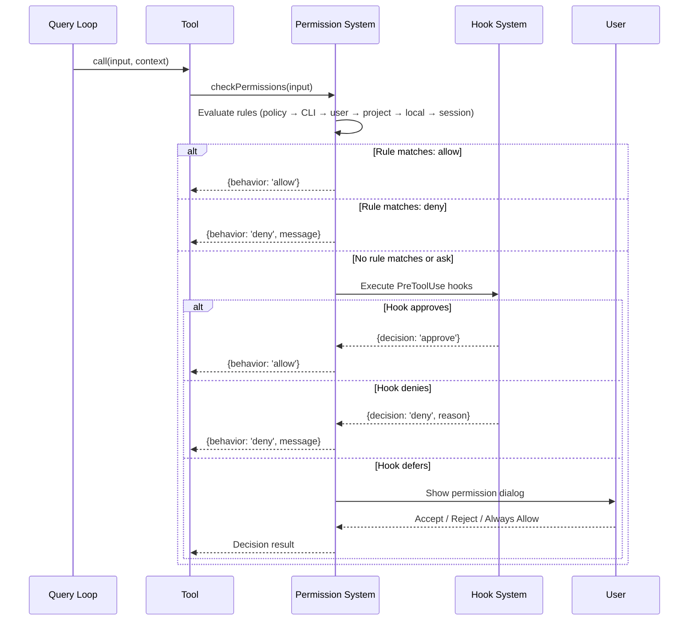
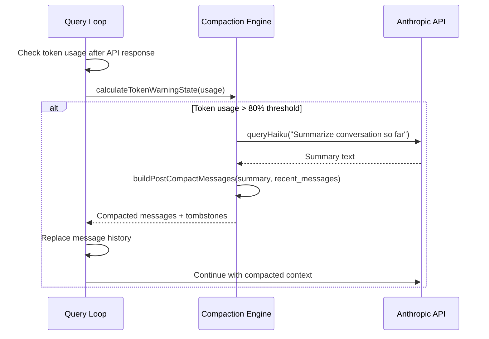

# API Contracts

## 1. External API — Anthropic Messages API

### Endpoint Catalog

| Method | Path | Purpose | Auth Required |
|--------|------|---------|---------------|
| POST | `/v1/messages` | Create a message (streaming) | Yes (API key, OAuth, or cloud IAM) |
| POST | `/v1/messages` | Create a message (non-streaming) | Yes |
| POST | `/v1/messages/count_tokens` | Count tokens for a prompt | Yes |

### Request Schema — Create Message (Streaming)

| Field | Type | Required | Constraints | Description |
|-------|------|----------|-------------|-------------|
| `model` | string | Yes | Valid model ID | Model to use (e.g., `claude-sonnet-4-6`) |
| `max_tokens` | integer | Yes | 1–200000 | Maximum output tokens |
| `system` | array of content blocks | No | — | System prompt sections with cache_control |
| `messages` | array of message objects | Yes | Alternating user/assistant | Conversation history |
| `tools` | array of tool definitions | No | — | Available tools |
| `tool_choice` | object | No | — | Tool selection strategy (`auto`, `any`, `tool`) |
| `stream` | boolean | Yes (for streaming) | `true` | Enable streaming |
| `thinking` | object | No | `{type: "enabled", budget_tokens: N}` | Extended thinking config |
| `betas` | string[] | No | — | Beta feature flags |
| `metadata` | object | No | — | Request metadata (user_id) |

### Response Schema — Stream Events

| Event Type | Key Fields | Description |
|-----------|-----------|-------------|
| `message_start` | `message: {id, type, role, model, usage}` | Stream begins |
| `content_block_start` | `index, content_block: {type, ...}` | New block starting |
| `content_block_delta` | `index, delta: {type, text/partial_json/thinking}` | Block content increment |
| `content_block_stop` | `index` | Block complete |
| `message_delta` | `delta: {stop_reason}, usage: {output_tokens}` | Message-level update |
| `message_stop` | — | Stream complete |

### Error Codes

| HTTP Status | Error Type | When It Occurs |
|-------------|-----------|----------------|
| 400 | `invalid_request_error` | Malformed request, invalid params |
| 401 | `authentication_error` | Invalid/expired API key or token |
| 403 | `permission_error` | Insufficient permissions |
| 404 | `not_found_error` | Invalid model or endpoint |
| 413 | `request_too_large` | Prompt exceeds context window |
| 429 | `rate_limit_error` | Rate limit exceeded |
| 500 | `api_error` | Server-side error |
| 529 | `overloaded_error` | API overloaded |

### Stop Reasons

| Stop Reason | Meaning | Action |
|-------------|---------|--------|
| `end_turn` | Model finished its response | Execute stop hooks, return to user |
| `tool_use` | Model wants to use a tool | Execute tools, continue loop |
| `max_tokens` | Output token limit reached | Recovery: continue with prompt or increase limit |
| `stop_sequence` | Hit a stop sequence | Rarely used; treat as end_turn |

### Rate Limits & Headers

Response headers include:
- `x-ratelimit-limit-*` — Rate limit ceiling
- `x-ratelimit-remaining-*` — Remaining quota
- `x-ratelimit-reset-*` — Reset timestamp
- `retry-after` — Seconds to wait before retrying

### Custom Request Headers

| Header | Value | Purpose |
|--------|-------|---------|
| `x-app` | `cli` | Identify client type |
| `User-Agent` | `claude-code/<version>` | Client version |
| `X-Claude-Code-Session-Id` | UUID | Session tracking |
| `x-client-request-id` | UUID | Per-request correlation ID |
| `x-anthropic-additional-protection` | `true` | Optional safety flag |
| `Authorization` | `Bearer <token>` | Auth token / API key helper |

## 2. Internal API — Tool System

### Tool Interface Contract

Every tool implements this contract:

| Method | Signature | Description |
|--------|-----------|-------------|
| `call()` | `(input, context, canUseTool, parentMessage, onProgress?) → Promise<ToolResult>` | Execute the tool |
| `description()` | `(input, options) → Promise<string>` | Generate tool description for system prompt |
| `prompt()` | `(options) → Promise<string>` | Generate detailed prompt text |
| `checkPermissions()` | `(input, context) → Promise<PermissionResult>` | Check if execution is allowed |
| `validateInput()` | `(input, context) → Promise<ValidationResult>` | Validate input before execution |
| `isReadOnly()` | `(input) → boolean` | Whether the tool only reads (no writes) |
| `isConcurrencySafe()` | `(input) → boolean` | Whether safe to run in parallel |
| `isEnabled()` | `() → boolean` | Whether the tool is currently available |

### Tool Catalog

| Tool Name | Purpose | Read-Only | Concurrent-Safe | Permission |
|-----------|---------|-----------|-----------------|------------|
| `Bash` | Execute shell commands | No | No | Ask for write commands |
| `Read` | Read file contents | Yes | Yes | Auto-allow |
| `Write` | Create/overwrite files | No | No | Ask |
| `Edit` | Edit file with find/replace | No | No | Ask |
| `Glob` | Find files by pattern | Yes | Yes | Auto-allow |
| `Grep` | Search file contents | Yes | Yes | Auto-allow |
| `Agent` | Spawn sub-agent | No | Yes | Auto-allow |
| `AskUserQuestion` | Ask user a question | Yes | No | Auto-allow |
| `WebFetch` | Fetch URL content | Yes | Yes | Ask (unless pre-approved URL) |
| `WebSearch` | Search the web | Yes | Yes | Auto-allow |
| `MCPTool` | Call MCP server tool | Varies | Varies | Ask |
| `NotebookEdit` | Edit Jupyter notebooks | No | No | Ask |
| `TaskCreate` | Create a tracking task | No | Yes | Auto-allow |
| `TaskUpdate` | Update task status | No | Yes | Auto-allow |
| `SendMessage` | Send message to agent | No | No | Auto-allow |
| `EnterPlanMode` | Switch to plan mode | No | No | Ask |
| `ExitPlanMode` | Exit plan mode | No | No | Ask |
| `Skill` | Execute a skill | Varies | No | Ask |
| `ToolSearch` | Find deferred tools | Yes | Yes | Auto-allow |
| `Sleep` | Wait for duration | Yes | Yes | Auto-allow |
| `TodoWrite` | Update todo list | No | No | Auto-allow |
| `Config` | Update settings | No | No | Auto-allow |
| `PowerShell` | Execute PowerShell (Windows) | No | No | Ask |
| `LSP` | Query language server | Yes | Yes | Auto-allow |

### Tool Result Format

```
ToolResult<T> = {
  data: T                    // Tool-specific output
  newMessages?: Message[]    // Additional messages to inject
  contextModifier?: fn       // Modify context for subsequent calls
  mcpMeta?: {                // MCP protocol metadata
    _meta?: Record
    structuredContent?: Record
  }
}
```

## 3. Internal API — Query Loop

### Query Parameters

| Parameter | Type | Required | Description |
|-----------|------|----------|-------------|
| `messages` | Message[] | Yes | Conversation history |
| `systemPrompt` | SystemPrompt | Yes | System prompt content |
| `userContext` | Record<string,string> | Yes | User context variables |
| `systemContext` | Record<string,string> | Yes | System context variables |
| `canUseTool` | Function | Yes | Permission callback |
| `toolUseContext` | ToolUseContext | Yes | Execution environment |
| `fallbackModel` | string | No | Fallback model on failure |
| `querySource` | QuerySource | Yes | Origin of the query |
| `maxOutputTokensOverride` | number | No | Override max output tokens |
| `maxTurns` | number | No | Max tool use iterations |
| `taskBudget` | {total: number} | No | Total token budget |

### Query Yield Types

The `query()` generator yields these event types:

| Event | Description |
|-------|-------------|
| `StreamEvent` | Raw API streaming events |
| `RequestStartEvent` | Marks start of an API request |
| `Message` | Complete user/assistant messages |
| `TombstoneMessage` | Marker for removed messages (compaction) |
| `ToolUseSummaryMessage` | Summary of tool executions for display |

## 4. MCP Protocol Contract

### Tool Discovery

```
→ {"jsonrpc": "2.0", "id": 1, "method": "tools/list"}
← {"jsonrpc": "2.0", "id": 1, "result": {"tools": [
    {"name": "tool-name", "description": "...", "inputSchema": {...}}
  ]}}
```

### Tool Execution

```
→ {"jsonrpc": "2.0", "id": 2, "method": "tools/call", "params": {
    "name": "tool-name",
    "arguments": {"param1": "value1"}
  }}
← {"jsonrpc": "2.0", "id": 2, "result": {
    "content": [{"type": "text", "text": "result"}],
    "isError": false
  }}
```

### Resource Discovery

```
→ {"jsonrpc": "2.0", "id": 3, "method": "resources/list"}
← {"jsonrpc": "2.0", "id": 3, "result": {"resources": [
    {"uri": "resource://name", "name": "...", "mimeType": "..."}
  ]}}
```

### Elicitation (OAuth)

When an MCP tool call fails with error code -32042, the client initiates an OAuth elicitation flow to get user authorization for the MCP server.

## 5. Key Interaction Sequences

### User Message → Tool Execution → Response



### Permission Prompt Flow



### Auto-Compaction Flow



## 6. Webhook / Event Contracts

### Hook Events

| Event | When Fired | Payload |
|-------|-----------|---------|
| `PreToolUse` | Before any tool executes | `{tool_name, tool_input, tool_use_id, session_id, agent_id}` |
| `PostToolUse` | After tool completes | `{tool_name, tool_input, tool_result, tool_use_id, session_id}` |
| `Stop` | When model stops (end_turn) | `{stop_reason, session_id, message}` |
| `SubagentStop` | When sub-agent completes | `{agent_id, agent_type, stop_reason}` |
| `SessionStart` | When session begins | `{session_id, cwd, model}` |
| `SessionEnd` | When session ends | `{session_id, duration_ms, total_cost}` |
| `UserPromptSubmit` | When user submits prompt | `{prompt_text, session_id}` |
| `PreCompact` | Before compaction | `{message_count, token_count}` |
| `Notification` | When notification is sent | `{message, notification_type}` |

### Hook Configuration Format

```
{
  "hooks": {
    "PreToolUse": [
      {
        "matcher": "Bash",           // Tool name pattern
        "if": "rm *",                // Optional: input pattern match
        "command": "echo 'check'",    // Shell command to execute
        "timeout": 30000              // Timeout in ms
      }
    ],
    "Stop": [
      {
        "command": "notify-send 'Claude done'"
      }
    ]
  }
}
```

Hook commands receive context via environment variables:
- `CLAUDE_TOOL_NAME` — Tool being executed
- `CLAUDE_TOOL_INPUT` — JSON-serialized tool input
- `CLAUDE_TOOL_USE_ID` — Unique tool use identifier
- `CLAUDE_SESSION_ID` — Session identifier

Hook exit codes:
- `0` — Approve (for PreToolUse) / Success
- `2` — Deny with message from stderr
- Other — Error (falls through to default behavior)
