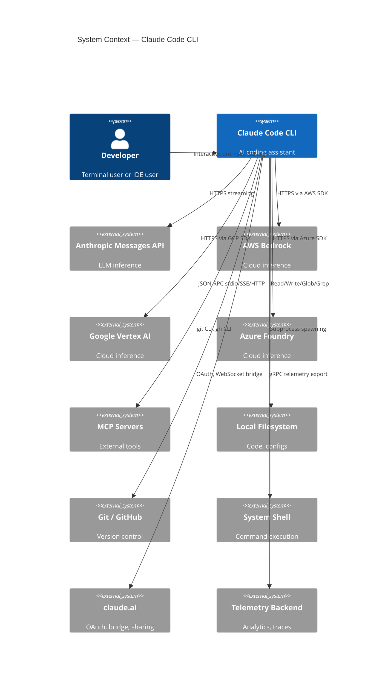
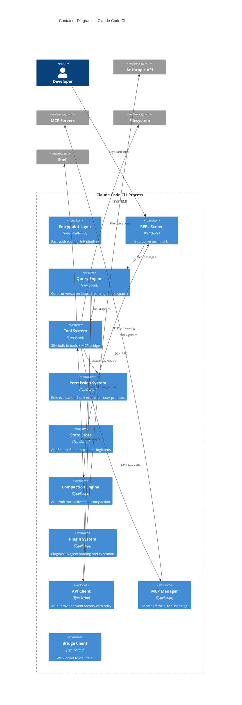
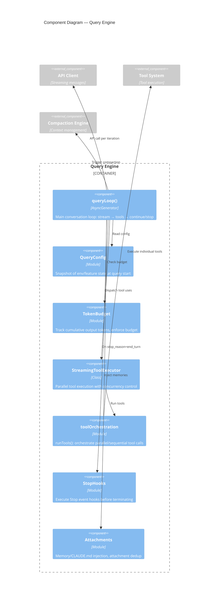
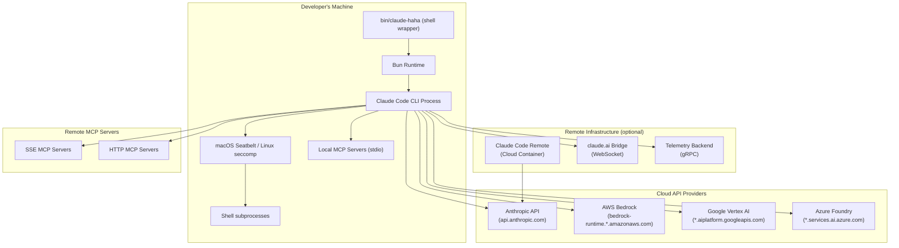

# Detailed Architecture

## 1. System Context Diagram

## 2. Container Diagram

## 3. Component Diagram — Query Engine

## 4. Deployment Topology

## 5. Technology Stack Table

| Layer | Technology | Purpose | Alternatives to Consider |
|-------|-----------|---------|-------------------------|
| **Runtime** | Bun 1.x | JavaScript/TypeScript execution, bundling | Node.js, Deno |
| **Language** | TypeScript (ESNext target) | Type-safe application code | — |
| **UI Framework** | React 19 + Custom Ink | Declarative terminal UI | Blessed, terminal-kit, raw ANSI |
| **Layout Engine** | Yoga (via yoga-layout) | Flexbox-based terminal layout | Manual column calculation |
| **CLI Parsing** | Commander.js v14 | Argument/option parsing | yargs, oclif, clipanion |
| **API Client** | @anthropic-ai/sdk | Anthropic Messages API | Raw HTTP, axios |
| **Cloud SDKs** | @anthropic-ai/bedrock-sdk, vertex-sdk, foundry-sdk | Multi-cloud inference | Direct REST calls |
| **MCP** | @modelcontextprotocol/sdk | MCP client for tool servers | Custom JSON-RPC client |
| **Schema Validation** | Zod v4 | Runtime type validation | Joi, Yup, AJV |
| **Markdown** | marked | Markdown parsing for rendering | remark, markdown-it |
| **Syntax Highlighting** | Custom (HighlightedCode) | Code block colorization | Shiki, Prism |
| **HTTP** | axios, fetch | HTTP requests (web fetch, OAuth) | got, undici |
| **YAML** | yaml | YAML parsing for configs | js-yaml |
| **JSON** | jsonc-parser | JSON with comments parsing | json5 |
| **Telemetry** | @opentelemetry/* | Distributed tracing, metrics, logs | Custom logging |
| **Feature Flags** | GrowthBook | A/B testing, feature gating | LaunchDarkly, Unleash |
| **Secure Storage** | OS Keychain (via keytar) | OAuth token storage | File-based encryption |
| **Sandbox** | macOS Seatbelt, Linux seccomp | Process isolation | Docker, Firejail |
| **Diff** | Custom diff engine + color-diff | File change visualization | diff, jsdiff |
| **Process Mgmt** | Bun subprocess API | Shell command execution | child_process, execa |

## 6. Cross-Cutting Concerns

### Authentication & Authorization Model

**Authentication** supports four providers:
1. **Claude.ai OAuth** — For consumer users. OAuth 2.0 PKCE flow with claude.ai. Tokens stored in OS keychain. Scopes: `user:profile`, `user:inference`, `user:sessions:claude_code`, `user:mcp_servers`, `user:file_upload`.
2. **API Key** — Direct Anthropic API key via `ANTHROPIC_API_KEY` env var or keychain.
3. **AWS Bedrock** — IAM credentials via AWS SDK credential chain. Supports session tokens and bearer tokens.
4. **Google Vertex AI** — Google Cloud IAM via `google-auth-library`. Supports service accounts and ADC.
5. **Azure Foundry** — Azure AD token via `@azure/identity` DefaultAzureCredential, or API key.

**Authorization** is the permission system:
- **Permission Modes:** `default` (ask for destructive ops), `acceptEdits` (auto-allow file edits), `plan` (read-only), `bypassPermissions` (allow all), `auto` (ML classifier), `dontAsk` (deny what isn't explicitly allowed).
- **Rule Sources** (highest to lowest precedence): policy settings, CLI args, user settings, project settings, local settings, session rules.
- **Rule Types:** `allow` (auto-approve), `deny` (auto-reject), `ask` (prompt user). Rules can be tool-specific with pattern matching (e.g., `Bash(git *)` allows git commands).

### Observability

- **Telemetry Events:** `logEvent()` sends structured events for session start, tool use, API calls, errors, feature usage.
- **OpenTelemetry:** Full OTLP integration with traces (API calls, tool execution), metrics (token counts, latency), and logs.
- **Debug Logging:** `logForDebugging()` writes to stderr when `CLAUDE_CODE_DEBUG` is set.
- **Diagnostics:** `/doctor` command checks system health (API connectivity, tool availability, config validity).
- **Session Recording:** Conversation messages and tool results are persisted to `~/.claude/sessions/` for session resume.

### Configuration Management

Settings are loaded from multiple sources with defined precedence:
1. **CLI arguments** — Highest precedence for session options
2. **Environment variables** — `ANTHROPIC_*`, `CLAUDE_CODE_*`, etc.
3. **User settings** — `~/.claude/settings.json`
4. **Project settings** — `.claude/settings.json` in project root
5. **Local settings** — `.claude/settings.local.json` (gitignored)
6. **MDM settings** — macOS managed preferences (enterprise deployment)
7. **Remote managed settings** — Server-pushed configuration
8. **Policy limits** — Server-enforced guardrails

Configuration files use JSONC (JSON with comments) format.

### Secret Management

- OAuth tokens: Stored in OS keychain (macOS Keychain, Windows Credential Manager, Linux libsecret)
- API keys: Environment variables or keychain
- No secrets in config files (`.env` is gitignored)
- Custom `ANTHROPIC_API_KEY_HELPER` command support for enterprise secret managers
- MCP server credentials: Per-server OAuth or API key configuration

### Feature Flags

- **Build-time flags:** `feature('FLAG')` from `bun:bundle` — code is eliminated at bundle time for external builds
- **Runtime flags:** GrowthBook SDK — evaluated at startup, cached for session duration
- **Policy flags:** Server-pushed limits on tool availability, model access, etc.

## 7. Scalability & Performance Notes

### Startup Performance
- Shell wrapper does zero module loading for `--version`
- MDM settings and keychain reads fire during module evaluation (parallelized)
- OpenTelemetry gRPC exporter (~700KB) is lazy-loaded
- TCP pre-connection to API endpoint starts before first request
- OAuth token refresh is async and non-blocking

### Context Window Management
- **Auto-compact:** Triggers when context approaches 80% of model's context window
- **Micro-compact:** Time-based clearing of old tool results within a turn
- **Reactive compact:** Triggers on prompt-too-long API errors
- **Snip compact:** Targeted removal of low-value messages
- **Tool result budget:** Large tool outputs are persisted to disk and replaced with summaries

### Connection Handling
- API client uses configurable timeout (default 600s / 10 minutes)
- Retry with exponential backoff for transient errors (overloaded, network errors)
- Fallback model support (e.g., Sonnet → Haiku on quota exhaustion)
- Proxy support via `HTTPS_PROXY` / `HTTP_PROXY` environment variables
- mTLS support for enterprise deployments

### Rate Limiting
- Client-side rate limit tracking from API response headers
- Backoff with user notification on rate limits
- Usage tracking per model for cost monitoring
- Task budget system for capping total token spend per agentic turn

### Parallel Tool Execution
- Tools marked `isConcurrencySafe` can execute in parallel
- `StreamingToolExecutor` manages concurrent tool dispatch
- File operations are serialized when they target the same path
- Agent spawning creates independent task trees
