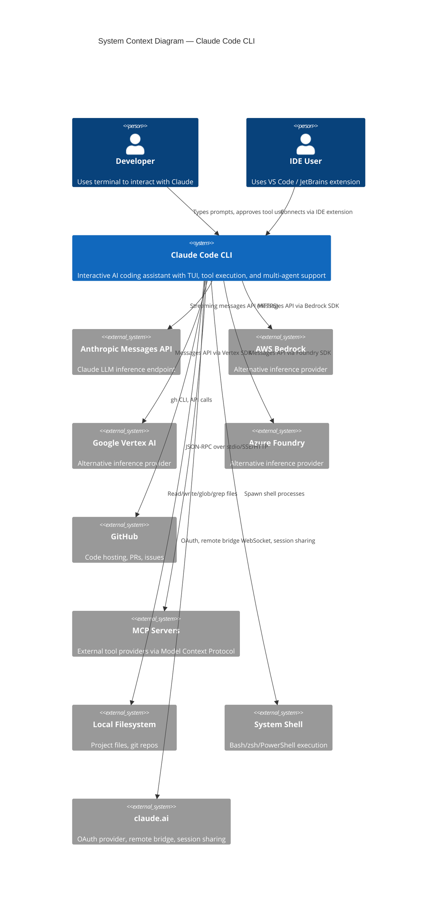

# Claude Code CLI — Master Blueprint

## 1. Project Identity

Claude Code is an **interactive AI-powered command-line interface** that enables software engineers to collaborate with Anthropic's Claude language model directly from the terminal. It provides a rich terminal UI (TUI) with tool execution, multi-agent orchestration, code editing, shell integration, and a plugin/skill extensibility system.

**Problem it solves:** Developers need a fast, integrated way to leverage LLMs for code generation, editing, debugging, and exploration without leaving their terminal workflow. Claude Code bridges the Claude API to real-world development tasks — reading/writing files, running shell commands, searching codebases, managing git, and orchestrating complex multi-step workflows.

**Who it's for:** Software engineers, DevOps engineers, and technical users who prefer CLI-based workflows. Also serves as a backend for IDE integrations (VS Code, JetBrains) and a programmable SDK for automation.

## 2. High-Level Architecture Summary

Claude Code is a TypeScript application running on the Bun runtime. It uses React (via a custom Ink-based terminal renderer) for its interactive TUI, the Anthropic SDK for API communication, and a modular tool/plugin architecture that lets the LLM read files, edit code, run commands, search the web, and spawn sub-agents. The system supports multiple API providers (Anthropic direct, AWS Bedrock, Google Vertex, Azure Foundry), multiple authentication methods (API key, OAuth, cloud IAM), and can operate in interactive REPL mode, headless/SDK mode, remote daemon mode, or as an MCP server.

## 3. Tech Decisions & Rationale

| Decision | Choice | Rationale |
|----------|--------|-----------|
| **Runtime** | Bun | Fast startup (critical for CLI), built-in TypeScript support, bundle-time dead code elimination via `feature()` flags |
| **Language** | TypeScript | Type safety for a large codebase with many contributors; good IDE tooling |
| **UI Framework** | React + Custom Ink Fork | Declarative terminal UI with component model; heavily customized for advanced features (Yoga layout, ANSI, mouse, selection) |
| **API Client** | `@anthropic-ai/sdk` | Official SDK for Anthropic's Messages API; supports streaming, tools, thinking |
| **CLI Framework** | Commander.js | Mature, well-typed argument parsing with subcommand support |
| **Schema Validation** | Zod v4 | Runtime type validation for tool inputs, settings, plugin manifests |
| **Tool Protocol** | Model Context Protocol (MCP) | Industry standard for LLM tool integration; enables third-party tool servers |
| **State Management** | Custom store (React-compatible) | Lightweight external store with `useSyncExternalStore`; avoids heavy dependencies |
| **Telemetry** | OpenTelemetry | Industry standard; supports traces, metrics, logs; gRPC exporter deferred for startup performance |
| **Auth** | OAuth 2.0 + API Keys + Cloud IAM | Supports consumer (claude.ai OAuth), enterprise (API key), and cloud-native (Bedrock/Vertex/Foundry IAM) deployment models |
| **Sandboxing** | macOS Seatbelt / Linux seccomp | Restricts shell command execution to prevent accidental damage |
| **Multi-Agent** | Hierarchical task tree | Parent-child agent spawning with message passing, per-agent permission scoping, and isolated context windows |

## 4. Module/Package Map

| Module | Purpose | Key Responsibilities | Dependencies |
|--------|---------|---------------------|--------------|
| `src/entrypoints/` | Application entry points | Fast-path CLI routing, init pipeline, MCP server mode, SDK entry | bootstrap, constants |
| `src/main.tsx` | Main orchestration | CLI parsing, command registration, REPL launch, plugin/skill init | All modules |
| `src/query.ts` | Core conversation loop | API call → stream → tool execution → continue/stop cycle | services/api, tools, services/compact |
| `src/Tool.ts` | Tool type system | Base `Tool` interface, `buildTool()` factory, `ToolUseContext` | types |
| `src/tools/` | Tool implementations | 30+ tools (Bash, FileRead, FileWrite, FileEdit, Glob, Grep, Agent, etc.) | Tool.ts, utils |
| `src/services/api/` | API client layer | Client construction, streaming, retry/fallback, usage tracking | @anthropic-ai/sdk |
| `src/services/mcp/` | MCP server management | Server lifecycle, tool bridging, resource management | @modelcontextprotocol/sdk |
| `src/services/compact/` | Context compaction | Auto-compact, micro-compact, reactive compact, snip compact | services/api |
| `src/services/oauth/` | OAuth authentication | Token management, refresh, claude.ai subscriber flow | constants/oauth |
| `src/services/plugins/` | Plugin management | Discovery, loading, validation, DXT format support | utils/plugins |
| `src/services/analytics/` | Telemetry & experiments | Event logging, GrowthBook feature flags, OpenTelemetry | @opentelemetry |
| `src/services/lsp/` | LSP integration | Language Server Protocol client for IDE diagnostics | |
| `src/state/` | State management | AppState store, React context provider, selectors | React |
| `src/hooks/` | Lifecycle hooks | PreToolUse, PostToolUse, Stop, SessionStart/End hooks | utils/hooks |
| `src/tasks/` | Task management | LocalMainSession, LocalAgent, LocalShell, Remote, Dream tasks | query.ts |
| `src/skills/` | Skill system | Skill discovery, loading, bundled skills, verification | utils/skills |
| `src/plugins/` | Plugin system | Bundled plugins, plugin loading/validation | services/plugins |
| `src/commands/` | Slash commands | 88+ commands (/help, /config, /model, /compact, etc.) with lazy loading | main.tsx |
| `src/components/` | UI components | Message rendering, permission dialogs, prompt input, diffs | ink |
| `src/ink/` | Terminal UI framework | Custom Ink fork: Yoga layout, ANSI, reconciler, events, selection | react-reconciler, yoga-layout |
| `src/screens/` | Screen components | REPL screen (main interactive view) | components, ink |
| `src/utils/` | Utility modules | bash, git, sandbox, memory, messages, model, permissions, settings, shell, etc. | Various |
| `src/bridge/` | Remote bridge | WebSocket bridge to claude.ai for remote control | services/api |
| `src/remote/` | Remote execution | Claude Code Remote (CCR) container management | |
| `src/server/` | Server mode | HTTP/MCP server mode for programmatic access | |
| `src/vim/` | Vim mode | Vim keybindings for the prompt input | |
| `src/voice/` | Voice input | Speech-to-text integration | |
| `src/constants/` | System constants | OAuth config, URLs, prompts, system messages | |
| `src/schemas/` | Validation schemas | Settings schema, plugin manifest schema | zod |
| `src/migrations/` | Settings migrations | Model name updates, settings format changes | |
| `src/bootstrap/` | Bootstrap state | Global singleton state, session ID, telemetry counters | |

## 5. Glossary

| Term | Definition |
|------|-----------|
| **Tool** | A function the LLM can invoke (e.g., Bash, FileRead, FileEdit). Has input schema, permission checks, and UI rendering. |
| **Tool Use** | A single invocation of a tool by the model, containing a tool name, input JSON, and a unique ID. |
| **Query** | One complete request-response cycle: user message → API call → streaming response → tool execution → optional continuation. |
| **Turn** | One iteration of the query loop. A single user message may trigger multiple turns if the model uses tools. |
| **Compact / Compaction** | Summarizing earlier conversation messages to free context window space. Multiple strategies: auto, micro, reactive, snip. |
| **MCP** | Model Context Protocol — a JSON-RPC protocol for connecting LLMs to external tool servers. |
| **Skill** | A reusable prompt template that can be triggered by slash commands or by the model via the Skill tool. |
| **Plugin** | An extension package containing commands, skills, agents, hooks, and MCP server configurations. |
| **Agent / Sub-agent** | A child task spawned by the Agent tool, running its own conversation with an isolated context window. |
| **Task** | A unit of work tracked by the system — main session, agent, shell command, remote, or dream. |
| **Permission Mode** | Controls how tool executions are authorized: `default` (ask), `acceptEdits` (auto-allow edits), `plan` (read-only), `bypassPermissions` (allow all), `auto` (classifier-based). |
| **REPL** | Read-Eval-Print Loop — the main interactive terminal interface. |
| **Bridge** | WebSocket connection between local Claude Code and claude.ai for remote observation/control. |
| **CCR** | Claude Code Remote — running Claude Code in a cloud container. |
| **GrowthBook** | Feature flag and A/B testing service used for experiment gating. |
| **DXT** | Developer Extension format — a packaged plugin distribution format. |
| **Ink** | Terminal UI library built on React; this codebase uses a heavily forked version. |
| **Yoga** | Facebook's flexbox layout engine used by Ink for terminal layout. |
| **Thinking** | Extended thinking mode where the model shows its reasoning process (thinking blocks). |
| **SystemPrompt** | The instructions sent to the model at the start of each conversation, including tool descriptions and behavior guidelines. |
| **CLAUDE.md** | Per-project configuration/instruction files read as part of the system prompt. |
| **Speculation** | Pre-executing likely next actions before the user submits, to reduce perceived latency. |

## 6. Conventions & Patterns

### Directory Layout
- `src/tools/<ToolName>/` — Each tool in its own directory with: main `.ts` file, `prompt.ts` (system prompt text), `constants.ts`, optional `UI.tsx`
- `src/commands/<command-name>/` — Each slash command in its own directory
- `src/services/<ServiceName>/` — Service modules for external integrations
- `src/utils/<domain>/` — Utility functions grouped by domain
- `src/components/<ComponentName>/` — React components for the TUI
- `src/ink/` — Custom terminal rendering framework

### Architectural Patterns
- **Tool Pattern:** Every tool implements the `Tool` interface via `buildTool()`. Input validation → permission check → execution → result mapping → UI rendering.
- **Streaming Generator Pattern:** The core `query()` function is an `AsyncGenerator` that yields stream events, messages, and tool results. Consumers iterate with `for await`.
- **Feature Flag Dead Code Elimination:** `feature('FLAG_NAME')` from `bun:bundle` eliminates code paths at bundle time for external builds.
- **Permission Layering:** Rules from multiple sources (user settings, project settings, local settings, CLI args, policy, session) are merged with a defined precedence.
- **Hook System:** PreToolUse/PostToolUse/Stop hooks allow intercepting tool execution via shell commands or prompt-based evaluation.
- **State Singleton:** `bootstrap/state.ts` holds process-wide mutable state (session ID, counters, model usage). `AppState` holds React-accessible UI state via an external store.

### Naming Conventions
- Tool classes: `<ToolName>Tool` (e.g., `BashTool`, `FileReadTool`)
- Tool name constants: `TOOL_NAME` in `constants.ts`
- System prompt text: `prompt.ts` exporting `getPrompt()` or `PROMPT`
- Feature flags: `UPPER_SNAKE_CASE` (e.g., `REACTIVE_COMPACT`, `VOICE_MODE`)
- Environment variables: `ANTHROPIC_*`, `CLAUDE_CODE_*`, `CLAUDE_AGENT_SDK_*`

### Error Handling Philosophy
- Tools return error results to the model (not thrown exceptions) so the model can recover
- API errors trigger retry with exponential backoff (up to configurable max retries)
- Prompt-too-long errors trigger automatic compaction
- Max-output-tokens errors trigger continuation with recovery loop
- Permission denials return a message to the model explaining the denial
- Graceful shutdown handlers ensure cleanup on SIGTERM/SIGINT

### Logging Strategy
- `logForDebugging()` — Debug logging to stderr (enabled by `CLAUDE_CODE_DEBUG`)
- `logEvent()` — Analytics event logging (1P telemetry)
- OpenTelemetry traces/spans for API calls and tool execution
- `logError()` — Error logging with stack traces
- Console output reserved for user-facing messages only

## 7. Build / Run / Test — Conceptual

### Build Pipeline
1. **Install dependencies** — Package manager installs npm packages
2. **TypeScript compilation** — Bun handles TypeScript natively (no separate build step for development)
3. **Bundle (production)** — Bun bundles with `feature()` flag elimination, tree shaking dead code for external builds
4. **Preload** — `preload.ts` sets global version metadata (`MACRO` object) before any module evaluation

### Running the System
1. **Shell wrapper** (`bin/claude-haha`) sets up environment and invokes Bun
2. **Fast-path routing** — `--version`, `--daemon-worker`, MCP server modes exit early without full initialization
3. **Initialization pipeline** — Config loading, OAuth setup, mTLS, telemetry, network pre-connection (all parallelized)
4. **Plugin/skill registration** — Built-in and user plugins loaded
5. **MCP server connection** — External tool servers started
6. **REPL launch** — React Ink component tree mounted, interactive message loop begins

### Testing Strategy
- **Unit tests** — Individual tool logic, utility functions, schema validation
- **Integration tests** — Query loop with mocked API, tool orchestration
- **Permission tests** — Permission rule evaluation, hook execution
- **UI tests** — Component rendering (React Testing Library for Ink)
- **E2E tests** — Full CLI invocation with test fixtures

## 8. Critical Re-implementation Warnings

1. **Thinking Block Rules:** Messages with thinking/redacted_thinking blocks have strict ordering rules. Thinking blocks must not be last in a message. They must be preserved across the entire assistant trajectory (a tool_use turn + its tool_result + the following assistant response). Violating these rules causes API errors.

2. **Tool Result Pairing:** Every `tool_use` block in an assistant message MUST have a corresponding `tool_result` in the next user message. The API rejects mismatched pairs. When interrupting or aborting, synthetic error results must be generated for all pending tool uses.

3. **Prompt Cache Sensitivity:** The system prompt is carefully structured with `cache_control` markers. Reordering system prompt sections, changing tool order, or modifying prompt text invalidates the prompt cache and significantly increases API costs. The system goes to great lengths to keep the prompt prefix stable.

4. **Permission State Machine:** The permission system has complex precedence rules: policy (highest) → CLI args → user settings → project settings → local settings → session rules. Rules can be `allow`, `deny`, or `ask`. The `auto` mode adds a security classifier that must be consulted asynchronously. Getting this wrong creates security vulnerabilities.

5. **Context Window Budget:** The auto-compact system monitors token usage and triggers compaction when approaching limits. There are multiple compaction strategies (auto, micro, reactive, snip) that fire at different thresholds. The system must correctly track cumulative token usage across compaction boundaries.

6. **Streaming Response Handling:** The API streams content blocks, thinking blocks, tool use blocks, and delta events. The streaming handler must correctly reassemble partial JSON for tool inputs, handle server-sent events, manage abort signals, and recover from connection drops — all while yielding events to the generator consumer.

7. **Multi-Agent Context Isolation:** Sub-agents get cloned `ToolUseContext` with isolated message arrays but shared `AppState` for infrastructure. The `setAppState` for async agents is a no-op to prevent race conditions — except `setAppStateForTasks` which always reaches the root store. Fork subagents share the parent's rendered system prompt bytes for cache efficiency.

8. **Sandbox Escapes:** The macOS seatbelt sandbox restricts file and network access. Commands that need network (like `curl`) or access paths outside the working directory require special handling. The sandbox profile must be carefully crafted to allow legitimate development operations while blocking dangerous ones.

9. **OAuth Token Lifecycle:** OAuth tokens are stored in the system keychain, refreshed proactively before expiry, and shared across sessions. The refresh flow must handle race conditions when multiple Claude Code instances run simultaneously. Keychain access can fail on headless systems.

10. **MCP Server Lifecycle:** MCP servers can be stdio (subprocess), SSE, or streamable HTTP. They must be started before the first query, kept alive across turns, restarted on crash, and properly shut down on exit. Tool schemas from MCP servers are merged with built-in tools and must handle name collisions.

11. **Feature Flag Ordering:** `feature()` calls must be at the top level (not inside functions) for Bun's dead code elimination to work. Conditional requires based on feature flags must use the `require()` pattern shown in the codebase, not dynamic `import()`.

12. **Message Normalization:** Messages stored in memory differ from messages sent to the API. `normalizeMessagesForAPI()` strips local-only fields, system messages, UI metadata, and applies thinking block rules. This normalization is critical and must be applied consistently.
