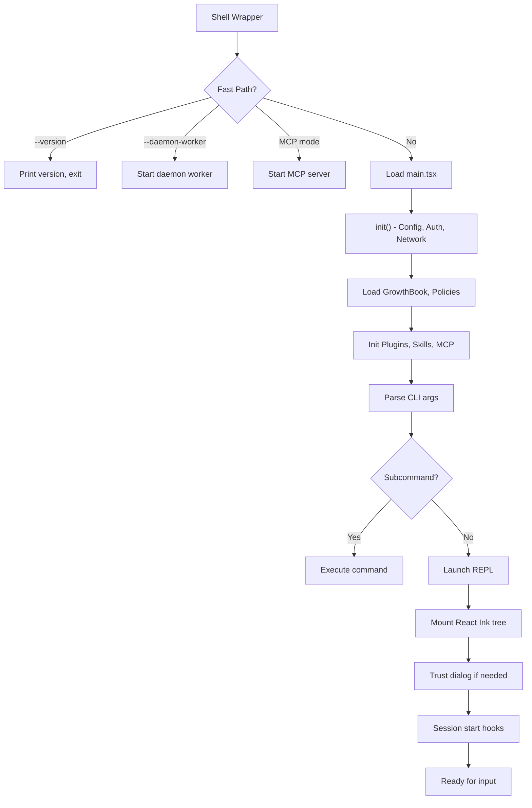
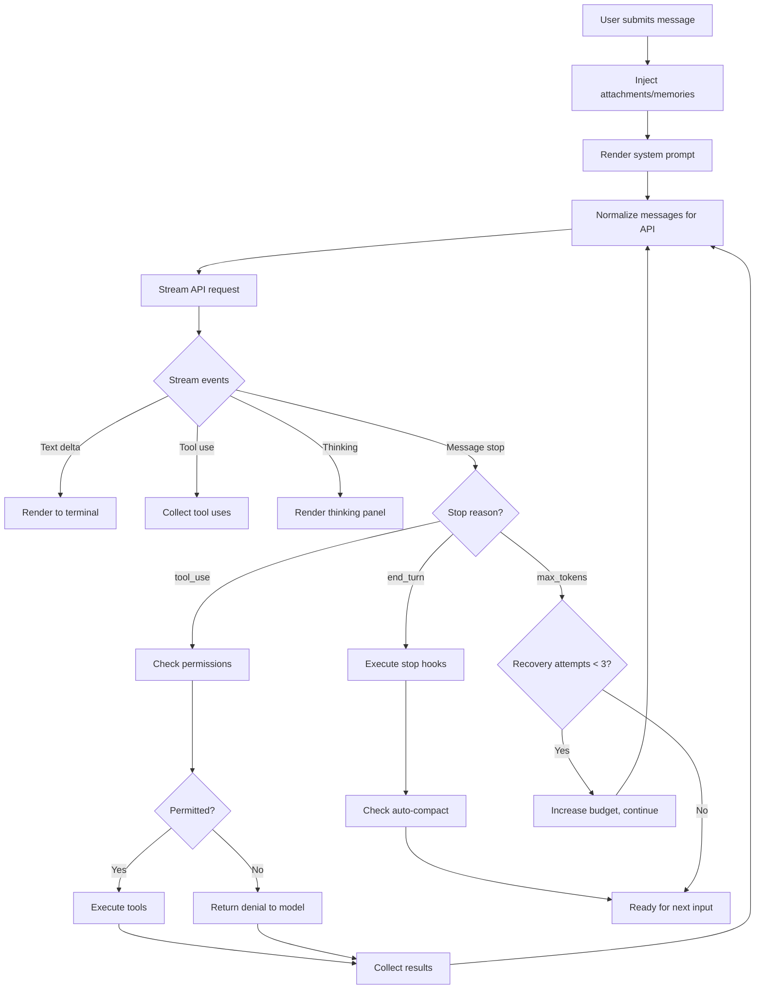
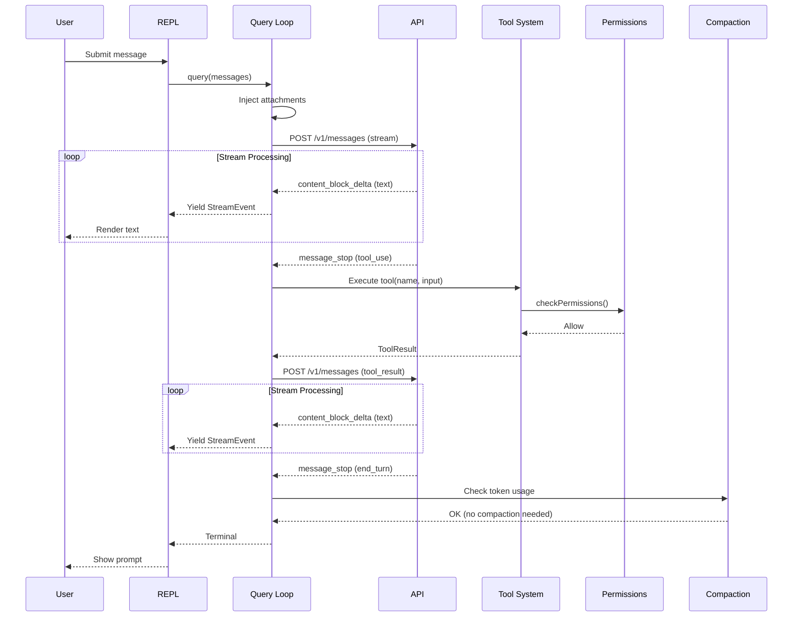
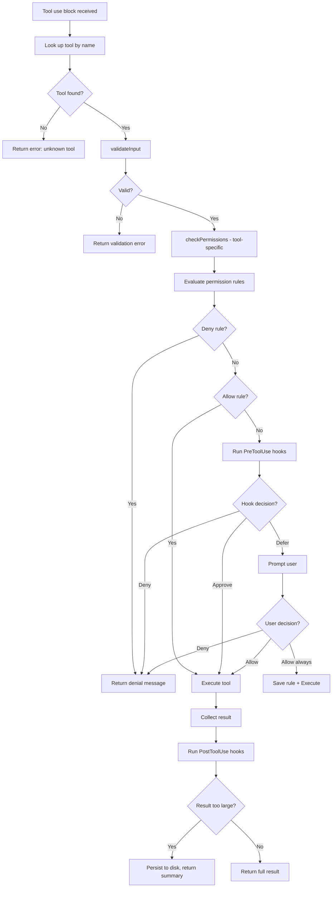
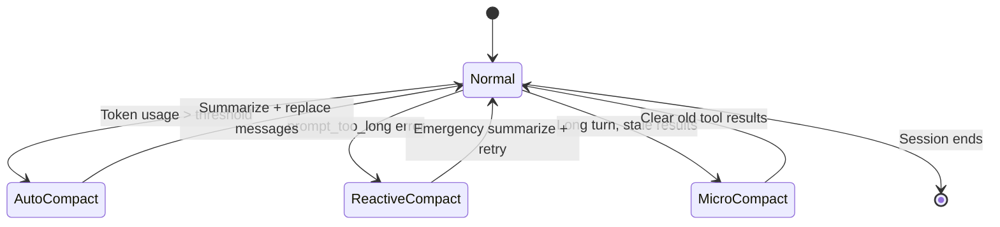
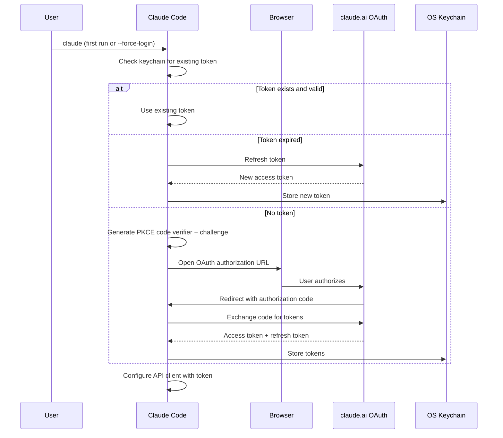
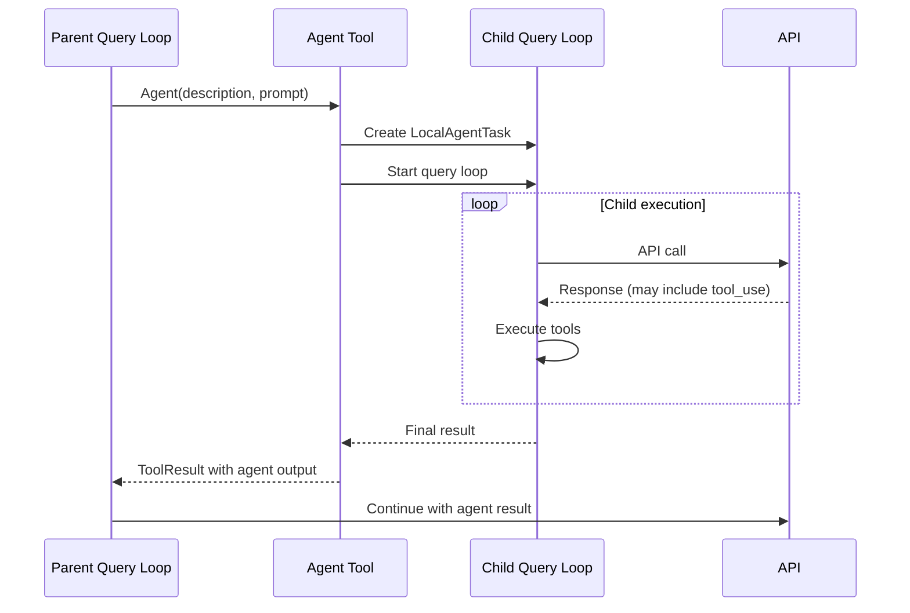
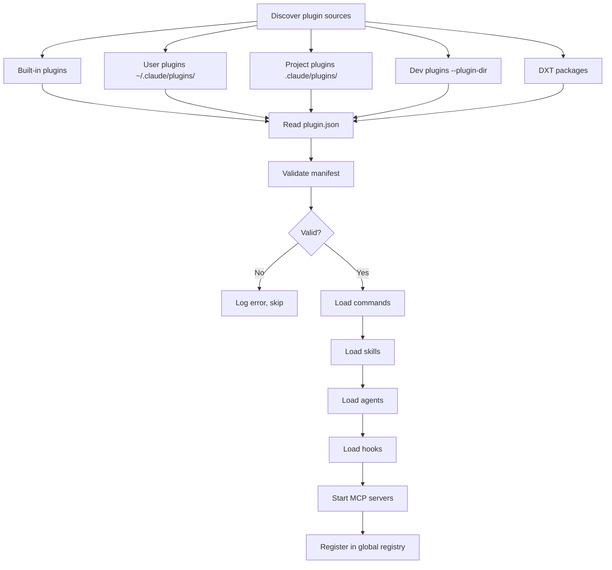

# Core Flows

## 1. Startup & Initialization

### Purpose
Bootstrap the application from shell invocation to interactive REPL.

### Actors
- Developer (user), Bun runtime, Filesystem, API endpoint, OAuth provider

### Preconditions
- Bun runtime installed
- Valid authentication configured (API key, OAuth, or cloud IAM)

### Postconditions
- Interactive REPL displayed with prompt ready
- All tools registered, MCP servers connected, plugins loaded

### Step-by-Step Walkthrough

1. Shell wrapper (`bin/claude-haha`) invokes Bun with environment file
2. `preload.ts` executes: sets `globalThis.MACRO` with version metadata
3. `cli.tsx` entry point checks for fast-path flags (`--version`, `--daemon-worker`, MCP modes)
4. If no fast-path, imports `main.tsx`
5. `init()` runs (memoized): enables configs, sets up graceful shutdown, configures network (mTLS, proxy, pre-connect)
6. MDM settings and keychain reads happen in parallel during module evaluation
7. System context gathered (OS info, git status, working directory)
8. GrowthBook feature flags initialized
9. Policy limits and remote managed settings loaded
10. Built-in plugins, skills, and MCP servers initialized
11. Commander.js parses CLI arguments
12. Commands registered (80+ built-in + MCP + plugin commands)
13. If no subcommand matched, REPL launches
14. React Ink component tree mounted
15. Trust dialog shown if first run
16. Session start hooks executed
17. Prompt input ready for user

### Edge Cases & Failure Modes
- **Config parse error:** Shows dialog with error details, continues with defaults
- **OAuth token expired:** Refresh attempted; if refresh fails, prompts for re-login
- **MCP server fails to start:** Warning shown, tools from that server unavailable
- **Network unavailable:** API pre-connect fails silently; error surfaces on first query
- **MDM settings unreadable:** Skipped silently, fallback to file-based settings

---

## 2. User Query → Model Response (The Query Loop)

### Purpose
Process a user message through the LLM and execute any requested tools.

### Actors
- User, Query Engine, Anthropic API, Tool System, Permission System, Compaction Engine

### Preconditions
- Session active with at least one user message
- Valid authentication

### Postconditions
- Model response rendered to terminal
- Any tool results applied (files edited, commands run, etc.)
- Token usage tracked

### Step-by-Step Walkthrough

1. User types message and presses Enter/Shift+Enter
2. Message added to conversation history
3. Memory prefetch starts (async background search for relevant CLAUDE.md content)
4. Attachment messages injected (CLAUDE.md, memories)
5. System prompt rendered (static sections + tool descriptions + context)
6. Messages normalized for API (strip local fields, apply thinking rules)
7. API request sent with streaming enabled
8. Stream events processed:
   a. Text deltas → rendered to terminal in real-time
   b. Thinking deltas → rendered in thinking panel
   c. Tool use blocks → collected with streaming JSON assembly
9. On `stop_reason: tool_use`:
   a. For each tool use block, concurrency check determines parallel vs. sequential
   b. Permission check for each tool (rules → hooks → user prompt)
   c. Tool executed, result collected
   d. Tool results assembled into user message
   e. Loop continues (go to step 6)
10. On `stop_reason: end_turn`:
    a. Stop hooks executed
    b. Auto-compact check: if token usage high, trigger compaction
    c. Tool use summary generated (async)
    d. Response complete, prompt ready for next input
11. On `stop_reason: max_tokens`:
    a. Recovery loop: up to 3 attempts with increased token budget
    b. If recovery exhausted, response shown as-is

### Sequence Diagram

### Edge Cases & Failure Modes
- **API timeout:** Retry with backoff; after max retries, show error to user
- **Prompt too long:** Trigger reactive compaction, retry with compacted context
- **Tool execution error:** Error returned to model as tool_result with `is_error: true`
- **User interruption (Escape):** Abort current API call, generate synthetic tool results for pending uses
- **Rate limit:** Wait with countdown timer, retry automatically
- **Network drop:** Retry with backoff; after exhaustion, surface error
- **Fallback model:** If primary model fails with quota error, try fallback model

---

## 3. Tool Execution Flow

### Purpose
Execute a tool requested by the model, with permission checks and error handling.

### Step-by-Step

1. Query loop receives tool_use block from API response
2. Tool looked up by name in tool registry (including aliases)
3. `validateInput()` called — checks input validity
4. `checkPermissions()` called — tool-specific permission logic
5. General permission system evaluates:
   a. Check deny rules (highest precedence)
   b. Check allow rules
   c. Check ask rules
   d. Execute PreToolUse hooks
   e. If undecided, prompt user (or auto-deny in non-interactive mode)
6. If permitted, `call()` executes the tool
7. Progress events emitted during execution
8. Result mapped to `ToolResultBlockParam` for API
9. PostToolUse hooks executed
10. If result exceeds `maxResultSizeChars`, persisted to disk with summary

---

## 4. Context Compaction Flow

### Purpose
Reduce conversation context size to stay within model limits.

### Actors
- Query Loop, Compaction Engine, API (Haiku model for summarization)

### Step-by-Step

1. After each API response, token usage is checked
2. If usage exceeds threshold (configurable, ~80% of context window):
   a. **Auto-compact:** Summarize older messages using a fast model (Haiku)
   b. Preserve recent messages (last N turns + all pending tool results)
   c. Replace older messages with compact summary
   d. Insert tombstone markers for removed messages
3. If API returns `prompt_too_long` error:
   a. **Reactive compact:** Emergency compaction triggered
   b. More aggressive summarization
   c. Retry the failed request
4. Within a long tool execution turn:
   a. **Micro-compact:** Time-based clearing of old tool results
   b. Replace stale tool results with brief summaries

---

## 5. Authentication Flow

### Purpose
Establish identity and API access.

### OAuth Flow (claude.ai)

---

## 6. Multi-Agent (Sub-Agent) Flow

### Purpose
Spawn child agents for parallel or delegated work.

### Step-by-Step

1. Model calls the `Agent` tool with description, prompt, and optional configuration
2. Agent tool creates a new `LocalAgentTask`
3. Child task gets:
   - Cloned `ToolUseContext` with isolated message array
   - Own `AbortController`
   - Restricted tool set (based on agent type configuration)
   - Own system prompt (parent's system prompt + agent-specific instructions)
4. Child task runs its own query loop (same `query()` function)
5. Child can use tools, including spawning further sub-agents (depth-limited)
6. Progress events from child are forwarded to parent's UI
7. On completion, child's final message is returned to parent as tool result
8. Parent continues its own query loop with the agent's result

---

## 7. Plugin Loading Flow

### Purpose
Discover, validate, and activate plugins.

### Step-by-Step

1. At startup, discover plugins from:
   a. Built-in plugins (bundled in source)
   b. User plugins in `~/.claude/plugins/`
   c. Project plugins in `.claude/plugins/`
   d. Development plugins via `--plugin-dir` flag
   e. DXT-packaged plugins
2. For each plugin, read `plugin.json` manifest
3. Validate manifest against schema
4. Load components:
   a. Commands (slash commands)
   b. Skills (prompt templates)
   c. Agents (agent definitions)
   d. Hooks (lifecycle interceptors)
   e. MCP servers (external tool providers)
5. Register commands and tools with the global registry
6. MCP servers started and connected
7. Plugin errors reported but don't block startup

---

## 8. Session Resume Flow

### Purpose
Resume a previous conversation from persisted state.

### Step-by-Step

1. User invokes `claude --resume` or `/resume` command
2. Session list loaded from `~/.claude/sessions/`
3. User selects session (or most recent is auto-selected)
4. Session messages loaded from JSONL file
5. Messages replayed into conversation state
6. Previous permission rules restored
7. REPL rendered with historical messages
8. User can continue the conversation

---

## 9. Remote Bridge Flow

### Purpose
Allow claude.ai web interface to observe and control local Claude Code session.

### Step-by-Step

1. Bridge enabled via config or `/remote-control` command
2. CLI creates a session on claude.ai API
3. WebSocket connection established
4. Events from local session forwarded to bridge (messages, tool uses, progress)
5. Inbound prompts from web interface injected into local message queue
6. Session URL displayed for sharing
7. On disconnect, automatic reconnection with backoff
