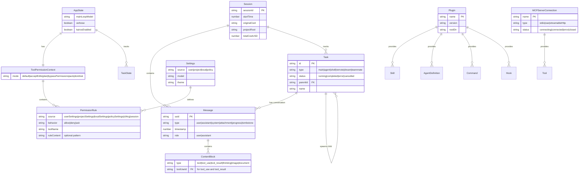

# Data Models

## 1. Entity-Relationship Diagram



## 2. Entity Catalog

### Message

The fundamental unit of conversation. Messages form an ordered sequence within a session.

| Field | Type | Constraints | Default | Description |
|-------|------|------------|---------|-------------|
| `uuid` | string (UUID) | Unique | Auto-generated | Unique message identifier |
| `type` | enum | Required | — | `user`, `assistant`, `system`, `attachment`, `progress`, `tombstone`, `tool_use_summary` |
| `timestamp` | number | Required | `Date.now()` | Unix timestamp in milliseconds |
| `message.role` | string | Required for API messages | — | `user` or `assistant` |
| `message.content` | ContentBlock[] | Required | — | Array of content blocks |
| `costUSD` | number | Optional | — | API cost for assistant messages |
| `durationMs` | number | Optional | — | API response time |
| `apiError` | string | Optional | — | Error type if API failed (`max_output_tokens`, `prompt_too_long`, etc.) |
| `toolUseResult` | string | Optional | — | Tool result text for user messages containing tool_result |
| `isMeta` | boolean | Optional | `false` | If true, message is hidden from display |
| `isCompacted` | boolean | Optional | `false` | If true, message was produced by compaction |

**Invariants:**
- Messages alternate between user and assistant roles when sent to the API
- Every `tool_use` block must have a matching `tool_result` in the subsequent user message
- Thinking blocks must not be the last block in an assistant message
- System messages are stripped before API calls

### ContentBlock Types

| Block Type | Key Fields | Description |
|-----------|-----------|-------------|
| `text` | `text: string` | Plain text content |
| `tool_use` | `id: string`, `name: string`, `input: object` | Model requesting tool execution |
| `tool_result` | `tool_use_id: string`, `content: string/blocks`, `is_error: boolean` | Result of tool execution |
| `thinking` | `thinking: string` | Extended thinking content (visible to user, stripped from API on next turn unless in same trajectory) |
| `redacted_thinking` | (opaque) | Redacted thinking block (must be preserved as-is) |
| `image` | `source: {type, media_type, data}` | Base64-encoded image |
| `document` | `source: {type, media_type, data}` | PDF or other document |

### AppState

The primary UI state object, managed by an external store with React integration.

| Field | Type | Default | Description |
|-------|------|---------|-------------|
| `settings` | SettingsJson | Loaded from disk | Merged settings from all sources |
| `verbose` | boolean | `false` | Show detailed tool output |
| `mainLoopModel` | ModelSetting | From config | Current model for conversation |
| `toolPermissionContext` | ToolPermissionContext | Default mode | Current permission rules and mode |
| `tasks` | Map<string, TaskState> | Empty | Running background tasks |
| `kairosEnabled` | boolean | `false` | Assistant/proactive mode |
| `agent` | string | undefined | Agent name from `--agent` flag |
| `speculation` | SpeculationState | `{status: 'idle'}` | Speculative execution state |
| `replBridgeEnabled` | boolean | `false` | Whether bridge to claude.ai is active |
| `todoList` | TodoList | undefined | Current task/todo tracking |
| `notifications` | Notification[] | `[]` | Pending UI notifications |

### ToolUseContext

Passed to every tool call. Contains the full execution environment.

| Field | Type | Description |
|-------|------|-------------|
| `options.commands` | Command[] | Available slash commands |
| `options.tools` | Tools | Available tools |
| `options.mainLoopModel` | string | Current model name |
| `options.mcpClients` | MCPServerConnection[] | Connected MCP servers |
| `options.agentDefinitions` | AgentDefinitionsResult | Available agent types |
| `abortController` | AbortController | Signal for cancellation |
| `readFileState` | FileStateCache | LRU cache of recently read files |
| `messages` | Message[] | Current conversation history |
| `agentId` | AgentId | Set only for sub-agents |
| `contentReplacementState` | ContentReplacementState | Tool result budget tracking |

### Bootstrap State (Singleton)

Process-wide mutable state. Key fields:

| Field | Type | Description |
|-------|------|-------------|
| `sessionId` | string | Unique session identifier |
| `originalCwd` | string | Working directory at startup |
| `projectRoot` | string | Detected project root (git root) |
| `totalCostUSD` | number | Cumulative API cost |
| `totalAPIDuration` | number | Cumulative API call time (ms) |
| `modelUsage` | Map | Per-model token usage counters |
| `invokedSkills` | Map | Skills used this session |
| `isInteractive` | boolean | Whether running in interactive mode |

### SettingsJson

| Field | Type | Default | Description |
|-------|------|---------|-------------|
| `permissions.allow` | string[] | `[]` | Auto-allow rules (e.g., `"Bash(git *)"`) |
| `permissions.deny` | string[] | `[]` | Auto-deny rules |
| `permissions.additionalDirectories` | string[] | `[]` | Extra allowed directories |
| `permissions.defaultMode` | PermissionMode | `"default"` | Default permission mode |
| `env` | Record<string, string> | `{}` | Environment variable overrides |
| `model` | string | undefined | Model override |
| `hooks` | HooksConfig | `{}` | Lifecycle hook definitions |
| `mcpServers` | Record<string, MCPConfig> | `{}` | MCP server configurations |

### TaskState

| Field | Type | Description |
|-------|------|-------------|
| `id` | string | Unique task ID |
| `type` | string | `main`, `agent`, `shell`, `remote`, `dream`, `teammate` |
| `status` | string | `running`, `completed`, `error`, `cancelled` |
| `name` | string | Human-readable task name |
| `parentId` | string | Parent task ID (for agent hierarchy) |
| `model` | string | Model used by this task |
| `agentColor` | AgentColorName | Display color for agent tasks |

### MCPServerConnection

| Field | Type | Description |
|-------|------|-------------|
| `name` | string | Server identifier |
| `type` | string | `stdio`, `sse`, `streamableHttp` |
| `status` | string | `connecting`, `connected`, `error`, `closed` |
| `tools` | Tool[] | Tools provided by this server |
| `resources` | ServerResource[] | Resources provided by this server |
| `config` | MCPConfig | Server configuration |

## 3. Schema Evolution / Migrations

The `src/migrations/` directory contains ordered migrations for settings and model names:

| Migration | Purpose |
|-----------|---------|
| `migrateLegacyOpusToCurrent` | Rename legacy Opus model identifiers |
| `migrateOpusToOpus1m` | Update Opus to 1M context variant |
| `migrateSonnet45ToSonnet46` | Update Sonnet model version |
| `migrateSonnet1mToSonnet45` | Update Sonnet 1M model name |
| `migrateFennecToOpus` | Rename codename to production model name |
| `migrateBypassPermissionsAcceptedToSettings` | Move bypass flag to settings |
| `migrateAutoUpdatesToSettings` | Move auto-update preference to settings |
| `resetProToOpusDefault` | Reset Pro tier default to Opus |
| `resetAutoModeOptInForDefaultOffer` | Reset auto-mode opt-in state |
| `migrateReplBridgeEnabledToRemoteControlAtStartup` | Rename bridge setting |
| `migrateEnableAllProjectMcpServersToSettings` | Move MCP approval to settings |

Migrations run once per user profile and are tracked to prevent re-execution.

## 4. In-Memory / Runtime Data Structures

### FileStateCache (LRU)
- **Purpose:** Cache of recently read file contents to avoid redundant disk reads
- **Structure:** LRU map with configurable max size
- **Key:** Absolute file path
- **Value:** File content + metadata (size, modification time)
- **Lifecycle:** Per-session, cleared on compaction boundaries

### Message Queue
- **Purpose:** Queue of pending user messages/commands while the model is processing
- **Structure:** Priority queue with UUID-keyed entries
- **Operations:** Enqueue, dequeue by priority, remove by UUID
- **Lifecycle:** Per-session

### Tool Decision Cache
- **Purpose:** Track recent permission decisions to avoid re-prompting
- **Structure:** Map keyed by decision signature
- **Value:** `{source, decision: 'accept'|'reject', timestamp}`
- **Lifecycle:** Per-query

### Content Replacement State
- **Purpose:** Track which tool results have been replaced with disk-persisted summaries
- **Structure:** Map of tool_use_id → replacement info
- **Lifecycle:** Per-session, cloned for sub-agents

## 5. Serialization Contracts

### API Request Format (Messages API)

Messages are serialized as JSON for the Anthropic Messages API:

```
{
  "model": "<model-id>",
  "max_tokens": <number>,
  "system": [
    {"type": "text", "text": "<system-prompt-section>", "cache_control": {"type": "ephemeral"}},
    ...
  ],
  "messages": [
    {"role": "user", "content": [{"type": "text", "text": "..."}]},
    {"role": "assistant", "content": [{"type": "text", "text": "..."}, {"type": "tool_use", "id": "...", "name": "...", "input": {...}}]},
    {"role": "user", "content": [{"type": "tool_result", "tool_use_id": "...", "content": "..."}]},
    ...
  ],
  "tools": [
    {"name": "<tool-name>", "description": "...", "input_schema": {"type": "object", "properties": {...}}},
    ...
  ],
  "stream": true,
  "betas": ["..."]
}
```

### Session Persistence Format

Sessions are stored as JSONL (newline-delimited JSON) in `~/.claude/sessions/<session-id>.jsonl`:
- Each line is a serialized `Message` object
- Read sequentially to reconstruct conversation state
- Session metadata stored in a separate `.meta.json` file

### Settings File Format (JSONC)

`~/.claude/settings.json` and `.claude/settings.json`:
```
{
  // Comments are allowed (JSONC)
  "permissions": {
    "allow": ["Bash(git *)", "Read"],
    "deny": ["Bash(rm -rf *)"],
    "defaultMode": "default"
  },
  "env": {
    "ANTHROPIC_API_KEY": "..."
  },
  "model": "claude-sonnet-4-6",
  "hooks": {
    "PreToolUse": [
      {"matcher": "Bash", "command": "echo check"}
    ]
  },
  "mcpServers": {
    "server-name": {
      "command": "npx",
      "args": ["-y", "@server/mcp"],
      "env": {}
    }
  }
}
```

### Plugin Manifest Format (`plugin.json`)

```
{
  "name": "my-plugin",
  "version": "1.0.0",
  "description": "Plugin description",
  "commands": ["commands/"],
  "skills": ["skills/"],
  "agents": ["agents/"],
  "hooks": {...},
  "mcpServers": {...}
}
```

### MCP Protocol (JSON-RPC 2.0)

Tool calls to MCP servers use JSON-RPC 2.0:
```
→ {"jsonrpc": "2.0", "id": 1, "method": "tools/call", "params": {"name": "tool-name", "arguments": {...}}}
← {"jsonrpc": "2.0", "id": 1, "result": {"content": [{"type": "text", "text": "..."}]}}
```

### Stream Events (SSE)

API streaming uses Server-Sent Events with typed event payloads:
- `message_start` — Initial message metadata
- `content_block_start` — New content block beginning
- `content_block_delta` — Incremental content (text delta, input JSON delta, thinking delta)
- `content_block_stop` — Content block complete
- `message_delta` — Message-level updates (stop_reason, usage)
- `message_stop` — Streaming complete

### CLAUDE.md Format

CLAUDE.md files are Markdown with optional YAML frontmatter:
```
---
description: "Project-specific instructions"
---

# Project Instructions
- Build with: npm run build
- Test with: npm test
```
