# Dependency Map

## 1. Internal Dependency Graph

```mermaid
flowchart TD
    subgraph Entrypoints
        CLI[cli.tsx]
        MAIN[main.tsx]
        INIT[init.ts]
        SDK[sdk entry]
    end

    subgraph Core
        QUERY[query.ts]
        TOOL[Tool.ts]
    end

    subgraph Services
        API[services/api/]
        MCP_SVC[services/mcp/]
        COMPACT[services/compact/]
        OAUTH[services/oauth/]
        ANALYTICS[services/analytics/]
        PLUGINS_SVC[services/plugins/]
        LSP[services/lsp/]
        TOOLS_SVC[services/tools/]
    end

    subgraph Tools
        BASH_T[BashTool]
        FILE_R[FileReadTool]
        FILE_W[FileWriteTool]
        FILE_E[FileEditTool]
        GLOB_T[GlobTool]
        GREP_T[GrepTool]
        AGENT_T[AgentTool]
        MCP_T[MCPTool]
        SKILL_T[SkillTool]
        OTHER_T[Other Tools...]
    end

    subgraph State
        BOOTSTRAP[bootstrap/state]
        APP_STATE[state/AppState]
        STORE[state/store]
    end

    subgraph UI
        INK[ink/ framework]
        SCREENS[screens/REPL]
        COMPONENTS[components/]
    end

    subgraph Utils
        BASH_U[utils/bash]
        GIT_U[utils/git]
        PERM_U[utils/permissions]
        SETTINGS_U[utils/settings]
        MODEL_U[utils/model]
        MSG_U[utils/messages]
        SANDBOX_U[utils/sandbox]
        HOOKS_U[utils/hooks]
        MEMORY_U[utils/memory]
        MCP_U[utils/mcp]
    end

    subgraph Extensions
        SKILLS[skills/]
        PLUGINS[plugins/]
        COMMANDS[commands/]
        TASKS[tasks/]
    end

    CLI --> MAIN
    CLI --> INIT
    MAIN --> QUERY
    MAIN --> COMMANDS
    MAIN --> PLUGINS_SVC
    MAIN --> ANALYTICS

    QUERY --> API
    QUERY --> TOOLS_SVC
    QUERY --> COMPACT
    QUERY --> MSG_U

    TOOLS_SVC --> TOOL
    TOOLS_SVC --> PERM_U
    TOOLS_SVC --> HOOKS_U

    TOOL --> BASH_T & FILE_R & FILE_W & FILE_E & GLOB_T & GREP_T & AGENT_T & MCP_T & SKILL_T & OTHER_T

    BASH_T --> BASH_U
    BASH_T --> SANDBOX_U
    FILE_R & FILE_W & FILE_E --> GIT_U
    AGENT_T --> TASKS
    MCP_T --> MCP_SVC
    SKILL_T --> SKILLS

    API --> OAUTH
    API --> MODEL_U
    API --> BOOTSTRAP

    SCREENS --> INK
    SCREENS --> COMPONENTS
    SCREENS --> APP_STATE

    COMPONENTS --> INK
    APP_STATE --> STORE
    APP_STATE --> PERM_U

    PERM_U --> SETTINGS_U
    PERM_U --> HOOKS_U

    SETTINGS_U --> BOOTSTRAP

    TASKS --> QUERY
    PLUGINS_SVC --> MCP_U
    PLUGINS_SVC --> PLUGINS

    COMPACT --> API
    COMPACT --> MSG_U
```

## 2. External Dependency Catalog

### Core Runtime & Language

| Dependency | Version | Purpose | Behavior Description |
|-----------|---------|---------|---------------------|
| `bun` | 1.x | JavaScript/TypeScript runtime | Executes TypeScript natively, provides bundling, subprocess API, `feature()` macro for dead code elimination |
| `typescript` | 5.x | Type system | Development-time type checking (Bun handles runtime) |

### API & Networking

| Dependency | Version | Purpose | Behavior Description |
|-----------|---------|---------|---------------------|
| `@anthropic-ai/sdk` | 0.80.0 | Anthropic API client | Constructs API requests, handles streaming SSE parsing, manages auth headers, retry logic |
| `@anthropic-ai/bedrock-sdk` | — | AWS Bedrock client | Wraps Anthropic SDK with AWS SigV4 auth for Bedrock endpoints |
| `@anthropic-ai/vertex-sdk` | — | Google Vertex client | Wraps Anthropic SDK with GCP IAM auth for Vertex endpoints |
| `@anthropic-ai/foundry-sdk` | — | Azure Foundry client | Wraps Anthropic SDK with Azure AD auth |
| `axios` | — | HTTP client | Used for non-API HTTP requests (web fetch, OAuth, health checks) |
| `@modelcontextprotocol/sdk` | 1.29.0 | MCP client | Manages JSON-RPC connections to MCP servers (stdio/SSE/HTTP), tool discovery, resource management |

### Cloud Provider SDKs

| Dependency | Version | Purpose | Behavior Description |
|-----------|---------|---------|---------------------|
| `@aws-sdk/client-bedrock-runtime` | — | AWS Bedrock | Direct Bedrock API access (alternative path) |
| `google-auth-library` | — | GCP authentication | OAuth2, service account, and ADC credential management for Vertex AI |
| `@azure/identity` | — | Azure authentication | DefaultAzureCredential for Foundry; supports managed identity, CLI, env vars |

### UI & Rendering

| Dependency | Version | Purpose | Behavior Description |
|-----------|---------|---------|---------------------|
| `react` | 19.2.4 | UI component model | Declarative component tree, hooks, context; used with custom terminal reconciler |
| `react-reconciler` | 0.33.0 | Custom React renderer | Bridges React's virtual DOM to terminal output nodes (Ink integration) |
| `ink` | 6.8.0 | Terminal UI framework | Base for the heavily customized terminal renderer (forked/vendored in `src/ink/`) |
| `yoga-layout` | — | Flexbox layout engine | Facebook's layout engine; calculates element positions/sizes in terminal grid |
| `chalk` | — | Terminal colors | ANSI color/style application for text output |
| `marked` | — | Markdown parser | Parses markdown in model responses for structured rendering |

### CLI & Input

| Dependency | Version | Purpose | Behavior Description |
|-----------|---------|---------|---------------------|
| `@commander-js/extra-typings` | 14.0.0 | CLI framework | Argument parsing, subcommand routing, help generation with TypeScript types |

### Data & Validation

| Dependency | Version | Purpose | Behavior Description |
|-----------|---------|---------|---------------------|
| `zod` | v4 | Schema validation | Runtime type validation for tool inputs, settings, API responses, plugin manifests |
| `yaml` | — | YAML parser | Parses YAML frontmatter in CLAUDE.md, skill files, plugin configs |
| `jsonc-parser` | — | JSONC parser | Parses JSON with comments for settings files |

### Telemetry & Observability

| Dependency | Version | Purpose | Behavior Description |
|-----------|---------|---------|---------------------|
| `@opentelemetry/api` | — | Telemetry API | Standard interface for traces, metrics, logs |
| `@opentelemetry/sdk-trace-node` | — | Trace SDK | Trace/span management with batch export |
| `@opentelemetry/sdk-metrics` | — | Metrics SDK | Counter/histogram management with periodic export |
| `@opentelemetry/sdk-logs` | — | Logs SDK | Structured log management with batch export |
| `@opentelemetry/exporter-trace-otlp-grpc` | — | gRPC exporter | Exports traces/metrics/logs via gRPC (lazy-loaded, ~700KB) |

### Feature Flags

| Dependency | Version | Purpose | Behavior Description |
|-----------|---------|---------|---------------------|
| `@growthbook/growthbook` | — | Feature flag client | Evaluates feature flags and A/B test assignments; initialized at startup with cached fallbacks |

### Security & Auth

| Dependency | Version | Purpose | Behavior Description |
|-----------|---------|---------|---------------------|
| OS Keychain (native) | — | Secure token storage | macOS Keychain / Windows Credential Manager / Linux libsecret for OAuth tokens |

## 3. Dependency Risk Notes

### `bun:bundle` feature() Macro
- **Risk:** Build-time dead code elimination — `feature('FLAG')` calls must be top-level for the bundler to statically analyze them. Using `feature()` inside a function body or with a variable flag name defeats elimination.
- **Re-impl note:** In other runtimes, this must be replaced with a build plugin (e.g., webpack DefinePlugin, Rollup replace) or runtime conditionals. The behavior is: features marked as internal-only (`VOICE_MODE`, `DUMP_SYSTEM_PROMPT`, etc.) are stripped from external builds.

### `react-reconciler` Custom Renderer
- **Risk:** The Ink fork is heavily customized with a bespoke reconciler, Yoga layout integration, terminal event system, and ANSI rendering pipeline. This is not standard React DOM — it renders to a 2D character grid.
- **Re-impl note:** Either use an existing TUI framework or implement: Yoga layout → character grid → ANSI escape code rendering.

### `@anthropic-ai/sdk` Streaming
- **Risk:** The SDK handles SSE stream parsing internally. Stream reconnection and error recovery are handled by both the SDK and the application's retry layer (`withRetry.ts`). The two can interact in subtle ways.
- **Re-impl note:** Must implement SSE stream parsing, partial JSON assembly for tool_use inputs, and a retry wrapper that handles both network errors and API errors differently.

### `yoga-layout` Native Module
- **Risk:** Yoga is a native (C++) module with WebAssembly fallback. The `src/native-ts/yoga-layout/` directory contains a TypeScript reimplementation for environments where the native module isn't available.
- **Re-impl note:** The layout engine must correctly implement CSS Flexbox for terminal grid alignment. Common gotchas: text measurement with wide characters (CJK), tab stops, and bidirectional text.

### `@modelcontextprotocol/sdk` Server Types
- **Risk:** MCP supports three transport types (stdio, SSE, streamable HTTP) with different connection semantics. stdio requires subprocess management; SSE requires long-lived HTTP connections; streamable HTTP uses request/response.
- **Re-impl note:** Must implement all three transports. The stdio transport is most common. Server crash detection and restart is critical for reliability.

### `jsonc-parser` Settings Files
- **Risk:** Settings files use JSONC (JSON with comments). Standard `JSON.parse()` will reject them. The parser preserves comment positions for round-trip editing.
- **Re-impl note:** Use a JSONC-compatible parser, not standard JSON.

### `chalk` / ANSI Handling
- **Risk:** Terminal color support varies. The system detects color support level (none, basic, 256-color, true-color) and adjusts output accordingly. Some terminals support hyperlinks (OSC 8), others don't.
- **Re-impl note:** Must detect terminal capabilities and degrade gracefully. Use terminfo or environment variable heuristics.
