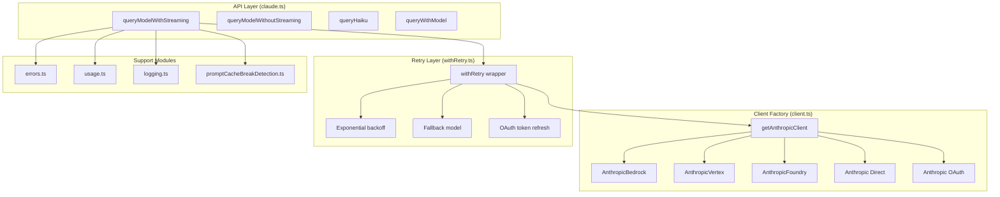

# API Client

## 1. Purpose & Responsibility

The API Client layer handles all communication with the Anthropic Messages API (and cloud provider variants). It owns:
- Client construction for 5 providers (Anthropic direct, Bedrock, Vertex, Foundry, OAuth)
- Streaming request/response handling
- Retry with exponential backoff
- Fallback model switching on quota exhaustion
- Token usage tracking
- Request/response logging and telemetry
- Prompt cache optimization

## 2. Public Interface

### `getAnthropicClient(options): Promise<Anthropic>`

Factory that creates the correct SDK client based on environment variables.

**Parameters:**
- `apiKey` — Optional API key override
- `maxRetries` — Max retry attempts
- `model` — Model name (used for provider-specific region selection)
- `fetchOverride` — Custom fetch implementation
- `source` — Caller identifier for debugging

**Provider Selection:**
- `CLAUDE_CODE_USE_BEDROCK=true` → `AnthropicBedrock`
- `CLAUDE_CODE_USE_FOUNDRY=true` → `AnthropicFoundry`
- `CLAUDE_CODE_USE_VERTEX=true` → `AnthropicVertex`
- `isClaudeAISubscriber()` → Anthropic with `authToken`
- Otherwise → Anthropic with `apiKey`

### `queryModelWithStreaming(options): AsyncGenerator<StreamEvent>`

Main streaming API call. Returns an async generator of stream events.

### `queryModelWithoutStreaming(options): Promise<Message>`

Non-streaming API call (used for simple queries like compaction summaries).

### `queryHaiku(options): Promise<string>`

Convenience function for fast model queries (compaction, summaries).

### `queryWithModel(options): Promise<Message>`

Query with explicit model override.

## 3. Internal Architecture

## 4. Algorithm Walkthroughs

### Streaming Request Algorithm

1. Build request parameters:
   a. Render system prompt sections with `cache_control` markers
   b. Normalize messages (strip local fields, apply thinking rules)
   c. Convert tools to API schema format
   d. Set model, max_tokens, thinking config, betas
2. Construct client via `getAnthropicClient()`
3. Send streaming request
4. For each SSE event:
   a. Parse event type and data
   b. For `content_block_delta`: accumulate text/JSON/thinking
   c. For `content_block_stop`: finalize block, yield complete block
   d. For `message_delta`: extract stop_reason, usage
   e. For `message_stop`: finalize message
5. On complete, extract token usage from response
6. Return final message with stop_reason

### Retry Algorithm (withRetry.ts)

1. Attempt the request
2. On failure, classify the error:
   - **Retryable (429, 529, network):** Wait with exponential backoff, retry
   - **OAuth 401:** Attempt token refresh, retry once
   - **Quota exhaustion with fallback:** Switch model, retry
   - **prompt_too_long:** Surface to caller (reactive compaction)
   - **Fatal (400, 403, 404):** Surface to caller immediately
3. Backoff formula: `min(baseDelay * 2^attempt, maxDelay)` with jitter
4. Respect `retry-after` header if present
5. After max retries, surface error to caller

### Prompt Cache Optimization

The system prompt is structured for maximum cache hit rate:
1. Static prefix (tool descriptions, base instructions) → `cache_control: ephemeral`
2. Dynamic sections (CLAUDE.md, context) → after cache boundary
3. The order of sections is kept stable across requests
4. `promptCacheBreakDetection.ts` logs when cache is likely busted

## 5. Configuration & Tunables

| Config | Default | Description |
|--------|---------|-------------|
| `API_TIMEOUT_MS` | `600000` (10 min) | Request timeout |
| `maxRetries` | 2 | Max retry attempts |
| Base backoff | 1000ms | Initial retry delay |
| Max backoff | 60000ms | Maximum retry delay |
| `CAPPED_DEFAULT_MAX_TOKENS` | Model-dependent | Default max output tokens |
| `ESCALATED_MAX_TOKENS` | Higher | Max tokens for recovery attempts |

## 6. Error Handling Strategy

| Error | Handling |
|-------|----------|
| Network timeout | Retry with backoff |
| 429 Rate limit | Wait (retry-after), retry |
| 529 Overloaded | Retry with backoff |
| 401 Unauthorized | Refresh OAuth token, retry once |
| 400 Bad request | Surface to caller (likely invalid messages) |
| 413 Prompt too long | Surface to caller (trigger compaction) |
| 500 Server error | Retry with backoff |
| Streaming parse error | Surface to caller |
| Connection drop mid-stream | Retry entire request |

## 7. Testing Notes

- Mock the Anthropic SDK to return predefined responses
- Test all provider paths (direct, Bedrock, Vertex, Foundry, OAuth)
- Test retry logic with simulated failures
- Test fallback model switching
- Test OAuth token refresh during request
- Test streaming with various event sequences
- Watch for: partial JSON in tool_use inputs (must be correctly reassembled)
