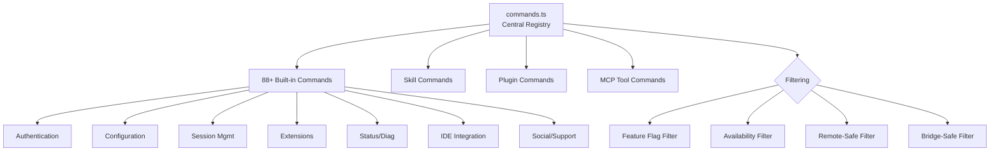

# Commands System

## 1. Purpose & Responsibility

The Commands System provides slash commands (`/help`, `/config`, `/model`, etc.) for user interaction within the REPL. It owns:
- Command registration with the central registry
- Lazy loading of command implementations for startup performance
- Command type differentiation (local-jsx, local, prompt)
- Feature-gated and availability-gated command filtering
- Remote-safe and bridge-safe command allowlists

## 2. Command Types

| Type | Rendering | Description |
|------|-----------|-------------|
| `local-jsx` | React/Ink components | Interactive terminal UI (dialogs, selectors, panels) |
| `local` | Plain text output | Text-only responses, supports non-interactive mode |
| `prompt` | Injected into conversation | Expands to text sent to the Claude model as a user message |

## 3. Command Metadata Interface

Every command exports an object with:

| Field | Type | Required | Description |
|-------|------|----------|-------------|
| `name` | string | Yes | Command identifier (used after `/`) |
| `description` | string/function | Yes | Help text (can be dynamic based on state) |
| `type` | enum | Yes | `local-jsx`, `local`, or `prompt` |
| `load()` | function | Yes | Lazy-load the command implementation |
| `isEnabled()` | function | No | Whether command is currently available |
| `isHidden` | boolean | No | Hide from help and typeahead |
| `immediate` | boolean | No | Execute without waiting for Enter key |
| `argumentHint` | string | No | Shows expected arguments in help |
| `aliases` | string[] | No | Alternative command names |
| `availability` | string[] | No | Auth requirements (`['claude-ai']`, `['console']`) |
| `supportsNonInteractive` | boolean | No | Whether command works in headless/SDK mode |

## 4. Command Categories (88+ commands)

### Authentication & Account
| Command | Aliases | Type | Description |
|---------|---------|------|-------------|
| `/login` | — | local-jsx | Sign in or switch Anthropic accounts |
| `/logout` | — | local-jsx | Sign out from Anthropic account |

### Configuration & Settings
| Command | Aliases | Type | Description |
|---------|---------|------|-------------|
| `/config` | `/settings` | local-jsx | Interactive configuration panel |
| `/model` | — | local-jsx | Set the AI model |
| `/theme` | — | local-jsx | Change terminal theme |
| `/color` | — | local-jsx | Set prompt bar color |
| `/effort` | — | local-jsx | Set effort level (low/medium/high/max/auto) |
| `/fast` | — | local-jsx | Toggle fast mode (Sonnet-only) |
| `/vim` | — | local | Toggle Vim editing mode |
| `/keybindings` | — | local | Edit keyboard shortcuts |
| `/sandbox` | — | local-jsx | Configure bash sandboxing |

### Session Management
| Command | Aliases | Type | Description |
|---------|---------|------|-------------|
| `/clear` | `/reset`, `/new` | local | Clear conversation history |
| `/compact` | — | local | Summarize and compact context |
| `/resume` | `/continue` | local-jsx | Resume previous conversation |
| `/branch` | `/fork` | local-jsx | Create conversation branch |
| `/rename` | — | local-jsx | Rename current conversation |
| `/rewind` | `/checkpoint` | local | Restore to previous point |
| `/plan` | — | local-jsx | Enable plan mode or view plan |
| `/export` | — | local-jsx | Export conversation to file |
| `/copy` | — | local-jsx | Copy last response to clipboard |

### Extension Systems
| Command | Aliases | Type | Description |
|---------|---------|------|-------------|
| `/mcp` | — | local-jsx | Manage MCP servers |
| `/plugin` | `/plugins`, `/marketplace` | local-jsx | Manage plugins |
| `/skills` | — | local-jsx | List available skills |
| `/agents` | — | local-jsx | Manage agent configurations |
| `/hooks` | — | local-jsx | View hook configurations |
| `/reload-plugins` | — | local | Activate pending plugin changes |

### Permissions & Security
| Command | Aliases | Type | Description |
|---------|---------|------|-------------|
| `/permissions` | `/allowed-tools` | local-jsx | Manage permission rules |
| `/privacy-settings` | — | local-jsx | View/update privacy settings |

### Code & Context
| Command | Aliases | Type | Description |
|---------|---------|------|-------------|
| `/context` | — | local-jsx | Visualize context usage grid |
| `/diff` | — | local-jsx | View uncommitted changes |
| `/memory` | — | local-jsx | Edit Claude memory files |
| `/files` | — | local | List files in context |
| `/review` | — | prompt | Review a pull request |
| `/add-dir` | — | local-jsx | Add working directory |

### Status & Diagnostics
| Command | Aliases | Type | Description |
|---------|---------|------|-------------|
| `/help` | — | local-jsx | Show help and commands |
| `/status` | — | local-jsx | Show version, model, connectivity |
| `/doctor` | — | local-jsx | Diagnose installation |
| `/cost` | — | local | Show session cost |
| `/usage` | — | local-jsx | Show plan usage limits |
| `/stats` | — | local-jsx | Show usage statistics |

### IDE & Integrations
| Command | Aliases | Type | Description |
|---------|---------|------|-------------|
| `/ide` | — | local-jsx | Manage IDE integrations |
| `/desktop` | `/app` | local-jsx | Continue in Claude Desktop |
| `/chrome` | — | local-jsx | Chrome extension settings |
| `/voice` | — | local | Toggle voice mode |
| `/remote-control` | `/rc` | local-jsx | Remote control bridge |
| `/session` | `/remote` | local-jsx | Show remote session URL |

### Social & Support
| Command | Aliases | Type | Description |
|---------|---------|------|-------------|
| `/feedback` | `/bug` | local-jsx | Submit feedback |
| `/mobile` | `/ios`, `/android` | local-jsx | QR code for mobile app |
| `/btw` | — | local-jsx | Quick side question |
| `/passes` | — | local-jsx | Share free week referral |

## 5. Command Filtering

### Feature-Gated Commands
Commands are conditionally included based on build-time feature flags:
- `BRIDGE_MODE` → `/remote-control`
- `VOICE_MODE` → `/voice`
- `KAIROS` → proactive assistant commands
- `WORKFLOW_SCRIPTS` → workflow commands
- `BG_SESSIONS` → background session commands
- `EXPERIMENTAL_SKILL_SEARCH` → skill search commands

### Availability Filtering
- `['claude-ai']` — Only for claude.ai subscribers
- `['console']` — Only for direct API customers (not 3P providers)

### Remote-Safe Commands (`REMOTE_SAFE_COMMANDS`)
Allowlist for commands safe in Claude Code Remote mode — only TUI-local effects:
session, exit, clear, help, theme, cost, usage, copy, etc.

### Bridge-Safe Commands (`BRIDGE_SAFE_COMMANDS`)
Allowlist for commands safe from the Remote Control bridge — text-output only:
compact, clear, cost, summary, files, etc. Blocks `local-jsx` commands by type.

## 6. Internal Architecture

## 7. Key Design Patterns

1. **Lazy Loading:** `load()` defers implementation import until command is invoked, reducing startup time
2. **Memoized Registry:** `COMMANDS()` function is memoized; cache cleared on plugin reload
3. **Dynamic Descriptions:** Some commands have `description` as a function that reads current state (e.g., `/model` shows current model)
4. **Immediate Mode:** Some commands execute without Enter (e.g., `/color red` applies immediately)
5. **Dual-Mode:** Some commands have different implementations for interactive vs. non-interactive (e.g., `/context`)

## 8. Testing Notes

- Test command registration and lookup
- Test feature-gated commands are absent when flag is off
- Test availability filtering for different auth contexts
- Test remote-safe filtering
- Test lazy loading (command implementation not imported at registration)
- Test immediate mode execution
