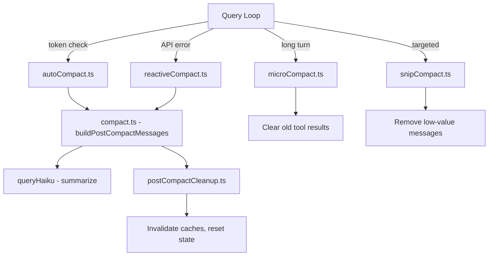

# Compaction Engine

## 1. Purpose & Responsibility

The Compaction Engine manages context window pressure by summarizing old messages. It owns:
- Auto-compaction triggered by token usage thresholds
- Reactive compaction triggered by prompt_too_long API errors
- Micro-compaction for clearing stale tool results within long turns
- Snip compaction for targeted removal of low-value messages
- Post-compaction cleanup (cache invalidation, state updates)

## 2. Compaction Strategies

### Auto-Compact
- **Trigger:** Token usage exceeds ~80% of context window after an API response
- **Algorithm:** Summarize older messages with a fast model (Haiku), keep recent turns intact
- **Result:** Replaces N older messages with 1 summary message

### Reactive Compact
- **Trigger:** API returns prompt_too_long error
- **Algorithm:** Emergency compaction with more aggressive summarization
- **Result:** Replaces messages and retries the failed request

### Micro-Compact
- **Trigger:** Long time gap between tool executions in a single turn
- **Algorithm:** Replace old tool results with brief summaries
- **Result:** Frees space within an ongoing turn without full compaction

### Snip Compact
- **Trigger:** Context pressure with identifiable low-value messages
- **Algorithm:** Remove specific messages (e.g., old search results, redundant reads)
- **Result:** Targeted space reclamation

## 3. Algorithm Walkthrough — Auto-Compact

1. Calculate token warning state from API response usage
2. If usage ratio > threshold:
   a. Identify preservation boundary (recent N turns)
   b. Collect messages before boundary
   c. Send to Haiku: "Summarize this conversation, preserving key decisions and file changes"
   d. Create summary message with compact marker
   e. Create tombstone messages for removed messages (UI shows removal indicators)
   f. Run PreCompact hooks
   g. Replace messages in conversation
   h. Run post-compact cleanup:
      - Invalidate file state caches (files may have changed)
      - Update token tracking state
      - Reset auto-compact tracking
   i. Continue query loop with compacted context

## 4. Internal Architecture

## 5. Configuration & Tunables

| Config | Default | Description |
|--------|---------|-------------|
| Auto-compact threshold | ~0.8 | Token usage ratio trigger |
| Preservation window | Recent 3-5 turns | Messages to keep during compaction |
| Micro-compact time threshold | Configurable | Time gap before clearing old results |
| Summary model | Haiku | Fast model used for summarization |
| Summary max tokens | 2048 | Max tokens for summary output |

## 6. Testing Notes

- Test auto-compact triggers at correct threshold
- Test message structure validity after compaction
- Test preservation of recent messages
- Test reactive compact recovery from prompt_too_long
- Test token tracking accuracy across compaction boundaries
- Watch for: losing important context in aggressive compaction
