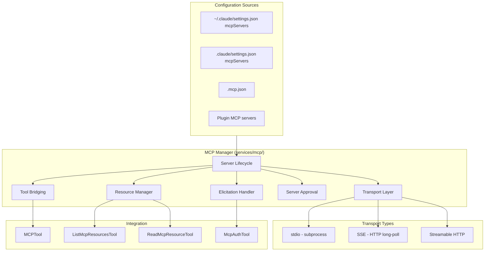

# MCP Integration

## 1. Purpose & Responsibility

The MCP (Model Context Protocol) Integration layer manages connections to external tool servers. It owns:
- MCP server lifecycle (start, connect, restart, shutdown)
- Tool discovery and bridging (MCP tools → unified Tool interface)
- Resource discovery and reading
- Three transport types: stdio, SSE, streamable HTTP
- Server approval and trust management
- OAuth elicitation for MCP servers requiring authentication

## 2. Public Interface

### Server Management

| Function | Purpose |
|----------|---------|
| `getClaudeCodeMcpConfigs()` | Load MCP server configs from settings and .mcp.json |
| `getMcpToolsCommandsAndResources(configs)` | Start servers, discover tools/resources |
| `connectMcpServer(config)` | Connect to a single MCP server |
| `disconnectMcpServer(name)` | Disconnect and clean up |

### MCPServerConnection

```
{
  name: string
  type: 'stdio' | 'sse' | 'streamableHttp'
  status: 'connecting' | 'connected' | 'error' | 'closed'
  client: MCPClient
  tools: Tool[]
  resources: ServerResource[]
  config: MCPConfig
}
```

### MCPConfig (from settings)

```
{
  command: string           // For stdio: command to run
  args: string[]            // Command arguments
  env: Record<string,string> // Environment variables
  url: string               // For SSE/HTTP: server URL
  type: 'stdio' | 'sse' | 'streamableHttp'
}
```

## 3. Internal Architecture



## 4. Algorithm Walkthroughs

### Server Startup Algorithm

1. Collect MCP configs from all sources (settings, .mcp.json, plugins)
2. For each configured server:
   a. Check approval status (user must approve new project servers)
   b. Select transport based on config:
      - If `command` present → stdio
      - If `url` present → SSE or streamable HTTP
   c. For stdio: spawn subprocess with configured command/args/env
   d. For SSE/HTTP: establish HTTP connection to URL
3. Send JSON-RPC `initialize` request
4. On success: send `tools/list` to discover tools
5. Convert each MCP tool to unified `Tool` interface:
   a. Prefix name: `mcp__<server>__<tool>`
   b. Map JSON Schema to Zod schema
   c. Create `call()` that sends `tools/call` JSON-RPC
   d. Set permission defaults (ask for most operations)
6. Send `resources/list` to discover resources
7. Register tools and resources in global registry

### Tool Call Bridging

1. Model requests tool: `mcp__servername__toolname`
2. MCPTool extracts server and tool names
3. Permission check (ask user by default)
4. Construct JSON-RPC request:
   ```
   {method: "tools/call", params: {name: "toolname", arguments: {...}}}
   ```
5. Send to MCP server via transport
6. Await JSON-RPC response
7. Map MCP response to ToolResult:
   - `content[].text` → text result
   - `content[].image` → image result
   - `isError` → error flag
8. If error code -32042 (elicitation):
   a. Extract OAuth URL from error
   b. Present to user for authorization
   c. Retry tool call after authorization

### Server Crash Recovery

1. Detect process exit (stdio) or connection drop (SSE/HTTP)
2. Log error and update status to `'error'`
3. Remove server's tools from registry
4. If within retry limits:
   a. Wait with exponential backoff
   b. Attempt reconnection
   c. Re-discover tools on success
5. If retries exhausted:
   a. Mark server as disconnected
   b. Notify user
   c. Tools remain unavailable until manual restart

## 5. Configuration & Tunables

| Config | Default | Description |
|--------|---------|-------------|
| Max reconnect attempts | 3 | Times to retry crashed server |
| Reconnect backoff | 1s, 2s, 4s | Exponential backoff delays |
| Server timeout | 30s | Timeout for server startup |
| Tool call timeout | 120s | Timeout for individual tool calls |

## 6. Testing Notes

- Test all three transport types
- Test server crash and automatic recovery
- Test tool discovery and schema mapping
- Test elicitation (OAuth) flow
- Test server approval persistence
- Watch for: stdio corruption from debug output on stdout
