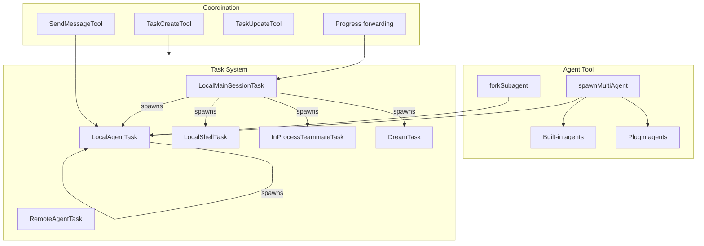
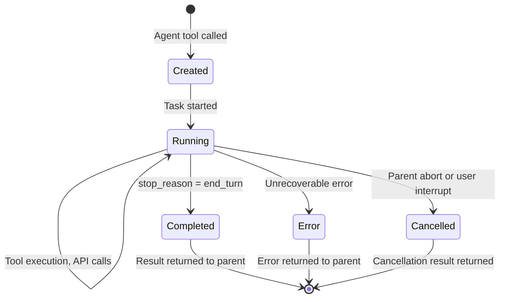

# Multi-Agent System

## 1. Purpose & Responsibility

The Multi-Agent System enables the LLM to spawn child agents for parallel or delegated work. It owns:
- Task lifecycle management (create, run, monitor, complete, cancel)
- Agent context isolation (separate message histories, shared infrastructure)
- Progress event forwarding between parent and child
- Built-in and plugin-defined agent types
- Background/foreground execution modes
- Agent color assignment for visual distinction

## 2. Public Interface

### Task Types

| Task Type | Class | Purpose |
|-----------|-------|---------|
| Main Session | `LocalMainSessionTask` | Root conversation task |
| Agent | `LocalAgentTask` | Sub-agent spawned by Agent tool |
| Shell | `LocalShellTask` | Background shell command |
| Remote | `RemoteAgentTask` | Agent running on remote server |
| Teammate | `InProcessTeammateTask` | Parallel agent sharing AppState |
| Dream | `DreamTask` | Background context processing |

### Agent Tool Input

| Field | Type | Required | Description |
|-------|------|----------|-------------|
| `description` | string | Yes | Short task description |
| `prompt` | string | Yes | Full task instructions |
| `subagent_type` | string | No | Agent type (Explore, Plan, or plugin-defined) |
| `model` | string | No | Model override for this agent |
| `name` | string | No | Named agent (addressable via SendMessage) |
| `run_in_background` | boolean | No | Run without blocking parent |
| `isolation` | `'worktree'` | No | Run in isolated git worktree |
| `mode` | string | No | Permission mode override |

### Built-in Agent Types

| Type | Purpose | Tools Available |
|------|---------|----------------|
| `general-purpose` | Research, code search, multi-step tasks | All tools |
| `Explore` | Fast codebase exploration | Read-only tools (no Edit, Write, Agent) |
| `Plan` | Architecture planning | Read-only tools (no Edit, Write, Agent) |

## 3. Internal Architecture



## 4. Algorithm Walkthroughs

### Agent Spawning Algorithm

1. Model calls Agent tool with description and prompt
2. Look up agent type (built-in or plugin-defined)
3. Create `ToolUseContext` for child:
   a. Clone parent's context
   b. Create new empty message array
   c. Create new AbortController (linked to parent's)
   d. Apply agent type's tool restrictions
   e. Set `setAppState` to no-op for async agents (prevent race conditions)
   f. Set `setAppStateForTasks` to root store (for infrastructure registration)
   g. Clone content replacement state
4. Build agent system prompt:
   a. Parent's base system prompt
   b. Agent type's additional instructions
   c. Tool descriptions for allowed tools only
5. Create initial user message from agent prompt
6. Instantiate `LocalAgentTask`
7. If foreground: await task completion, return result
8. If background: register in AppState.tasks, return task ID

### Context Isolation

Each sub-agent gets:
- **Own messages:** Empty array, starts fresh
- **Own AbortController:** Can be cancelled independently, but parent abort cascades
- **Own readFileState:** Separate file cache
- **Shared AppState (read):** Can read global state
- **No-op setAppState (write):** Cannot modify global state (prevents race conditions)
- **Shared setAppStateForTasks:** Can register/clean up tasks in root store
- **Cloned contentReplacementState:** For tool result budget tracking

### Progress Forwarding

1. Child agent's query loop yields stream events
2. Events are wrapped as `AgentToolProgress` objects
3. Parent's `onProgress` callback receives wrapped events
4. REPL renders child's progress in a nested view
5. On completion, child's final text response becomes parent's tool result

## 5. Task Lifecycle



## 6. Fork Subagent (Advanced)

When the fork subagent feature is enabled, omitting `subagent_type` triggers an implicit fork where the child inherits the parent's full context:

### Fork Message Construction
1. Clone the full assistant message (thinking + text + all tool_use blocks)
2. Create identical placeholder tool_result blocks for each tool_use
3. Append only the directive text (the only per-child difference)
4. Result: byte-identical prefix across all fork children maximizes prompt cache hits

### Fork Agent Properties
- `tools: ['*']` with `useExactTools` — inherits parent's exact tool pool
- `permissionMode: 'bubble'` — surfaces permission prompts to parent terminal
- `model: 'inherit'` — uses parent's model for context parity
- System prompt: parent's rendered bytes passed via `toolUseContext.renderedSystemPrompt` (avoids GrowthBook cold→warm cache busting)

### Fork Child Rules
1. Do NOT spawn further sub-agents (prevents recursive forks)
2. Execute directly without conversing
3. Use tools silently, report once at end
4. Keep report under 500 words, factual

### Anti-recursion
`isInForkChild()` detects fork boilerplate in messages, preventing recursive fork spawning.

## 7. Coordinator Mode

When `CLAUDE_CODE_COORDINATOR_MODE` is enabled, the main agent operates as an orchestrator that delegates work to spawned workers:

### Coordinator Workflow
1. Coordinator spawns worker 1 + worker 2 (parallel research)
2. Receives `<task-notification>` XML messages for each worker completion
3. Synthesizes findings into implementation specification
4. Spawns implementation worker with synthesized spec
5. Spawns verification worker separately (fresh eyes)
6. Reports final result to user

### System Prompt Injection
The coordinator receives additional system prompt defining:
- Role: "You are a coordinator"
- Available tools: Agent, SendMessage, TaskStop
- Workflow guidance: Research → Synthesis → Implementation → Verification
- Decision matrix: when to continue existing worker vs. spawn new

### Worker Tool Restrictions
- Simple mode: Bash, Read, Edit only
- Full mode: Standard tools + MCP + project skills

### Mutual Exclusion
Coordinator mode and fork subagent are mutually exclusive (checked at startup).

## 8. Dream Tasks (Background Memory)

Dream tasks perform background memory consolidation:

1. Auto-dream forks a subagent to analyze session history
2. Consolidation lock prevents concurrent dreams
3. Phases: `starting` → `updating` (when first Edit/Write fires)
4. Tracks assistant turns (last 30) and files touched
5. On kill: rollback consolidation lock to allow retry
6. No model-facing notification (UI-only task)

## 9. Task Notification Protocol

When a child task completes, it generates a `<task-notification>` XML message injected as a user message to the parent:

```
<task-notification>
  <task-id>a1234567890</task-id>
  <status>completed</status>
  <summary>Agent "Research X" completed</summary>
  <result>Final result text...</result>
  <usage>
    <total_tokens>50000</total_tokens>
    <tool_uses>15</tool_uses>
    <duration_ms>30000</duration_ms>
  </usage>
</task-notification>
```

The notification is atomic: the `notified` flag is set before enqueueing to prevent duplicates.

## 10. Configuration & Tunables

| Config | Default | Description |
|--------|---------|-------------|
| Agent depth limit | Configurable | Max nesting depth for agents |
| Agent model | Parent's model | Can be overridden per agent |
| Agent tool set | Based on type | Restricted tools per agent type |
| Background timeout | None | Background agents run until complete |
| Worktree cleanup | Auto | Isolated worktrees cleaned up if no changes |

## 7. Testing Notes

- Test basic agent spawn and result return
- Test nested agents (agent spawns agent)
- Test background agent execution
- Test abort cascade (parent abort → child abort)
- Test context isolation (child can't corrupt parent's messages)
- Test named agents with SendMessage
- Watch for: race conditions in shared AppState, orphaned child processes
