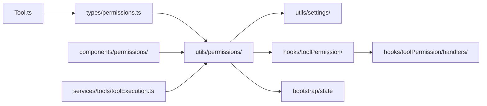

# Permission System

## 1. Purpose & Responsibility

The Permission System controls what tools the LLM is allowed to execute. It owns:
- Evaluating permission rules from multiple sources with defined precedence
- Pattern matching tool names and inputs against rules
- Integrating with the hook system for PreToolUse/PostToolUse decisions
- Presenting permission prompts to the user
- Tracking denial patterns to prevent infinite loops
- Managing permission modes (default, acceptEdits, plan, bypass, auto, dontAsk)

It must NEVER:
- Execute tools (that's the tool system)
- Make final decisions without consulting all rule sources
- Allow policy-denied operations regardless of other rules

## 2. Public Interface

### Permission Modes

| Mode | Constant | Behavior |
|------|----------|----------|
| Default | `'default'` | Ask user for write/destructive operations |
| Accept Edits | `'acceptEdits'` | Auto-allow file edits, ask for other writes |
| Plan | `'plan'` | Deny all write operations |
| Bypass | `'bypassPermissions'` | Allow everything |
| Don't Ask | `'dontAsk'` | Deny what isn't explicitly allowed |
| Auto | `'auto'` | ML classifier decides, uncertain → ask |
| Bubble | `'bubble'` | Bubble up to parent (internal) |

### Permission Result Types

```
PermissionAllowDecision = { behavior: 'allow', updatedInput?, userModified? }
PermissionAskDecision = { behavior: 'ask', message, suggestions? }
PermissionDenyDecision = { behavior: 'deny', message, decisionReason }
```

### PermissionRule

```
{
  source: 'userSettings' | 'projectSettings' | 'localSettings' | 'policySettings' | 'cliArg' | 'session',
  ruleBehavior: 'allow' | 'deny' | 'ask',
  ruleValue: { toolName: string, ruleContent?: string }
}
```

### ToolPermissionContext

The permission state available to all tools:

```
{
  mode: PermissionMode,
  additionalWorkingDirectories: Map<string, AdditionalWorkingDirectory>,
  alwaysAllowRules: ToolPermissionRulesBySource,
  alwaysDenyRules: ToolPermissionRulesBySource,
  alwaysAskRules: ToolPermissionRulesBySource,
  isBypassPermissionsModeAvailable: boolean,
  shouldAvoidPermissionPrompts?: boolean,
}
```

## 3. Internal Architecture

```mermaid
flowchart TD
    subgraph RuleEvaluation["Rule Evaluation"]
        POLICY[Policy Rules\n(highest precedence)]
        CLI_ARG[CLI Argument Rules]
        USER[User Settings Rules]
        PROJECT[Project Settings Rules]
        LOCAL[Local Settings Rules]
        SESSION[Session Rules\n(lowest precedence)]
    end

    subgraph HookIntegration["Hook Integration"]
        PRE_HOOK[PreToolUse Hooks]
        POST_HOOK[PostToolUse Hooks]
    end

    subgraph ModeLogic["Mode Logic"]
        BYPASS[bypass → allow all]
        PLAN[plan → deny writes]
        ACCEPT[acceptEdits → allow edits]
        AUTO[auto → classifier]
        DEFAULT[default → ask user]
        DONT_ASK[dontAsk → deny unmatched]
    end

    TOOL_CHECK[Tool permission check] --> POLICY
    POLICY -->|deny| DENIED[Denied]
    POLICY -->|allow| ALLOWED[Allowed]
    POLICY -->|no match| CLI_ARG
    CLI_ARG -->|deny| DENIED
    CLI_ARG -->|allow| ALLOWED
    CLI_ARG -->|no match| USER
    USER --> PROJECT --> LOCAL --> SESSION
    SESSION -->|no match| PRE_HOOK
    PRE_HOOK -->|approve| ALLOWED
    PRE_HOOK -->|deny| DENIED
    PRE_HOOK -->|defer| ModeLogic
    ModeLogic --> BYPASS & PLAN & ACCEPT & AUTO & DEFAULT & DONT_ASK
```

## 4. Algorithm Walkthroughs

### Rule Evaluation Algorithm

For a given tool name and input:

1. **For each rule source** (policy → CLI → user → project → local → session):
   a. Check deny rules for this source:
      - Match tool name (exact or pattern)
      - If tool has `preparePermissionMatcher()`, also match input pattern
      - If match found → return `{behavior: 'deny'}`
   b. Check allow rules for this source:
      - Same matching logic
      - If match found → return `{behavior: 'allow'}`
   c. Check ask rules for this source:
      - If match found → mark as "should ask" (don't return yet, lower sources might override)

2. **If no deny/allow matched across all sources:**
   a. Execute PreToolUse hooks
   b. If hook approves → return `{behavior: 'allow'}`
   c. If hook denies → return `{behavior: 'deny'}`
   d. If hook defers → fall through to mode logic

3. **Mode logic:**
   - `bypassPermissions` → allow
   - `plan` + write tool → deny
   - `acceptEdits` + edit/write tool → allow
   - `auto` → run classifier, then ask if uncertain
   - `dontAsk` → deny
   - `default` → ask user

### Pattern Matching Algorithm

Rules can be simple tool names or tool names with content patterns:

- `Read` → matches tool named "Read" with any input
- `Bash(git *)` → matches Bash tool where command matches glob pattern `git *`
- `Edit(/src/**)` → matches Edit tool where file path matches glob pattern `/src/**`

The `preparePermissionMatcher()` method on each tool creates a closure that matches patterns against the tool's specific input. For Bash, this matches against the command string. For file tools, this matches against the file path.

### Denial Tracking Algorithm

To prevent the model from endlessly retrying denied operations:

1. Track consecutive denials per tool name
2. After N consecutive denials (configurable), escalate:
   - In auto mode: switch from auto-deny to ask-user
   - In other modes: add stronger messaging to denial response
3. Reset counter when a different tool is used or user manually intervenes

## 5. Dependency Map



## 6. Configuration & Tunables

| Config | Default | Description |
|--------|---------|-------------|
| `permissions.defaultMode` | `"default"` | Default permission mode in settings |
| `permissions.allow` | `[]` | Allow rules in settings |
| `permissions.deny` | `[]` | Deny rules in settings |
| `permissions.additionalDirectories` | `[]` | Extra allowed directories |
| Denial tracking threshold | ~5 | Consecutive denials before escalation |

## 7. Error Handling Strategy

- Permission evaluation never throws — always returns a decision
- Invalid rule patterns are silently ignored (logged)
- Hook failures (timeout, crash) fall through to default behavior
- If permission state is corrupted, falls back to `default` mode (safest)

## 8. Testing Notes

- Test all rule sources individually and in combination
- Test precedence: policy deny overrides all other allow rules
- Test pattern matching: simple names, glob patterns, nested paths
- Test mode behavior: plan blocks writes, bypass allows all
- Test hook integration: exit code 0 = approve, 2 = deny, other = defer
- Test denial tracking: counter increments and escalation
- Watch for: rule source precedence bugs (this is the most common error)
