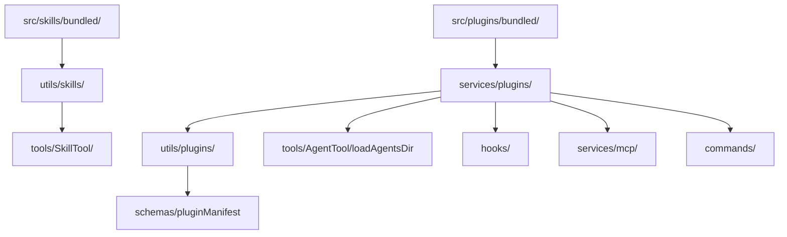

# Plugin & Skill System

## 1. Purpose & Responsibility

The Plugin & Skill System provides extensibility for Claude Code. It owns:
- Plugin discovery, validation, and loading from multiple sources
- Skill discovery, loading, and execution via the Skill tool
- Agent definition loading from plugins
- Hook registration from plugins
- MCP server configuration from plugins
- DXT (Developer Extension) package format support
- Command registration from plugins

## 2. Plugin Architecture

### Plugin Sources (in load order)
1. **Built-in plugins** — Shipped with Claude Code in `src/plugins/bundled/`
2. **User plugins** — `~/.claude/plugins/<plugin-name>/`
3. **Project plugins** — `.claude/plugins/<plugin-name>/`
4. **CLI plugins** — `--plugin-dir <dir>` flag
5. **DXT packages** — Packaged plugins with signature verification

### Plugin Manifest (`plugin.json`)

| Field | Type | Required | Description |
|-------|------|----------|-------------|
| `name` | string | Yes | Plugin identifier |
| `version` | string | Yes | Semantic version |
| `description` | string | Yes | Human-readable description |
| `commands` | string[] | No | Paths to command directories |
| `skills` | string[] | No | Paths to skill files/directories |
| `agents` | string[] | No | Paths to agent definition files |
| `hooks` | HooksConfig | No | Hook definitions |
| `mcpServers` | MCPConfig | No | MCP server configurations |

### Plugin Loading Algorithm

1. Discover plugin directories from all sources
2. For each directory:
   a. Read `plugin.json` manifest
   b. Validate manifest against schema
   c. If invalid, log error and skip
3. For each valid plugin:
   a. Load commands (resolve paths, register in command registry)
   b. Load skills (read skill files, register for discovery)
   c. Load agents (read agent definitions, register)
   d. Register hooks (merge with global hook config)
   e. Queue MCP servers for connection

## 3. Skill Architecture

### Skill Format

Skills are Markdown files with YAML frontmatter:

```markdown
---
name: "skill-name"
description: "When to trigger this skill"
---

# Skill Instructions

Detailed prompt template that gets injected when the skill is invoked.
```

### Skill Discovery

1. At startup, collect skills from:
   a. Bundled skills (`src/skills/bundled/`)
   b. Plugin skills (from loaded plugins)
2. Register each skill with name, description, and content
3. Skill descriptions are included in system prompt for model awareness

### Skill Execution (via SkillTool)

1. Model calls Skill tool with `{skill: "name", args?: "arguments"}`
2. Look up skill by name
3. Load skill content (Markdown body)
4. Inject skill content as a system message
5. Model processes the injected instructions
6. Skill completion tracked for telemetry

### Bundled Skills

Examples of built-in skills:
- `verify` — Verification skill with example templates
- Various development workflow skills

## 4. Agent Definitions

### Agent Definition Format

Agent definitions are Markdown files with YAML frontmatter:

```markdown
---
name: "agent-type"
description: "When to use this agent"
tools: ["Read", "Grep", "Glob"]  # Allowed tools
model: "sonnet"  # Optional model override
color: "blue"  # UI color
---

# Agent System Prompt

Additional instructions for this agent type.
```

### Agent Loading

1. Read agent definition files from plugins
2. Parse frontmatter for configuration
3. Register agent type in agent definitions registry
4. Agent type available via `subagent_type` parameter in Agent tool

## 5. Dependency Map



## 6. Testing Notes

- Test plugin loading from all sources
- Test manifest validation (valid and invalid manifests)
- Test skill discovery and execution
- Test agent definition loading and type resolution
- Test hook registration from plugins
- Test MCP server configuration from plugins
- Watch for: path resolution issues, circular plugin dependencies
