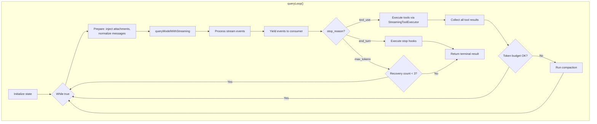
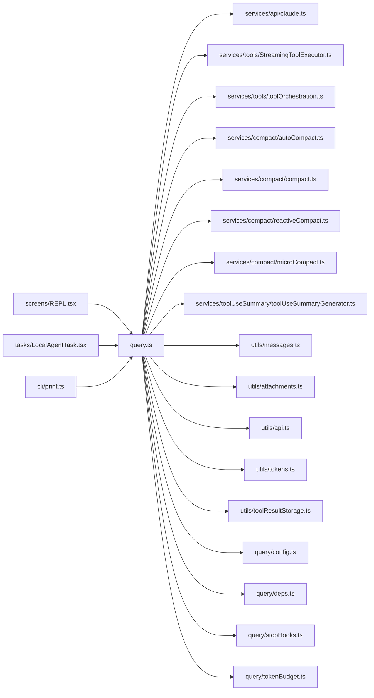

# Query Engine

## 1. Purpose & Responsibility

The Query Engine is the core conversation loop. It owns:
- Sending messages to the Anthropic API and processing streaming responses
- Dispatching tool executions and collecting results
- Managing the continue/stop decision after each API turn
- Triggering context compaction when approaching token limits
- Recovery from max_tokens and prompt_too_long errors
- Injecting memory and CLAUDE.md attachments
- Token budget tracking and enforcement

It must NEVER:
- Directly render UI (it yields events for the REPL to render)
- Make permission decisions (delegated to the permission system)
- Manage session persistence (handled by the REPL layer)

## 2. Public Interface

### `query(params: QueryParams): AsyncGenerator<StreamEvent | Message | ...>`

The main entry point. An async generator that yields events as they occur.

**Parameters:**
- `messages` — Current conversation history
- `systemPrompt` — Rendered system prompt
- `userContext` / `systemContext` — Context key-value pairs
- `canUseTool` — Permission callback function
- `toolUseContext` — Execution environment
- `fallbackModel` — Optional fallback model
- `querySource` — Origin identifier
- `maxOutputTokensOverride` — Optional token limit override
- `maxTurns` — Optional max tool iterations
- `taskBudget` — Optional total token budget

**Return:** Terminal result with `stop_reason` and final messages

**Pre/Post-conditions:**
- Pre: Messages must be valid (alternating roles, no orphaned tool_results)
- Post: All tool_use blocks in assistant messages have corresponding tool_results

## 3. Internal Architecture

## 4. Algorithm Walkthroughs

### Main Query Loop Algorithm

1. **Initialize state:** Create mutable `State` object with messages, tracking counters, compaction state
2. **Build query config:** Snapshot environment/feature state (immutable for loop duration)
3. **Start memory prefetch:** Async background search for relevant memories
4. **Enter loop:**
   a. Destructure current state
   b. Inject queued slash commands into messages
   c. Inject attachment messages (CLAUDE.md, memories) if first iteration or after compaction
   d. Apply tool result budget (replace large results with disk-persisted summaries)
   e. Render system prompt with tool descriptions
   f. Normalize messages for API (strip local fields, apply thinking rules, ensure pairing)
   g. Call `queryModelWithStreaming()` — yields stream events
   h. Process streaming response, collecting assistant message and tool_use blocks
   i. **Decision point based on stop_reason:**
      - `tool_use` → Execute tools, collect results, continue loop
      - `end_turn` → Execute stop hooks, check for continuation, return terminal
      - `max_tokens` → Increment recovery counter, add continuation prompt, continue loop
   j. Check auto-compact: if token usage high, run compaction before next iteration
   k. Generate tool use summary (async, for display)
   l. Update state and continue loop

**Complexity:** O(N * T) where N is conversation length and T is tools per turn. Each iteration is dominated by API call latency.

### Tool Execution Algorithm (within a turn)

1. Collect all `tool_use` blocks from assistant message
2. Group by concurrency safety: concurrent-safe tools form one group, others are sequential
3. For concurrent group: dispatch all in parallel via `StreamingToolExecutor`
4. For sequential tools: execute one at a time
5. For each tool:
   a. Look up tool by name
   b. Call `validateInput()` — reject if invalid
   c. Call `checkPermissions()` via permission system
   d. If denied, create error tool_result
   e. If permitted, call `tool.call()` with progress callback
   f. Map result to `ToolResultBlockParam`
   g. Execute PostToolUse hooks
6. Assemble all tool_results into a user message
7. Apply any `contextModifier` from non-concurrent tools

### Compaction Decision Algorithm

1. After each API response, extract token usage from response headers
2. Calculate ratio: `used_tokens / context_window_size`
3. If ratio > AUTO_COMPACT_THRESHOLD (typically 0.8):
   a. Identify messages to keep (recent N turns + pending tool results)
   b. Send older messages to Haiku model for summarization
   c. Replace older messages with summary
   d. Insert tombstone markers for UI
   e. Update tracking state
4. If API returns `prompt_too_long`:
   a. Run reactive compaction (more aggressive)
   b. Retry the failed request

## 5. Dependency Map

## 6. Configuration & Tunables

| Config | Default | Description |
|--------|---------|-------------|
| `AUTO_COMPACT_THRESHOLD` | ~0.8 | Token usage ratio that triggers auto-compact |
| `MAX_OUTPUT_TOKENS_RECOVERY_LIMIT` | 3 | Max recovery attempts for max_tokens |
| `ESCALATED_MAX_TOKENS` | Higher than default | Token limit used during recovery |
| `maxTurns` | Unlimited | Maximum tool use iterations per query |
| `taskBudget.total` | Unlimited | Total token budget for the agentic turn |

## 7. Error Handling Strategy

| Error | Handling | Recovery |
|-------|----------|----------|
| API timeout | Retry with backoff | Up to maxRetries |
| API 429 (rate limit) | Wait + retry | Respect retry-after header |
| API 529 (overloaded) | Retry with backoff | Up to maxRetries |
| prompt_too_long | Reactive compaction | Retry with compacted context |
| max_tokens | Continue with recovery prompt | Up to 3 attempts |
| Auth error (401) | Refresh OAuth token | Re-auth if refresh fails |
| Network error | Retry with backoff | Up to maxRetries |
| Tool execution error | Return error as tool_result | Model sees error, can retry |
| Abort signal | Cancel API call | Generate synthetic tool results |
| Quota exhaustion | Try fallback model | Surface error if no fallback |

## 8. Testing Notes

- Mock the API client to return predefined streaming responses
- Test the full loop: text response, single tool use, multi-tool use, nested agent
- Test compaction triggers by simulating high token counts
- Test recovery loops for max_tokens (ensure counter increments and limits work)
- Test abort behavior: verify synthetic tool results are generated
- Test token budget enforcement
- Watch for: message mutation bugs (messages array must not be mutated in place during iteration)
