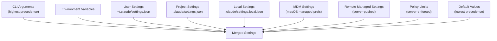

# Settings & Configuration

## 1. Purpose & Responsibility

The Settings & Configuration system manages all application configuration. It owns:
- Loading settings from multiple sources with defined precedence
- JSONC parsing and round-trip editing
- Settings validation against Zod schemas
- Settings migration for version upgrades
- MDM (Mobile Device Management) integration for enterprise
- Remote managed settings from server
- Environment variable resolution from settings

## 2. Settings Hierarchy

### Merge Algorithm

1. Start with default values
2. Deep-merge each source in precedence order (lowest first)
3. Arrays are replaced, not merged (e.g., permission allow lists)
4. Policy limits override all other sources for restricted fields
5. Result cached until a source file changes

## 3. Settings Sources

### User Settings (`~/.claude/settings.json`)
- Global preferences
- Persistent across projects
- Can be edited manually or via `/config` command
- JSONC format (comments preserved)

### Project Settings (`.claude/settings.json`)
- Per-project configuration
- Checked into version control
- Shared across team members
- Trust dialog shown on first use in new project

### Local Settings (`.claude/settings.local.json`)
- Per-project, per-machine overrides
- Gitignored
- Machine-specific configuration

### MDM Settings (macOS only)
- Enterprise-managed preferences via macOS MDM
- Read from `defaults read com.anthropic.claude-code`
- Cannot be overridden by user settings
- Subprocess read for isolation

### Remote Managed Settings
- Server-pushed configuration
- Fetched at session start
- Used for feature rollouts and emergency overrides

### Policy Limits
- Server-enforced guardrails
- Cannot be overridden
- Controls tool availability, model access, etc.

## 4. Migration System

Settings migrations handle format changes between versions:

1. At startup, check current settings version
2. Run all pending migrations in order
3. Each migration:
   a. Reads current settings
   b. Transforms to new format
   c. Writes updated settings
   d. Marks migration as complete
4. Migrations are idempotent (safe to re-run)

### Migration Examples
- Model name renames (e.g., `claude-3-opus` → `claude-opus-4-6`)
- Settings key renames
- Default value changes
- Format restructuring

## 5. Schema Validation

Settings are validated against Zod schemas:

- Top-level structure: `SettingsJson` type
- Permissions: valid rule format, valid mode names
- Hooks: valid event names, valid command format
- MCP servers: valid config structure
- Environment variables: string values only

Invalid settings are reported with specific error messages but don't block startup.

## 6. Testing Notes

- Test settings loading from all sources
- Test precedence (higher source overrides lower)
- Test JSONC parsing (comments preserved)
- Test schema validation (valid and invalid settings)
- Test migrations (each migration individually and in sequence)
- Test MDM integration (mock subprocess)
- Watch for: race conditions with concurrent settings writes
