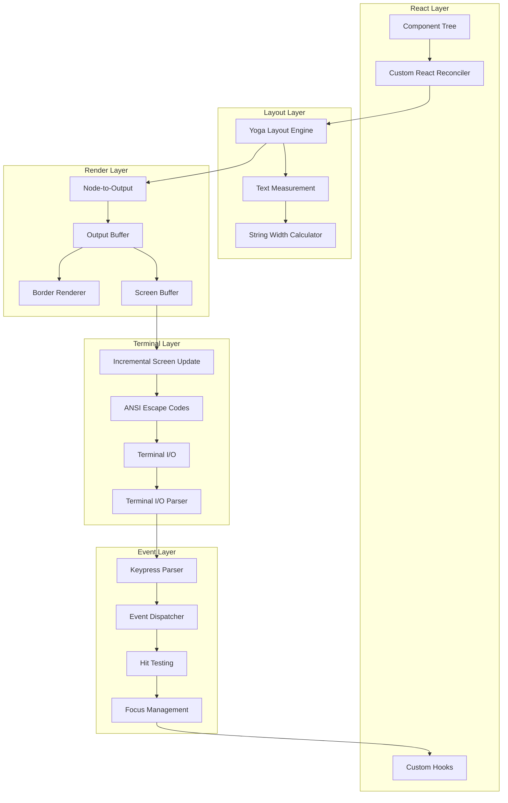
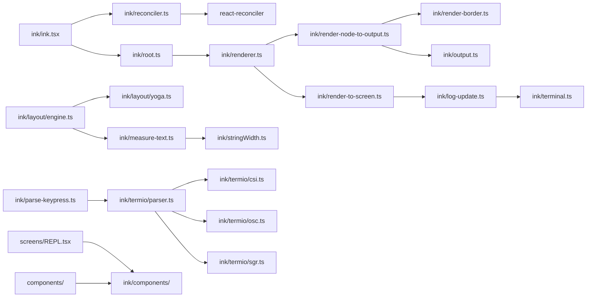

# Terminal UI (Ink Framework)

## 1. Purpose & Responsibility

The Terminal UI subsystem renders the interactive interface in the terminal. It owns:
- React component tree rendering to terminal character grid
- Yoga-based flexbox layout calculation
- ANSI escape code generation for colors, styles, cursor positioning
- Keyboard/mouse event handling and dispatch
- Text measurement (including wide characters, emoji, CJK)
- Screen management (alternate screen, clear, scroll)
- Selection and copy support
- Search/highlight within rendered content

This is a heavily customized fork of the Ink library, with significant additions for advanced terminal features.

## 2. Public Interface

### Core Rendering

| Export | Purpose |
|--------|---------|
| `render(element)` | Mount React element tree and start rendering |
| `Box` | Flexbox container component |
| `Text` | Text rendering with styles |
| `Spacer` | Flexible spacer component |
| `Newline` | Line break component |
| `Link` | Terminal hyperlink (OSC 8) |
| `ScrollBox` | Scrollable container |
| `Button` | Interactive button |

### Hooks

| Hook | Purpose |
|------|---------|
| `useInput(handler)` | Listen for keyboard input |
| `useStdin()` | Access raw stdin |
| `useApp()` | Access app lifecycle (exit) |
| `useTerminalViewport()` | Get terminal dimensions |
| `useDeclaredCursor()` | Manage cursor position |
| `useTerminalFocus()` | Track terminal focus state |
| `useSelection()` | Text selection support |
| `useSearchHighlight()` | Search term highlighting |

### Layout Engine

| Module | Purpose |
|--------|---------|
| `yoga.ts` | Yoga layout engine integration |
| `engine.ts` | Layout calculation pipeline |
| `node.ts` | Layout node management |
| `geometry.ts` | Geometry utilities |

### Event System

| Module | Purpose |
|--------|---------|
| `emitter.ts` | Event emitter for component tree |
| `dispatcher.ts` | Event dispatch to handlers |
| `input-event.ts` | Keyboard input events |
| `click-event.ts` | Mouse click events |
| `focus-event.ts` | Focus change events |

## 3. Internal Architecture

## 4. Algorithm Walkthroughs

### Rendering Pipeline

1. React reconciler processes component tree changes
2. For each component node:
   a. Apply styles (flex direction, padding, margin, border)
   b. Measure text content (handling wide chars, ANSI escapes)
   c. Create Yoga layout node with dimensions
3. Yoga calculates flexbox layout (positions and sizes)
4. For each positioned node:
   a. Render text content into output buffer at calculated position
   b. Render borders if present
   c. Apply color/style ANSI codes
5. Diff screen buffer against previous frame
6. Emit only changed regions as ANSI escape sequences
7. Flush to terminal stdout

### Text Measurement

1. Strip ANSI escape codes from text
2. For each character:
   a. Check Unicode width (1 for ASCII, 2 for CJK/wide)
   b. Handle combining characters (0 width)
   c. Handle emoji (may be 1 or 2 cells)
   d. Handle tab stops
3. Sum character widths for total line width
4. For multi-line text, return max line width and line count

### Keypress Parsing

1. Read raw bytes from stdin
2. Parse ANSI escape sequences:
   a. CSI sequences (`\x1b[...`) → arrow keys, function keys, modifiers
   b. OSC sequences (`\x1b]...`) → terminal queries
   c. DEC sequences → terminal mode responses
3. Map to high-level key events:
   a. Regular characters → `{key: char, shift?, ctrl?, alt?}`
   b. Special keys → `{key: 'return'|'escape'|'tab'|'backspace'|...}`
   c. Mouse events → `{x, y, button, type: 'click'|'scroll'|...}`
4. Dispatch to focused component's event handler

### Incremental Screen Update (log-update)

1. Compare new screen buffer line-by-line with previous
2. For each changed line:
   a. Move cursor to line position
   b. Clear line
   c. Write new content
3. Optimization: if only a few lines changed, move cursor to each; if most changed, redraw entire screen

## 5. Dependency Map

## 6. Configuration & Tunables

| Config | Default | Description |
|--------|---------|-------------|
| Theme | `dark` | Color scheme for UI elements |
| Alternate screen | On | Use terminal alternate screen buffer |
| Hyperlinks | Auto-detect | OSC 8 hyperlink support |
| Mouse | Auto-detect | Mouse event support |
| Tab width | 4 | Tab stop width for text measurement |

## 7. Testing Notes

- Test text measurement with ASCII, CJK, emoji, ANSI codes
- Test layout with nested flex containers
- Test keypress parsing with raw escape sequences
- Test screen diffing (incremental updates)
- Test component rendering with snapshot tests
- Watch for: wide character alignment issues, ANSI escape code nesting
