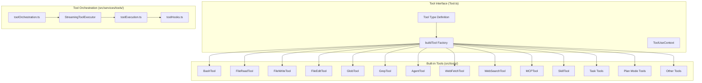

# Tool System

## 1. Purpose & Responsibility

The Tool System provides a pluggable framework for the LLM to interact with the external world. It owns:
- Defining the `Tool` interface contract
- Providing `buildTool()` factory with sensible defaults
- Implementing 30+ built-in tools
- Orchestrating parallel/sequential tool execution
- Bridging MCP server tools into the unified interface

It must NEVER:
- Make permission decisions (delegated to permission system)
- Manage conversation state (that's the query loop)
- Render UI directly (tools provide React components for the REPL to render)

## 2. Public Interface

### `Tool<Input, Output, Progress>` Type

The core interface every tool implements:

| Method | Purpose | Required |
|--------|---------|----------|
| `name` | Unique tool identifier | Yes |
| `inputSchema` | Zod schema for input validation | Yes |
| `call(input, context, canUseTool, parentMessage, onProgress?)` | Execute the tool | Yes |
| `description(input, options)` | Generate description for LLM | Yes |
| `prompt(options)` | Detailed prompt text for system prompt | Yes |
| `checkPermissions(input, context)` | Tool-specific permission logic | Default: allow |
| `validateInput(input, context)` | Semantic input validation | Optional |
| `isReadOnly(input)` | Whether tool only reads | Default: false |
| `isConcurrencySafe(input)` | Whether safe for parallel execution | Default: false |
| `isEnabled()` | Whether tool is currently available | Default: true |
| `maxResultSizeChars` | Threshold for disk persistence | Required |
| `renderToolUseMessage(input, options)` | Render tool invocation UI | Yes |
| `renderToolResultMessage(output, progress, options)` | Render tool result UI | Optional |
| `mapToolResultToToolResultBlockParam(content, id)` | Serialize result for API | Yes |

### `buildTool(def: ToolDef): Tool`

Factory function that fills in defaults:
- `isEnabled` → `() => true`
- `isConcurrencySafe` → `() => false`
- `isReadOnly` → `() => false`
- `isDestructive` → `() => false`
- `checkPermissions` → `{behavior: 'allow'}`
- `toAutoClassifierInput` → `''`
- `userFacingName` → `tool.name`

### `findToolByName(tools, name): Tool | undefined`

Lookup by primary name or aliases.

## 3. Internal Architecture

## 4. Tool Catalog Details

### BashTool
- **Input:** `{command: string, description?: string, timeout?: number}`
- **Execution:** Spawns shell subprocess with sandbox restrictions
- **Concurrency:** NOT safe (modifies filesystem state)
- **Permission:** Always asks unless explicitly allowed
- **Special:** Sandbox enforcement, command parsing for safety checks, timeout support

### FileReadTool
- **Input:** `{file_path: string, offset?: number, limit?: number}`
- **Execution:** Reads file content, returns with line numbers
- **Concurrency:** Safe
- **Permission:** Auto-allow (read-only)
- **Special:** PDF support, image support, notebook support, size limiting

### FileWriteTool
- **Input:** `{file_path: string, content: string}`
- **Execution:** Writes content to file, creating directories as needed
- **Concurrency:** NOT safe
- **Permission:** Asks user
- **Special:** Must have read the file first (prevents overwriting without seeing content)

### FileEditTool
- **Input:** `{file_path: string, old_string: string, new_string: string, replace_all?: boolean}`
- **Execution:** Exact string replacement in file
- **Concurrency:** NOT safe
- **Permission:** Asks user
- **Special:** `old_string` must be unique unless `replace_all` is true; shows diff in UI

### GlobTool
- **Input:** `{pattern: string, path?: string}`
- **Execution:** File pattern matching using glob syntax
- **Concurrency:** Safe
- **Permission:** Auto-allow (read-only)
- **Special:** Results sorted by modification time

### GrepTool
- **Input:** `{pattern: string, path?: string, glob?: string, output_mode?: string}`
- **Execution:** Content search using ripgrep
- **Concurrency:** Safe
- **Permission:** Auto-allow (read-only)
- **Special:** Multiple output modes (files, content, count), context lines support

### AgentTool
- **Input:** `{description: string, prompt: string, subagent_type?: string, model?: string, ...}`
- **Execution:** Spawns sub-agent with isolated conversation
- **Concurrency:** Safe (each agent is independent)
- **Permission:** Auto-allow
- **Special:** Built-in agent types (Explore, Plan), plugin-defined agents, background execution

### MCPTool (Dynamic)
- **Input:** Per-server tool schema
- **Execution:** JSON-RPC call to MCP server
- **Concurrency:** Varies by server
- **Permission:** Asks user
- **Special:** Name prefixed with `mcp__<server>__<tool>`, supports elicitation for OAuth

### WebFetchTool
- **Input:** `{url: string}`
- **Execution:** HTTP GET, converts HTML to readable text
- **Concurrency:** Safe
- **Permission:** Asks unless URL matches pre-approved pattern
- **Special:** Size limits, HTML-to-text conversion, pre-approved URL list

## 5. Tool Orchestration

### StreamingToolExecutor

Manages concurrent tool dispatch during streaming:

1. As tool_use blocks arrive from the stream, they're queued
2. When the stream completes (stop_reason = tool_use):
   a. Group tools by concurrency safety
   b. Dispatch concurrent-safe tools in parallel
   c. Execute non-concurrent tools sequentially
   d. Collect all results
3. Progress events forwarded to UI in real-time

### runTools()

Orchestrates tool execution for a set of tool_use blocks:

1. For each tool use block:
   a. Look up tool
   b. Validate input
   c. Check permissions (via canUseTool callback)
   d. Execute PreToolUse hooks
   e. Call tool.call()
   f. Execute PostToolUse hooks
   g. Map result to ToolResultBlockParam
2. Handle contextModifier from non-concurrent tools
3. Return assembled tool results

## 6. Configuration & Tunables

| Config | Default | Description |
|--------|---------|-------------|
| `maxResultSizeChars` | Per-tool | Threshold for persisting large results to disk |
| Tool `maxResultSizeChars` | e.g., Read=Infinity, Bash=50000, Grep=30000 | Size limit per tool |
| `fileReadingLimits.maxTokens` | Configurable | Max tokens for file read results |
| `globLimits.maxResults` | Configurable | Max files returned by glob |

## 7. Error Handling Strategy

- **Input validation failure:** Error message returned as tool_result to model
- **Permission denial:** Denial message returned as tool_result to model
- **Tool execution error:** Error caught, returned as tool_result with `is_error: true`
- **Tool timeout:** Aborted, timeout error returned as tool_result
- **Result too large:** Persisted to disk, summary with file path returned
- **Unknown tool name:** Error returned as tool_result

All errors are returned to the model (never thrown to the query loop), allowing the model to recover gracefully.

## 8. Testing Notes

- Test each tool with valid and invalid inputs
- Test permission integration (mock canUseTool to return allow/deny/ask)
- Test concurrent execution (verify no state corruption)
- Test large result handling (verify disk persistence and summary)
- Test MCP tool bridging with mock MCP server
- Test tool lookup by name and aliases
- Watch for: file path validation edge cases (symlinks, path traversal)
