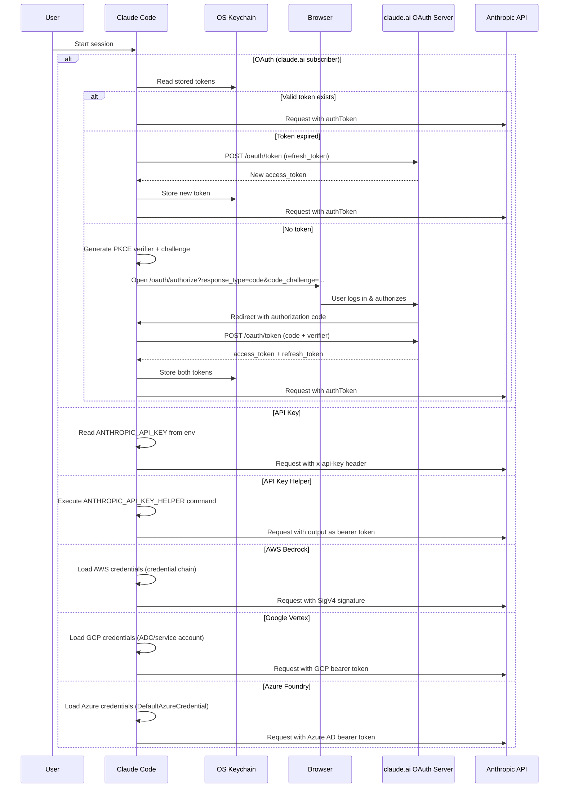

# Security Model

## 1. Authentication Flow

## 2. Authorization Model

Claude Code uses a **layered rule-based permission system** with tool-level granularity.

### Permission Modes

| Mode | Behavior | Use Case |
|------|----------|----------|
| `default` | Ask user for write operations | Normal interactive use |
| `acceptEdits` | Auto-allow file edits, ask for shell commands | Trusting code modifications |
| `plan` | Read-only — all write tools denied | Review/planning mode |
| `bypassPermissions` | Auto-allow everything | Fully trusted automation |
| `dontAsk` | Deny anything not explicitly allowed | Strict security |
| `auto` | ML classifier decides; uncertain → ask user | Automated workflows |

### Rule Precedence (highest to lowest)

1. **Policy settings** — Server-pushed enterprise rules (cannot be overridden)
2. **CLI arguments** — Per-session flags
3. **User settings** — `~/.claude/settings.json`
4. **Project settings** — `.claude/settings.json`
5. **Local settings** — `.claude/settings.local.json`
6. **Session rules** — Runtime "always allow" decisions

### Rule Format

Rules are strings matching the pattern: `ToolName` or `ToolName(pattern)`

Examples:
- `Read` — Allow the Read tool with any input
- `Bash(git *)` — Allow Bash tool when command starts with `git`
- `Edit(/src/**)` — Allow Edit tool for files under `/src/`
- `WebFetch(https://docs.*)` — Allow fetching docs URLs

### Permission Check Algorithm

1. For each rule source (highest to lowest precedence):
   a. Check deny rules — if match, return deny
   b. Check allow rules — if match, return allow
   c. Check ask rules — if match, mark as ask
2. If no rule matched, execute PreToolUse hooks
3. If hook approves/denies, use hook decision
4. If undecided, check permission mode:
   - `bypassPermissions` → allow
   - `plan` + write tool → deny
   - `acceptEdits` + edit tool → allow
   - `auto` → run classifier, then ask if uncertain
   - `default` → ask user
5. User decision can include "always allow" which saves a session or settings rule

### Denial Tracking

- Consecutive denials are tracked per tool
- After threshold (configurable), falls back to prompting user even in auto-deny modes
- Prevents infinite loops where model keeps requesting denied operations

## 3. Data Protection

### Encryption at Rest
- OAuth tokens: Encrypted by OS keychain (macOS Keychain uses AES-256)
- Session history: Stored as plaintext JSONL in `~/.claude/sessions/` (user's home directory permissions)
- Settings: Stored as plaintext JSONC (no secrets should be in settings)

### Encryption in Transit
- All API calls use HTTPS/TLS
- mTLS support for enterprise deployments (`configureGlobalMTLS()`)
- Proxy support respects `HTTPS_PROXY` for all outbound connections
- MCP stdio transport is local (no encryption needed); SSE/HTTP use HTTPS

### PII Handling
- Conversation content sent to Anthropic API for inference
- Telemetry events use `AnalyticsMetadata_I_VERIFIED_THIS_IS_NOT_CODE_OR_FILEPATHS` type to enforce no code/path leakage in analytics
- File paths in analytics are hashed or stripped
- User ID generated locally (`getOrCreateUserID()`), not linked to personal identity

### Data Retention
- Session files persist until manually deleted
- No automatic cleanup (user controls their data)
- Remote sessions (CCR) follow server-side retention policies
- Telemetry data retention per Anthropic's data policies

## 4. Input Validation & Sanitization

### Tool Input Validation
- Every tool has a Zod schema (`inputSchema`) that validates input before execution
- `validateInput()` method provides additional semantic validation
- File paths are resolved and checked against working directory scope
- Shell commands are parsed and checked against deny patterns

### Shell Command Safety

The Bash tool applies multiple safety layers:
1. **Pattern matching:** Commands checked against allow/deny patterns
2. **Command parsing:** Multi-command strings split and individually checked
3. **Sandbox enforcement:** macOS Seatbelt or Linux seccomp restricts system calls
4. **Working directory scope:** Commands cannot access files outside allowed directories
5. **Timeout:** Commands have configurable execution timeout

### File Path Validation
- Paths resolved to absolute paths
- Checked against project root and additional allowed directories
- Symlink resolution to prevent escape via symlinks
- Path traversal (`../`) resolved before checking

### Web Fetch Validation
- URLs validated for format
- Pre-approved URL patterns bypass permission prompt
- Content size limits enforced
- HTML content converted to readable text (sanitized)

### MCP Input Validation
- MCP tool inputs validated against server-provided JSON Schema
- Server responses validated for expected structure
- Error responses (-32042 elicitation) handled specially

## 5. Known Attack Surfaces

### Prompt Injection via Tool Results
- **Risk:** Malicious content in files, web pages, or MCP server responses could contain prompt injection attempts
- **Defense:** System prompt includes warnings about prompt injection; tool results are clearly delimited; user is notified of suspicious content

### Shell Command Injection
- **Risk:** Model-generated shell commands could be dangerous
- **Defense:** Permission system requires user approval for shell commands; sandbox restricts operations; deny patterns block known-dangerous commands

### Path Traversal
- **Risk:** File operations targeting paths outside project scope
- **Defense:** Path resolution and scope checking; additional directory allow-listing required

### MCP Server Trust
- **Risk:** Malicious MCP servers could return harmful tool results or attempt prompt injection
- **Defense:** User must approve MCP server connections; server tools go through permission system; server approval tracked in settings

### OAuth Token Theft
- **Risk:** Access tokens could be stolen from keychain or memory
- **Defense:** OS keychain encryption; tokens are short-lived (access token) with refresh; refresh tokens stored securely

### Settings File Manipulation
- **Risk:** Malicious `.claude/settings.json` in a cloned repository could grant dangerous permissions
- **Defense:** Trust dialog on first run in new project; project settings are lower precedence than user settings; policy settings override all

### Sandbox Escape
- **Risk:** Shell commands could bypass sandbox restrictions
- **Defense:** Seatbelt/seccomp profiles crafted for development use; sandbox cannot be disabled by the model; user must explicitly opt out

### Denial-of-Service via Tool Loops
- **Risk:** Model could enter infinite tool use loops consuming API quota
- **Defense:** Max turns limit; token budget system; cost tracking with alerts; user can interrupt with Escape

### Supply Chain via Plugins
- **Risk:** Malicious plugins could execute arbitrary code
- **Defense:** Plugin validation; DXT signature verification; plugin hooks go through permission system; user must explicitly install plugins
