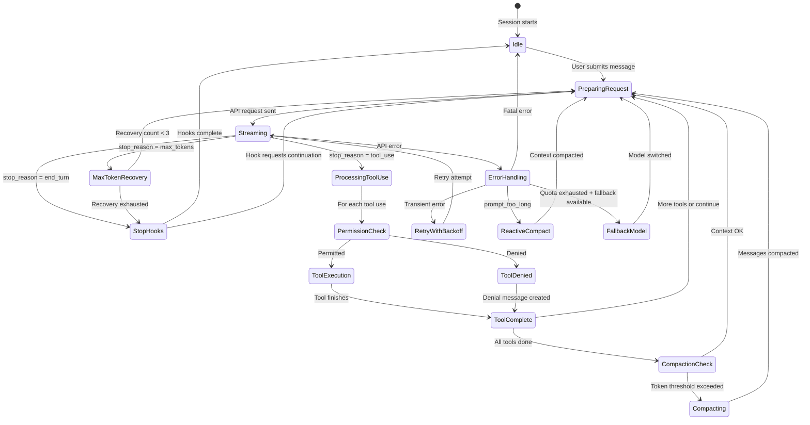
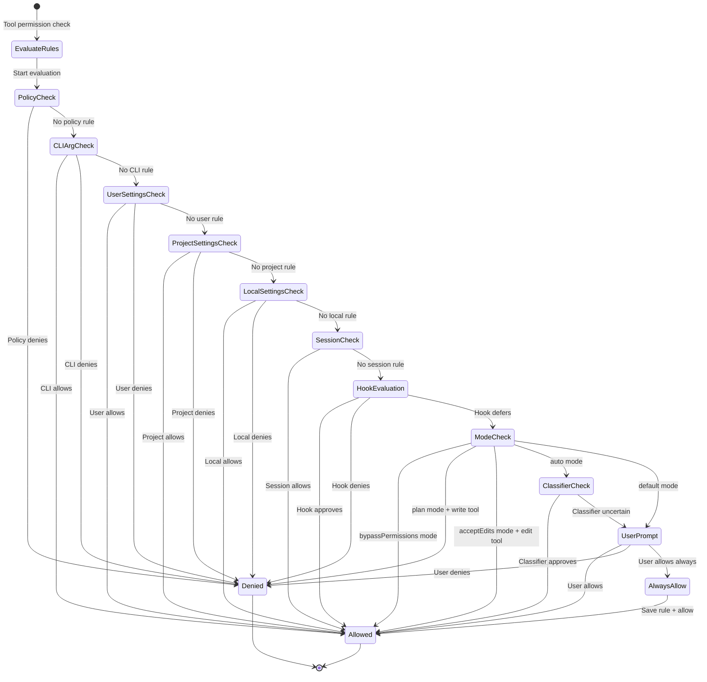
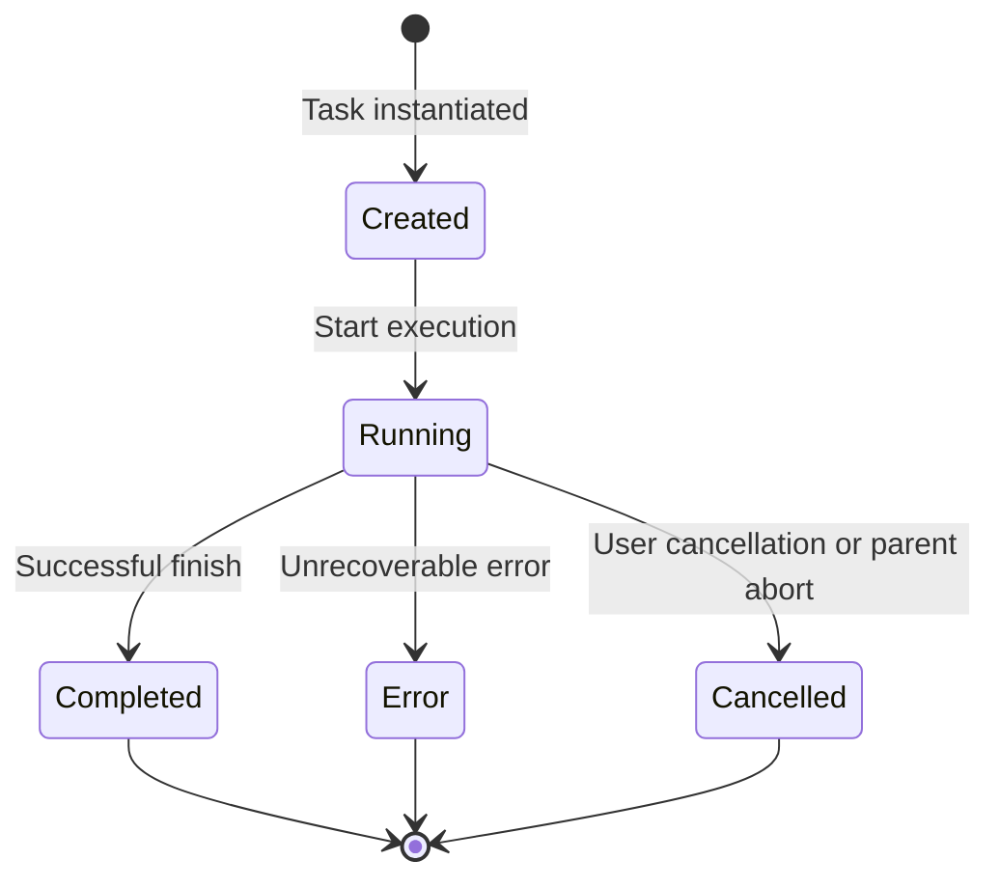
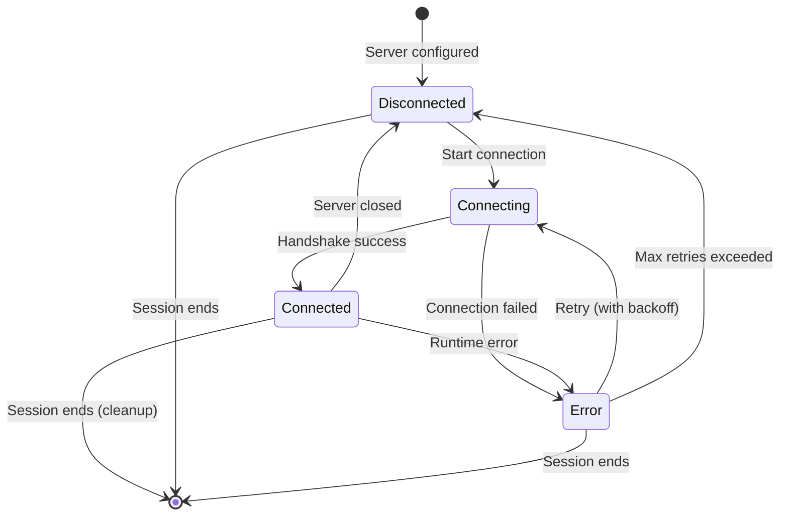
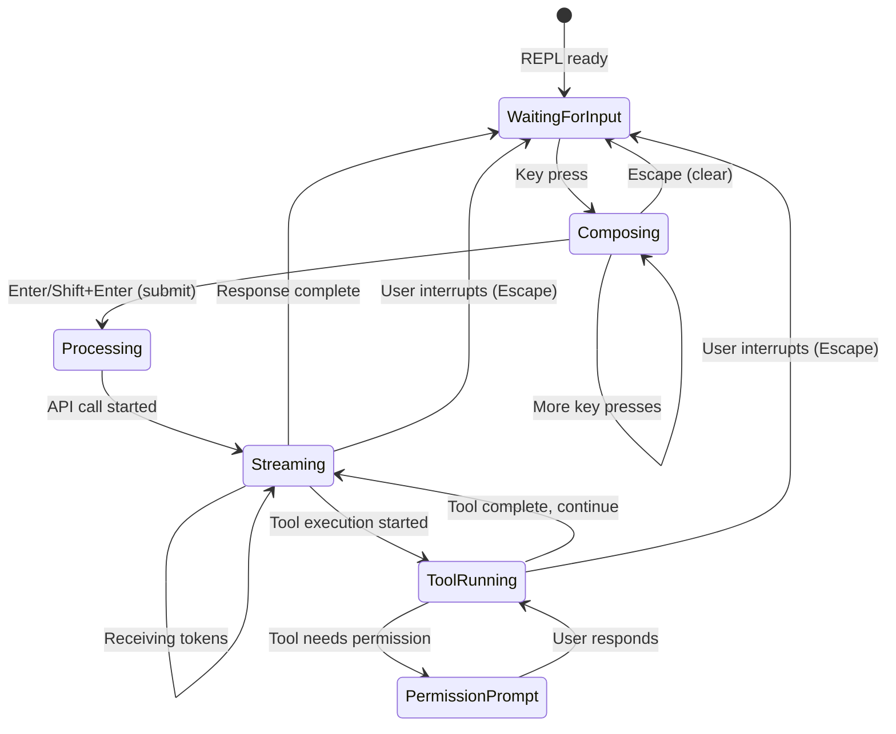
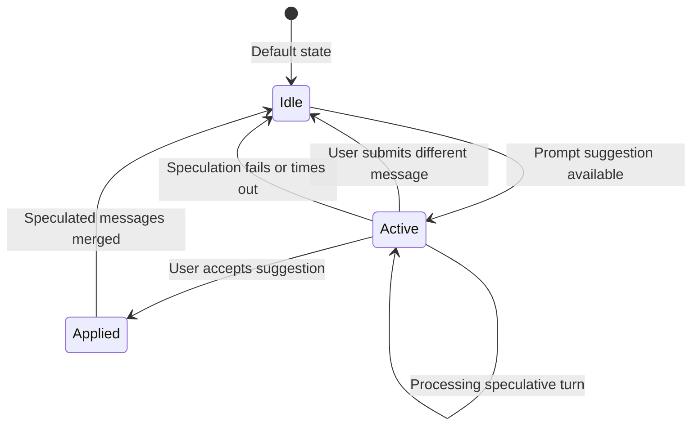
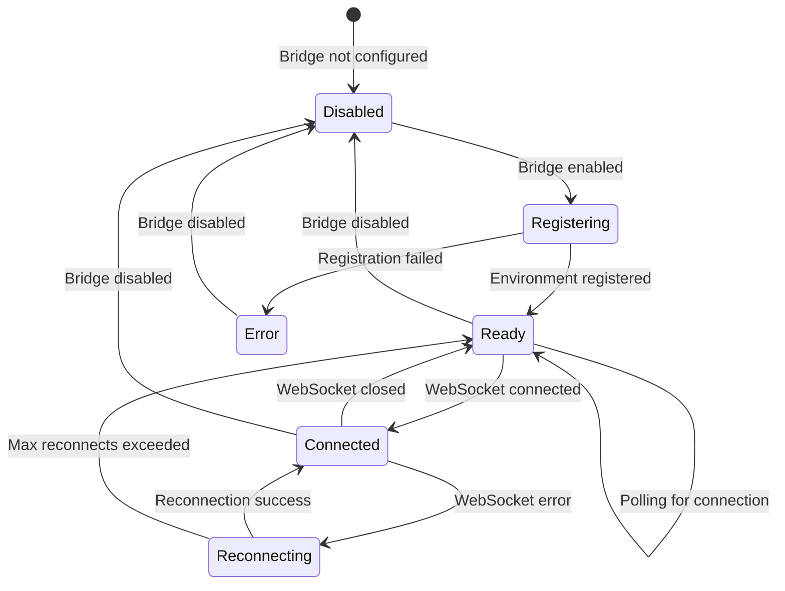
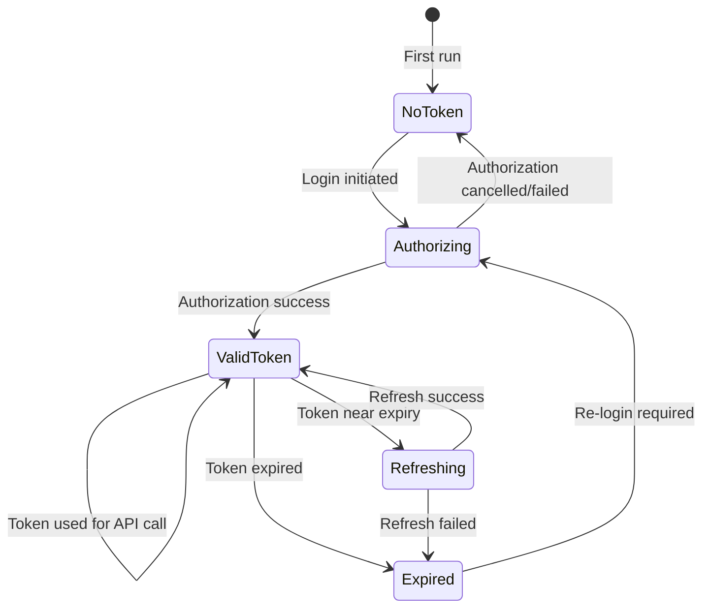

# State Machines

## 1. Query Loop State Machine

The core conversation loop transitions between states based on API responses and tool execution.

### Transition Table

| From State | Event | Guard | To State | Side Effects |
|-----------|-------|-------|----------|-------------|
| Idle | User submits message | — | PreparingRequest | Inject attachments, memories |
| PreparingRequest | — | — | Streaming | Normalize messages, send API request |
| Streaming | stop_reason=tool_use | — | ProcessingToolUse | Collect tool use blocks |
| Streaming | stop_reason=end_turn | — | StopHooks | — |
| Streaming | stop_reason=max_tokens | recovery < 3 | MaxTokenRecovery | Increment recovery counter |
| Streaming | API error (transient) | retries remaining | RetryWithBackoff | Log error, increment retry |
| Streaming | API error (prompt_too_long) | — | ReactiveCompact | — |
| ProcessingToolUse | Permission check | allowed | ToolExecution | — |
| ProcessingToolUse | Permission check | denied | ToolDenied | Create denial tool_result |
| ToolComplete | All tools done | tokens OK | PreparingRequest | Assemble tool results |
| ToolComplete | All tools done | tokens high | Compacting | — |
| Compacting | Summary complete | — | PreparingRequest | Replace messages with summary |
| StopHooks | Hooks complete | no continuation | Idle | Yield terminal event |
| MaxTokenRecovery | recovery < 3 | — | PreparingRequest | Increase max_tokens |
| MaxTokenRecovery | recovery >= 3 | — | StopHooks | — |
| ErrorHandling | Transient error | retries left | RetryWithBackoff | Exponential backoff |
| ErrorHandling | Quota error | fallback model set | FallbackModel | Switch model |
| ErrorHandling | Fatal error | — | Idle | Yield error message |

## 2. Permission Decision State Machine

## 3. Task Lifecycle State Machine

### Task Types and Their States

| Task Type | Created By | Special States | Notes |
|-----------|-----------|----------------|-------|
| LocalMainSessionTask | REPL | — | Root task, lives for session duration |
| LocalAgentTask | Agent tool | Inherits parent's permission context | Can spawn child agents |
| LocalShellTask | Bash tool | Has guard conditions | Sandboxed execution |
| RemoteAgentTask | Remote bridge | Has connection states | WebSocket-dependent |
| InProcessTeammateTask | Team feature | Shared AppState | Parallel to main task |
| DreamTask | Auto-dream / /dream | Background mode | Low-priority context processing |

## 4. MCP Server Connection State Machine

### Transition Table

| From | Event | To | Side Effects |
|------|-------|----|-------------|
| Disconnected | Config available | Connecting | Spawn process (stdio) or open connection (SSE/HTTP) |
| Connecting | JSON-RPC initialize success | Connected | Register tools and resources |
| Connecting | Timeout or error | Error | Log error |
| Connected | Process exit | Disconnected | Remove tools from registry |
| Connected | JSON-RPC error | Error | Log error, remove tools |
| Error | Auto-retry | Connecting | Backoff delay |
| Error | Max retries | Disconnected | Warn user |

## 5. REPL Input State Machine

## 6. Speculation State Machine

## 7. Bridge Connection State Machine

## 8. OAuth Token State Machine

