# Error Handling & Resilience Patterns

> How Claude Code survives API failures, context overflows, tool crashes, network outages, and user cancellations without losing work. Every diagram is a Mermaid diagram you can render in any Markdown viewer.

---

## Table of Contents

1. [Resilience Architecture Overview](#1-resilience-architecture-overview)
2. [API Retry & Fallback](#2-api-retry--fallback)
3. [Context Overflow Recovery](#3-context-overflow-recovery)
4. [Max Output Token Recovery](#4-max-output-token-recovery)
5. [Tool Execution Error Handling](#5-tool-execution-error-handling)
6. [MCP Server Failure Handling](#6-mcp-server-failure-handling)
7. [Rate Limiting & Backoff](#7-rate-limiting--backoff)
8. [Cancellation & Abort Propagation](#8-cancellation--abort-propagation)
9. [Session Crash Recovery](#9-session-crash-recovery)
10. [Graceful Degradation](#10-graceful-degradation)
11. [Error Boundary Architecture](#11-error-boundary-architecture)

---

## 1. Resilience Architecture Overview

Claude Code's error handling follows the principle: **every error is an opportunity for recovery, not a reason to crash**.

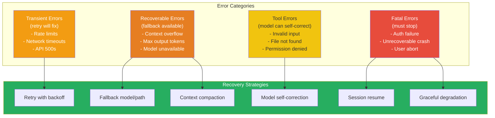

---

## 2. API Retry & Fallback

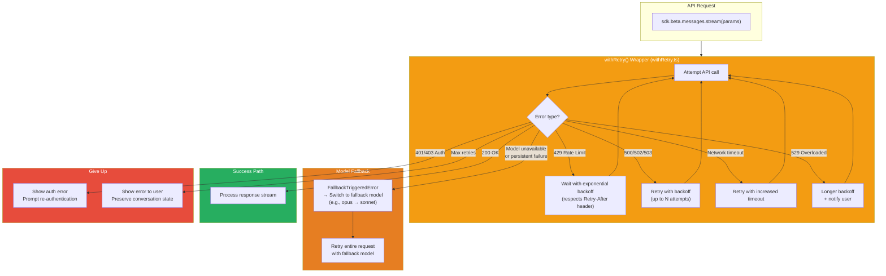

### Design Insight: FallbackTriggeredError Pattern

The `FallbackTriggeredError` is a custom error type that signals the query loop to switch models:

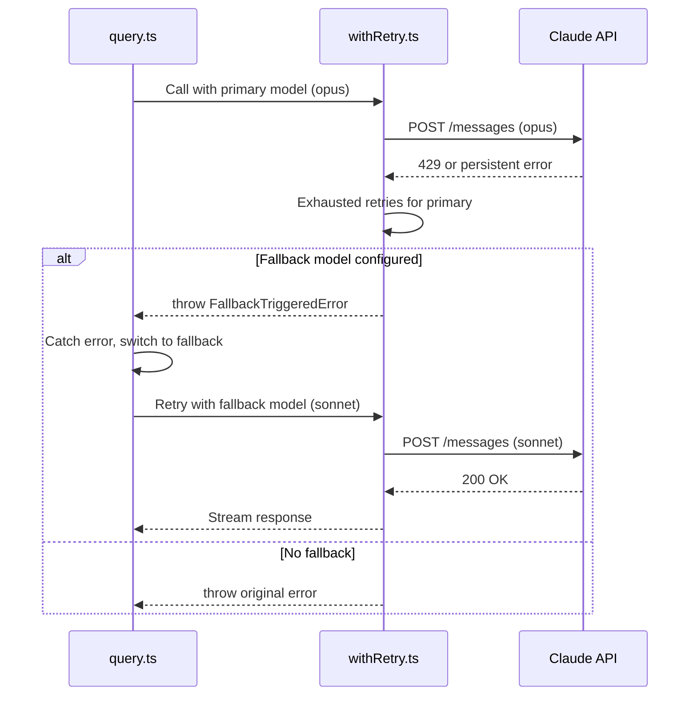

**Why a custom error type?** The retry layer doesn't know about model fallback — that's the query loop's concern. By throwing a specific error type, the separation of concerns is maintained: `withRetry` handles transient failures, `query()` handles strategic model switching.

---

## 3. Context Overflow Recovery

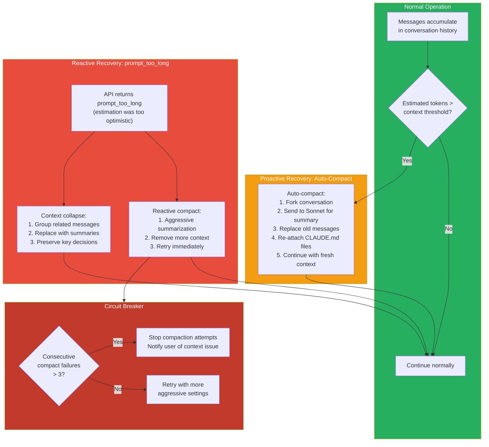

### Compaction Error Recovery Chain

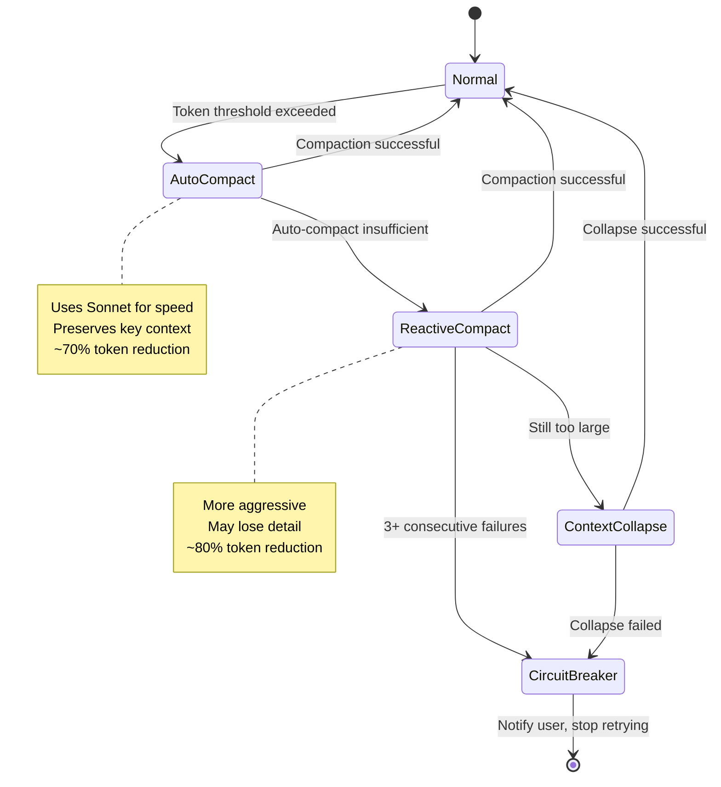

### Design Insight: Why a Circuit Breaker?

Without a circuit breaker, a pathological conversation could enter an infinite loop:
1. Compact → still too long → compact → still too long → ...

The `MAX_CONSECUTIVE_AUTOCOMPACT_FAILURES = 3` constant prevents this runaway. After 3 failures, the system stops trying and surfaces the issue to the user, who can manually clear context or start a new session.

---

## 4. Max Output Token Recovery

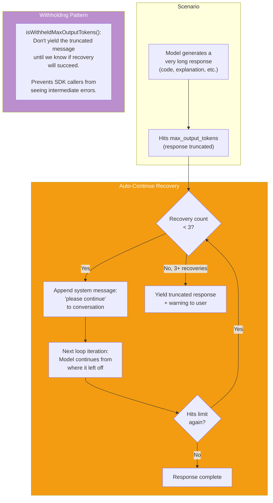

### Design Insight: The Withholding Pattern

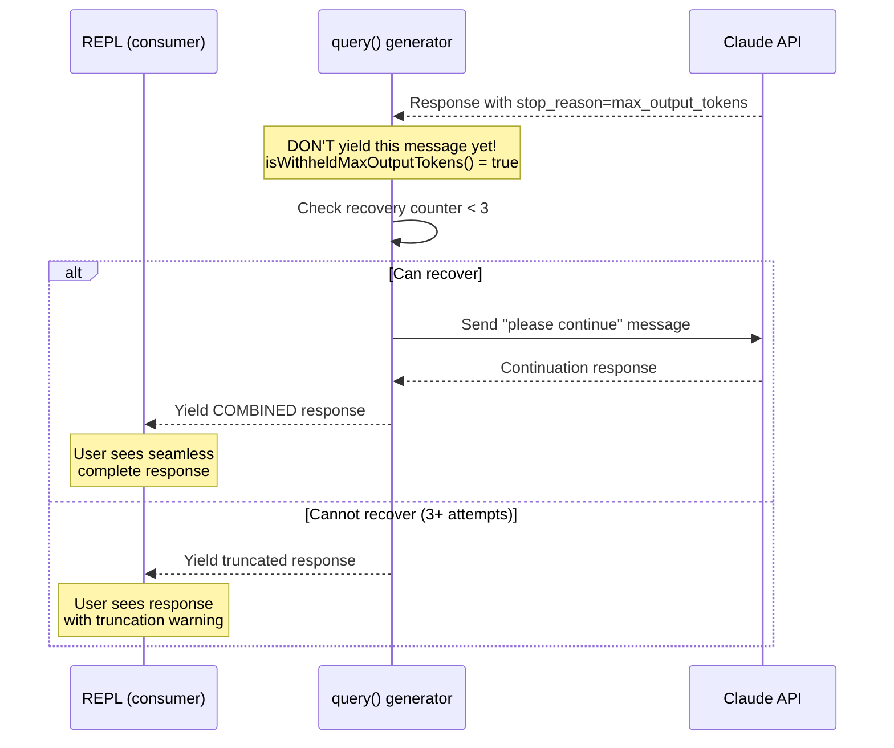

**Why withhold?** If Claude Code yields the truncated message immediately, SDK consumers (like the VS Code extension or desktop app) might treat it as a final response and close the session. By withholding until recovery is attempted, the generator protocol remains clean: yielded messages are final.

---

## 5. Tool Execution Error Handling

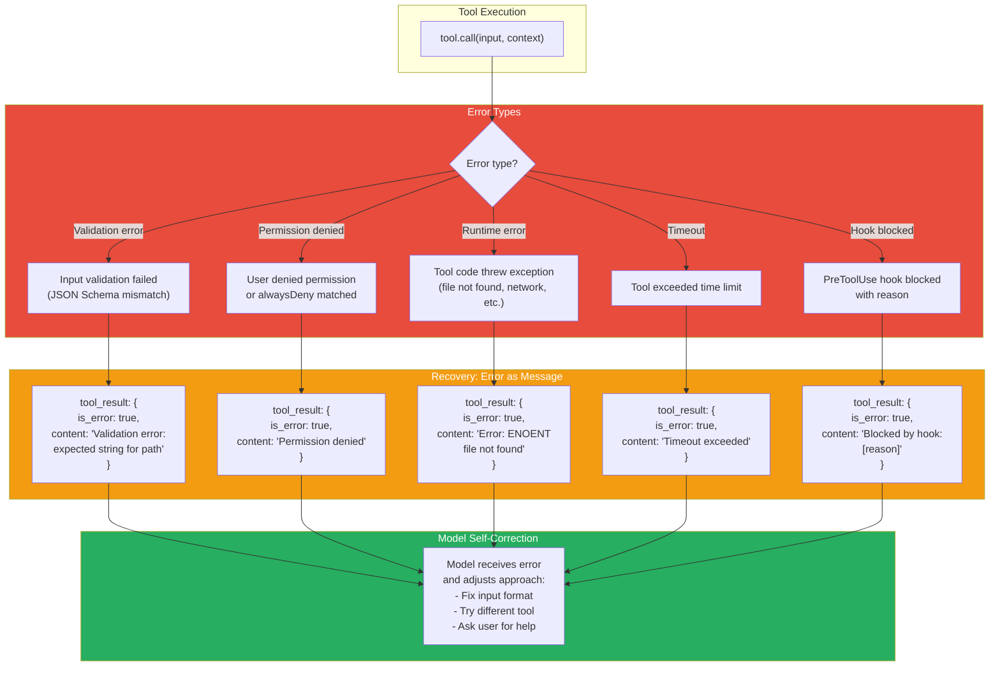

### Design Insight: Errors as Messages, Not Exceptions

Every tool error becomes a `tool_result` with `is_error: true` rather than throwing an exception. This is a critical design choice:

| Approach | What Happens |
|---|---|
| **Throw exception** | Query loop catches it, conversation breaks, user must restart |
| **Return error message** | Model sees the error, understands what went wrong, tries a different approach |

Example: Model tries `Read("/nonexistent/file.ts")` → gets error "file not found" → tries `Glob("**/file.ts")` to find the right path → succeeds. The model's ability to self-correct depends on receiving errors as conversational feedback.

### Missing Tool Result Recovery

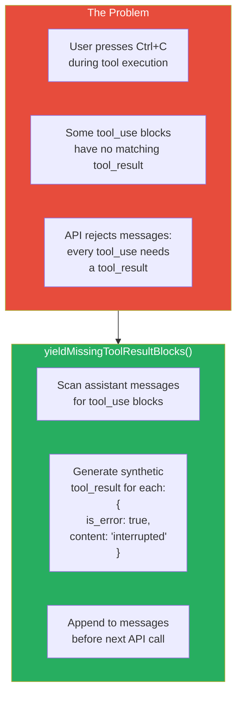

---

## 6. MCP Server Failure Handling

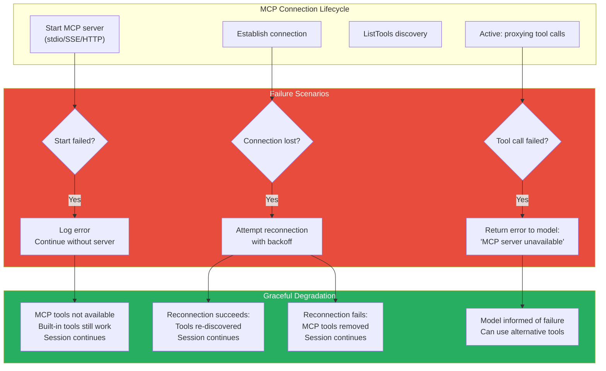

### Design Insight: MCP Failures Never Crash the Session

MCP servers are external processes that can fail independently. Claude Code treats them as **optional enhancements**:
- If a server fails to start → session continues without its tools
- If a connection drops → attempt reconnection, degrade gracefully
- If a tool call fails → model gets an error message and adapts

This is critical because a user might have 5 MCP servers configured, and one flaky server shouldn't prevent them from using Claude Code.

---

## 7. Rate Limiting & Backoff

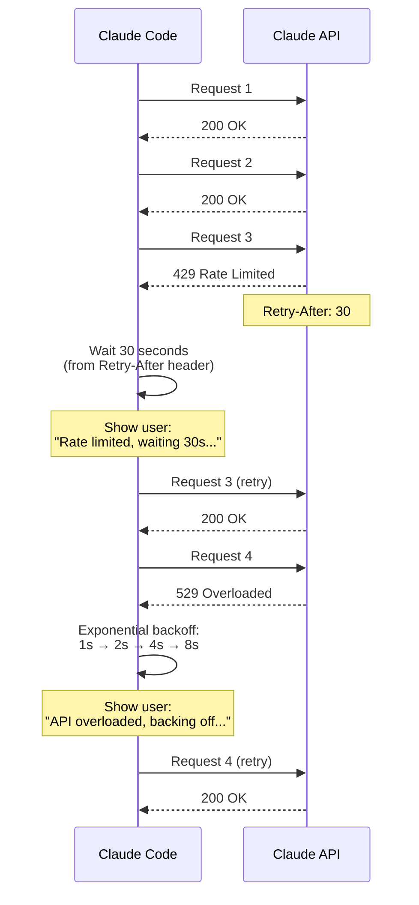

### Design Insight: Why Respect Retry-After?

Some retry libraries use fixed exponential backoff. Claude Code respects the `Retry-After` header because:
1. The server knows its own capacity better than the client
2. Ignoring it risks being blocked entirely
3. The header often indicates when capacity will be available (more accurate than exponential guessing)

---

## 8. Cancellation & Abort Propagation

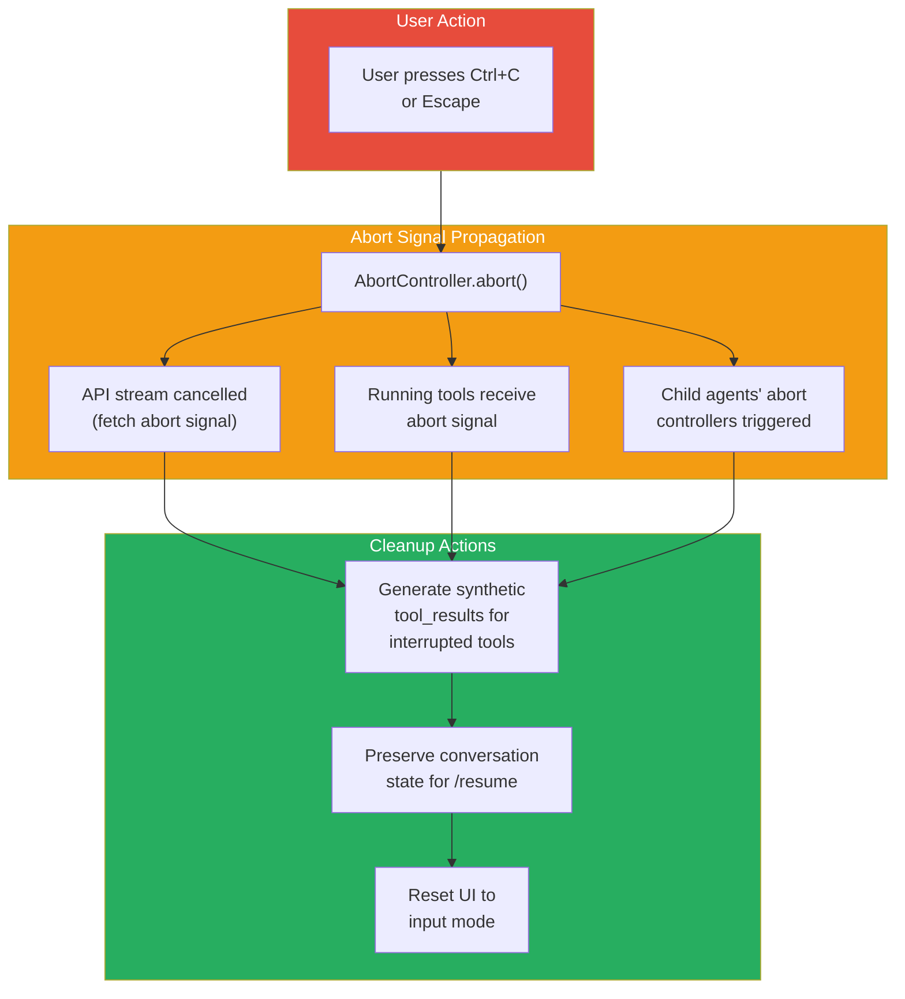

### Linked Abort Controllers for Agents

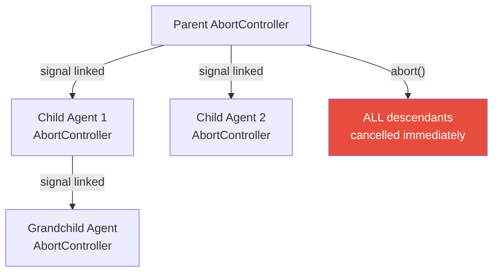

---

## 9. Session Crash Recovery

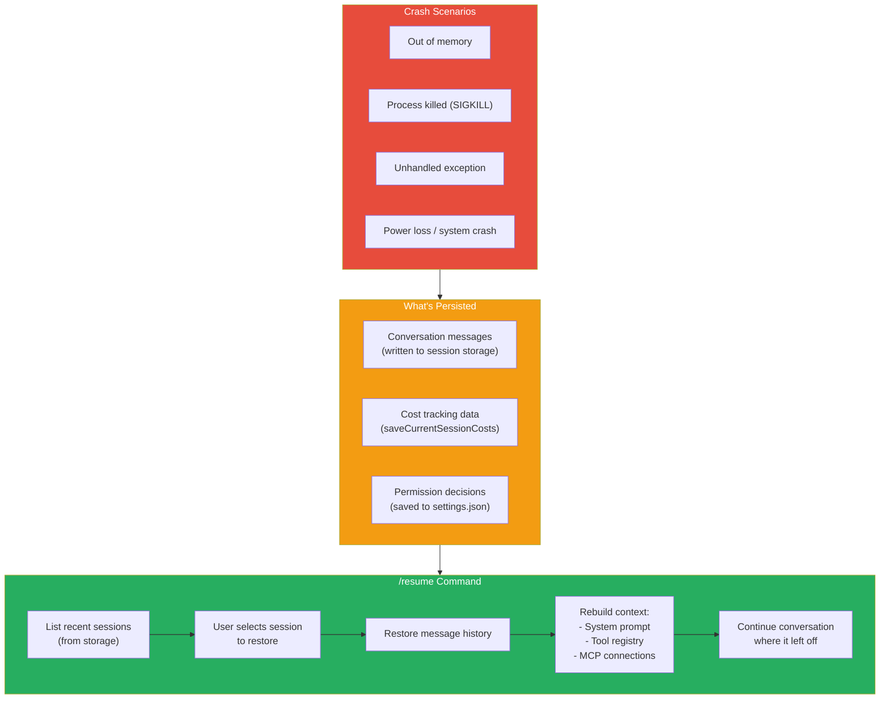

### Design Insight: Why Session Persistence Over Checkpointing?

| Approach | Pros | Cons |
|---|---|---|
| **Checkpointing** (save full state) | Perfect restoration | Huge storage (AppState is complex), stale tool connections |
| **Message persistence** (chosen) | Lightweight, JSON-serializable | Must rebuild context on resume |

Claude Code chose message persistence because:
1. Messages are already JSON (discriminated unions, plain objects)
2. Context (system prompt, tools, MCP) must be fresh anyway (MCP servers may have restarted)
3. The model can re-establish understanding from conversation history

---

## 10. Graceful Degradation

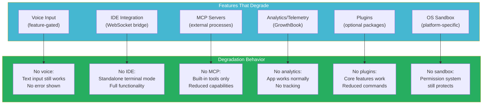

### Design Insight: Feature Flags Enable Graceful Degradation

The `feature()` pattern from `bun:bundle` isn't just for build optimization — it's also a degradation mechanism:

```typescript
// If VOICE_MODE is disabled, this entire code path doesn't exist
if (feature('VOICE_MODE')) {
  const voice = require('./voice.js')
  // ... voice setup
}
// App works fine without it
```

Features behind flags can be disabled without affecting the rest of the system. This means:
- **Internal builds** can experiment with unstable features
- **OSS builds** ship only proven, stable features
- **Enterprise deployments** can disable features that violate policy

---

## 11. Error Boundary Architecture

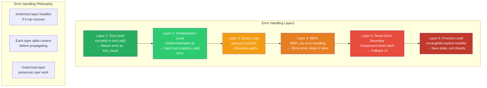

### The Error Recovery Decision Tree

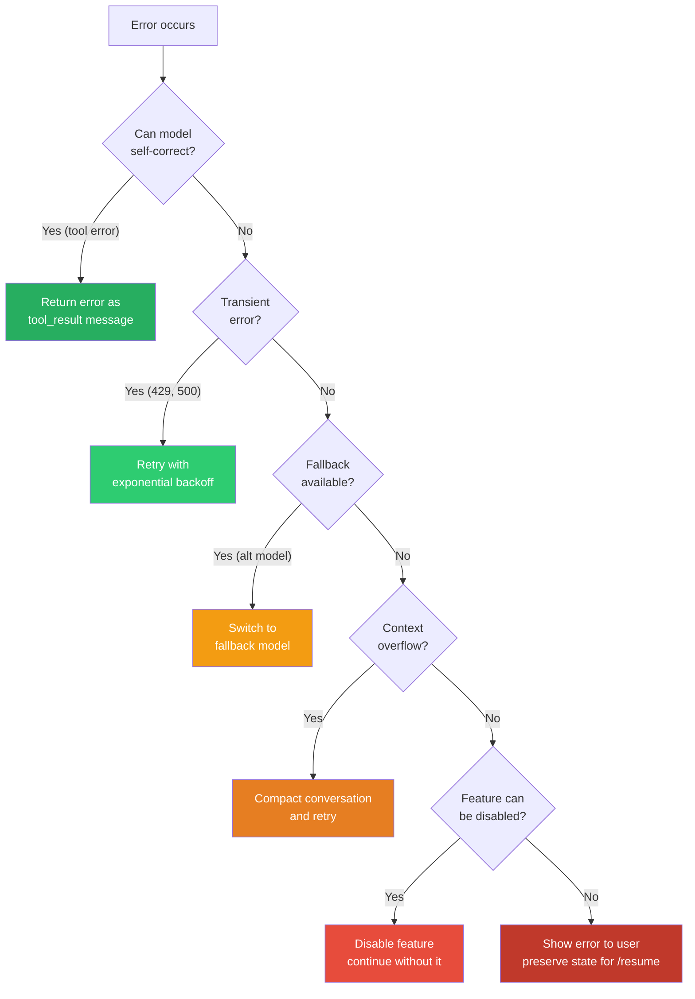

### The Resilience Philosophy

Claude Code's error handling follows three principles:

1. **Errors are data, not crashes** — Every tool error becomes a message the model can learn from. The AI gets better at its task by seeing what doesn't work.

2. **Progressive escalation** — Try the cheapest recovery first (retry), then more expensive ones (model fallback, compaction), and only stop when all options are exhausted.

3. **Never lose user work** — Even a fatal crash preserves the conversation via session storage. The `/resume` command can restore any session, including ones that ended in errors.
