# Extension Ecosystem

> How plugins, hooks, skills, MCP servers, agents, and commands form a unified extensibility architecture. Every diagram is a Mermaid diagram you can render in any Markdown viewer.

---

## Table of Contents

1. [Ecosystem Overview](#1-ecosystem-overview)
2. [Plugin Architecture](#2-plugin-architecture)
3. [Hook System](#3-hook-system)
4. [Skill System](#4-skill-system)
5. [Custom Agent Definitions](#5-custom-agent-definitions)
6. [MCP Integration](#6-mcp-integration)
7. [Slash Commands](#7-slash-commands)
8. [Tool Registry & Merging](#8-tool-registry--merging)
9. [Cross-Cutting Interactions](#9-cross-cutting-interactions)
10. [Extension Point Comparison](#10-extension-point-comparison)

---

## 1. Ecosystem Overview

Claude Code has **six extension points** that work together as a unified ecosystem. Each point serves a different purpose but shares the same registration and permission infrastructure.

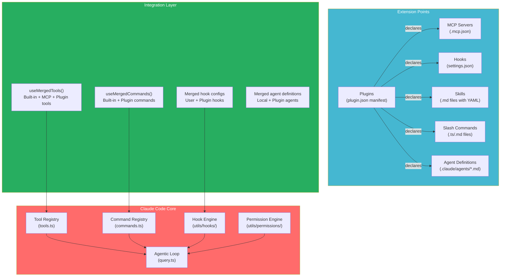

### Design Insight: Why Six Extension Points Instead of One?

Each extension point has a fundamentally different execution model:

| Extension | Execution Model | Invoked By | Runs When |
|---|---|---|---|
| **Tools** | AI calls via `tool_use` block | Claude model | During agentic loop |
| **Hooks** | System triggers on events | Hook engine | Before/after tool use, stop, etc. |
| **Skills** | Prompt expansion | User slash command or pattern match | Before query starts |
| **Agents** | Spawn new query loop | AgentTool | When model needs delegation |
| **MCP** | JSON-RPC to external process | MCPTool proxy | When model calls MCP tool |
| **Commands** | Direct execution | User slash command | Immediate, outside loop |

A single "plugin" abstraction would force these different models into one interface, losing the clarity of when and how each runs.

---

## 2. Plugin Architecture

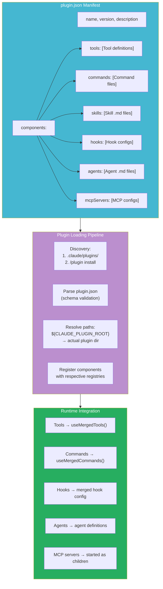

### Plugin Lifecycle

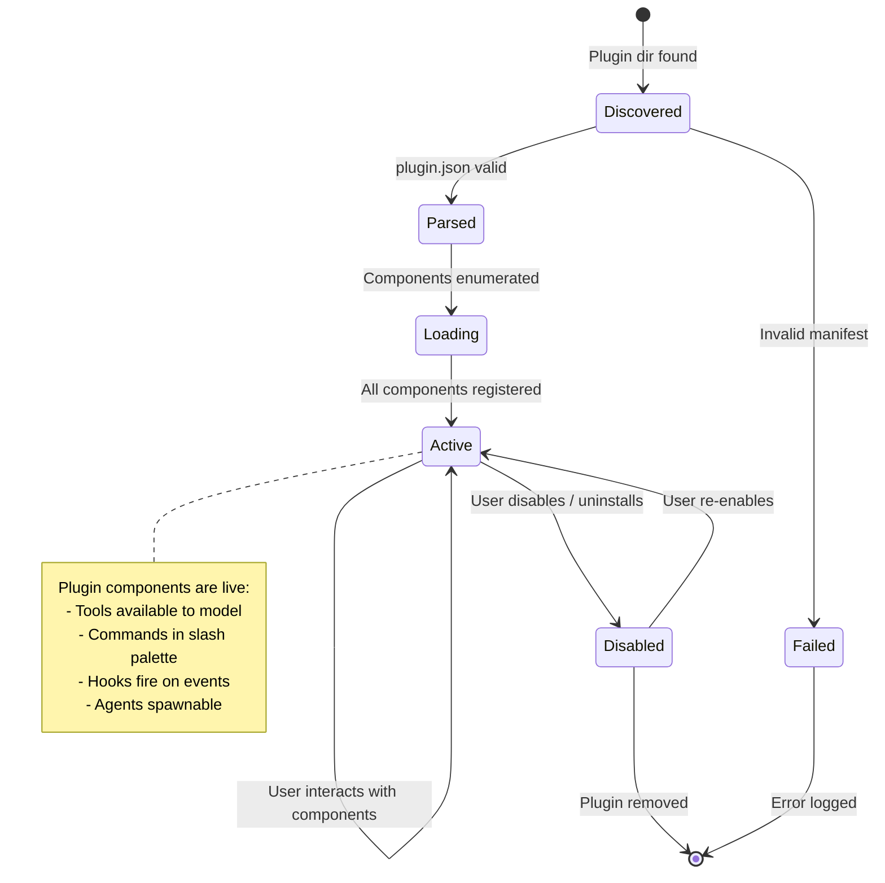

### Design Insight: ${CLAUDE_PLUGIN_ROOT} Scoping

Plugins reference their own files using `${CLAUDE_PLUGIN_ROOT}`:

```json
{
  "commands": [
    {"source": "${CLAUDE_PLUGIN_ROOT}/commands/deploy.md"}
  ]
}
```

This pattern provides:
1. **Portability** — Plugin works regardless of where it's installed
2. **Security** — File references are scoped to the plugin directory (can't reference `/etc/passwd`)
3. **Isolation** — Multiple plugins can have identically-named files without collision

---

## 3. Hook System

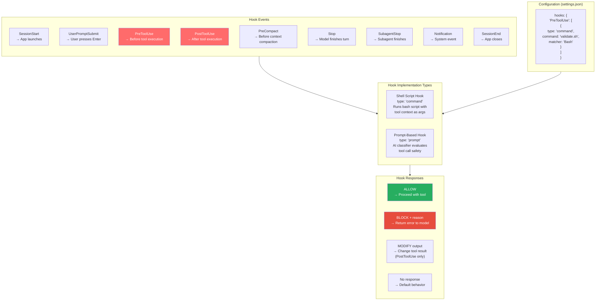

### Hook Execution Flow (PreToolUse)

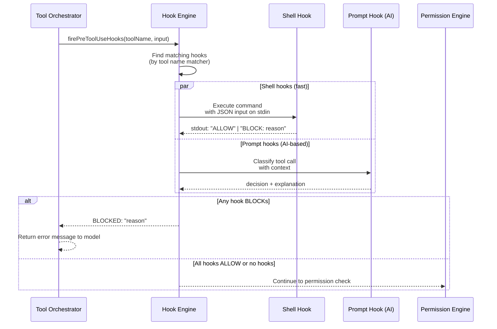

### Design Insight: Why Both Shell and Prompt Hooks?

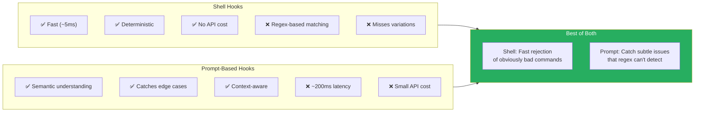

---

## 4. Skill System

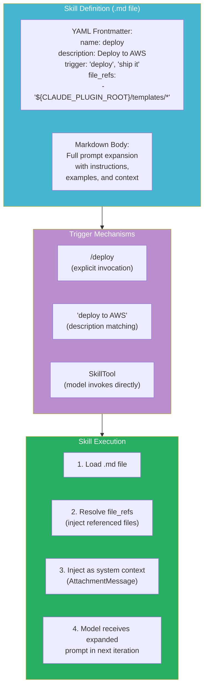

### Design Insight: Skills are Prompt Engineering, Not Code

Skills are intentionally **markdown files**, not code:

1. **No execution risk** — A skill can't run arbitrary code; it only expands to text that the model receives
2. **Easy to write** — Anyone who can write a prompt can create a skill
3. **Progressive disclosure** — Skills can include `file_refs` that inject code/templates as context, giving the model exactly what it needs
4. **Composable** — A skill can reference other skills, creating a hierarchy of expertise

This is fundamentally different from tools (which execute code) and hooks (which run scripts). Skills are pure knowledge injection.

---

## 5. Custom Agent Definitions

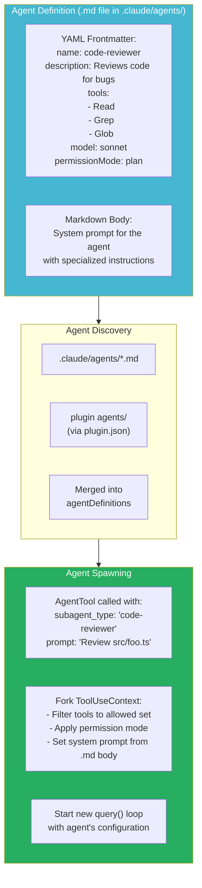

### Built-in vs Custom Agent Types

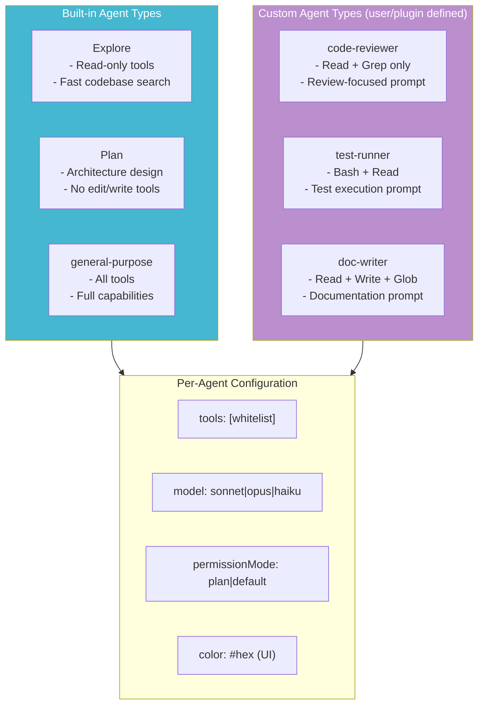

### Design Insight: Why Markdown-Based Agent Definitions?

The `.claude/agents/*.md` pattern means:
1. **Version controlled** — Agent definitions live in the repo alongside code
2. **Shareable** — Team members get the same agent configurations via git
3. **Declarative** — No code to maintain; just YAML config + prompt text
4. **Safe** — The frontmatter constrains what tools/mode the agent gets; it can't grant itself more power than declared

---

## 6. MCP Integration

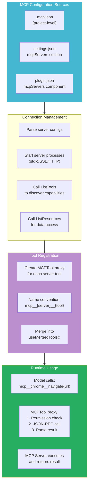

### Deferred Tool Loading (ToolSearch)

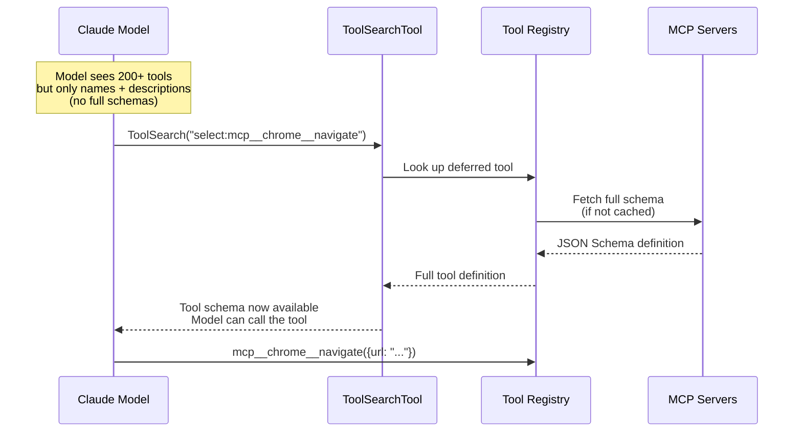

### Design Insight: Why Deferred Tool Loading?

With 200+ tools (40+ built-in + MCP + plugins), sending all tool schemas in every API request would:
- Consume ~20K tokens of context window
- Slow down API calls (larger request body)
- Confuse the model with irrelevant tools

Deferred loading means the model sees tool **names and descriptions** (compact) but must explicitly load the full schema before calling a tool. This keeps the prompt lean while preserving access to the full ecosystem.

---

## 7. Slash Commands

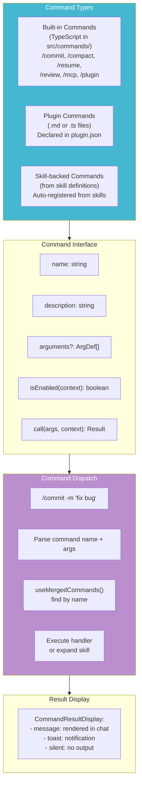

---

## 8. Tool Registry & Merging

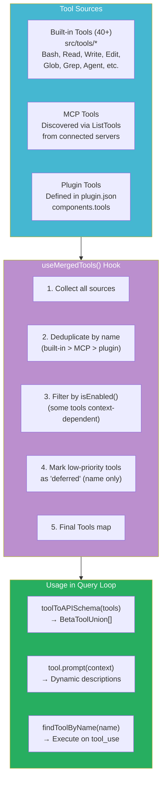

### Design Insight: Why Built-in > MCP > Plugin Priority?

If multiple sources define a tool with the same name:
1. **Built-in wins** — Core tools are security-audited and performance-optimized
2. **MCP second** — External servers provide specialized capabilities
3. **Plugin last** — User-installed plugins are the most flexible but least controlled

This prevents a malicious MCP server from overriding the `Read` tool with a data-exfiltrating version.

---

## 9. Cross-Cutting Interactions

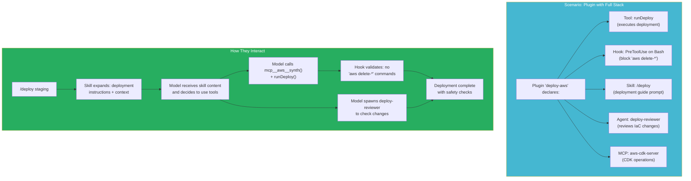

### The Extension Composition Pattern

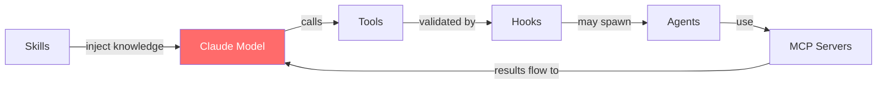

Extensions compose **around the model**, not around each other:
- Skills give the model knowledge
- The model uses tools based on that knowledge
- Hooks validate the model's tool usage
- Agents let the model delegate complex sub-tasks
- MCP provides access to external systems

---

## 10. Extension Point Comparison

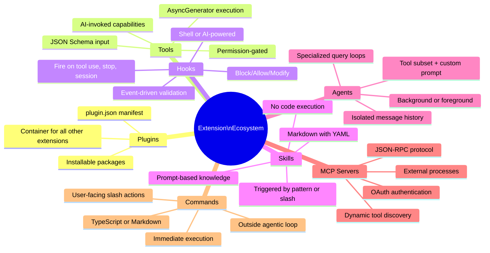

| Feature | Tools | Hooks | Skills | Agents | MCP | Commands |
|---|---|---|---|---|---|---|
| **Invoked by** | AI model | System events | User or AI | AI model | AI (via proxy) | User only |
| **Runs code** | Yes | Yes | No (prompt only) | Yes (query loop) | Yes (external) | Yes |
| **Has permissions** | Yes | N/A (IS the validator) | No | Inherited | Yes (via proxy) | No |
| **Can be blocked** | By hooks/perms | No | No | By parent perms | By hooks/perms | No |
| **Defined in** | TypeScript | JSON config | Markdown | Markdown | JSON config | TS or MD |
| **Scope** | Per-tool call | Per-event | Per-conversation | Per-task | Per-session | Per-invocation |
