# Multi-Agent Orchestration & Communication

> How Claude Code spawns, manages, communicates with, and orchestrates multiple AI agents working in parallel — from simple subagents to full team swarms. Every diagram is a Mermaid diagram you can render in any Markdown viewer.

---

## Table of Contents

1. [Why Multi-Agent Architecture](#1-why-multi-agent-architecture)
2. [The Agent Hierarchy](#2-the-agent-hierarchy)
3. [Subagent Spawning & Lifecycle](#3-subagent-spawning--lifecycle)
4. [Fork Agents: Background Workers](#4-fork-agents-background-workers)
5. [Built-in Agent Types](#5-built-in-agent-types)
6. [Inter-Agent Communication](#6-inter-agent-communication)
7. [Prompt Cache Sharing](#7-prompt-cache-sharing)
8. [The Swarm/Team System](#8-the-swarmteam-system)
9. [Agent Permission Inheritance](#9-agent-permission-inheritance)
10. [Agent Context Isolation](#10-agent-context-isolation)
11. [Coordinator Mode](#11-coordinator-mode)

---

## 1. Why Multi-Agent Architecture

A single agent has a finite context window and attention budget. Multi-agent architecture solves three problems:

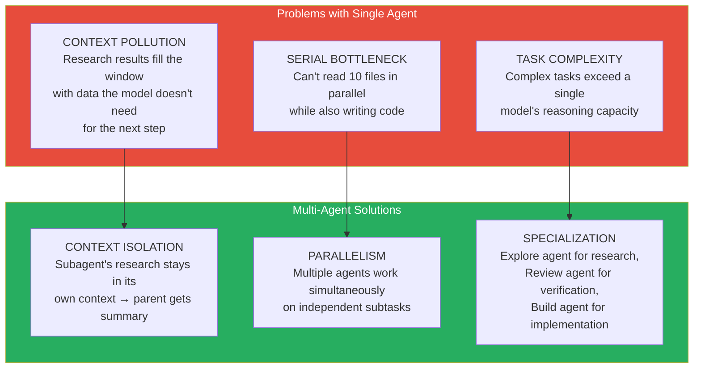

---

## 2. The Agent Hierarchy

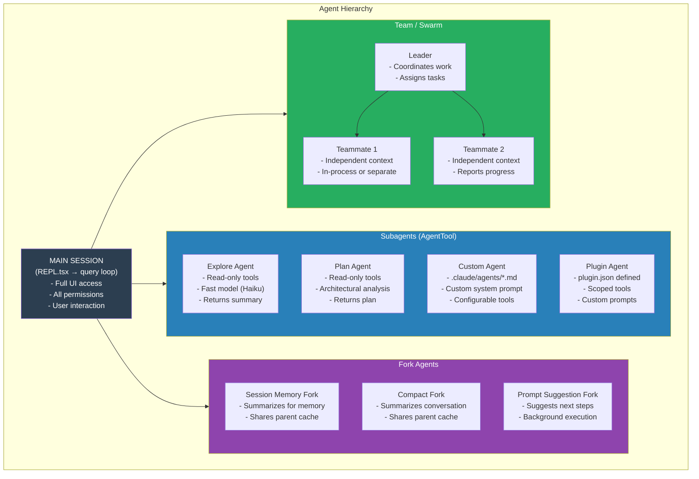

---

## 3. Subagent Spawning & Lifecycle

Subagents are spawned via the `AgentTool` and managed through the `runAgent()` function.

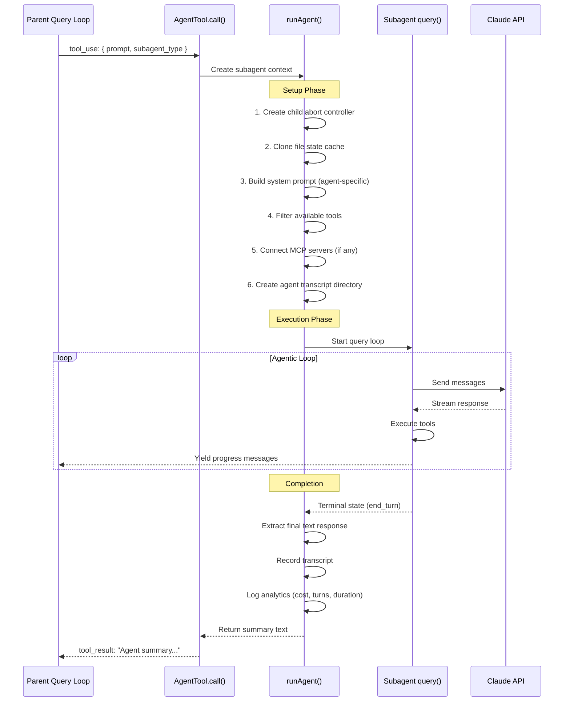

### Subagent Configuration

| Property | Source | Effect |
|---|---|---|
| `subagent_type` | LLM parameter | Selects built-in or custom agent |
| `model` | Agent definition or LLM parameter | Model for subagent (can differ from parent) |
| `prompt` | LLM parameter | Initial message to subagent |
| `tools` | Agent definition `allowedTools` | Restricts available tools |
| `isolation` | LLM parameter (`"worktree"`) | Creates git worktree for agent |
| `run_in_background` | LLM parameter | Returns immediately, notifies on completion |
| `maxTurns` | Agent definition or default | Limits agentic loop iterations |

---

## 4. Fork Agents: Background Workers

Fork agents are lightweight query loops that share the parent's prompt cache.

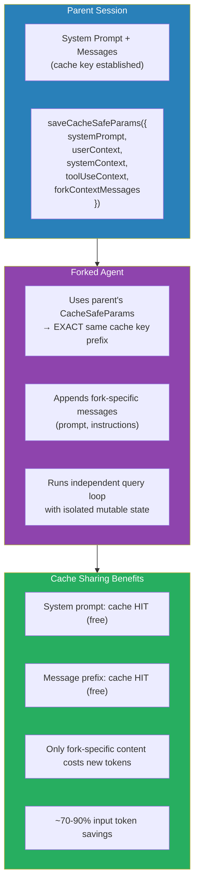

### Fork Agent Use Cases

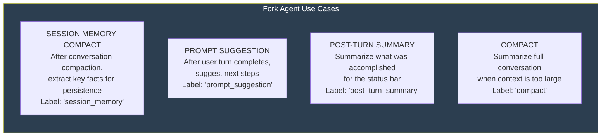

---

## 5. Built-in Agent Types

Claude Code provides specialized built-in agents optimized for common tasks.

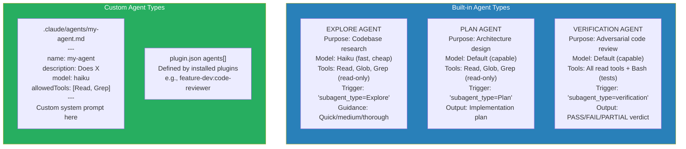

### Agent Selection Logic

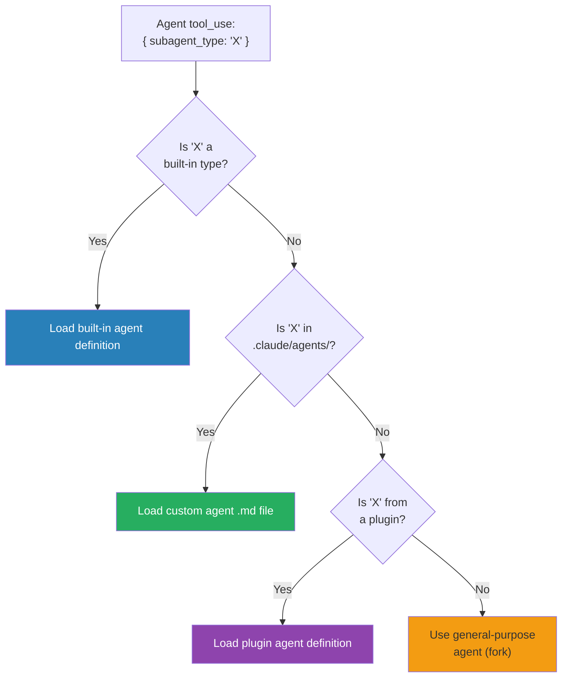

---

## 6. Inter-Agent Communication

Agents communicate through several mechanisms.

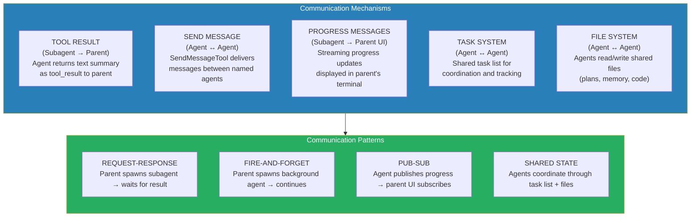

### The SendMessage Tool

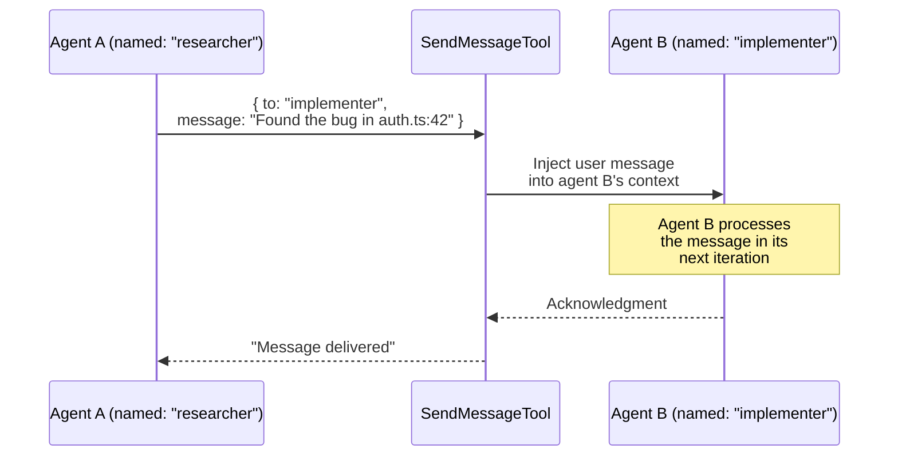

---

## 7. Prompt Cache Sharing

The most impactful optimization: subagents share the parent's prompt cache.

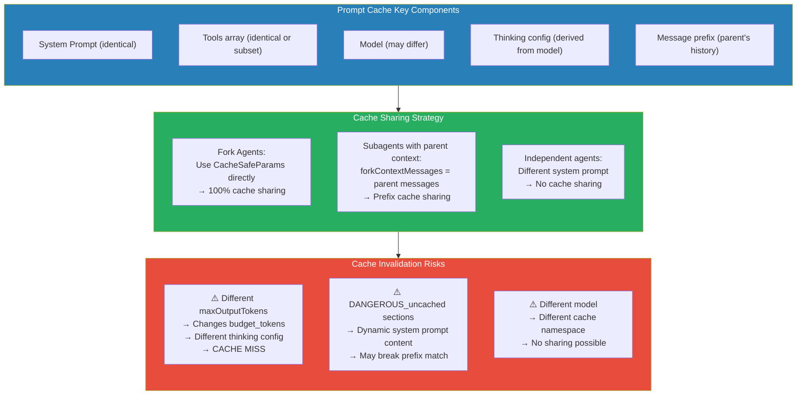

---

## 8. The Swarm/Team System

The swarm system enables multiple agents working as a coordinated team.

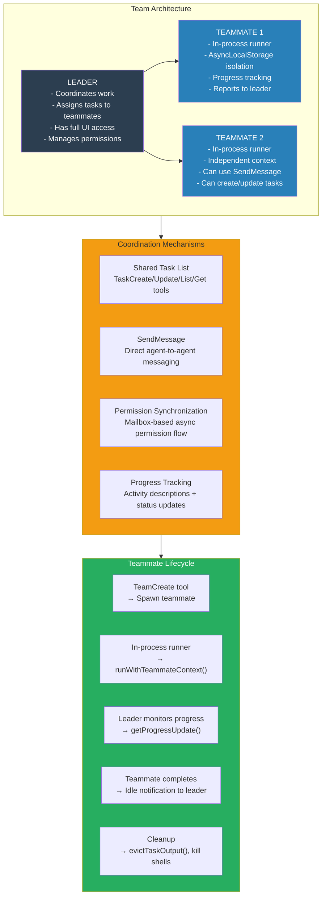

### In-Process vs Separate Process

| Aspect | In-Process Teammate | Separate Process |
|---|---|---|
| Context isolation | AsyncLocalStorage | Process boundary |
| Communication | Direct function calls | UDS messaging |
| Resource sharing | Shared memory | File-based |
| Abort propagation | Direct AbortController | Signal-based |
| UI integration | Shared Ink renderer | Separate output |

---

## 9. Agent Permission Inheritance

Subagents inherit permissions from their parent with **restriction only** — they can never have MORE permissions.

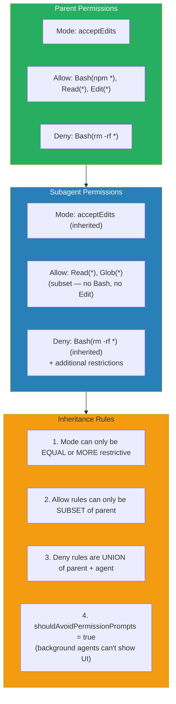

---

## 10. Agent Context Isolation

Each agent runs with isolated context to prevent interference.

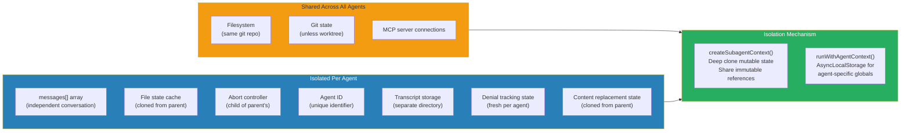

---

## 11. Coordinator Mode

Coordinator mode (feature flag: `COORDINATOR_MODE`) is a specialized multi-agent pattern where a coordinator agent manages the overall workflow.

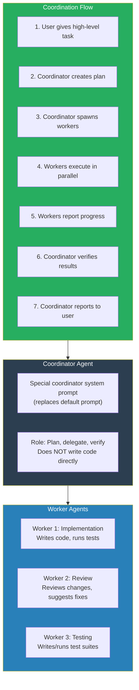

### When to Use Multi-Agent vs Single Agent

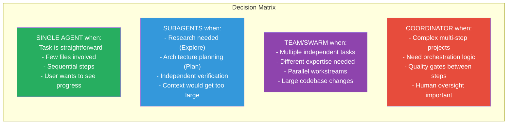
