# Performance & Optimization Strategies

> How Claude Code achieves fast startup, responsive streaming, and efficient resource usage through layered optimization techniques. Every diagram is a Mermaid diagram you can render in any Markdown viewer.

---

## Table of Contents

1. [Performance Architecture Overview](#1-performance-architecture-overview)
2. [Startup Optimization](#2-startup-optimization)
3. [API Prompt Caching](#3-api-prompt-caching)
4. [Streaming & StreamingToolExecutor](#4-streaming--streamingtoolexecutor)
5. [Concurrent Tool Execution](#5-concurrent-tool-execution)
6. [Caching Strategies](#6-caching-strategies)
7. [Lazy Loading & Dead Code Elimination](#7-lazy-loading--dead-code-elimination)
8. [Terminal Rendering Performance](#8-terminal-rendering-performance)
9. [Token Estimation & Budget Management](#9-token-estimation--budget-management)
10. [Speculation & Prefetching](#10-speculation--prefetching)

---

## 1. Performance Architecture Overview

Claude Code optimizes at every layer of the stack — from build-time code elimination to runtime streaming overlap.

```mermaid
flowchart TD
    subgraph BuildTime["Build-Time Optimizations"]
        DCE["Dead Code Elimination\n(bun:bundle feature flags)"]
        Preload["Preload Scripts\n(MACRO globals set early)"]
    end

    subgraph StartupTime["Startup Optimizations"]
        ParPrefetch["Parallel Prefetching\n(credentials, settings, features)"]
        LazyImport["Lazy Module Loading\n(feature-gated dynamic imports)"]
        FastPath["Fast Paths\n(--version exits before full init)"]
    end

    subgraph RequestTime["Per-Request Optimizations"]
        PromptCache["Prompt Caching\n(static prefix cached at API)"]
        Streaming["Token Streaming\n(200ms first token)"]
        StreamExec["StreamingToolExecutor\n(start tools before stream ends)"]
    end

    subgraph LoopTime["Per-Loop-Iteration Optimizations"]
        ToolPar["Read-Parallel Tool Execution\n(up to 10 concurrent)"]
        MicroComp["Microcompact Cache\n(reuse prior summaries)"]
        TokenEst["Token Estimation\n(avoid re-counting)"]
    end

    subgraph RenderTime["Rendering Optimizations"]
        VScroll["Virtual Scrolling\n(render only visible rows)"]
        ReactComp["React Compiler\n(automatic memoization)"]
        DeferValue["useDeferredValue\n(non-blocking updates)"]
    end

    BuildTime --> StartupTime --> RequestTime --> LoopTime --> RenderTime

    style BuildTime fill:#c0392b,color:#fff
    style StartupTime fill:#e74c3c,color:#fff
    style RequestTime fill:#f39c12,color:#fff
    style LoopTime fill:#f1c40f,color:#333
    style RenderTime fill:#27ae60,color:#fff
```

---

## 2. Startup Optimization

```mermaid
gantt
    title Claude Code Boot Timeline
    dateFormat X
    axisFormat %L ms

    section Critical Path (Blocking)
    Parse CLI args           :crit, a1, 0, 5
    Check fast paths         :crit, a2, 5, 8
    Import main.tsx          :crit, a3, 8, 50
    Commander.js setup       :crit, a4, 50, 70
    setup() call             :crit, a5, 70, 120
    React render REPL        :crit, a6, 120, 150

    section Parallel (Non-Blocking)
    MDM settings read        :b1, 8, 35
    Keychain prefetch        :b2, 8, 60
    GrowthBook init          :b3, 50, 90
    MCP server connections   :b4, 120, 250
    Plugin loading           :b5, 120, 180
    Background housekeeping  :b6, 150, 200
```

### Fast Paths

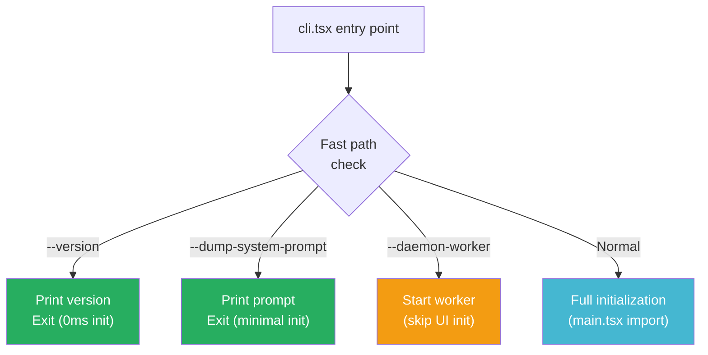

### Design Insight: Why Parallel Prefetching?

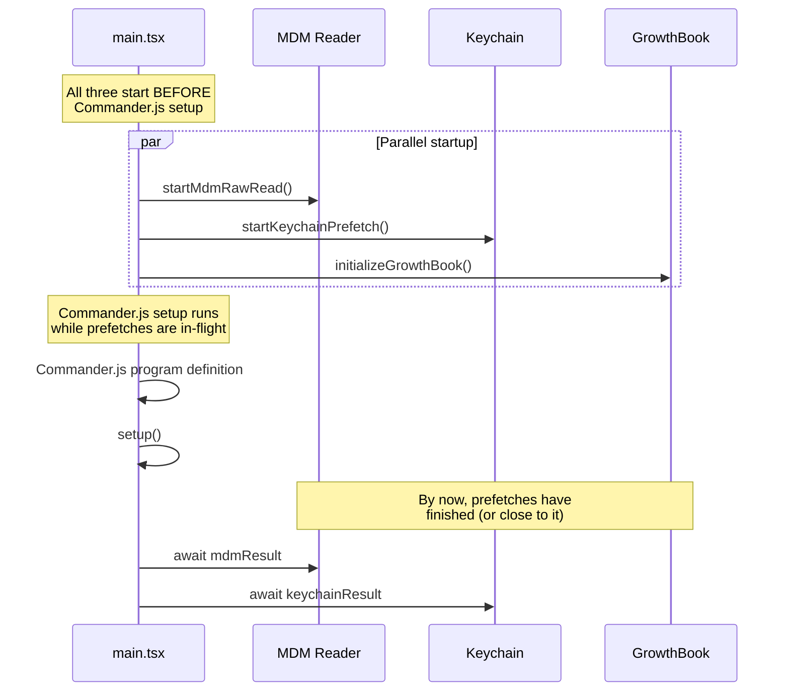

The parallel prefetch pattern overlaps I/O-bound operations (keychain access, HTTP for GrowthBook, file reads for MDM) with CPU-bound operations (module parsing, Commander setup). Total startup time ≈ max(prefetch, init) instead of sum(prefetch + init).

---

## 3. API Prompt Caching

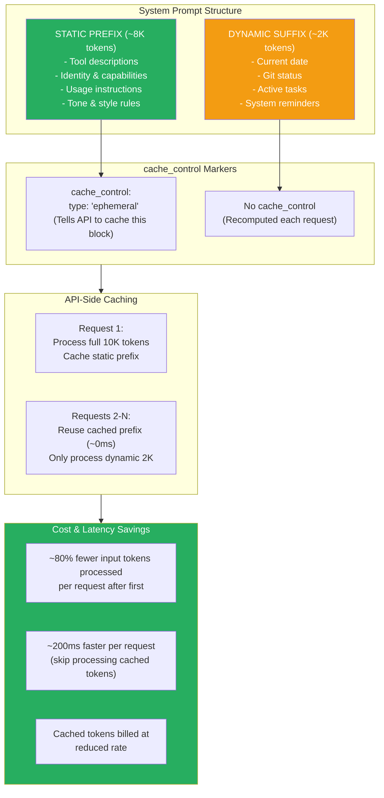

### splitSysPromptPrefix() — The Cache Boundary

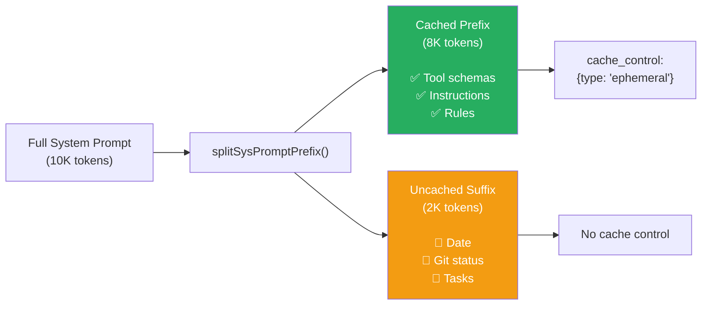

### Design Insight: Why "ephemeral" Cache Type?

Anthropic's prompt caching offers `ephemeral` caching that persists for ~5 minutes. This is perfect for Claude Code because:
- Within a session, requests happen every few seconds (well within 5 min window)
- Across sessions, the system prompt changes (different tools, different project context)
- No stale cache risk — cache naturally expires when the user starts a new session

---

## 4. Streaming & StreamingToolExecutor

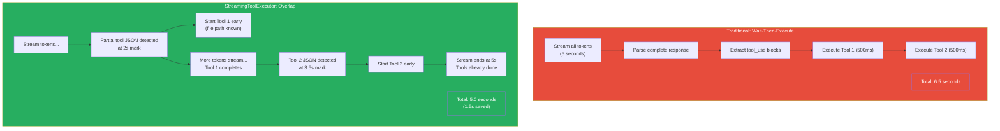

### How Partial JSON Parsing Works

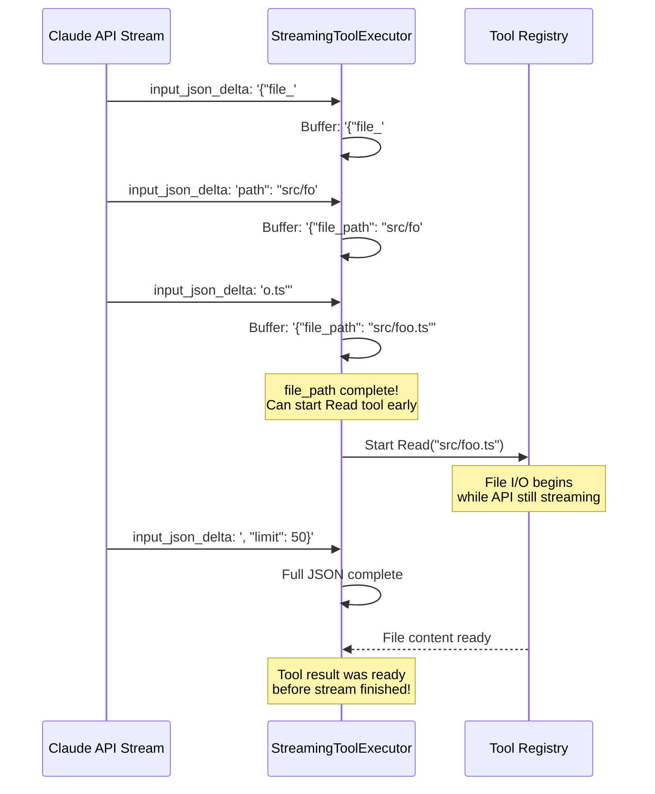

### Design Insight: Why This Matters

For a typical "explore the codebase" interaction where the model reads 5-8 files:
- **Without streaming exec**: 5s stream + 4s tool execution = **9 seconds**
- **With streaming exec**: 5s stream (overlapped with tool I/O) + 0.5s remaining = **5.5 seconds**
- **Savings**: ~40% reduction in perceived latency

The key insight is that most tool inputs (especially file paths for Read/Glob/Grep) appear at the **beginning** of the JSON object, so parsing can start before the full input is available.

---

## 5. Concurrent Tool Execution

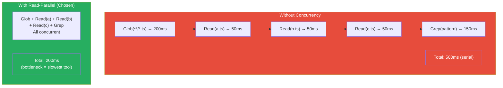

### Concurrency Limit: Why 10?

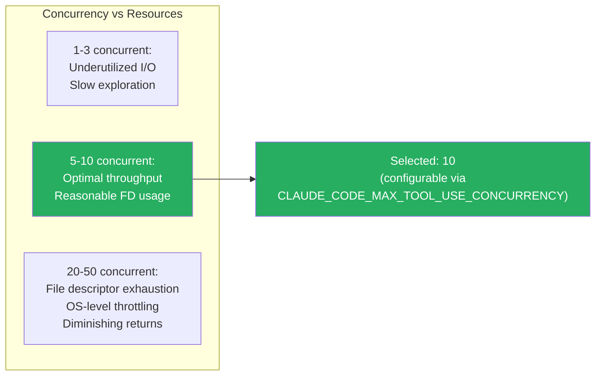

---

## 6. Caching Strategies

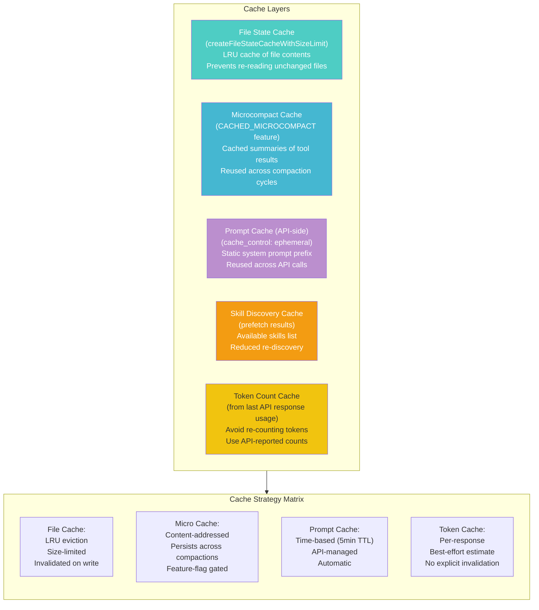

### Design Insight: Why LRU for File State?

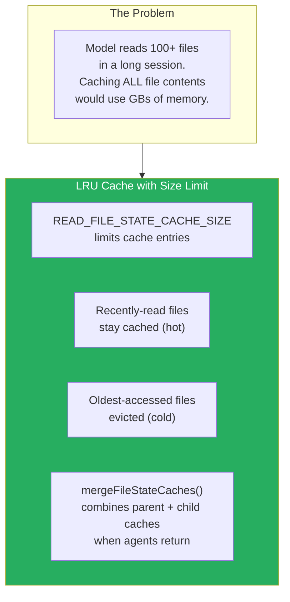

The LRU strategy matches real usage: the model tends to read the same files repeatedly (editing a file requires reading it first), so recently-read files are the most valuable to cache.

---

## 7. Lazy Loading & Dead Code Elimination

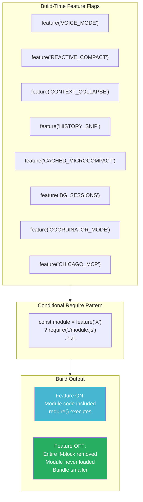

### Dynamic Import Pattern

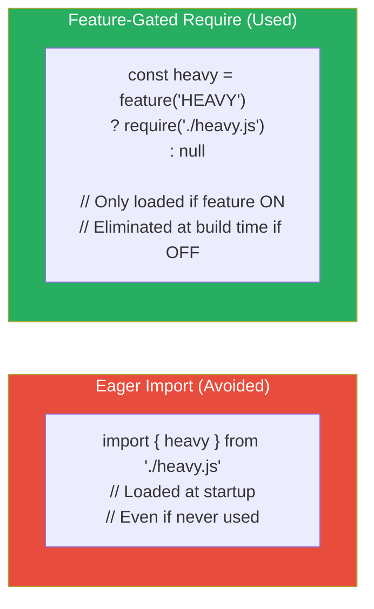

### Design Insight: 17+ Feature Gates in query.ts Alone

The query loop (`query.ts`) is the hot path — it runs on every single user interaction. Having 17+ feature gates means the open-source build has significantly less code to parse and execute in this critical path. Each gate eliminates both the import and all usage sites, compounding the savings.

---

## 8. Terminal Rendering Performance

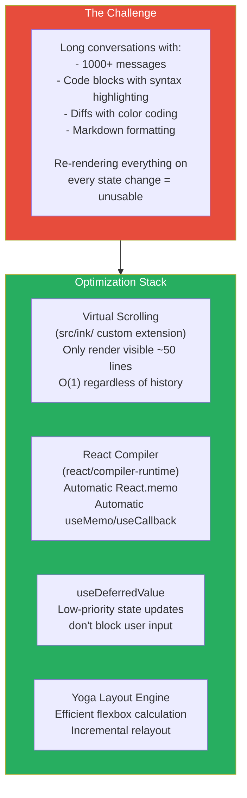

### Virtual Scrolling Deep Dive

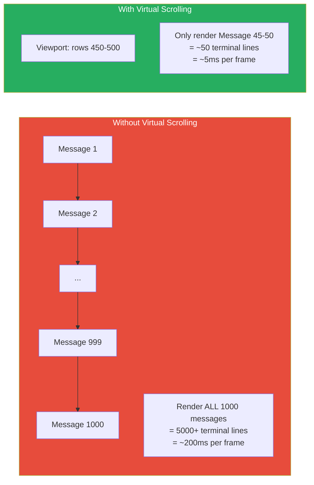

### Design Insight: React Compiler for CLI

The `react/compiler-runtime` import in REPL.tsx enables React 19's automatic optimization:

| Without Compiler | With Compiler |
|---|---|
| Manual `React.memo()` wrappers | Automatic memoization |
| Manual `useMemo()` for expensive computations | Compiler detects stable values |
| Manual `useCallback()` for handler refs | Compiler hoists stable callbacks |
| Easy to miss optimizations | Comprehensive coverage |

In a CLI app with 140+ components, manually memoizing everything would be impractical. The compiler does it automatically, preventing unnecessary terminal redraws.

---

## 9. Token Estimation & Budget Management

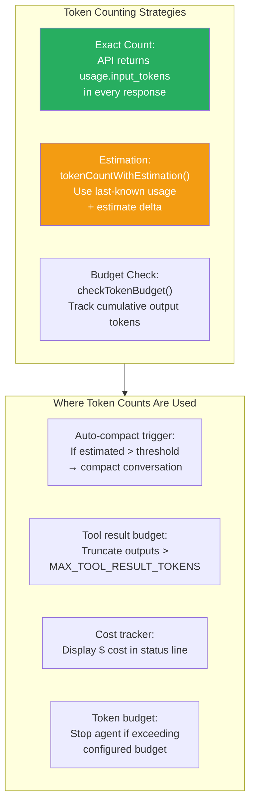

### Design Insight: Why Estimate Instead of Count?

Counting tokens precisely requires a tokenizer (which is ~1MB of data and ~10ms per call). Instead, Claude Code:

1. Uses the **exact count from the last API response** (`usage.input_tokens`)
2. Estimates the delta since then (new messages added since last API call)
3. Uses `finalContextTokensFromLastResponse()` as the authoritative baseline

This is accurate enough for compaction triggers (±5% error is fine when the threshold is 80% of context window) while avoiding tokenizer dependency.

---

## 10. Speculation & Prefetching

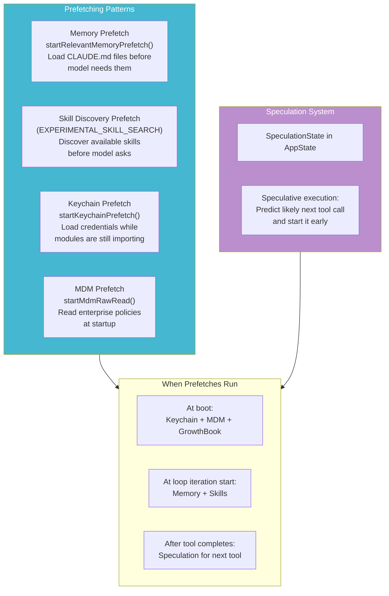

### Design Insight: Why Prefetch Memory at Loop Start?

CLAUDE.md files and memory attachments are needed for every API call, but they may change between iterations (if a tool modifies them). By prefetching at the **start of each loop iteration** (not just at boot), Claude Code:

1. Gets the **freshest** CLAUDE.md content
2. Overlaps the file I/O with context management (compaction, etc.)
3. Has results ready by the time the API call is constructed

---

## Performance Impact Summary

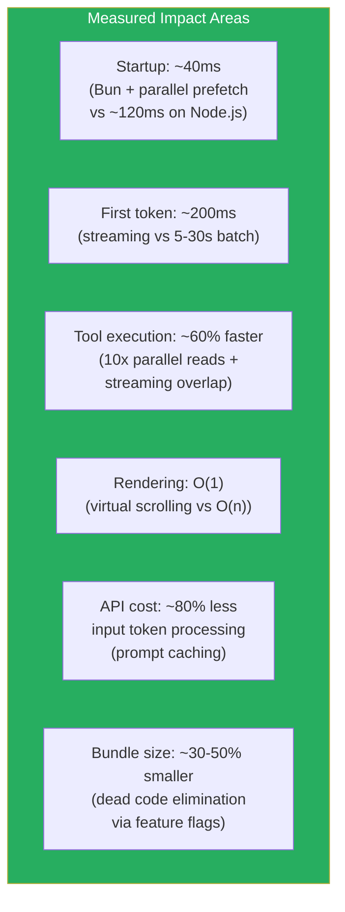

### The Overarching Performance Philosophy

Every optimization in Claude Code follows one principle: **overlap everything possible**.

- **Startup**: Overlap credential fetching with module loading
- **API calls**: Overlap static prompt caching with dynamic computation
- **Streaming**: Overlap token reception with tool execution
- **Tool execution**: Overlap multiple read operations via concurrency
- **Rendering**: Overlap state updates with deferred rendering

The result is a system that feels responsive even when doing complex multi-tool agentic work.
