# Prompt Engineering & System Prompt Architecture

> How Claude Code constructs, layers, caches, and evolves its system prompt to make the AI model maximally effective at coding tasks. This is the **most critical subsystem** — the prompt IS the product. Every diagram is a Mermaid diagram you can render in any Markdown viewer.

---

## Table of Contents

1. [Why Prompt Engineering Matters Most](#1-why-prompt-engineering-matters-most)
2. [System Prompt Assembly Pipeline](#2-system-prompt-assembly-pipeline)
3. [The Layered Prompt Architecture](#3-the-layered-prompt-architecture)
4. [Prompt Priority & Override Hierarchy](#4-prompt-priority--override-hierarchy)
5. [Static vs Dynamic Boundary — The Cache Split](#5-static-vs-dynamic-boundary--the-cache-split)
6. [System Prompt Section Registry](#6-system-prompt-section-registry)
7. [Context Injection Points](#7-context-injection-points)
8. [CLAUDE.md Injection & Memory Loading](#8-claudemd-injection--memory-loading)
9. [Tool Description Design Principles](#9-tool-description-design-principles)
10. [Prompt Caching Economics](#10-prompt-caching-economics)
11. [Model-Specific Prompt Adaptations](#11-model-specific-prompt-adaptations)
12. [The Behavioral Shaping Strategy](#12-the-behavioral-shaping-strategy)

---

## 1. Why Prompt Engineering Matters Most

The system prompt is the single highest-leverage component in an AI coding agent. It determines:
- **What the model will do** — task interpretation, tool selection, coding style
- **What the model won't do** — safety boundaries, destructive action avoidance
- **How well the model performs** — the difference between a hallucinating chatbot and a 10x developer

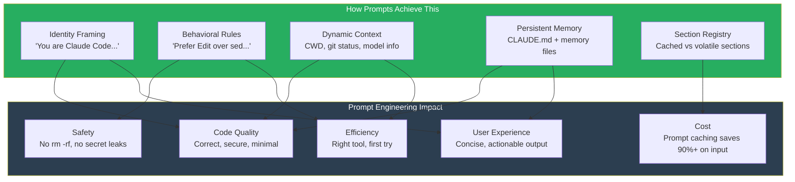

### The Core Insight

Claude Code doesn't just have a system prompt — it has a **prompt assembly pipeline** with 15+ composable sections, a cache boundary marker, feature-flagged sections, and a section registry with memoization. The prompt is treated like production code, not a static string.

---

## 2. System Prompt Assembly Pipeline

The system prompt goes through a multi-stage assembly before reaching the API.

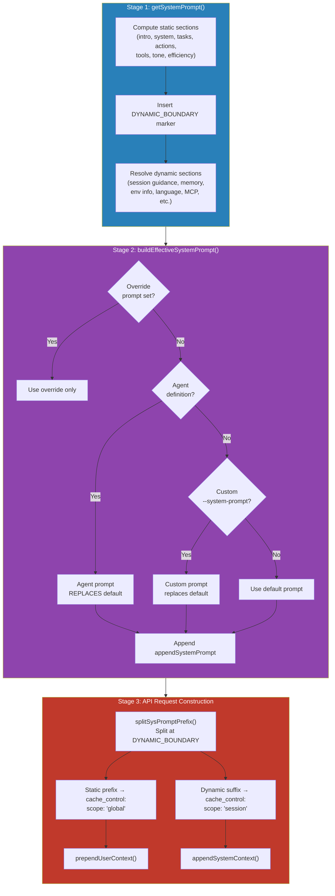

**Key files:**
- `src/constants/prompts.ts` — The master prompt builder (`getSystemPrompt()`)
- `src/utils/systemPrompt.ts` — Priority resolution (`buildEffectiveSystemPrompt()`)
- `src/constants/systemPromptSections.ts` — Section registry with memoization
- `src/utils/api.ts` — Cache boundary splitting (`splitSysPromptPrefix()`)
- `src/context.ts` — User/system context injection

---

## 3. The Layered Prompt Architecture

The system prompt is composed of distinct semantic layers, each serving a specific purpose.

```mermaid
graph TD
    subgraph StaticLayers["STATIC LAYERS (Cache-Friendly)"]
        direction TB
        L1["Layer 1: Identity & Framing<br/><i>'You are Claude Code, Anthropic's<br/>official CLI for Claude'</i>"]
        L2["Layer 2: System Rules<br/><i>Tool display, permissions,<br/>system-reminders, hooks</i>"]
        L3["Layer 3: Task Behavior<br/><i>Read before edit, no over-engineering,<br/>security awareness, code style</i>"]
        L4["Layer 4: Action Safety<br/><i>Reversibility checks, blast radius,<br/>destructive operation warnings</i>"]
        L5["Layer 5: Tool Usage<br/><i>Prefer Read over cat,<br/>Edit over sed, parallel calls</i>"]
        L6["Layer 6: Tone & Style<br/><i>No emojis, file:line refs,<br/>concise output</i>"]
        L7["Layer 7: Output Efficiency<br/><i>Go straight to the point,<br/>lead with action not reasoning</i>"]
        L1 --> L2 --> L3 --> L4 --> L5 --> L6 --> L7
    end

    Boundary["═══ DYNAMIC_BOUNDARY ═══<br/>(Cache breakpoint)"]

    subgraph DynamicLayers["DYNAMIC LAYERS (Per-Session)"]
        direction TB
        D1["Layer 8: Session Guidance<br/><i>Agent tool config, explore agents,<br/>skill discovery, verification</i>"]
        D2["Layer 9: Memory<br/><i>CLAUDE.md content, auto memory</i>"]
        D3["Layer 10: Environment<br/><i>CWD, git status, platform,<br/>model name, knowledge cutoff</i>"]
        D4["Layer 11: Language<br/><i>'Always respond in Japanese'</i>"]
        D5["Layer 12: MCP Instructions<br/><i>Server-provided usage guides</i>"]
        D6["Layer 13: Feature-Gated<br/><i>Token budget, brief mode,<br/>scratchpad, FRC</i>"]
        D1 --> D2 --> D3 --> D4 --> D5 --> D6
    end

    StaticLayers --> Boundary --> DynamicLayers

    style StaticLayers fill:#27ae60,color:#fff
    style Boundary fill:#f39c12,color:#333
    style DynamicLayers fill:#e74c3c,color:#fff
```

### Why This Layering?

| Layer | Purpose | Cache Impact |
|---|---|---|
| Identity + Rules | Same for ALL users, ALL sessions | Global cache hit |
| Task + Actions | Same for ALL users (slight ant/external variance) | Global cache hit |
| Tools + Tone | Same for all users (feature-flag variants) | Global cache hit |
| **BOUNDARY** | **Separates cacheable from volatile** | **Cache split point** |
| Session Guidance | Varies by enabled tools, session type | Session cache |
| Memory/Env | Varies by project, user, model | Per-request |

---

## 4. Prompt Priority & Override Hierarchy

Multiple prompt sources can compete. The resolution follows a strict priority.

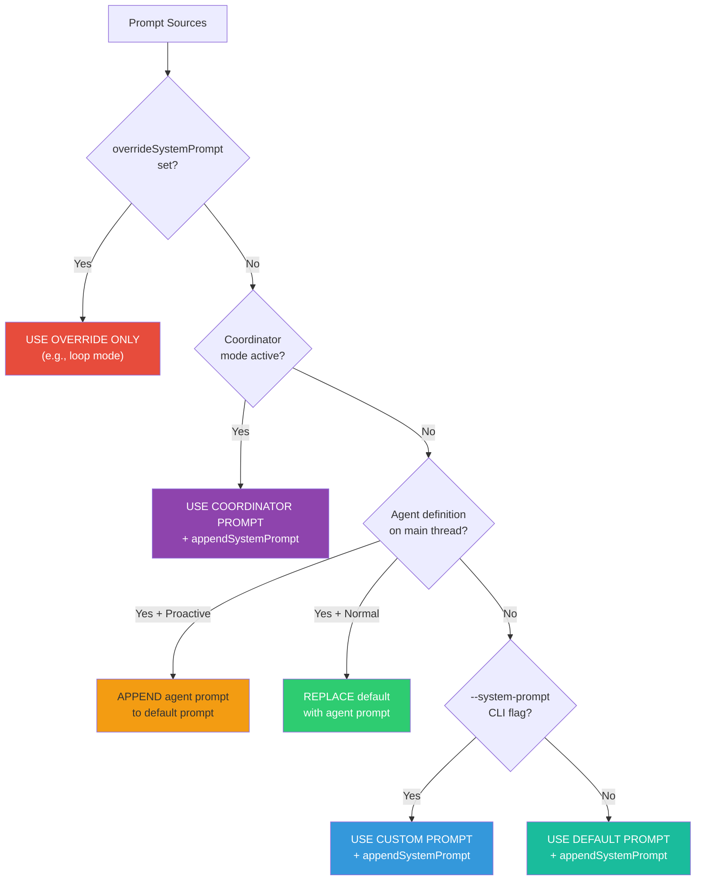

### Key Design Decision: Agent Append vs Replace

- **Normal mode**: Agent prompt **replaces** the default prompt entirely. The agent IS the identity.
- **Proactive mode**: Agent prompt is **appended** to the default autonomous agent prompt. This mirrors how teammates work — they add domain instructions on top of a shared base.

---

## 5. Static vs Dynamic Boundary — The Cache Split

This is the most cost-impactful design decision in the entire system.

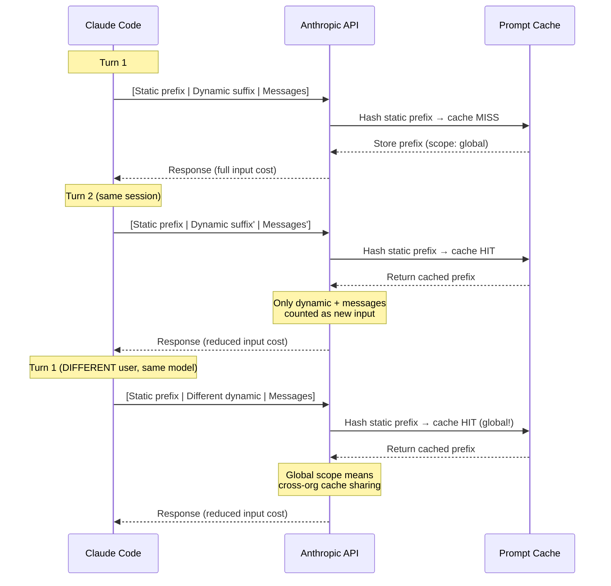

### The SYSTEM_PROMPT_DYNAMIC_BOUNDARY Marker

```
__SYSTEM_PROMPT_DYNAMIC_BOUNDARY__
```

This string literal in the prompt array is detected by `splitSysPromptPrefix()` in `src/utils/api.ts`:

- **Everything before** → `cache_control: { type: 'ephemeral', scope: 'global' }`
- **Everything after** → `cache_control: { type: 'ephemeral' }` (session-scoped)

### Why This Saves Massive Costs

The static prefix is ~8,000-12,000 tokens. With prompt caching:
- **Cache write**: 1.25x the normal input price (one-time)
- **Cache read**: 0.1x the normal input price (every subsequent turn)
- **Savings**: ~90% reduction on input tokens for the static portion

For a session with 20 turns, this means the static prefix is paid in full once, then at 10% for the remaining 19 turns.

---

## 6. System Prompt Section Registry

Sections are not raw strings — they're managed through a registry with memoization.

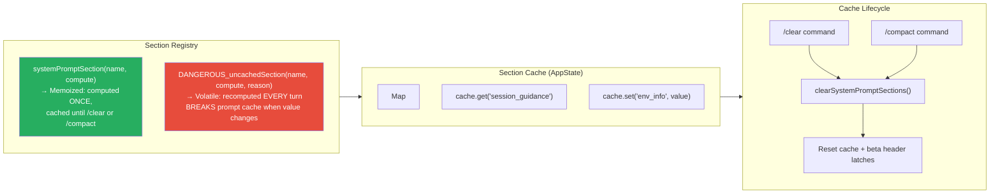

### Registered Sections

| Section Name | Type | What It Contains |
|---|---|---|
| `session_guidance` | Cached | Agent tool config, explore agents, skills, verification |
| `memory` | Cached | CLAUDE.md content loaded via `loadMemoryPrompt()` |
| `ant_model_override` | Cached | Internal model-specific prompt suffix |
| `env_info_simple` | Cached | CWD, git, platform, model name, knowledge cutoff |
| `language` | Cached | Language preference (e.g., "Always respond in Japanese") |
| `output_style` | Cached | Custom output style prompt |
| `mcp_instructions` | **VOLATILE** | MCP server instructions (servers connect/disconnect) |
| `scratchpad` | Cached | Scratchpad directory instructions |
| `frc` | Cached | Function Result Clearing instructions |
| `summarize_tool_results` | Cached | Tool result summarization guidance |
| `token_budget` | Cached | Token budget continuation instructions |
| `numeric_length_anchors` | Cached | "≤25 words between tools, ≤100 words final" (ant-only) |

### Why DANGEROUS_uncached Exists

MCP servers can connect or disconnect between turns. If MCP instructions were cached, a newly connected server's instructions wouldn't appear until `/clear`. The `DANGEROUS_` prefix is a code-review signal: "this breaks the prompt cache — make sure the reason is worth it."

---

## 7. Context Injection Points

Beyond the system prompt, context is injected at three additional points.

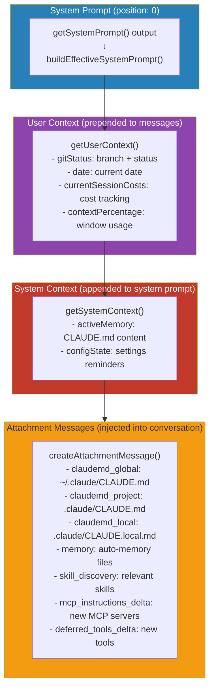

### The `<system-reminder>` Pattern

Context that changes between turns is injected as `<system-reminder>` tags within user messages or tool results. The system prompt tells the model:

> "Tool results and user messages may include `<system-reminder>` tags. Tags contain information from the system. They bear no direct relation to the specific tool results or user messages in which they appear."

This allows the system to piggyback context updates on existing messages without consuming a separate turn.

---

## 8. CLAUDE.md Injection & Memory Loading

CLAUDE.md files are the user's primary way to customize agent behavior per-project.

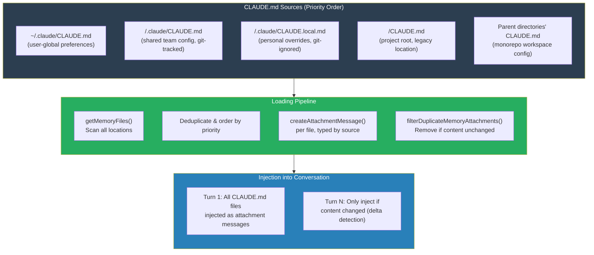

### Auto Memory System

Beyond CLAUDE.md, the auto memory system in `~/.claude/projects/<hash>/memory/` stores:
- **User memories** — role, preferences, expertise level
- **Feedback memories** — corrections and confirmed approaches
- **Project memories** — ongoing initiatives, deadlines, decisions
- **Reference memories** — pointers to external systems

The `loadMemoryPrompt()` function reads `MEMORY.md` (the index) and injects it as a system prompt section.

---

## 9. Tool Description Design Principles

How tool descriptions are written has a massive impact on whether the model uses the right tool.

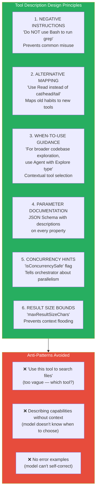

### Real Example: The Bash Tool Steering

The system prompt contains this critical instruction:

```
Do NOT use the Bash to run commands when a relevant dedicated tool is provided.
- To read files use Read instead of cat, head, tail, or sed
- To edit files use Edit instead of sed or awk
- To create files use Write instead of cat with heredoc or echo redirection
- To search for files use Glob instead of find or ls
- To search the content of files, use Grep instead of grep or rg
```

This is in the **system prompt**, not the tool description, because:
1. It's a **cross-tool** concern (involves all tools, not just Bash)
2. It needs **high priority** (system prompt is always attended to)
3. It prevents the model's **pre-training bias** toward shell commands

---

## 10. Prompt Caching Economics

The financial impact of prompt caching strategy is substantial.

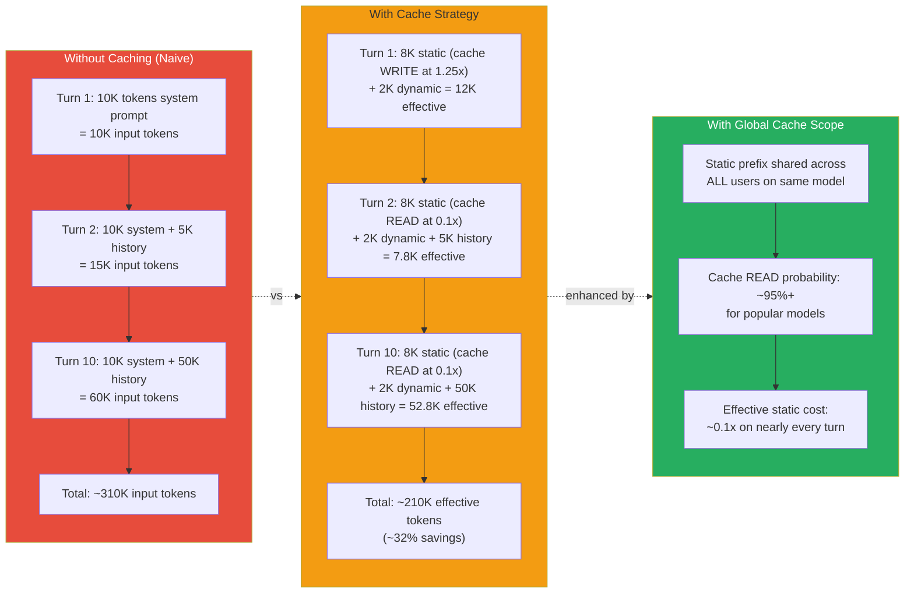

### The 2^N Variant Problem

Every conditional in the static prefix doubles the number of possible cache keys:

```
if (ant) → 2 variants
if (embeddedSearchTools) → 4 variants
if (replMode) → 8 variants
```

This is why session-variant guidance was **moved after** `SYSTEM_PROMPT_DYNAMIC_BOUNDARY`:
- `isForkSubagentEnabled()` reads session type → moved to dynamic
- `isReplModeEnabled()` depends on tools → handled per-path
- `areExplorePlanAgentsEnabled()` is A/B tested → moved to dynamic

The goal: **minimize the number of distinct static prefixes** to maximize global cache hit rate.

---

## 11. Model-Specific Prompt Adaptations

The prompt adapts to different models and user types.

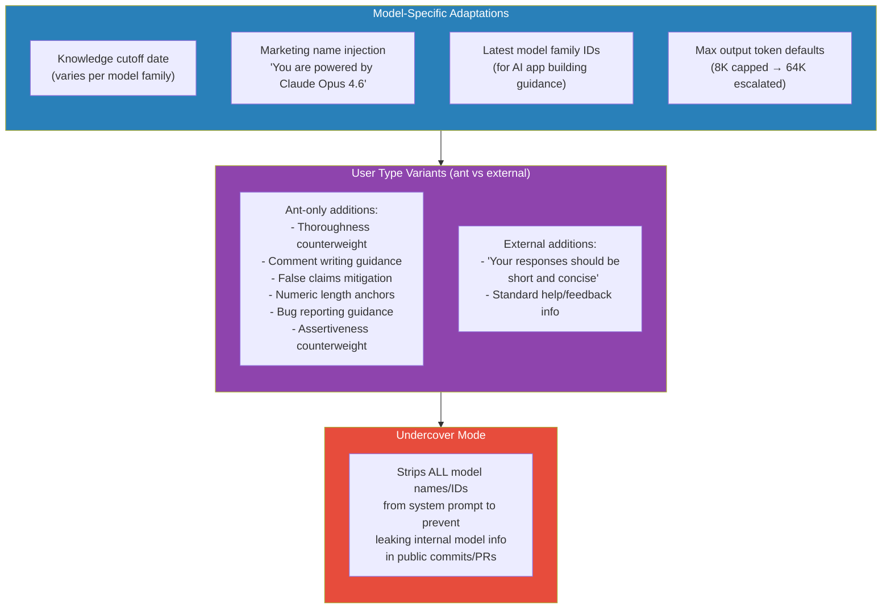

### The `@[MODEL LAUNCH]` Pattern

Throughout `prompts.ts`, you'll find comments like:

```typescript
// @[MODEL LAUNCH]: Update the latest frontier model.
// @[MODEL LAUNCH]: Update the model family IDs below.
// @[MODEL LAUNCH]: Remove this section when we launch numbat.
```

These are search markers for the model launch checklist — when a new model ships, engineers grep for `@[MODEL LAUNCH]` to find every prompt location that needs updating.

---

## 12. The Behavioral Shaping Strategy

The prompt doesn't just instruct — it **shapes behavior** through specific psychological patterns.

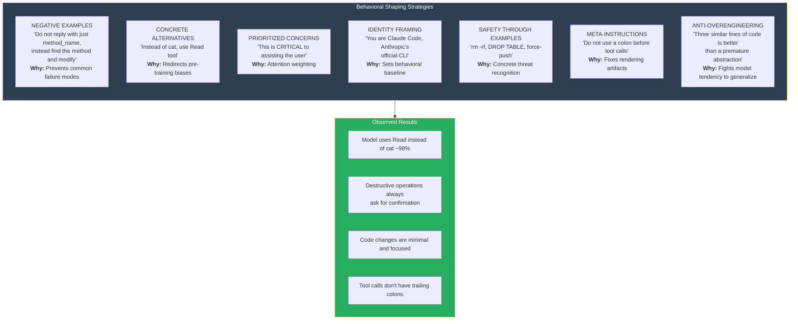

### The "Measure Twice, Cut Once" Principle

The safety section ends with:

> "Follow both the spirit and letter of these instructions - measure twice, cut once."

This is a behavioral anchoring technique — it gives the model a memorable metaphor to recall when making decisions about risky actions, even when the specific instructions don't cover the exact scenario.

### The FRC (Function Result Clearing) Pattern

Large tool results are automatically cleared from the conversation history and replaced with `[Old tool result content cleared]`. The system prompt tells the model:

> "When working with tool results, write down any important information you might need later in your response, as the original tool result may be cleared later."

This trains the model to extract and summarize key information immediately, rather than relying on being able to re-read tool results later — a critical behavior for long conversations.
