# Security Model & Trust Boundaries

> How Claude Code prevents an AI model from doing unauthorized damage — a layered defense-in-depth approach. Every diagram is a Mermaid diagram you can render in any Markdown viewer.

---

## Table of Contents

1. [Threat Model Overview](#1-threat-model-overview)
2. [Trust Boundary Map](#2-trust-boundary-map)
3. [Permission Engine Deep Dive](#3-permission-engine-deep-dive)
4. [Sandbox Architecture](#4-sandbox-architecture)
5. [Hook-Based Security Gates](#5-hook-based-security-gates)
6. [File Access Control](#6-file-access-control)
7. [Authentication & Secret Management](#7-authentication--secret-management)
8. [MCP Server Trust Model](#8-mcp-server-trust-model)
9. [Plugin Security](#9-plugin-security)
10. [Multi-Agent Security](#10-multi-agent-security)
11. [Defense-in-Depth Summary](#11-defense-in-depth-summary)

---

## 1. Threat Model Overview

Claude Code operates in a unique threat landscape: the AI model is simultaneously the **user's assistant** and a **potential source of risk**. It can generate and execute arbitrary code, modify files, and interact with external systems.

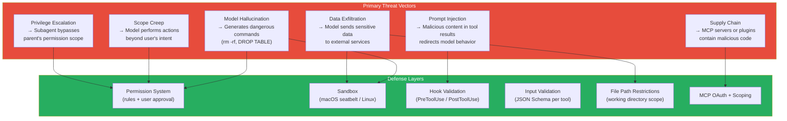

### Design Insight: Why Defense-in-Depth?

No single layer is sufficient:
- **Permissions alone** can't prevent a model from encoding `rm -rf /` as `echo cm0gLXJmIC8= | base64 -d | bash`
- **Sandboxing alone** would block legitimate operations (installing packages, running builds)
- **Hooks alone** depend on correct configuration

Claude Code layers all three so that if one layer fails, others catch the attack.

---

## 2. Trust Boundary Map

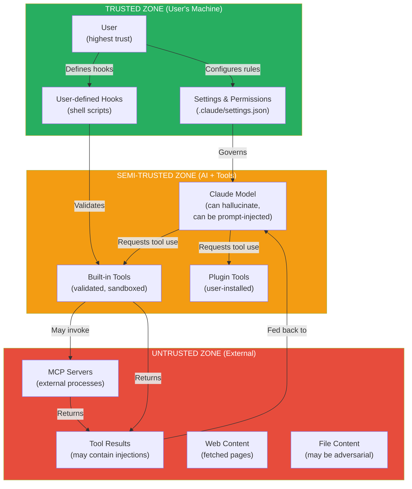

### Design Insight: The Model is Semi-Trusted

This is the fundamental tension in Claude Code's security model:

| Entity | Trust Level | Reason |
|---|---|---|
| **User** | Fully trusted | They own the machine; their intent is the ground truth |
| **Claude model** | Semi-trusted | Highly capable but can hallucinate, be manipulated by prompt injection, or misinterpret intent |
| **Built-in tools** | Semi-trusted | Code is audited but executes model's potentially dangerous requests |
| **MCP servers** | Untrusted | External processes that could be compromised |
| **File/web content** | Untrusted | Could contain prompt injection payloads |

The permission system exists because the model is semi-trusted — it needs to be able to do real work, but every destructive action should have user confirmation.

---

## 3. Permission Engine Deep Dive

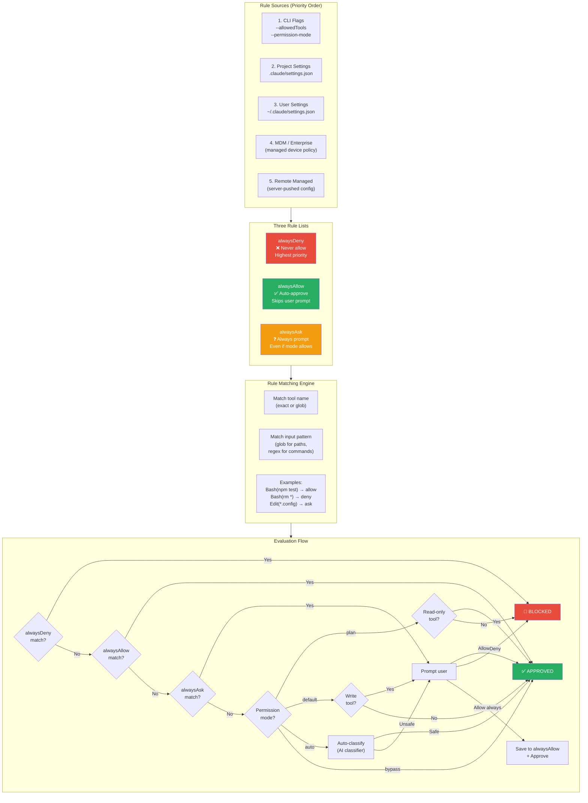

### Permission Modes Compared

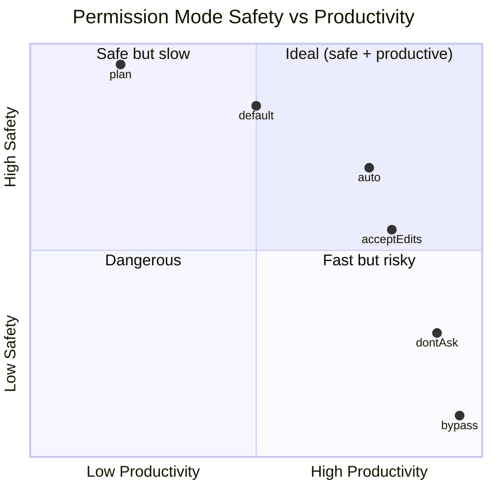

### Design Insight: Why alwaysDeny > alwaysAllow > alwaysAsk?

The priority ordering prevents a common security mistake:

1. **Enterprise MDM** sets `alwaysDeny: ["Bash(curl *)"]` to prevent data exfiltration
2. **Developer** sets `alwaysAllow: ["Bash(curl localhost:*)"]` for local API testing
3. **Result**: The deny rule wins — enterprise policy cannot be overridden by user convenience

This is the **deny-by-default** principle: explicit denials are absolute, explicit allows are conditional, and everything else requires judgment.

---

## 4. Sandbox Architecture

Claude Code includes a sandboxing layer for Bash command execution that provides OS-level containment.

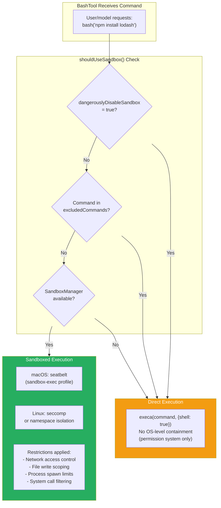

### Binary Hijack Protection

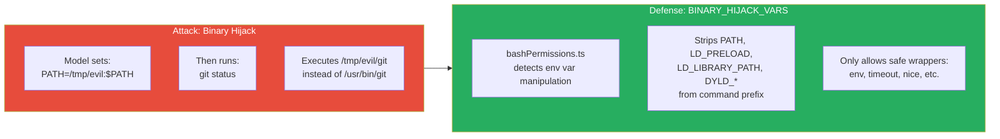

### Design Insight: Sandbox is a Safety Net, Not the Primary Control

The sandbox is deliberately positioned as the **last line of defense**, not the first:

1. **Primary**: Permission system (user approval) — catches most dangerous operations
2. **Secondary**: Hook validation — catches pattern-specific risks
3. **Tertiary**: Sandbox — OS-level containment for when everything else fails

The `dangerouslyDisableSandbox` flag name itself is a security UX pattern — the word "dangerously" forces conscious acknowledgment of risk.

---

## 5. Hook-Based Security Gates

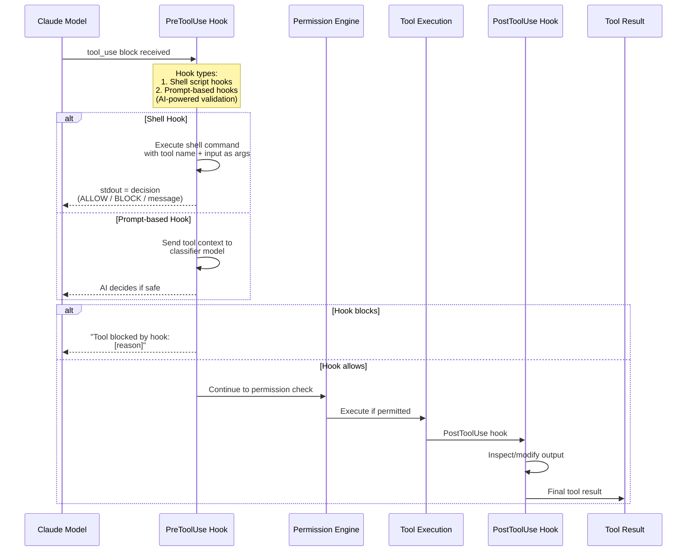

### Hook Event Lifecycle

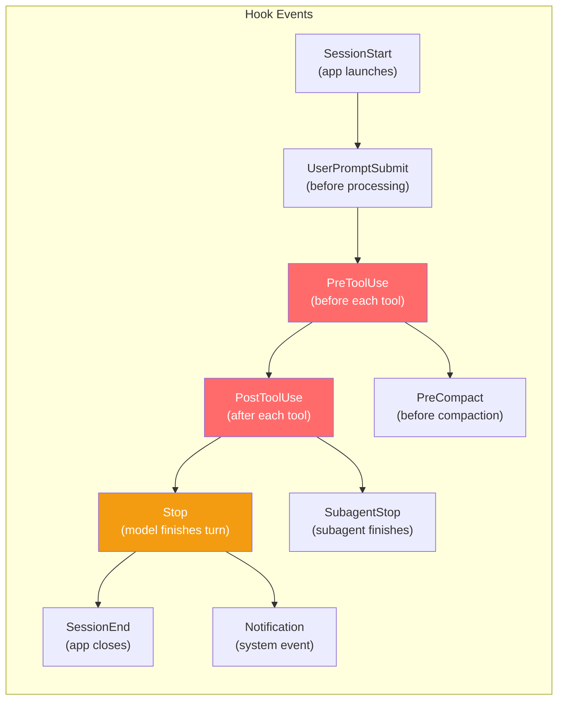

### Design Insight: Why Prompt-Based Hooks?

Traditional hooks run shell scripts — fast but brittle (regex matching misses edge cases). Prompt-based hooks use an AI classifier:

| Approach | Precision | Recall | Latency | Maintenance |
|---|---|---|---|---|
| **Regex/shell** | High (exact match) | Low (misses variations) | ~5ms | High (constant updates) |
| **AI classifier** | High | High | ~200ms | Low (model generalizes) |

Example: A shell hook blocking `rm -rf` misses `find / -delete`. An AI classifier understands the intent is "delete everything" regardless of the command variation.

---

## 6. File Access Control

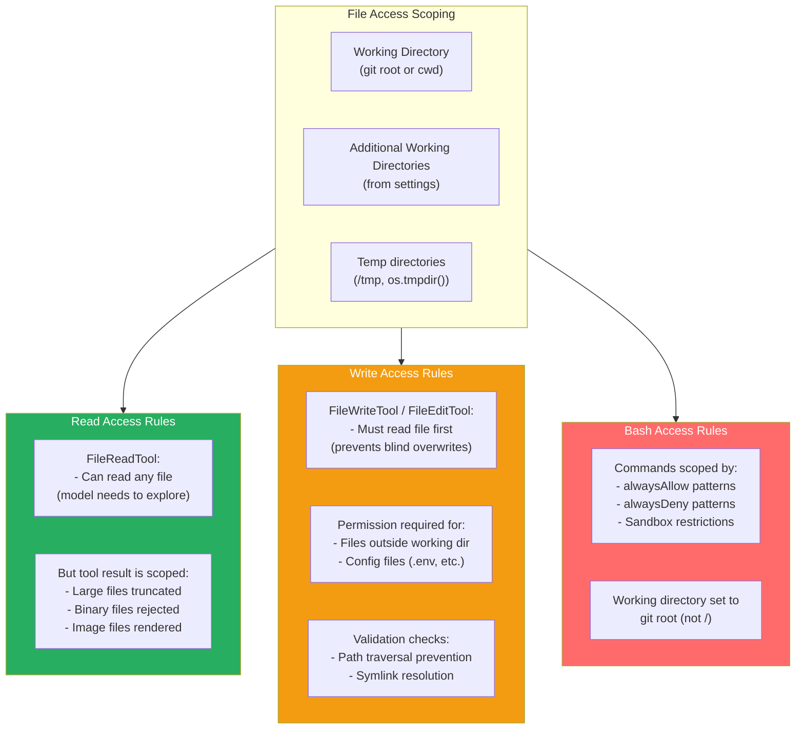

### Design Insight: Read-Before-Write Requirement

The `FileWriteTool` and `FileEditTool` enforce a **read-before-write** invariant:

```
Tool call: Write(file_path: "src/config.ts", content: "...")
→ ERROR: "You must use your Read tool at least once before editing"
```

This prevents two attack vectors:
1. **Blind overwrite** — Model hallucinates file contents and overwrites real data
2. **Race condition** — Model edits based on stale cached content

The read operation updates the `readFileState` cache, ensuring edits are based on current file contents.

---

## 7. Authentication & Secret Management

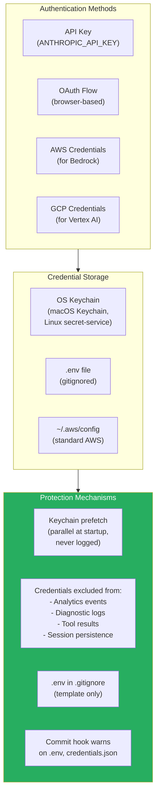

### Design Insight: Why Keychain Over Environment Variables?

| Storage | Security | UX | Persistence |
|---|---|---|---|
| **Environment variable** | Visible to child processes, leaked in error dumps | Manual export | Per-session |
| **OS Keychain** | Encrypted at rest, requires user auth to access | Automatic after first auth | Permanent |
| **.env file** | Plaintext on disk, risk of git commit | Easy to manage | Permanent |

Claude Code prefers the OS Keychain (via `startKeychainPrefetch()` at boot) but falls back to environment variables for CI/CD compatibility. The prefetch runs in parallel with module loading so there's no startup penalty.

---

## 8. MCP Server Trust Model

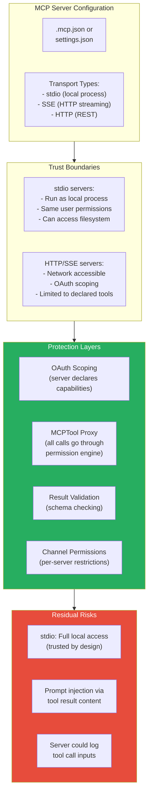

### Design Insight: MCP Tools Go Through the Same Permission Engine

When an MCP server exposes a tool called `database_query`, that tool is registered through the `MCPTool` proxy and subject to the **exact same permission rules** as built-in tools:

```
alwaysDeny: ["mcp__myserver__database_query(DROP *)"]
alwaysAllow: ["mcp__myserver__database_query(SELECT *)"]
```

This means enterprise policies can restrict MCP tool usage without modifying the MCP server itself. The naming convention `mcp__{server}__{tool}` makes pattern-based rules possible.

---

## 9. Plugin Security

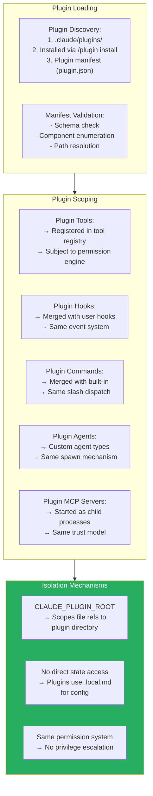

### Design Insight: Why No Plugin Sandbox?

Plugins run with the same permissions as the user — there's no VM or container isolation. This is a deliberate trade-off:

| Sandboxed Plugins | Unsandboxed Plugins (Chosen) |
|---|---|
| Secure against malicious plugins | Relies on trust (user installs explicitly) |
| Can't access filesystem freely | Full filesystem access for real tools |
| Complex API for host communication | Direct function calls, simple integration |
| Slow (IPC overhead) | Fast (in-process) |

The reasoning: if a user installs a plugin, they're granting it trust. The permission system still governs what the AI *does with* plugin tools, even if the plugin code itself is unrestricted.

---

## 10. Multi-Agent Security

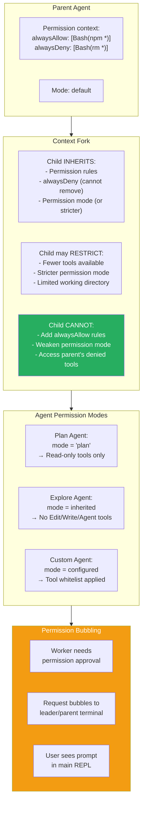

### Design Insight: Permission Bubbling in Swarms

When a worker agent in a swarm needs user permission, it can't prompt the user directly (it has no terminal). Instead:

1. Worker creates a `SandboxPermissionRequest` via the mailbox system
2. `useSwarmPermissionPoller` on the leader agent detects the pending request
3. Leader surfaces the permission dialog in the main REPL
4. User's decision flows back through the mailbox to the worker

This preserves the single-point-of-approval principle — the user always sees permission requests in one place, even with 10 agents running in parallel.

---

## 11. Defense-in-Depth Summary

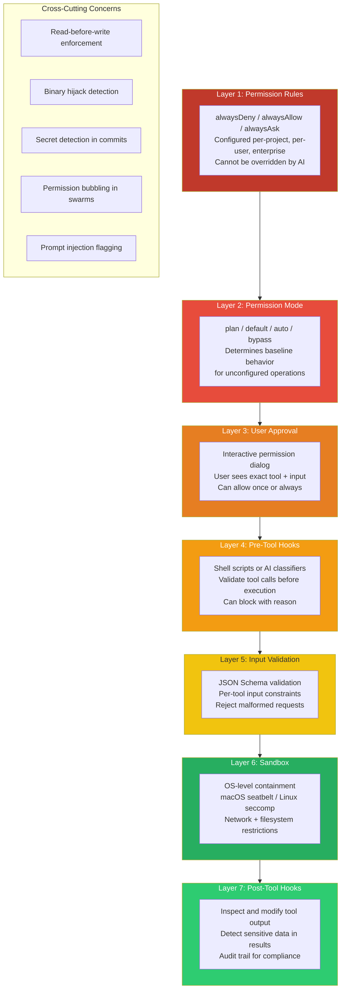

### The Security Philosophy

Claude Code's security model follows three principles:

1. **Assume the model will try dangerous things** — Not maliciously, but through hallucination or misunderstanding. Every tool call is potentially dangerous until proven safe.

2. **Make the safe path the easy path** — `default` mode asks for confirmation on writes. `alwaysAllow` patterns let users pre-approve safe operations. The UX encourages security without making it painful.

3. **Enterprise overrides individual** — MDM policies and `alwaysDeny` rules cannot be weakened by per-project settings, user preferences, or AI behavior. This makes Claude Code deployable in regulated environments.
