# Testing & Quality Assurance Strategy

> How to test an AI coding agent that uses LLMs, executes shell commands, modifies files, and interacts with external APIs — the unique QA challenges and patterns. Every diagram is a Mermaid diagram you can render in any Markdown viewer.

---

## Table of Contents

1. [Why Testing AI Agents Is Uniquely Hard](#1-why-testing-ai-agents-is-uniquely-hard)
2. [The Testing Pyramid for AI Agents](#2-the-testing-pyramid-for-ai-agents)
3. [Unit Testing Patterns](#3-unit-testing-patterns)
4. [Integration Testing Patterns](#4-integration-testing-patterns)
5. [The VCR Pattern: Recording API Interactions](#5-the-vcr-pattern-recording-api-interactions)
6. [Permission & Security Testing](#6-permission--security-testing)
7. [Prompt Testing & Evaluation](#7-prompt-testing--evaluation)
8. [Feature Flag Testing](#8-feature-flag-testing)
9. [Model Launch Validation](#9-model-launch-validation)
10. [Quality Gates & CI Pipeline](#10-quality-gates--ci-pipeline)

---

## 1. Why Testing AI Agents Is Uniquely Hard

Traditional software has deterministic outputs. AI agents have **non-deterministic** outputs from LLMs, **side effects** on the filesystem, and **external dependencies** on APIs.

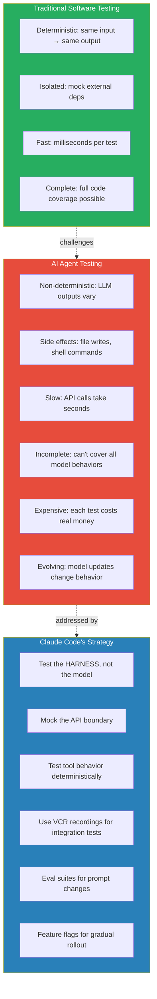

### The Core Testing Philosophy

> **Test the harness, not the model.** The model's behavior is tested through evals. The harness (tool execution, permission checks, context management, state transitions) is tested through unit and integration tests.

---

## 2. The Testing Pyramid for AI Agents

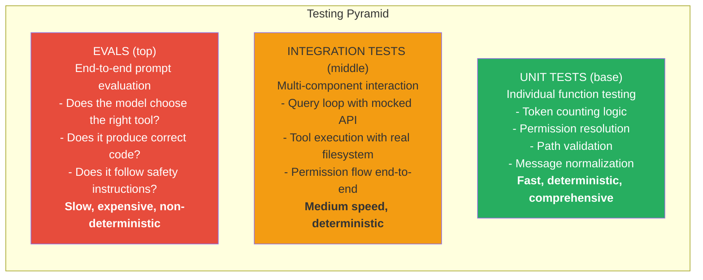

---

## 3. Unit Testing Patterns

Claude Code's codebase uses several distinct unit testing patterns.

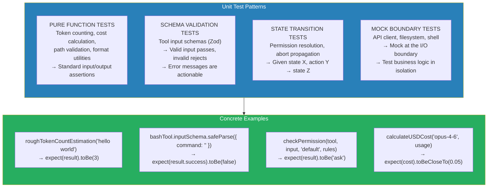

### What's Testable Without the Model

| Component | Testability | How |
|---|---|---|
| Token counting | Fully deterministic | Pure function tests |
| Cost calculation | Fully deterministic | Pure function tests |
| Permission resolution | Fully deterministic | State transition tests |
| Path validation | Fully deterministic | Pure function tests |
| Message normalization | Fully deterministic | Transform tests |
| Schema validation | Fully deterministic | Zod parse tests |
| Tool orchestration | Deterministic with mocks | Mock tool implementations |
| Context management | Deterministic with mocks | Mock token counts |
| Session persistence | Deterministic with temp dirs | Filesystem integration |

---

## 4. Integration Testing Patterns

Integration tests verify multiple components working together.

```mermaid
flowchart LR
    subgraph Setup["Test Setup"]
        direction TB
        MockAPI["Mock Anthropic API<br/>(return canned responses)"]
        TempDir["Temp directory<br/>(isolated filesystem)"]
        MockMCP["Mock MCP servers<br/>(controllable tools)"]
    end

    subgraph Test["Test Execution"]
        direction TB
        Scenario["Create scenario:<br/>1. Set up files<br/>2. Configure permissions<br/>3. Inject user message"]
        RunQuery["Run query loop<br/>(with mocked API)"]
        Verify["Verify:<br/>- Correct tools called<br/>- Files modified correctly<br/>- Messages in right order<br/>- State transitions correct"]
    end

    subgraph Cleanup["Cleanup"]
        direction TB
        RemoveTemp["Remove temp directory"]
        ResetState["Reset global state"]
        VerifyCost["Verify cost tracking"]
    end

    Setup --> Test --> Cleanup

    style Setup fill:#2980b9,color:#fff
    style Test fill:#27ae60,color:#fff
    style Cleanup fill:#f39c12,color:#333
```

### The Query Loop Integration Test Pattern

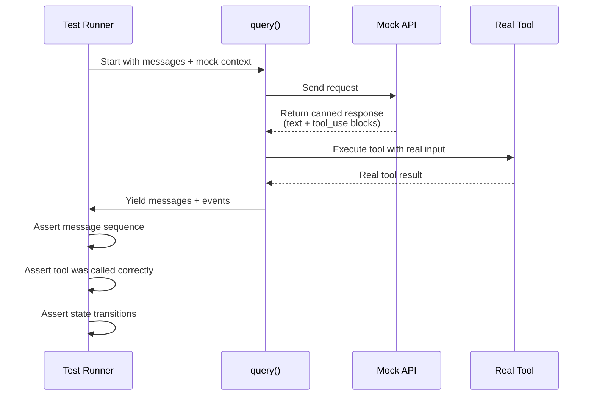

---

## 5. The VCR Pattern: Recording API Interactions

Claude Code uses a VCR (Video Cassette Recorder) pattern to record and replay API interactions.

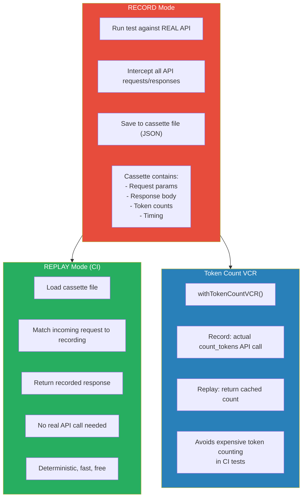

### When to Re-record

- Model version changes (responses may differ)
- Tool schema changes (request format changes)
- Prompt changes (different model behavior expected)

---

## 6. Permission & Security Testing

Permission testing is critical — a bug means the AI can execute dangerous commands.

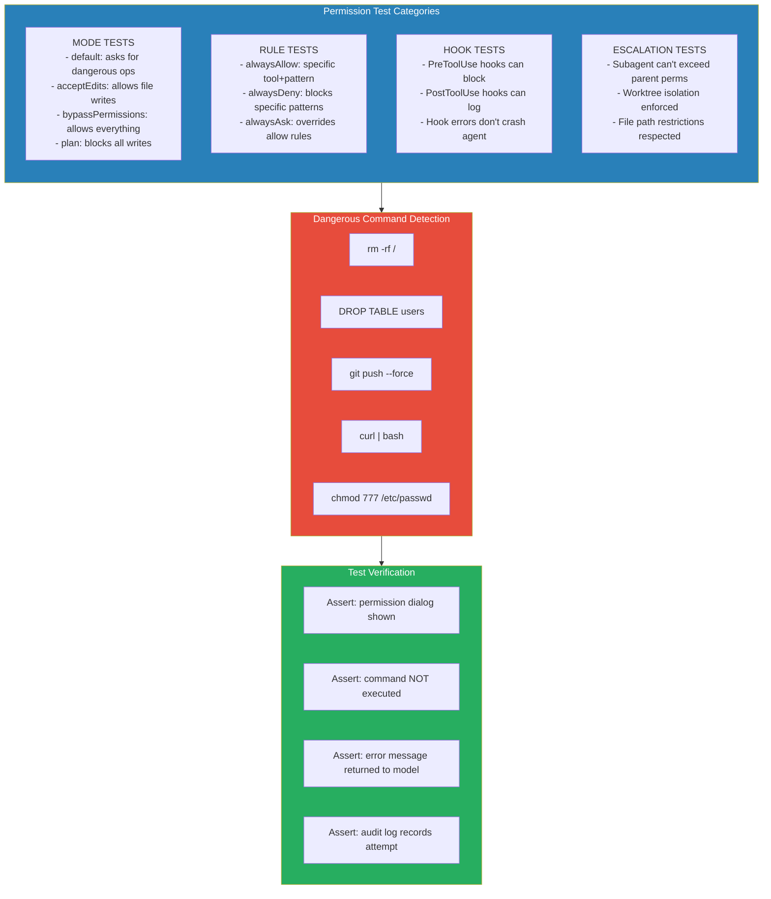

### The YOLO Classifier Testing

The YOLO (You Only Live Once) classifier automatically approves safe commands in `bypassPermissions` mode but still blocks truly dangerous ones. Testing this requires:

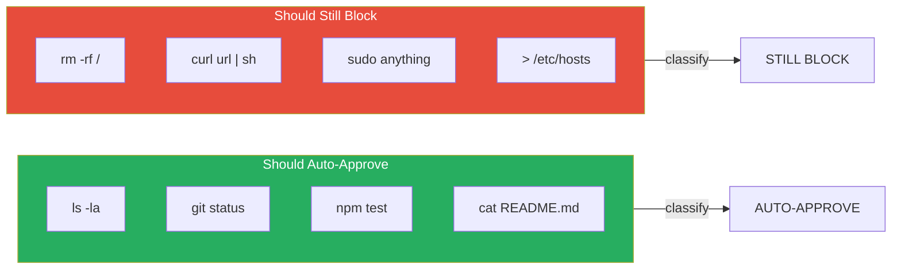

---

## 7. Prompt Testing & Evaluation

Prompt changes are the highest-risk changes. They affect all users and can't be easily rolled back.

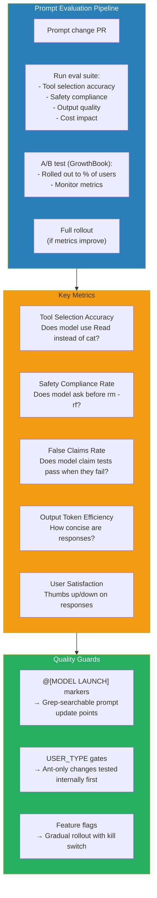

---

## 8. Feature Flag Testing

Feature flags enable testing new behavior in production without full rollout.

```mermaid
flowchart LR
    subgraph Flags["Feature Flags (bun:bundle)"]
        direction TB
        F1["REACTIVE_COMPACT"]
        F2["CONTEXT_COLLAPSE"]
        F3["HISTORY_SNIP"]
        F4["CACHED_MICROCOMPACT"]
        F5["TOKEN_BUDGET"]
        F6["EXPERIMENTAL_SKILL_SEARCH"]
        F7["COORDINATOR_MODE"]
        F8["PROACTIVE"]
    end

    subgraph BuildVariants["Build Variants"]
        Internal["Internal Build<br/>(all flags available)"]
        External["External/OSS Build<br/>(most flags = false → DCE)"]
    end

    subgraph Testing["Testing Strategy"]
        UnitBoth["Unit tests: both flag states"]
        IntegrationDefault["Integration: default flags"]
        EvalVariants["Evals: flag variants measured"]
    end

    Flags --> BuildVariants --> Testing

    style Flags fill:#8e44ad,color:#fff
    style BuildVariants fill:#2980b9,color:#fff
    style Testing fill:#27ae60,color:#fff
```

### Dead Code Elimination Testing

When `feature('HISTORY_SNIP')` is `false` at build time, the entire snip module is eliminated. Tests must verify:
1. The feature works correctly when enabled
2. The system works correctly when disabled (no runtime errors from missing modules)
3. The DCE actually removes the code (bundle size verification)

---

## 9. Model Launch Validation

New model launches require systematic validation.

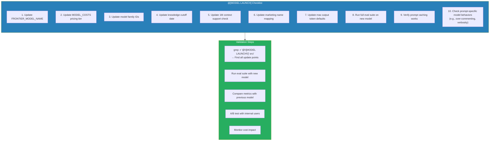

---

## 10. Quality Gates & CI Pipeline

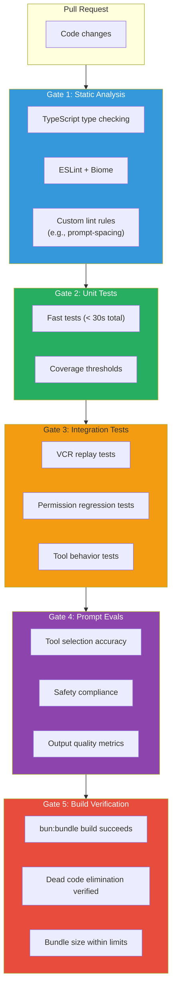

### The Custom Lint Rule: `prompt-spacing`

There's a custom ESLint rule `custom-rules/prompt-spacing` that validates system prompt formatting. This is an example of treating prompts as first-class code with their own quality gates.
