# Tool Design Anatomy — Building Tools an LLM Can Actually Use

> How to design, validate, execute, and orchestrate tools for an AI coding agent — the patterns that make Claude Code's 40+ tools work reliably. Every diagram is a Mermaid diagram you can render in any Markdown viewer.

---

## Table of Contents

1. [Why Tool Design Is Different for LLMs](#1-why-tool-design-is-different-for-llms)
2. [Anatomy of a Tool Definition](#2-anatomy-of-a-tool-definition)
3. [The Tool Type System](#3-the-tool-type-system)
4. [Input Validation with Zod](#4-input-validation-with-zod)
5. [The ToolUseContext — Shared Brain](#5-the-tooluse-context--shared-brain)
6. [Tool Execution Pipeline](#6-tool-execution-pipeline)
7. [Concurrency Classification](#7-concurrency-classification)
8. [Streaming Tool Execution](#8-streaming-tool-execution)
9. [Tool Result Design Patterns](#9-tool-result-design-patterns)
10. [The Permission Gate](#10-the-permission-gate)
11. [Tool Registry & Merging](#11-tool-registry--merging)
12. [Anti-Patterns in Tool Design](#12-anti-patterns-in-tool-design)

---

## 1. Why Tool Design Is Different for LLMs

When a human uses an API, they read docs and adapt. When an LLM uses a tool, it relies on the **tool description, parameter schema, and error messages** to make decisions. Bad tool design = wrong tool choices, malformed inputs, and wasted tokens.

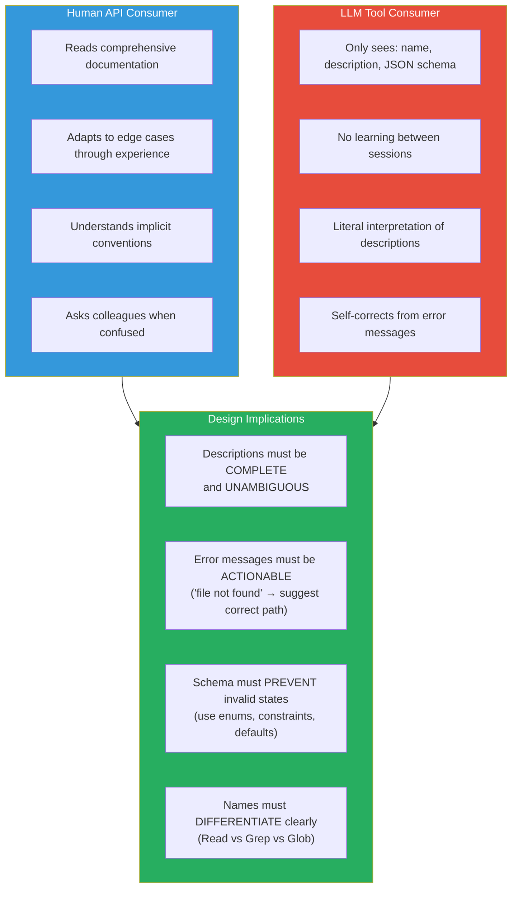

---

## 2. Anatomy of a Tool Definition

Every tool in Claude Code follows a consistent structure.

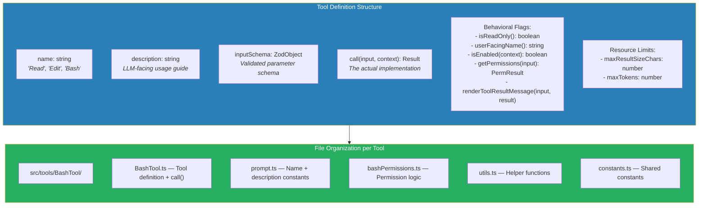

---

## 3. The Tool Type System

The `Tool.ts` type definitions form the contract between the LLM, the orchestrator, and tool implementations.

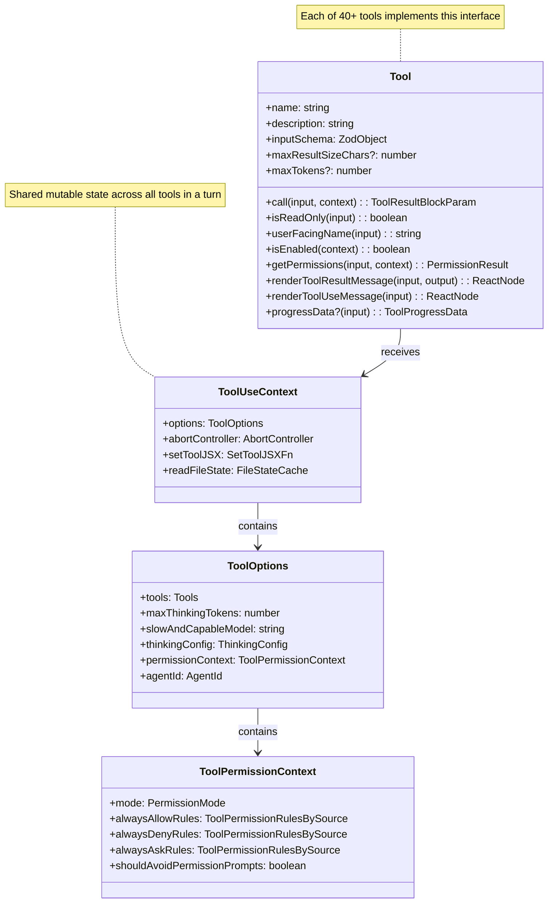

---

## 4. Input Validation with Zod

Every tool uses Zod v4 schemas for input validation. This is critical — the LLM can generate any JSON.

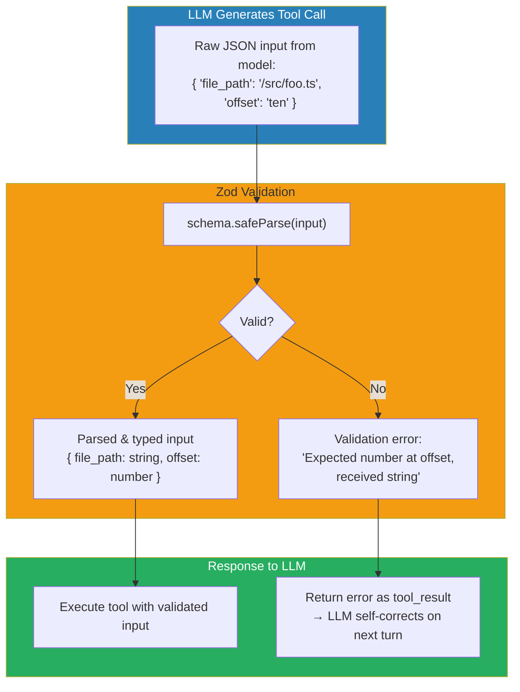

### Why Zod Over JSON Schema?

| Feature | JSON Schema | Zod |
|---|---|---|
| Type inference | Manual types | Automatic TypeScript types |
| Custom validators | Verbose | `.refine()` / `.transform()` |
| Error messages | Generic | Descriptive, customizable |
| Runtime + compile time | Runtime only | Both |
| API compatibility | Direct → API | Auto-converted via `.jsonSchema` |

---

## 5. The ToolUseContext — Shared Brain

The `ToolUseContext` is the shared mutable state that all tools can read and modify during a query loop iteration.

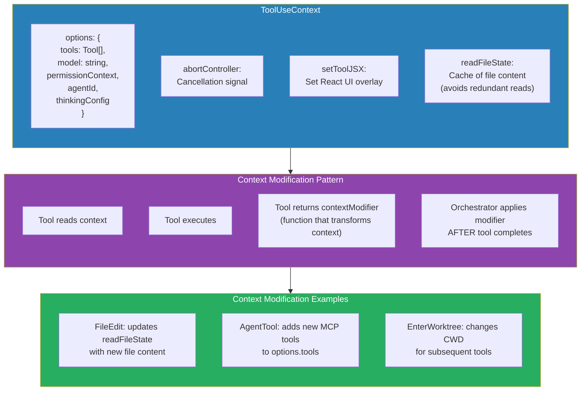

### Why Context Modifiers Are Deferred

Tools run concurrently when read-only. If two tools both modified the context simultaneously, you'd get race conditions. Instead:
1. Tools return **modifier functions** alongside their results
2. The orchestrator applies modifiers **sequentially** after the concurrent batch completes
3. This ensures consistency without locks

---

## 6. Tool Execution Pipeline

Every tool call goes through a multi-stage pipeline before execution.

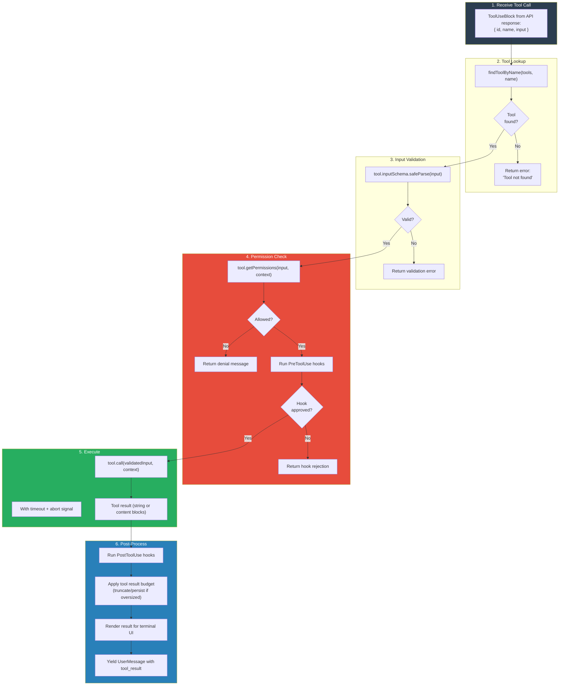

---

## 7. Concurrency Classification

The orchestrator partitions tool calls into concurrent-safe and serial batches.

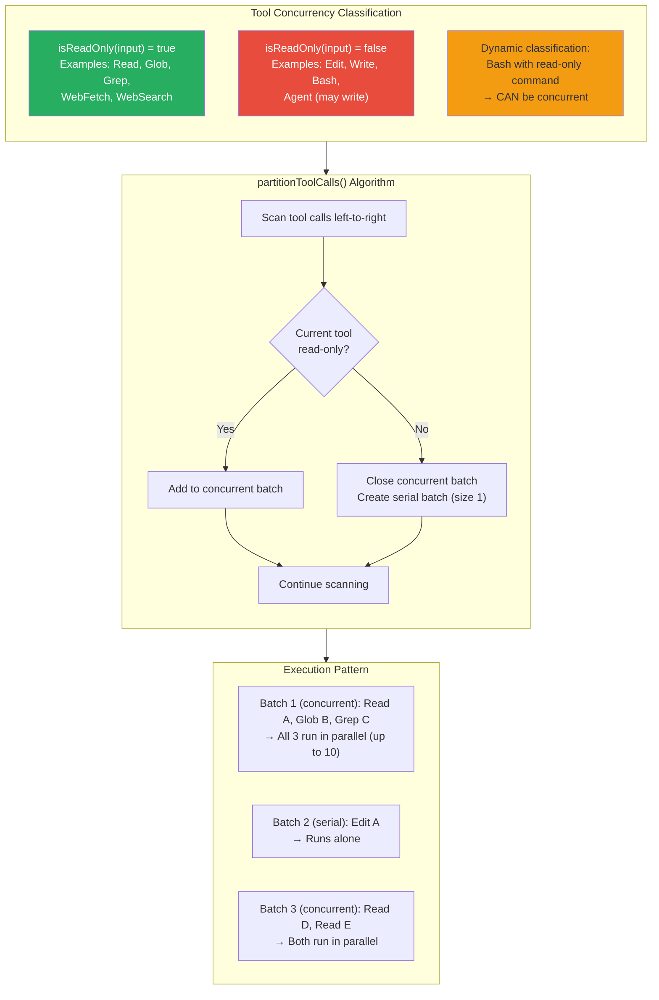

### Max Concurrency

```typescript
function getMaxToolUseConcurrency(): number {
  return parseInt(process.env.CLAUDE_CODE_MAX_TOOL_USE_CONCURRENCY || '', 10) || 10
}
```

Default: 10 concurrent read-only tools. Configurable via environment variable.

---

## 8. Streaming Tool Execution

The `StreamingToolExecutor` starts executing tools **before the API response finishes streaming**.

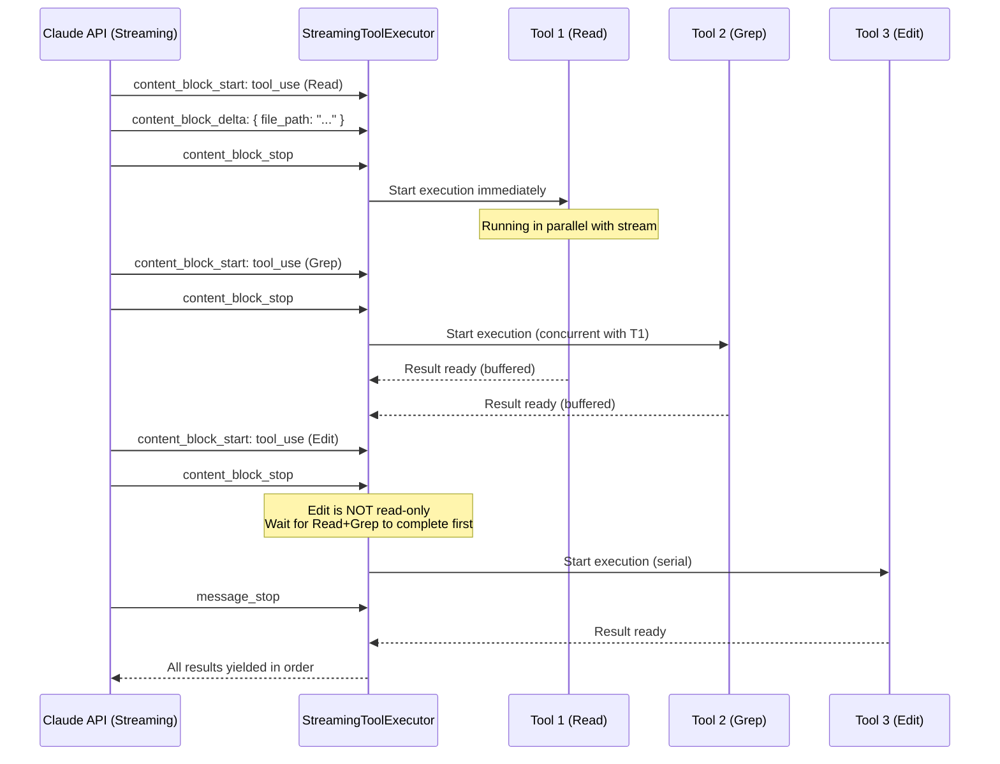

### Key Design: Order-Preserving Results

Even though tools execute out of order (concurrent reads finish before serial writes start), results are **buffered and yielded in the order tools were received**. This ensures the conversation history is deterministic.

### Error Propagation

When a Bash tool errors, the `StreamingToolExecutor` fires a child abort controller:
- Sibling tools in the same concurrent batch are aborted
- The parent query loop's abort controller is **NOT** fired (the model gets to see the error and self-correct)

---

## 9. Tool Result Design Patterns

How a tool formats its result determines whether the model can use the information effectively.

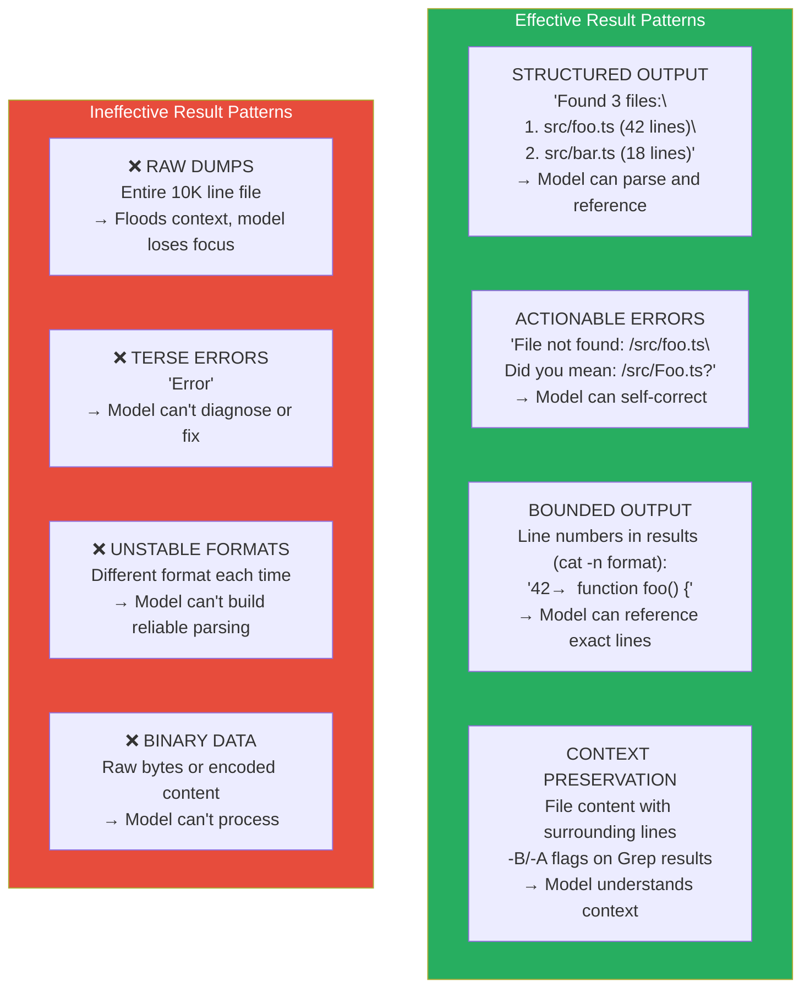

---

## 10. The Permission Gate

Every tool call passes through the permission system before execution.

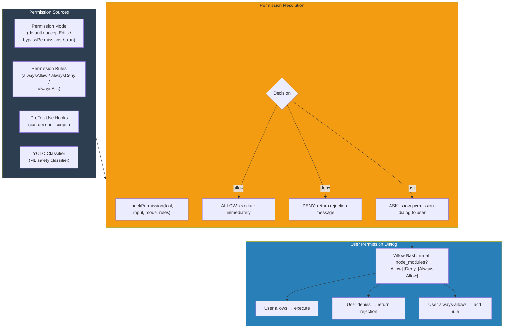

---

## 11. Tool Registry & Merging

Tools come from multiple sources and are merged into a single registry.

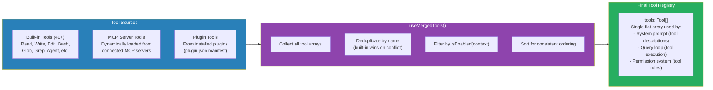

### Tool Search (Deferred Loading)

For sessions with 100+ MCP tools, loading all tool schemas into the system prompt is expensive. Tool Search allows tools to be **deferred** — only their names are visible until the model explicitly requests the full schema via the `ToolSearch` tool.

---

## 12. Anti-Patterns in Tool Design

Lessons learned from building 40+ tools for LLM consumption.

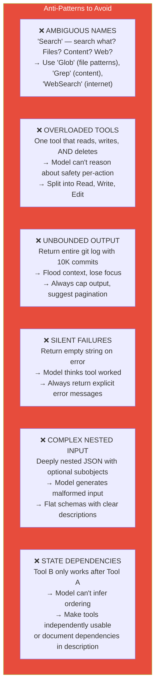

### The Golden Rule

> **If you need to explain the tool's behavior in the system prompt (outside the tool description), the tool design is leaking.**

The system prompt should only contain **cross-tool coordination** guidance (e.g., "prefer Read over cat"). Individual tool behavior should be fully described in the tool's own description field.
